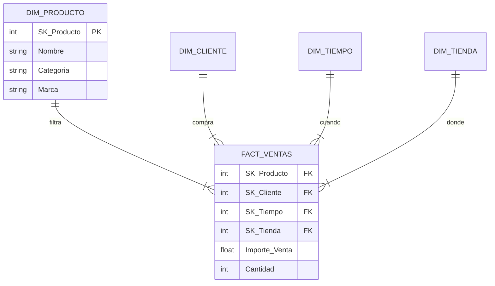
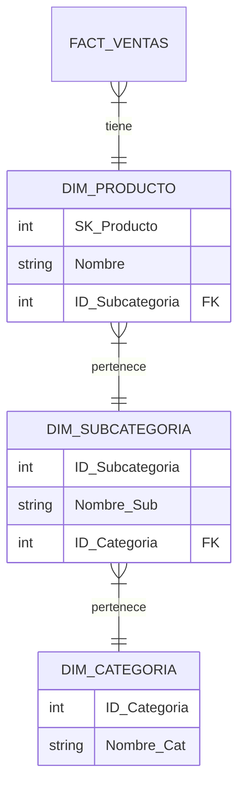
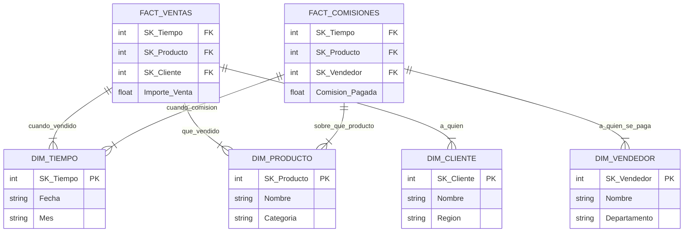

---
tags:
Fecha de actualización: 2025-11-28
Nota previa: "[[002 -]]"
Nota siguiente:
Area: "[[Inteligencia del negocio.base|Inteligencia del negocio]]"
---
---

# 1. Introducción y conceptos generales
El modelado dimensional es una técnica de diseño lógico para **Sistemas de BI y DW**, específicamente adecuada para implementaciones **ROLAP** (Relational OLAP). A diferencia del modelo E-R (normalizado) usado en OLTP para transacciones rápidas, el dimensional busca **rendimiento en consultas** y facilidad de análisis.

## Elementos Clave
* **Hechos (Facts):** Medidas numéricas de una actividad de negocio (Ventas, Gastos).
* **Dimensiones:** El contexto descriptivo (Quién, Qué, Dónde, Cuándo).
* **Granularidad:** El nivel de detalle más atómico de los datos.

---

# 2. Tablas de Hechos (Fact Tables)
Contienen los datos numéricos y las métricas del negocio. Son tablas **normalizadas**, con muchas filas y pocas columnas (estrechas).

## Composición
1.  **Claves Foráneas (FK):** Apuntan a las tablas de dimensiones.
2.  **Medidas (Measures):** Datos cuantificables (cantidad, importe).
3.  **Dimensiones Degeneradas:** Atributos que son identificadores en el OLTP pero no pertenecen a ninguna dimensión (ej: Nº de Factura, Nº Pedido).
> [!DANGER]+ Regla de oro: NULOS
> Las claves foráneas (FK) en la tabla de hechos **NO pueden contener valores nulos (NULL)**. Si un hecho no tiene relación con una dimensión, debe asignarse a un registro ficticio en la dimensión (ej: "Desconocido" o "N/A").

## Tipos de Medidas (Facts)
* **Aditivas:** Se pueden sumar en todas las dimensiones (ej: Importe venta).
* **Semi-aditivas:** Se suman en algunas dimensiones, pero no en otras (ej: Inventario/Stock se suma por almacén, pero no por tiempo; no sumas el stock de enero + febrero).
* **No aditivas:** No se pueden sumar (ej: Temperatura, Porcentajes). Se deben promediar.

## Tipos de tablas de hechos
1.  **Transaccionales:** Un registro por evento/transacción. Es la más granular y común.
2.  **Periódicas (Snapshot):** Foto fija en un momento del tiempo (ej: Saldo a fin de mes).
3.  **Acumuladas (Accumulating):** Un registro por ciclo de vida. Se actualiza conforme avanza el proceso (ej: Pedido -> Envío -> Entrega).

---

Describen el contexto. Son tablas **desnormalizadas** (para evitar joins), con pocas filas pero muchas columnas (anchas).

## Claves en dimensiones
* **Business Key (Natural Key):** La clave original del sistema operacional (DNI, Código Producto).
* **Surrogate Key (Clave subrogada - SK):** Clave sintética (entero autoincremental) creada en el DW. Es la **Clave Primaria (PK)** recomendada.
> [!INFO]+ ¿Por qué usar claves subrogadas (SK)?
> 1. **Rendimiento:** Los `INT` son más rápidos en los *joins* que los textos.
> 2. **Independencia:** Si la clave de negocio cambia o se recicla, no rompe el histórico.
> 3. **Integración:** Permite unificar datos de varios sistemas que usan códigos distintos para lo mismo.
> 4. **Histórico:** Necesaria para tener múltiples versiones de un mismo cliente/producto (SCD Tipo 2).   

## Navegación por jerarquías (Drill-Down & Drill-Up)
Las jerarquías no son solo estructurales, definen cómo el usuario "navega" por los datos 1:
- **Drill-Down (Profundizar):** Ir de lo general a lo específico (ej: Ver ventas anuales $\to$ hacer clic $\to$ ver desglose por Trimestres). Requiere que la jerarquía esté bien definida (Año > Trimestre > Mes > Día).
- **Drill-Up (Agrupar):** Lo contrario, resumir los datos a un nivel superior (ej: ver ventas diarias y subir a nivel de País).

`INSERTAR IMAGEN`
- _Fuente:_ Tu PDF "Business Intelligence T3.pdf", página 326.
- _Por qué:_ Muestra el árbol de Territorio $\to$ Región $\to$ Estado.

## Modelo dimensional vs. modelo relacional (OLAP vs. OLTP)

| **Característica** | **Modelo Relacional (OLTP)**                   | **Modelo Dimensional (OLAP)**                          |
| ------------------ | ---------------------------------------------- | ------------------------------------------------------ |
| **Objetivo**       | Transacción rápida, insertar/actualizar.       | Consultas rápidas, análisis.                           |
| **Diseño**         | **Normalizado** (3FN) para evitar redundancia. | **Desnormalizado** (Star Schema) para velocidad.       |
| **Estructura**     | Muchas tablas pequeñas y complejas.            | Pocas tablas grandes (hechos) y amplias (dimensiones). |
| **Claves**         | Claves de Negocio (Natural Keys).              | **Claves Subrogadas** (Surrogate Keys).                |
| **Rendimiento**    | Lento en agregación y joins complejos.         | Optimizado para _joins_ simples y sumarización.        |

---

# 4. Esquemas de modelado
## Esquema en estrella (Star Schema)
* Una tabla de hechos central rodeada de dimensiones.
* **Recomendado:** Es el estándar. Mejor rendimiento y más intuitivo para el usuario.

## Esquema en copo de nieve (Snowflake)
* Dimensiones normalizadas (jerarquías separadas en tablas).
* **Desventaja:** Aunque ahorra espacio (insignificante hoy día), **penaliza drásticamente el rendimiento** debido al exceso de *joins*.
* *Nota:* Solo usar si es estrictamente necesario.

### Estrella vs. Copo de nieve
`INSERTAR IMAGEN`
- _Fuente:_ Tu PDF "Business Intelligence T3.pdf", página 36.
- _Por qué:_ Muestra claramente cómo el Copo de Nieve ramifica las dimensiones (normalización) frente a la Estrella.

## Esquema en constelación (Galaxy)
* **Definición:** Dos o más tablas de hechos que comparten una o más dimensiones.  
* **Importancia:** Las dimensiones compartidas (como `DIM_TIEMPO` y `DIM_PRODUCTO` en el ejemplo) se conocen como **Dimensiones Conformadas**. Son críticas porque permiten que los reportes de diferentes áreas del negocio (ej. Ventas y Comisiones) hablen el mismo idioma y se puedan integrar. Este concepto es fundamental para construir un Data Warehouse consistente.

---

# 5. Conceptos avanzados
## Dimensión fecha (Time Intelligence)
Es obligatoria en casi todos los modelos.
* **Formato Clave SK:** A diferencia de otras SK, debe ser un entero con formato **YYYYMMDD** (ej: `20231128`). Esto facilita el orden y filtrado sin joins.
* **Atributos:** Debe incluir flags (festivo, laboral), trimestres fiscales, nombres de mes, etc.
* **Fechas desconocidas:** Incluir un registro (ej: `99999999` o `-1`) para evitar NULOS.

## Dimensión hora (Time of Day)
* Si la granularidad es "Día", no se necesita.
* Si se requiere análisis por horas/minutos, se separa en una dimensión distinta a la de Fecha para no explotar el tamaño de la tabla (Fecha x Hora).

## Factless Fact Tables (Hechos sin Hechos)
Tablas que no tienen métricas numéricas, solo claves.
1.  **De Eventos:** Para registrar que algo ocurrió (ej: Asistencia a clase). Se suele usar un contador ficticio "1".
2.  **De Cobertura (Coverage):** Para analizar **lo que NO sucedió** (Análisis negativo). Se cruza una tabla de "posibles eventos" (catálogo) con "eventos reales" (ventas) para ver qué productos en promoción **no se vendieron**.

## Dimensiones causales
Explican el **"Por qué"** de un hecho. Ejemplos: Dimensión "Promoción" o Dimensión "Motivo Devolución". A menudo se olvidan pero son vitales.

## Outrigger dimensions
Cuando una dimensión referencia a otra dimensión (ej: Dimensión Cliente -> Dimensión Geografía). Se debe evitar si es posible (snowflake), pero a veces es necesario.

## Dimensiones de rol (Role Playing Dimensions)
Cuando una misma tabla de dimensión se utiliza **múltiples veces** en la misma tabla de hechos, cada vez con un propósito diferente (un "rol" distinto).
- **Ejemplo clásico:** La **Dimensión Fecha**. Una tabla de hechos de `Ventas` puede necesitar la fecha de `SK_Fecha_Pedido`, la fecha de `SK_Fecha_Envio` y la fecha de `SK_Fecha_Entrega`.
- **Implementación:** Solo se crea una única tabla `DIM_TIEMPO` en la base de datos, pero la tabla de hechos la referencia con tres claves foráneas distintas. Esto asegura que el contexto de fecha sea uniforme para todos los roles.

## Dimensiones multivaluadas (Bridge Table)
Este es el método avanzado para gestionar relaciones de **muchos a muchos (M:N)** entre una dimensión y la tabla de hechos.
- **Problema:** En el modelo dimensional, la relación es idealmente 1:N (1 fila de dimensión $\to$ N filas de hechos). Las multivaluadas (ej: un paciente puede tener varios diagnósticos) rompen esto.
- **Solución (Tabla puente - Bridge Table):**
    1. Se crea una tabla de dimensión normal (`DIM_DIAGNOSTICO`).
    2. Se crea una tabla `PUENTE_DIAGNOSTICO` que almacena la relación M:N entre la clave de hechos y la clave de diagnóstico.
    3. Se añaden a la tabla puente **factores de ponderación** (Weighting Factors) si el hecho necesita ser distribuido entre los diferentes valores de la dimensión.

## Dimensiones basura (Junk Dimensions)
¿Qué hacemos con todos esos indicadores "Sí/No", "Flags" o estados (ej: "Pagado", "Enviado", "Urgente") que sobran en la tabla de hechos?
- **El problema:** Si los dejas en la tabla de hechos, la ensucian. Si creas una dimensión para cada flag, llenas el modelo de dimensiones diminutas.
- **La solución:** Creas una única **Dimensión basura** (Junk Dimension) que contiene todas las combinaciones posibles de estos indicadores. Así limpias la tabla de hechos y reduces el número de tablas.

---

# 6. Slowly Changing Dimensions (SCD)
Cómo gestionar los cambios en los atributos de las dimensiones (ej: un cliente se muda).
* **Tipo 0:** No se aceptan cambios (Inmutable).
* **Tipo 1 (Sobrescribir):** Se actualiza el dato. **Se pierde la historia**. Usar para corrección de errores.
* **Tipo 2 (Histórico - Add Row):** Se crea una fila nueva con nueva SK. Se usan fechas de vigencia (`ValidFrom`, `ValidTo`). Permite reproducir la historia exacta.
	* `INSERTAR IMAGEN`
	* *Fuente*: Tu PDF, página 76 o la tabla de la página 25 del primer PDF.
	* *Por qué*: Es difícil entender el concepto de "filas nuevas para el mismo cliente" sin ver las columnas `StartDate` y `EndDate`.
* **Tipo 3 (Columna nueva):** Se mantiene el valor original y el actual en columnas distintas (`Region_Actual`, `Region_Anterior`).
* **Tipo 4 (Mini-Dimensión):** Separar atributos que cambian rápido en una tabla aparte.
* **Tipo 7 (Híbrido):** Permite doble visión ("As Was" y "As Is"). Usa una **Durable Key** (clave duradera) que vincula todas las versiones históricas de un registro.

| **Tipo SCD** | **Acción**    | **Resultado**                                    | **¿Guarda Historia?** |
| ------------ | ------------- | ------------------------------------------------ | --------------------- |
| **Tipo 0**   | Ignorar       | El dato no cambia nunca.                         | No                    |
| **Tipo 1**   | Sobrescribir  | El valor antiguo desaparece.                     | No                    |
| **Tipo 2**   | Nueva Fila    | Se añade fila con nueva SK y fechas de vigencia. | **Sí (Completa)**     |
| **Tipo 3**   | Nueva Columna | Columna `Valor_Anterior` y `Valor_Actual`.       | Sí (Limitada)         |

---

# 7. Metodología de diseño (Kimball 4-Steps)
El proceso estándar para diseñar el modelo:
1.  **Identificar el proceso de negocio:** No centrarse en departamentos, sino en la actividad (ej: "Venta en Caja", "Gestión de Pedidos").
2.  **Declarar la granularidad:** ¿Qué representa una fila en la tabla de hechos?
    * *Mejor prática:* buscar siempre el **máximo nivel de detalle** (atomicidad) posible.
3.  **Identificar las dimensiones:** Contexto aplicable a la granularidad elegida.
4.  **Identificar los hechos:** Las métricas resultantes del proceso a esa granularidad.

`INSERTAR IMAGEN`
- _Fuente:_ Tu PDF "Business Intelligence T3.pdf", página 104.
- _Por qué:_ Es el resumen visual de toda la metodología Kimball.