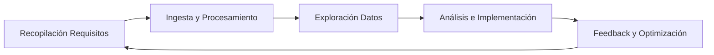
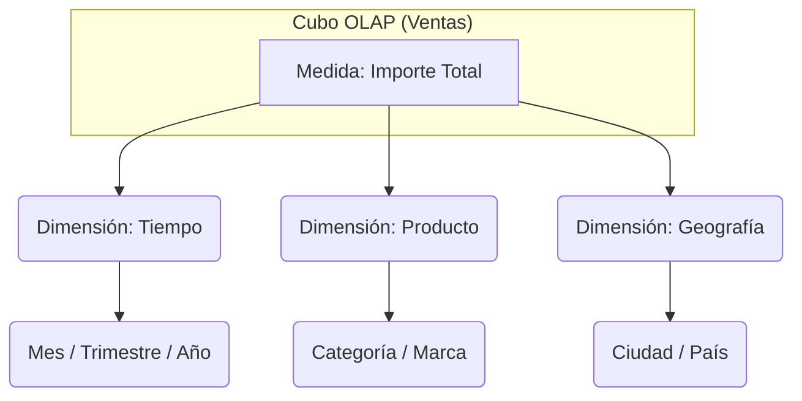
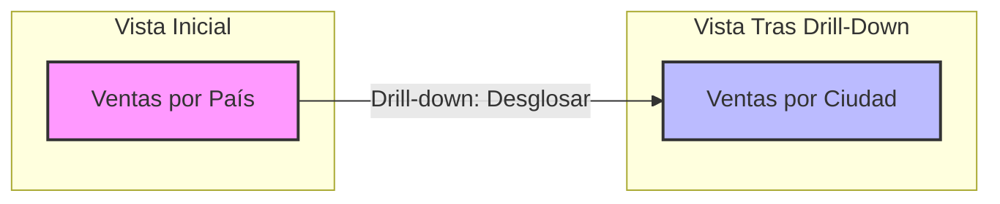
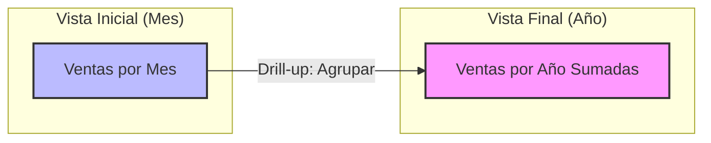
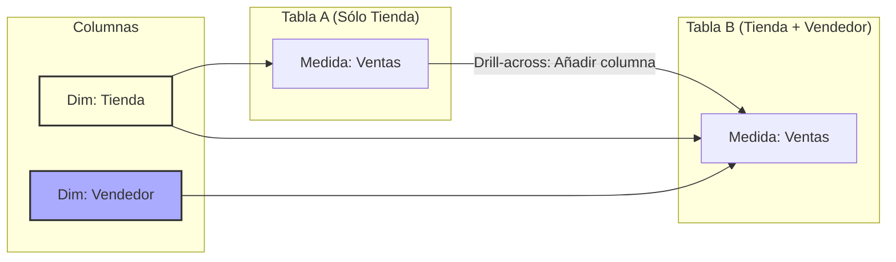
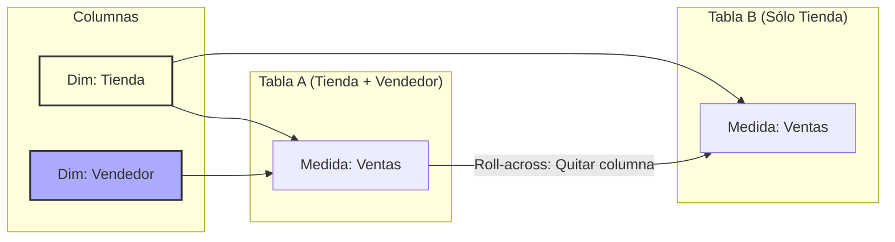
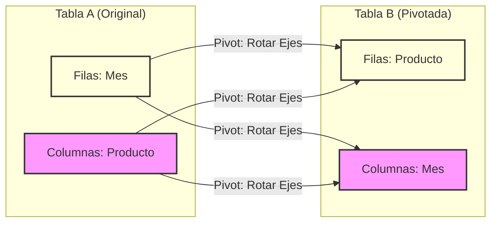
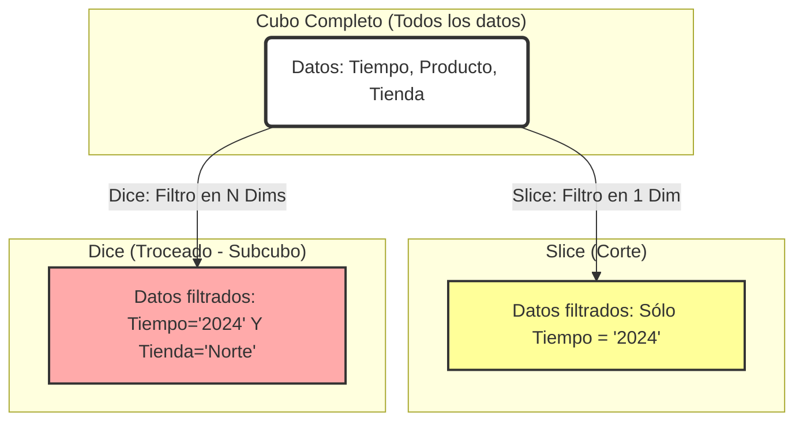
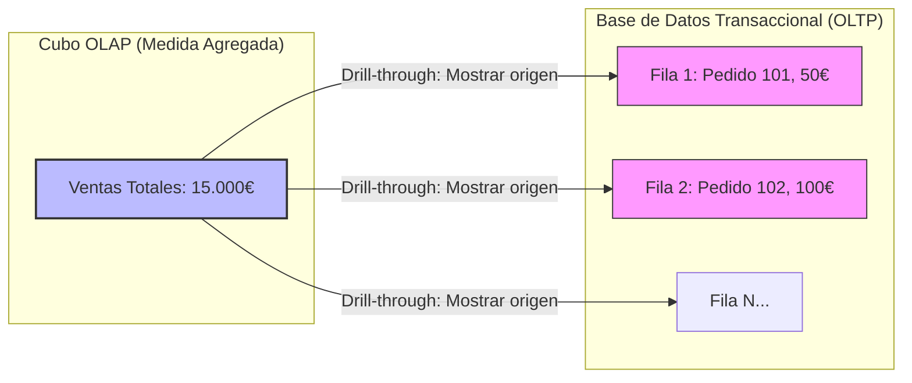

---
tags:
  - Datos
  - Análisis/Datos
  - Ingenieria
Fecha de actualización: 2025-12-04
Nota previa:
Nota siguiente:
Area: "[[Inteligencia del negocio.base|Inteligencia del negocio]]"
---
---

# 1. Conceptos Básicos
El análisis de datos es la ciencia de examinar conjuntos de datos para obtener conclusiones, identificar tendencias y mejorar la toma de decisiones.

## Tipos de Análisis (Según naturaleza)
* **Cuantitativo:** Información numérica, estadística exacta (ej: calificaciones).
* **Cualitativo:** Información textual o de opinión (ej: focus groups).

## Niveles de Análisis (Según objetivo)
Ordenados de menor a mayor valor/complejidad:
1. **Descriptivo:** *¿Qué ha pasado?* Se basa en datos históricos y KPIs. Es el más común (Dashboards, Informes).
2. **Diagnóstico:** *¿Por qué ha pasado?* Busca las causas de anomalías o tendencias detectadas en el descriptivo (Drill-down).
3. **Predictivo:** *¿Qué pasará?* Usa modelos matemáticos y estadísticos para proyectar tendencias futuras (Forecasting).
4. **Prescriptivo:** *¿Qué debemos hacer?* Sugiere acciones para lograr un objetivo basándose en las predicciones.
5. **Cognitivo:** *Simulación humana.* Usa Deep Learning e IA para entender razonamientos y emociones (texto, imágenes).

---

# 2. Proceso de Análisis
El ciclo de vida de un proyecto de análisis no empieza con tecnología, sino con preguntas de negocio:

1. **Requisitos:** Definir las preguntas clave y los KPIs.
2. **Ingesta (ETL):** Identificar fuentes y alimentar el DW.
3. **Exploración:** Entender la calidad y naturaleza de los datos (limpieza).
4. **Análisis/Implementación:** Crear los modelos y visualizaciones (PowerBI).
5. **Feedback:** Validar si responde a las necesidades del negocio.

---

# 3. Análisis con OLAP
## Arquitectura del Cubo
- **Cubo OLAP (Hipercubo):** Estructura rígida multidimensional. Una vez creado, es difícil cambiar sus dimensiones.

## Tipos de Implementación (ROLAP vs MOLAP)

| **Característica** | **MOLAP (Multidimensional)**                                 | **ROLAP (Relational)**                                         | **HOLAP (Hybrid)**                 |
| ------------------ | ------------------------------------------------------------ | -------------------------------------------------------------- | ---------------------------------- |
| **Almacenamiento** | Estructuras propietarias (Arrays/Matrices).                  | Tablas relacionales (Estrella/Copo de Nieve).                  | Mixto.                             |
| **Ventajas**       | **Rapidez extrema** (pre-cálculo). Indexación natural.       | Escalabilidad (grandes volúmenes). Usa SGBD existente.         | Balance entre velocidad y volumen. |
| **Desventajas**    | Larga carga de datos. Espacio en disco. Menor escalabilidad. | **Lento** (calcula al vuelo). Rendimiento cae con complejidad. | Complejidad de gestión.            |
| **Uso**            | Dashboards rápidos.                                          | Navegación y detalle histórico.                                | Lo mejor de ambos.                 |

## Operaciones OLAP (Navegación)
Las operaciones OLAP transforman la vista de los datos multidimensionales. Para identificar qué operación se ha realizado entre una "Tabla A" y una "Tabla B", fíjate en **qué cambia (filas o columnas)**.

### A. Navegación por Jerarquía (Cambia el Nivel de Detalle)
Se mueve verticalmente por la jerarquía de una dimensión (ej: Tiempo: Año > Trimestre > Mes).
1. **Drill-down (Desglosar):**
    - **Qué hace:** Baja un nivel en la jerarquía (de general a específico).
    - **Efecto visual:** Aumenta el número de filas. Se ve "más detalle".
    - _Ejemplo:_ Pasar de ver ventas por `Año` a verlas por `Trimestres`.

2. **Drill-up (Agrupar/Enrollar):**
    - **Qué hace:** Sube un nivel en la jerarquía (de específico a general).
    - **Efecto visual:** Disminuye el número de filas. Los datos se agregan (suman).
    - _Ejemplo:_ Pasar de ver ventas por `Mes` a ver el total del `Año`.

### B. Manipulación de Atributos (Cambia la Estructura de Consulta)
No se mueve por la jerarquía, sino que añade o quita columnas de dimensiones (atributos) para cambiar el contexto.
1. **Drill-across (Añadir dimensión):**
    - **Qué hace:** Añade un nuevo atributo/columna a la consulta para dar más contexto.
    - **Efecto visual:** Aparece una **columna nueva** que antes no estaba.
    - _Ejemplo:_ Tienes `Producto` y `Ventas`. Añades la columna `Tienda`. Ahora ves qué producto se vendió en qué tienda.

1. **Roll-across (Quitar dimensión):**
    - **Qué hace:** Elimina un atributo/columna de la consulta.
    - **Efecto visual:** Desaparece una columna y las filas se agrupan (menos detalle horizontal).
    - _Ejemplo:_ Quitas la columna `Tienda` para ver solo `Producto` y `Ventas` totales.

### C. Orientación y Filtrado
5. **Pivot (Rotar):**
    - **Qué hace:** Rota los ejes de visualización. Lo que eran filas pasan a ser columnas y viceversa.
    - **Efecto visual:** Los datos son los mismos, pero la tabla se "gira".

1. **Page (Paginar):**
    - **Qué hace:** Divide el cubo en secciones basadas en un valor de un atributo, como si fueran páginas de un libro.
    - _Ejemplo:_ Ver una tabla solo para `Producto A`, pasar página y ver la misma tabla para `Producto B`.
2. **Slice & Dice (Cortar y Trocear):**
    - **Slice:** Seleccionar un **único valor** de una dimensión (ej: "Solo año 2023"). Es un corte plano.
    - **Dice:** Seleccionar un **sub-cubo** específico filtrando por dos o más dimensiones (ej: "Año 2023" Y "Tienda Norte").

1. **Drill-through (Detalle):**
    - **Qué hace:** Va al fondo de los datos, mostrando las filas individuales de la base de datos transaccional que componen un dato agregado.

---

# 4. Data Mining (Minería de Datos)
Descubrimiento de patrones (KDD - Knowledge Discovery in Databases).

## A. Reglas de Asociación
Buscar correlaciones del tipo "Si compra A, compra B" (Market Basket Analysis)9. Se mide con dos métricas clave:
> [!INFO]+ Fórmulas Clave (Examen)
> 
> - Soporte (Support): Frecuencia con la que aparece el conjunto de items en el total de transacciones.
>     
>     $$Support(A \cup B) = \frac{\text{Transacciones con A y B}}{\text{Total Transacciones}}$$
>     
> - Confianza (Confidence): Fiabilidad de la regla. Si tengo A, ¿con qué probabilidad tendré B?
>     
>     $$Confidence(A \Rightarrow B) = \frac{Support(A \cup B)}{Support(A)}$$
>     

## B. Clasificación
Modelo supervisado (tenemos datos etiquetados previos) para predecir una clase (ej: Riesgo Crédito Alto/Bajo).
- **Matriz de Confusión:** Herramienta para evaluar la precisión del modelo.

| |**Predicho: SÍ**|**Predicho: NO**|
|---|---|---|
|**Real: SÍ**|Verdadero Positivo (TP)|Falso Negativo (FN)|
|**Real: NO**|Falso Positivo (FP)|Verdadero Negativo (TN)|

- **Tasa de Precisión (Accuracy):** $(TP + TN) / Total$.

## C. Clustering (Agrupamiento)
Modelo no supervisado (sin etiquetas previas). Agrupa objetos similares.
1. **Basado en Distancia (K-Means):**
    - **Lógica:** Define $k$ centros (centroides). Asigna cada punto al centroide más cercano y recalcula el centro hasta estabilizarse.
    - _Clave:_ Funciona bien con grupos esféricos, pero mal con formas irregulares.
2. **Basado en Densidad (DBScan):**
    - **Lógica:** Busca áreas donde hay muchos puntos juntos (alta densidad) separados por áreas vacías.
    - **Concepto clave:** Define un radio ($\epsilon$) y un número mínimo de puntos. Los puntos que no cumplen el criterio se consideran **Ruido (Outliers)**.
    - _Ventaja:_ Encuentra clústeres de formas extrañas y elimina el ruido.
3. **Basado en Rejilla (Grid - STING):**
    - **Lógica:** Divide el espacio de datos en una cuadrícula (celdas). Agrupa las celdas vecinas con suficientes datos.
    - _Ventaja:_ Muy rápido para grandes volúmenes de datos multidimensionales.

## D. Regresión y Series Temporales
- **Regresión:** Predice un valor **numérico continuo** (ej: precio de vivienda) basándose en otras variables.
- **Series Temporales:** Predice valores futuros basándose en el historial temporal (ARIMA).

---

# 5. Big Data
Gestión de datos cuyo **Volumen, Velocidad y Variedad** superan las herramientas tradicionales.

## Las V del Big Data
1. **Volumen:** Cantidad masiva.
2. **Velocidad:** Generación en tiempo real (streaming).
3. **Variedad:** Estructurados, semi-estructurados y no estructurados (texto, video).
4. **Veracidad:** Calidad y fiabilidad del dato (limpiar incertidumbre).
5. **Valor:** Retorno de inversión (ROI) para el negocio.

## Modelo MapReduce
Paradigma de computación paralela y distribuida.
1. **Map():** Procesa datos en cada nodo y emite pares `(clave, valor)`.
    - _Ejemplo WordCount:_ `("hola", 1)`, `("mundo", 1)`, `("hola", 1)`.
2. **Shuffle (Barajado):** Agrupa y ordena los pares por clave.
    - _Salida:_ `("hola", [1, 1])`, `("mundo", [1])`.
3. **Reduce():** Agrega los valores de cada clave.
    - _Salida:_ `("hola", 2)`, `("mundo", 1)`.

## Ecosistema Hadoop
Framework Open Source para almacenamiento y procesamiento distribuido.

**Componentes Núcleo:**
- **HDFS:** Sistema de ficheros distribuido (Almacenamiento).
- **YARN:** Gestor de recursos y planificación.
- **MapReduce:** Motor de procesamiento.
- **Common:** Utilidades comunes.

**Herramientas del Ecosistema (Zoo)** :
- **Hive:** Infraestructura de DW sobre Hadoop (permite consultas tipo SQL).
- **Pig:** Plataforma para crear programas de análisis (lenguaje _Pig Latin_).
- **HBase:** Base de datos **NoSQL** distribuida (columnar).
- **Mahout:** Librería de algoritmos de **Machine Learning** escalables.
- **ZooKeeper:** Coordinador de procesos distribuidos (el "semáforo" del clúster).
- **Oozie:** Planificador de flujos de trabajo (Workflows).
- **Ambari:** Interfaz web para gestionar y monitorizar el clúster.
- **Lucene/Solr:** Motores de búsqueda y e indexación de texto.
- **Spark:** (Aunque a veces va aparte) Procesamiento en memoria, mucho más rápido que MapReduce.

---

# 6. Big Data vs. BI Tradicional

|**Característica**|**BI Tradicional (DW)**|**Big Data (Hadoop/Data Lake)**|
|---|---|---|
|**Datos**|Estructurados (Tablas).|Estructurados, Semi y No Estructurados (Texto, Logs, Vídeo).|
|**Volumen**|Gigabytes / Terabytes.|Petabytes / Exabytes.|
|**Esquema**|**Schema-on-Write:** Se define al guardar (ETL estricto).|**Schema-on-Read:** Se define al leer (flexible, ELT).|
|**Procesamiento**|Centralizado o SMP.|Distribuido (MPP / MapReduce).|
|**Coste**|Alto (Hardware propietario).|Bajo (Hardware commodity / Open Source).|
