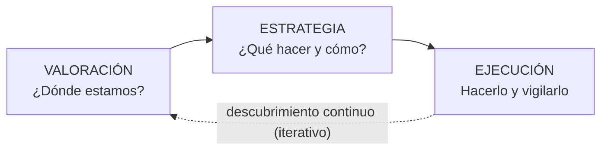

---
tags:
  - GPSI
  - Planificacion-Estrategica
Fecha de actualización: 2026-06-09
Nota previa:
Nota siguiente: "[[002 - Planificación de Proyectos Software]]"
Area: "[[GPSI.base|GPSI]]"
---
---

## El papel de las TI en las organizaciones

Toda empresa necesita una estrategia de negocio, y sus Sistemas de Información (SI), implementados sobre Tecnologías de la Información (TI), pueden contribuir a alcanzar los objetivos de negocio. Pero incorporar nueva tecnología **siempre** supone un cambio en la forma de trabajar: no se podrá hacer lo mismo que antes y de la misma forma, así que los procesos deben adaptarse y la tecnología debe ser la adecuada para esos procesos. Que aparezca una tecnología no implica que la empresa la adopte; eso depende de sus necesidades. La idea central del tema es que <mark style="background: #ADCCFFA6;">la tecnología nunca es neutral</mark>: no es solo una herramienta de implementación, sino que por sí misma abre nuevas oportunidades.

El uso de las TI en una organización madura por **fases**, y conviene saber identificar en cuál se encuentra la empresa:

| Fase | Qué la caracteriza |
| - | - |
| **Inicio** | Mecanización de pocas actividades muy estructuradas, bajo el liderazgo de pocas personas. |
| **Expansión / Contagio** | Crecimiento caótico: se generalizan las peticiones de soluciones informáticas desde muchos departamentos. |
| **Formalización / Control** | Se reconoce la necesidad de controlar el crecimiento para evitar el caos. |
| **Madurez** | <mark style="background: #FFB8EBA6;">Raramente alcanzada.</mark> Las TI se incorporan de forma efectiva y alineada con los objetivos de la organización. |

## Conceptos básicos de planificación

Un plan identifica una meta y establece el camino (conjunto de acciones) para alcanzarla; determina los *qués, quiénes, cuándos, dóndes y cómos* asociados. Planificar tiene que ver con el futuro y es parte integral de la ingeniería de sistemas y de software. Sin una buena planificación hay que trabajar mucho más para alcanzar objetivos que exigirían menos esfuerzo si el equipo tuviera las metas claras (ojo: planificar **no** es trabajar menos).

> [!example]+ Ejemplos clásicos de mala planificación ligada al SI
> - **People Express** (aerolínea, 1981–1987): su SI no permitía gestionar **múltiples tarifas por asiento**, así que no pudo competir cuando la competencia introdujo precios dinámicos según ocupación y proximidad del vuelo. Desapareció.
> - **Caja de ahorros**: gestionaba clientes por tipo de producto; cada producto nuevo exigía rediseñar la base de datos de clientes.
> - **Sector energético**: departamentos con SI inconexos imprimían datos en papel que otros volvían a teclear horas después.

La planificación estratégica permite tomar decisiones más eficientes (directivas, tácticas y operativas), alinea las actividades con la visión y misión, ayuda a posicionarse en el mercado y define **objetivos medibles** para evaluar el progreso. Aborda componentes como la **visión** (qué lograr a largo plazo), la **misión** (por qué existe la empresa), los **objetivos**, los **socios clave**, el producto/precio/distribución, el mercado y clientes, y las estrategias de marketing. Para anticipar el futuro se trabaja con tres tipos de escenario: <mark style="background: #ADCCFFA6;">**probable** (factible, lo que es esperable que ocurra), **posible** (válido aunque su probabilidad sea baja) y **deseable** (al que se pretende llegar)</mark>.

La planificación estratégica descansa en tres características: **requiere la participación de toda la compañía** (liderazgo activo de la dirección, en compenetración con gerencias y operativos), **es la base de las actividades** (fundamenta las decisiones mensuales y trimestrales y las acciones cotidianas de los empleados) y **tiene componentes medibles** (las actividades se vigilan mediante indicadores, de ahí que el aspecto cuantitativo de los objetivos sea esencial para evaluar el avance). Es de vital importancia **analizar la situación actual** de la empresa —saber con qué se cuenta para lograr la misión, la visión y los objetivos— y **reajustar** las actividades siempre que sea necesario.

Antes de ejecutar, la planificación aborda un conjunto de actividades concretas: determinar los requisitos, idear los conceptos operacionales, identificar a los actores, definir papeles (roles) y delimitar responsabilidades, definir actividades, especificar hitos, calcular presupuestos y programar acuerdos y compromisos.

## Niveles de planificación

Distinguir los tres niveles es un clásico de examen; **mezclarlos es el error más común**.

| Nivel | Plazo | Responsable | Enfoque | Ejemplo |
| - | - | - | - | - |
| **Estratégico** | Largo (1–8 años) | Alta dirección | Metas globales, visión y misión | "Abrir el mercado asiático" |
| **Táctico** (ejecutivo) | Medio (≤ 1 año, mensual/trimestral) | Mandos intermedios | Desarrollar las capacidades para cumplir la estrategia | "Programar la versión 1.0 este mes" |
| **Operativo** | Corto (diario/semanal) | Supervisores | Tareas concretas y estructuras productivas | Agenda diaria, Scrum diario |

El nivel **operativo** encaja muy bien con metodologías ágiles ([[003 - SCRUM|Scrum]], XP) y da gran sensación de avance, pero por sí solo nunca basta para que la organización funcione. Tanto el **táctico** —que admite subniveles, como una planificación trimestral con su desglose mensual— como el **operativo** —con un nivel diario y otro semanal— sirven para controlar el flujo de trabajo sin perder el foco ni invadir el nivel superior; conviene aplicar el táctico incluso cuando la actividad se compone de proyectos muy cortos. Según la **escala**, los planes pueden ser corporativos (fusiones, I+D, marketing), de unidad de negocio (financiero, personal, programas) o de proyecto/equipo (calidad, riesgos, contingencias, transición).

### Propiedades de un buen plan

Debe ser **Completo** (todas sus partes desarrolladas), **Conciso** (sin información innecesaria), **Consistente** (sin contradicciones internas; misma notación y terminología), **Viable** (factible técnica y económicamente) y **Rastreable** (fácil seguir la traza de requisitos y metas).

## El modelo de Boar

Es el marco principal del tema para la planificación estratégica de las TI. Propuesto por Bernard H. Boar (AT&T), estructura la planificación estratégica en etapas agrupadas en tres áreas: Valoración, Estrategia y Ejecución, apoyándose en modelos y técnicas analíticas para decidir entre etapas. Parece lineal, pero <mark style="background: #8000E1A6;">en realidad es iterativo: una espiral concéntrica basada en el descubrimiento continuo</mark>.

**A. Valoración** — entender dónde está la organización, dentro y fuera. Incluye el *posicionamiento* (radiografía del estado actual: mercado, competencias nucleares, clientes, fuerza relativa frente a competidores), el *análisis situacional* (recopilar datos y detectar debilidades, amenazas, fortalezas y oportunidades) y las *conclusiones estratégicas* (qué áreas requieren atención y qué oportunidades aprovechar).

**B. Estrategia** — decidir hacia dónde ir y cómo: *objetivos estratégicos*, *movimientos estratégicos* (iniciativas concretas: cambios de estructura, nuevas tecnologías, alianzas), un *plan de gestión del cambio* (toda estrategia implica cambio, hay que vencer las resistencias) y un *plan de garantías* (asegurar que los supuestos en que se basan las decisiones sigan vigentes). El resultado es el **plan estratégico**.

**C. Ejecución** — pasar de la planeación a la acción: priorizar iniciativas, fijar plazos/hitos/métricas, implementar y, sobre todo, **monitorizar y controlar** comparando resultados con objetivos. Termina cuando se han conseguido todas las metas.

> [!important]+ Ventajas y limitaciones del modelo
> **Ventajas**: claridad estructural; fuerza un diagnóstico profundo antes de decidir; integra la gestión del cambio (algo que se suele olvidar); sirve tanto para TI como para el negocio general.
> **Limitaciones**: demandante en tiempo y recursos; riesgo de "parálisis por análisis"; en entornos muy cambiantes la estrategia caduca si no se revisa; exige compromiso real de la alta dirección.

## Planificación Estratégica de SI (PESI)

Es el <mark style="background: #ADCCFFA6;">proceso de preparar y posicionar la organización para prosperar en el futuro</mark>: identificar los objetivos corporativos futuros y los recursos/actividades necesarios, teniendo en cuenta fortalezas y debilidades internas y las oportunidades y amenazas del entorno. <mark style="background: #FF5582A6;">La planificación de los SI debe ser coherente con la estrategia de la compañía</mark> — es el punto fundamental del apartado. Las **decisiones estratégicas** son no rutinarias, importantes para toda la organización, complejas, holísticas (visión de conjunto) y orientadas al futuro.

La PESI se descompone en tres subniveles:

- **PE de la empresa**: el plan global.
- **PE de las TI**: identificar qué tecnologías reportarán beneficios futuros y cómo alcanzarlas.
- **PE de los datos**: los datos son un bien corporativo fundamental. <mark style="background: #FF5582A6;">Deben ser independientes de la tecnología y de las aplicaciones</mark>, porque la forma de hacer las cosas cambia más rápido que la información que se usa para hacerlas. Hay que fijar **responsables** de quién genera o modifica cada dato.

Los SI/TI generan **impacto estratégico** de tres maneras: producir a bajo coste (más productividad, mejor uso de instalaciones), fabricar un producto **diferenciado** (calidad, servicio, valor añadido) e identificar y satisfacer **nichos** de mercado especializados.

## Proyectos, programas y cartera

Tres conceptos que hay que distinguir con precisión:

- **Proyecto**: esfuerzo **temporal** para crear un producto o servicio **único**. Impulsa el cambio y crea valor.
- **Programa**: grupo de proyectos **relacionados** gestionados de forma coordinada para obtener beneficios que no se lograrían individualmente. <mark style="background: #FF5582A6;">No es simplemente "un proyecto grande".</mark>
- **Cartera (portfolio)**: conjunto de proyectos y programas (que **pueden no estar relacionados** entre sí) agrupados para facilitar la gestión y cumplir los objetivos estratégicos. Refleja las inversiones y prioridades de la organización.

Los proyectos son el **medio para ejecutar el plan estratégico**. Suelen autorizarse por una demanda del mercado, una necesidad de la organización, la solicitud de un cliente, un avance tecnológico o un requisito legal.

## Procedimiento de alineamiento

Para alinear el plan de SI/TI con la estrategia, se define un procedimiento que dice **qué hay que hacer** más que cómo (el cómo depende de cada organización). Intervienen tres grupos:

- **Comité de SI/TI**: responsable último del SI.
- **Equipo de trabajo**: realiza el trabajo operativo de elaborar el plan.
- **Grupo base**: coordina al equipo de trabajo con los usuarios.

Sus fases son: **(1) Presentación y compromiso** de la dirección (constituye el equipo, apoya el plan y lo presenta a toda la organización); **(2) Descripción de la situación actual** (funciones de negocio, flujos de información y grado de servicio de las TI); **(3) Elaboración del plan SI/TI** (detectar necesidades de información y definir el SI conceptual: tipo de información, periodicidad y responsables, recursos y prioridades); **(4) Programación de actividades** (los proyectos concretos del primer año).

> [!tip]+ Pistas para el examen
> - **Tecnología no es neutral** y la fase de **Madurez** rara vez se alcanza.
> - Los tres **niveles** (estratégico/táctico/operativo) se diferencian por plazo y responsable; no mezclarlos.
> - El modelo de **Boar** es **iterativo** (espiral), no lineal, y sus tres fases son Valoración → Estrategia → Ejecución.
> - En PESI lo **fundamental** es la **coherencia** con la estrategia de la empresa, y los **datos** deben ser **independientes** de la tecnología.
> - **Programa ≠ proyecto grande**; la **cartera** puede contener proyectos **no** relacionados.
