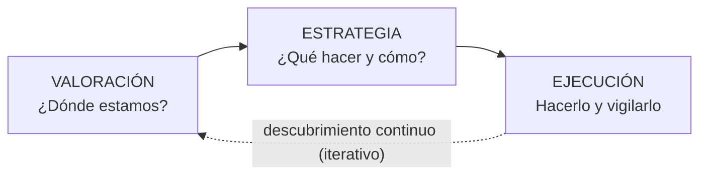

---
tags:
  - GPSI
  - Planificacion-Estrategica
Fecha de actualización: 2026-06-13
Nota previa:
Nota siguiente: "[[002 - Planificación de Proyectos Software]]"
Area: "[[GPSI.base|GPSI]]"
---
---

> [!note]+ Foco de examen
> El profesor prioriza: **¿para qué sirve la PE?** y sus componentes (diap. 15-20), **niveles y tipos de planes** (31-32), **propiedades** (36), el **modelo de Boar completo** (38-51), **PESI** (53-54) y **proyecto/programa/cartera** (61, 65-66) y el **procedimiento de alineamiento** (69-72). El resto es contexto.

## El papel de las TI en las organizaciones

Los SI sobre TI ayudan a cumplir los objetivos de negocio, pero incorporar tecnología **siempre** implica un cambio en la forma de trabajar. Idea de fondo: <mark style="background: #ADCCFFA6;">la tecnología nunca es neutral</mark> — no solo implementa, también abre oportunidades. Su uso madura en cuatro **fases**: *Inicio* (pocas actividades mecanizadas), *Expansión/Contagio* (crecimiento caótico), *Formalización/Control* (se controla ese crecimiento) y *Madurez* (raramente alcanzada; TI alineadas con los objetivos).

## ¿Para qué sirve la planificación estratégica?

La PE <mark style="background: #ADCCFFA6;">hace más eficiente la toma de decisiones</mark> (directiva, táctica y operativa), **alinea las actividades con la visión y la misión**, ayuda a **posicionarse** en el mercado y define **objetivos medibles**. Tiene tres rasgos: **requiere la participación de toda la compañía**, **es la base de las actividades** (decisiones mensuales/trimestrales y acciones cotidianas) y **tiene componentes medibles** (indicadores).

Aborda la **visión** (largo plazo), la **misión** (por qué existe), los **objetivos**, los **socios clave**, el producto/precios/distribución, el **mercado y clientes** y las **estrategias de marketing**, siempre desde un **análisis del estado actual**. Para anticipar el futuro maneja tres escenarios: <mark style="background: #ADCCFFA6;">**probable** (lo esperable), **posible** (válido aunque improbable) y **deseable** (al que se quiere llegar)</mark>.

## Niveles y tipos de planes

| Nivel | Plazo | Responsable | Tipos de planes |
| - | - | - | - |
| **Estratégico** | Largo (1–8 años) | Alta dirección | Políticas, estrategias |
| **Táctico** | Medio (≤ 1 año) | Mandos intermedios | Planes de marketing, de negocio, operacionales y de proyectos |
| **Operativo** | Corto (diario/semanal) | Supervisores | Planes de ventas y de trabajo |

Por **escala**, los planes pueden ser corporativos, de unidad de negocio o de proyecto/equipo.

### Propiedades de un buen plan

**Completo**, **Conciso**, **Consistente** (sin contradicciones; misma terminología), **Viable** (factible técnica y económicamente) y **Rastreable** (fácil seguir la traza de requisitos y metas).

## El modelo de Boar

Marco central del tema. Propuesto por **Bernard H. Boar (AT&T)** para la planificación estratégica de las TI, estructura el proceso en tres áreas —**Valoración, Estrategia y Ejecución**— con técnicas analíticas para decidir entre etapas. Parece lineal, pero es <mark style="background: #8000E1A6;">iterativo: una espiral concéntrica basada en el descubrimiento continuo</mark>.

- **Valoración** (¿dónde estamos?): *posicionamiento* (radiografía del estado actual: mercado, clientes, competidores), *análisis situacional* (debilidades, amenazas, fortalezas y oportunidades) y *conclusiones estratégicas*.
- **Estrategia** (¿qué y cómo?): *objetivos estratégicos*, *movimientos estratégicos* (iniciativas), *plan de gestión del cambio* (vencer resistencias) y *plan de garantías* → el **plan estratégico**.
- **Ejecución**: priorizar iniciativas, fijar plazos/hitos/métricas, implementar y **monitorizar/controlar**. Termina al lograr todas las metas.

> [!info]+ Ventajas y límites del modelo
> **Ventajas**: estructura clara, fuerza el diagnóstico antes de decidir, integra la gestión del cambio y vale tanto para las TI como para el negocio. **Límites**: costoso en tiempo, riesgo de "parálisis por análisis", caduca si no se revisa y exige el compromiso de la dirección.

## Planificación Estratégica de SI (PESI)

Es el <mark style="background: #ADCCFFA6;">proceso de identificar los objetivos corporativos futuros</mark> —considerando oportunidades/amenazas del entorno y fortalezas/debilidades internas— y determinar las actividades y recursos para alcanzarlos: **preparar la organización para prosperar en el futuro**. <mark style="background: #FF5582A6;">Lo fundamental: la planificación de los SI debe ser coherente con la estrategia de la compañía.</mark>

La **estrategia** es el resultado global del proceso (estado futuro deseado + objetivos + movimientos + plan de cambio + plan de garantías). Las **decisiones estratégicas** son no rutinarias, importantes, complejas, holísticas y orientadas al futuro. La PESI se descompone en tres subniveles: **PE de la empresa**, **PE de las TI** (tecnologías con beneficio futuro) y **PE de los datos** (los datos deben ser **independientes de la tecnología y las aplicaciones**, porque estas cambian más rápido). Su **impacto estratégico**: producir a bajo coste, diferenciar el producto y atacar nichos especializados.

## Proyectos, programas y cartera

- **Proyecto**: esfuerzo **temporal** para crear un producto/servicio **único**; impulsa el cambio y crea valor.
- **Programa**: grupo de proyectos **relacionados** gestionados de forma coordinada para beneficios no alcanzables por separado. <mark style="background: #FF5582A6;">No son "proyectos grandes".</mark>
- **Cartera (portfolio)**: conjunto de proyectos y programas (que **pueden no estar relacionados**) para cumplir los objetivos estratégicos; refleja inversiones y prioridades.

## Procedimiento de alineamiento

Alinea el plan de SI/TI con la estrategia diciendo **qué** hacer más que cómo. Intervienen el **Comité de SI/TI** (responsable último), el **Equipo de trabajo** (elabora el plan) y el **Grupo base** (coordina equipo y usuarios). Fases: **(1)** presentación y compromiso de la dirección; **(2)** descripción de la situación actual (funciones y flujos de información); **(3)** elaboración del plan SI/TI (necesidades, SI conceptual, prioridades); **(4)** programación de las actividades del primer año.

> [!tip]+ Pistas para el examen
> - La PE define **objetivos medibles**; sus tres rasgos: participación, base de las actividades, componentes medibles.
> - Tres **niveles** (estratégico/táctico/operativo) con sus tipos de planes.
> - El modelo de **Boar** es **iterativo** (Valoración → Estrategia → Ejecución); domina sus tres fases.
> - En PESI lo fundamental es la **coherencia con la estrategia**.
> - **Programa ≠ proyecto grande**; la **cartera** puede contener proyectos **no** relacionados.
