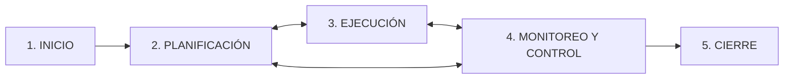

---
tags:
  - GPSI
  - Gestion-Proyectos
  - PMBOK
Fecha de actualización: 2026-06-09
Nota previa: "[[001 - Planificación Estratégica de SI]]"
Nota siguiente: "[[003 - SCRUM]]"
Area: "[[GPSI.base|GPSI]]"
---
---

## Conceptos fundamentales

Hay que distinguir bien **proyecto** y **operación**, porque se gestionan de forma distinta.

| Concepto | Definición | Ejemplo |
| - | - | - |
| **Proyecto** | Esfuerzo **temporal** para crear un producto/servicio **único**. | Desarrollar una app. |
| **Operación** | Función **permanente y repetitiva** de la organización. | Mantenimiento de servidores. |

Operaciones → gestión de procesos de negocio; proyectos → **gestión de proyectos**. La gestión de proyectos es la aplicación de conocimientos, habilidades, herramientas y técnicas a las actividades de un proyecto para satisfacer sus requisitos. Gestionar implica identificar requisitos, atender a los **interesados** (*stakeholders*) y **equilibrar demandas concurrentes**: el "triángulo de hierro" ampliado a seis variables — **alcance, tiempo, costes, calidad, recursos y riesgos**. <mark style="background: #FFB86CA6;">Si una de ellas cambia, afecta a las demás.</mark>

## Naturaleza de los proyectos software

El software es **complejo, abstracto** y se desarrolla con **requisitos incompletos y cambiantes**; las tecnologías abarcan un dominio muy amplio y cambian rápido, y a veces el proyecto se parece más a una investigación. El **cambio es inevitable** y se percibe (erróneamente) como fácil de hacer.

El <mark style="background: #ADCCFFA6;">informe CHAOS (Standish Group) es el estudio más famoso sobre el fracaso de los proyectos TI</mark>. La edición 2009 daba un **32 %** de éxito (frente al 35 % de 2006 y solo el **16 % de 1994**); un 44 % fueron deficientes (retraso, sobrecoste o menos requisitos) y un 24 % fracasaron.

> [!warning]+ La crítica al informe CHAOS
> Mide el éxito **solo** por tiempo, presupuesto y requisitos, ignorando **calidad, riesgo y satisfacción del cliente**. Además se cita siempre el dato de **1994** (el peor, más sensacionalista) y se suman fracasos + deficientes para concluir que "el 84 % de los proyectos fallan", dando una imagen falsamente catastrófica del sector.

Existen dos grandes familias de métodos de gestión: **basados en planes** (PMBOK) y **ágiles** ([[003 - SCRUM|Scrum]], tratado en el Tema 3).

## PMBOK 6

El **PMBOK** (*Project Management Body of Knowledge*) es la guía de referencia del **PMI** (*Project Management Institute*); no es una metodología rígida sino un marco de buenas prácticas adaptable. La **versión 6** (septiembre de 2017) se organiza en tres partes: el **marco conceptual**, el **rol del director de proyecto** y las **áreas de conocimiento**. Su núcleo son **5 grupos de procesos × 10 áreas de conocimiento = 49 procesos**.

| Grupo de procesos | Objetivo |
| - | - |
| **1. Inicio** | Definir el proyecto y obtener su aprobación. |
| **2. Planificación** | Establecer el plan detallado (qué, cómo, cuándo, cuánto). |
| **3. Ejecución** | Llevar a cabo el plan y producir los entregables. |
| **4. Monitoreo y Control** | Supervisar el avance y corregir desviaciones. |
| **5. Cierre** | Finalizar formalmente y documentar lecciones aprendidas. |

Las **10 áreas de conocimiento** atraviesan esos grupos: Integración, Alcance, Cronograma (tiempo), Costos, Calidad, Recursos, Comunicaciones, Riesgos, Adquisiciones e Interesados.

### Recorrido por los 5 grupos

**Inicio (2 procesos).** Se *desarrolla el acta de constitución* (*project charter*): documento corto (1–2 páginas) que **autoriza formalmente** el proyecto y da autoridad al director; describe necesidades, objetivos, hitos, supuestos y restricciones a alto nivel. Y se *identifica a los interesados*: es lo **primero** que hace el director tras ser nombrado; un interesado es cualquiera que influya en el proyecto (positiva o negativamente).

**Planificación (el grupo más grande).** Es **iterativo**, no lineal. Se *desarrolla el plan para la dirección del proyecto*, que integra todos los planes subsidiarios (alcance, cronograma, costes, calidad, recursos, comunicaciones, riesgos, adquisiciones, interesados) y las **líneas base**. La secuencia central del alcance y el cronograma es:

La **EDT/WBS** es la **descomposición jerárquica** del trabajo total, clave para no olvidar nada. *Determinar el presupuesto* crea la **línea base de costes** con la que después se medirá el desempeño. En riesgos, *planificar la respuesta* asigna un **propietario** responsable de cada riesgo.

**Ejecución.** <mark style="background: #FF5582A6;">Es donde se consume la mayor parte del tiempo, presupuesto y recursos.</mark> Se *dirige y gestiona el trabajo* (implementando los cambios aprobados), se *gestiona el conocimiento* (lecciones aprendidas), se *gestiona la calidad* mediante **auditorías** (asegurar que se siguen los procesos), se *adquieren, desarrollan y dirigen* los recursos del equipo y se *efectúan las adquisiciones* (seleccionar proveedores y firmar contratos).

**Monitoreo y Control.** Compara el plan (líneas base) con la realidad. El proceso estrella es el *control integrado de cambios*: **nada se modifica sin pasar por aquí**. Dos pares que se confunden en el examen:

- *Controlar el alcance* → prevenir la **corrupción del alcance** (cambios no controlados).
- <mark style="background: #FF5582A6;">*Validar el alcance* → conseguir la **aceptación formal** del cliente sobre los entregables. No es testear (eso es calidad), es que el cliente firme el OK.</mark>
- *Controlar las adquisiciones* → solo el **administrador de contratos** puede autorizar o rechazar cambios contractuales.

**Cierre.** *Cerrar el proyecto o fase* (cierre administrativo): verificar y transferir el producto, obtener la **aceptación formal**, cerrar contratos, redactar el informe de cierre y las **lecciones aprendidas**, y **archivar la información histórica**. No se omite ni aunque el proyecto se cancele.

> [!info]+ El orden de los grupos (diagrama de Rita)
> Según el *Proceso de Rita* (Mulcahy), <mark style="background: #FFB8EBA6;">**Planificación es el único grupo de procesos que tiene un orden interno asignado**</mark>; el resto agrupan actividades sin secuencia estricta. Los **5 grupos están presentes en todo proyecto**; el director decide cuánta atención dar a cada uno.

## PMBOK 7

La versión 7 supone un **cambio de paradigma**: <mark style="background: #8000E1A6;">pasa de un enfoque basado en *procesos* a uno basado en **Principios** y **Dominios de Desempeño**</mark>, centrado en la **Entrega de Valor**. Define **12 principios fundamentales**:

1. **Administración** (*stewardship*): ética, diligencia, cumplimiento legal.
2. **Equipo**: cultura de colaboración y respeto.
3. **Interesados**: no solo gestionarlos, **involucrarlos** activamente.
4. **Valor**: es el objetivo final.
5. **Pensamiento holístico/sistémico**: ver el proyecto como un sistema conectado.
6. **Liderazgo**: motivar, influir, acompañar.
7. **Adaptación** (*tailoring*): no hay talla única; adaptar el método a cada proyecto.
8. **Calidad**: en el proceso y en el producto.
9. **Complejidad**: saber gestionarla.
10. **Riesgo**: minimizar amenazas, maximizar oportunidades.
11. **Adaptabilidad y resiliencia**: responder al cambio del entorno.
12. **Cambio**: facilitar la transición hacia estados futuros.

PMBOK 7 dice **qué** saber sin decir **cómo**; se recomienda leer la v6 para el detalle de las definiciones que la v7 ya no describe.

## Técnicas de gestión de proyectos software

**Estimación.** Tiene tres etapas encadenadas: estimar el **tamaño** (líneas de código o **puntos de función** — la etapa más compleja) → estimar el **esfuerzo** (personas-día, a partir del tamaño y datos históricos) → estimar el **calendario**. La idea clave es el <mark style="background: #ADCCFFA6;">**cono de incertidumbre**</mark>: al inicio la oscilación es enorme (**de 1 a 16**) y se reduce a medida que avanza el proyecto (tras la especificación de requisitos baja a ~1 a 2). Modelos habituales: **Puntos de Función, COCOMO II, SLIM**.

**Gestión de riesgos.** <mark style="background: #ADCCFFA6;">Un riesgo es un evento o condición incierta que, si ocurre, tiene un efecto positivo o negativo sobre los objetivos del proyecto.</mark> La gestión busca **aumentar la probabilidad e impacto de las oportunidades** y **reducir los de las amenazas**, priorizando con probabilidad × impacto y asignando un propietario a cada respuesta.

**Desarrollo Global de Software (DGS).** Equipos distribuidos por distintos países y continentes. Su reto se resume en las **3 C** (Conchuir): **Comunicación, Coordinación y Control**.

**Calidad del software.** Dos ramas: calidad de **proceso** (**CMMI**, **ISO 33000**) y calidad de **producto** (**ISO 25000**), ambas apoyadas en la **medición** (métricas). Estándares de gestión: **IEEE 1058** e **ISO/IEC 16326**. Herramientas: **MS Project / ProjectLibre** (planificación), **JIRA / Redmine** (*issue management*), **COCOMO / SLIM** (estimación).

> [!tip]+ Pistas para el examen (preguntas tipo PMP)
> - **Organización matricial** → las comunicaciones se vuelven **complejas**.
> - Lo que **NO** es característica de un proyecto: "se repite cada mes" (eso es una operación).
> - Mejor lista de **restricciones**: alcance, tiempo, costo, **calidad, riesgo, recursos y satisfacción del cliente**.
> - El **presupuesto detallado** se crea en **Planificación**; el **enunciado del alcance**, también en Planificación (no en Inicio).
> - Tras el cronograma y presupuesto iniciales, lo **SIGUIENTE** es *determinar los requisitos de comunicaciones* (antes que los riesgos).
> - El grupo que consume **más** tiempo y recursos es la **Ejecución**.
> - Las **lecciones aprendidas** sirven sobre todo como **registros históricos** para proyectos futuros.
> - Un trabajo **repetitivo** (p. ej. manufactura) **no** lleva acta de constitución → es un proceso, no un proyecto.
