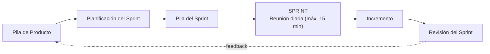

---
tags:
  - GPSI
  - Scrum
  - Agil
Fecha de actualización: 2026-06-09
Nota previa: "[[002 - Planificación de Proyectos Software]]"
Nota siguiente:
Area: "[[GPSI.base|GPSI]]"
---
---

# Introducción y filosofía

<mark style="background: #ADCCFFA6;">Scrum no se basa en seguir un plan rígido, sino en el control empírico (basado en la experiencia) y la adaptación continua</mark> a la <mark style="background: #FFB8EBA6;">evolución del proyecto.</mark> **Comparte los principios del desarrollo ágil**, recogidos en el **Manifiesto Ágil**, donde se valora más lo de la izquierda que lo de la derecha:

- **Individuos e interacciones** > <mark style="background: #8000E1A6;">procesos</mark> y <mark style="background: #8000E1A6;">herramientas</mark>.
- **Software funcionando** > <mark style="background: #8000E1A6;">documentación</mark> extensiva.
- **Colaboración con el cliente** > negociación <mark style="background: #8000E1A6;">contractual</mark>.
- **Respuesta ante el cambio** > seguir un <mark style="background: #8000E1A6;">plan</mark>.

Se apoya en <mark style="background: #FFB86CA6;">varias prácticas</mark>: **revisión de las iteraciones** (<mark style="background: #FFB8EBA6;">al final de cada sprint</mark>, con todos los implicados), **desarrollo incremental** (cada <mark style="background: #FFB8EBA6;">iteración entrega una parte de producto operativa</mark>, inspeccionable), **desarrollo evolutivo** (<mark style="background: #FFB8EBA6;">acepta la inestabilidad</mark> como premisa) y **auto-organización**: <mark style="background: #FF5582A6;">los equipos son auto-organizados, no auto-dirigidos</mark> — deciden *cómo* hacer el trabajo, pero <mark style="background: #8000E1A6;">dentro de un marco</mark>. Para que la auto-organización funcione como control eficaz es imprescindible la <mark style="background: #ADCCFFA6;">colaboración abierta de cada miembro según sus capacidades, no según su rol</mark>.

---

# Roles (la metáfora del cerdo y la gallina)

> [!info]+ La metáfora
> En un plato de huevos con jamón, la **gallina** está *involucrada* (pone el huevo) pero el **cerdo** está *comprometido* (se deja la piel). Distingue el nivel de implicación en el proyecto.

## Roles comprometidos ("cerdos") — construyen el producto

- **Propietario del Producto (*Product Owner*)**: <mark style="background: #ADCCFFA6;">representa la voz del cliente y de todos los interesados</mark>. Su responsabilidad clave es <mark style="background: #FFB86CA6;">maximizar el valor del producto y el retorno de la inversión (ROI)</mark>. Gestiona la financiación, decide la funcionalidad, prioriza la *Pila de Producto* y acepta o rechaza el trabajo. <mark style="background: #FF5582A6;">Es una sola persona</mark>.
- **Equipo de Desarrollo**: <mark style="background: #ADCCFFA6;">transforma la pila en un incremento funcional</mark>. Es <mark style="background: #FFB86CA6;">auto-gestionado, auto-organizado y multifuncional</mark> (tiene todas las <mark style="background: #8000E1A6;">habilidades necesarias</mark>). Nadie le dice cómo convertir los requisitos en código.
- **Scrum Manager** (*Scrum Master*): responsable de <mark style="background: #ADCCFFA6;">que Scrum se entienda y aplique</mark>. Es un "*líder al servicio*": <mark style="background: #FFB86CA6;">elimina impedimentos</mark>, <mark style="background: #FFB86CA6;">facilita las reuniones</mark>, <mark style="background: #FFB86CA6;">protege al equipo de interrupciones</mark>, hace *coaching* e introduce <mark style="background: #FFB8EBA6;">Scrum en la cultura</mark> de la empresa.

## Roles involucrados ("gallinas")

- **Interesados (*stakeholders*)**: clientes, usuarios, dirección comercial y gerencial. Aportan *feedback*, <mark style="background: #FFB8EBA6;">sugerencias y colaboración</mark>, pero <mark style="background: #FF5582A6;">no intervienen en el día a día del sprint</mark>.

> [!warning]+ Terminología del examen
> Tus diapositivas usan el término **"Scrum Manager"**. Aunque en la industria se dice "Scrum Master", en el examen emplea el término de tus apuntes.

---

# Artefactos (componentes)

| Artefacto | Qué es | Propiedad |
| - | - | - |
| **Pila de Producto** (*Product Backlog*) | Inventario priorizado de **todo** lo que podría necesitar el producto (funcionalidades, mejoras, tecnología, errores). | *Product Owner* |
| **Pila del Sprint** (*Sprint Backlog*) | Subconjunto de la pila seleccionado para *ese* sprint, descompuesto en tareas. | Equipo de Desarrollo |
| **Incremento** | Suma de los elementos completados en el sprint (más los anteriores). | Equipo |

<mark style="background: #ADCCFFA6;">La Pila de Producto es un documento vivo: nunca se da por cerrada</mark>, crece y evoluciona, y está priorizada por valor de negocio. Cada ítem incluye al menos **identificador, descripción, prioridad y estimación** (opcionalmente criterios de validación, persona asignada, sprint, módulo…).

La **Pila del Sprint** descompone las funcionalidades en tareas de **2 a 16 horas** (si una tarea dura más, se divide), la realiza el equipo en conjunto y <mark style="background: #FF5582A6;">solo el equipo puede modificarla durante el sprint</mark>. Es visible para todos, idealmente en una pizarra en el espacio físico del equipo. El **Incremento** debe estar <mark style="background: #8000E1A6;">"Terminado": operativo, usable e inspeccionable.</mark>

---

# Eventos (reuniones)

**Planificación del Sprint** — jornada previa al sprint, en dos partes:

- *Parte 1 — el QUÉ* (1–4 h): el **Product Owner** presenta los ítems de mayor prioridad con suficiente detalle; el equipo pregunta y propone alternativas. Se define el **Objetivo del Sprint** (frase que sintetiza el valor a entregar).
- *Parte 2 — el CÓMO* (hasta fin de jornada): el **equipo** desglosa cada funcionalidad en tareas, estima tiempos y **se auto-asigna** las tareas según conocimientos e interés. El **Scrum Manager** actúa solo como **moderador**.

**Reunión diaria (*Daily*)** — sincronización breve (<mark style="background: #FFB8EBA6;">máximo 15 minutos</mark>) en la que cada miembro responde: ¿qué hice ayer?, ¿qué haré hoy?, ¿tengo impedimentos?

**Revisión del Sprint (*Sprint Review*)** — al final del sprint, el equipo presenta (*demo*) el incremento al Product Owner y a los interesados, y se revisa qué se hizo y qué no.

**Seguimiento — *Burndown Chart*** — gráfico de **trabajo pendiente** (eje Y: esfuerzo restante) frente a **tiempo** (eje X: días del sprint). Sirve para ver, día a día, si se llegará a tiempo.

> [!info]+ Matiz para el examen
> Las diapositivas tratan tres reuniones (Planificación, Diaria y Revisión) más el *burndown*. El Scrum estándar añade además la **Retrospectiva** (mejora del proceso al cerrar el sprint), pero **no** aparece destacada en tus apuntes; cíñete a lo que pidan en clase.

---

# Técnica de estimación: Planning Poker

Es una **adaptación del método Delphi** (juicio de expertos) a la gestión ágil, cuyo objetivo es <mark style="background: #ADCCFFA6;">alcanzar una estimación por consenso</mark> a partir de las estimaciones individuales, combinando opinión experta y analogía. Procedimiento:

1. El **Product Owner** presenta una historia de usuario y se discuten los detalles dudosos.
2. Cada estimador elige en secreto la **carta** (números tipo serie de **Fibonacci**: 1, 2, 3, 5, 8…) que representa el esfuerzo.
3. Todas las cartas se **muestran a la vez** (para que unas estimaciones no condicionen a otras).
4. Si hay **gran dispersión** (uno dice 2, otro 20) se discuten los extremos y se repite la votación; si hay **consenso**, esa es la estimación.

> [!important]+ Cartas especiales
> - **? (interrogación):** falta información, no puedo estimar.
> - **Taza de café:** necesito un descanso.

---

# Condiciones de éxito

Para que Scrum funcione hacen falta: **autonomía** del equipo, **respeto**, **responsabilidad y autodisciplina**, **foco** en la tarea, y **transparencia y visibilidad** del desarrollo. Las responsabilidades quedan repartidas: el funcionamiento de Scrum recae en el **Scrum Manager**, la gestión del producto en el **Product Owner**, y la auto-organización y el uso de prácticas ágiles en los **miembros del equipo**. En el equipo no existe "mi tarea": el objetivo del sprint es **responsabilidad conjunta** de todos.

> [!tip]+ Pistas para el examen
> - Equipos **auto-organizados ≠ auto-dirigidos**.
> - El **Product Owner** es **una sola persona** y busca **maximizar el valor / ROI**; prioriza la Pila de Producto.
> - **Solo el equipo** modifica la **Pila del Sprint** durante el sprint; sus tareas duran **2–16 h**.
> - La **Daily** dura **máx. 15 min** y responde a **3 preguntas**.
> - **Planning Poker** = Delphi adaptado, cartas Fibonacci a la vez para evitar sesgos; cartas especiales **?** y **café**.
> - En el examen, **"Scrum Manager"** (no "Master").
