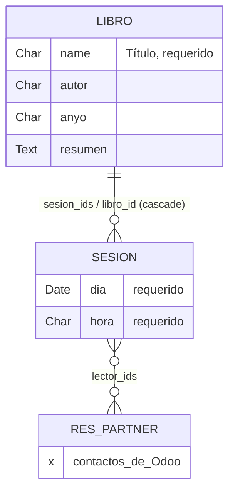

---
tags:
  - SIE/Laboratorio
  - SIE/Examen
  - SIE/Modulos
  - SIE
Fecha de actualización: 2026-05-30
Nota previa: "[[20 - Estrategia de examen y autoevaluación]]"
Nota siguiente: "[[22 - Cheatsheet de examen (chuleta operativa)]]"
Area: "[[Laboratorios.base|Laboratorios]]"
---
---

# Ejercicio de práctica — Biblioteca (resuelto)

La mejor forma de comprobar que dominas el patrón del examen es resolver **otro** enunciado nuevo de la misma dificultad que la Filmoteca, sin copiar y sin mirar la solución hasta el final. Aquí tienes un enunciado original de tipo examen y su resolución completa paso a paso, con el *porqué* de cada decisión. La estructura es deliberadamente idéntica a [[18 - Filmoteca paso a paso]] (maestro → detalle → contactos), porque <mark style="background: #ADCCFFA6;">el examen no cambia de patrón, solo de dominio</mark>: si reconoces el patrón, lo resuelves con los ojos cerrados.

> [!important]+
> **Cómo aprovechar esta nota**: tapa la solución y resuelve el enunciado tú mismo en tu Odoo de prácticas ([[04 - Instalación con Docker]]). Cuando termines —o cuando te atasques— compara con los pasos de abajo. Cada captura es de este módulo corriendo de verdad en Odoo 14, para que reconozcas las pantallas el día del examen.

---

## Enunciado — Práctica: Módulo Biblioteca

> **Objetivo.** Desarrollar un nuevo módulo de Odoo que gestione una biblioteca con un **club de lectura**: cada libro se comenta en varias sesiones del club y a cada sesión puede acudir cualquier socio.
>
> **1. Descripción.** Crea un módulo llamado **Biblioteca**. Habrá dos nuevos tipos de objeto: **libro** y **sesión**. Un libro debe tener información sobre título (obligatorio), autor, año, resumen y lista de sesiones. Una sesión tendrá día (obligatorio), hora (obligatoria) y lista de lectores asistentes. Los lectores se elegirán de entre la lista de contactos.
> *Nota:* los campos *año* y *hora* pueden ser cadenas de texto; *día* debe ser de tipo fecha.
>
> **2. Aspecto.** Las pantallas del módulo tendrán este aspecto: lista de libros; formulario de un libro mostrando el resumen; formulario de un libro mostrando las sesiones; y detalle de una sesión con sus lectores.

Es Filmoteca con otros nombres: *película → libro*, *sesión de proyección → sesión de club*, *asistentes → lectores*. Mismo esqueleto, mismos tipos, mismas relaciones. Vamos a resolverlo entero.

---

## Paso 0 — Leer el enunciado y diseñar los datos

Igual que en el examen real, lo primero **no es teclear**, sino traducir el enunciado a un modelo de datos. <mark style="background: #FF5582A6;">El error más caro es saltarse este paso.</mark> Subrayo entidades, campos, tipos y relaciones:

- Dos modelos: **libro** (`biblioteca.libro`) y **sesión** (`biblioteca.sesion`).
- **Libro**: `name` (título, obligatorio), `autor`, `anyo`, `resumen` y lista de sesiones.
- **Sesión**: `dia` (obligatorio), `hora` (obligatoria) y lista de lectores.
- Tipos que fija el enunciado: <mark style="background: #FFB8EBA6;">`anyo` y `hora` son `Char`; `dia` es `Date`</mark>.
- Relaciones: un libro tiene muchas sesiones (`One2many` ↔ `Many2one`); una sesión tiene muchos lectores que son contactos (`Many2many` a `res.partner`).

El diagrama mental (la "chuleta" antes de teclear, idéntica en forma a la de Filmoteca):



> [!info]+
> **El "contrato" del módulo** son estas cuatro pantallas que pide el enunciado. Tu módulo es correcto si las reproduce. Son capturas del módulo `biblioteca` ya resuelto, corriendo en Odoo 14.

**Listado de libros** (título, autor, año):
![[biblio-lista.png]]

**Formulario de libro, pestaña "Resumen"**:
![[biblio-form-resumen.png]]

**Formulario de libro, pestaña "Sesiones"** (tabla embebida día/hora):
![[biblio-form-sesiones.png]]

**Detalle de una sesión** (Horario + Lectores, elegidos de los contactos):
![[biblio-sesion-detalle.png]]

Con esto diseñado, programar es mecánico. Vamos fichero a fichero.

## Paso 1 — Entorno y scaffold

Con un contenedor de Odoo 14 arrancado ([[04 - Instalación con Docker]]), genero el esqueleto del módulo en la carpeta de addons montada:

```shell-session
$ docker exec -itu root [contenedor] /usr/bin/odoo scaffold biblioteca /mnt/extra-addons
$ sudo chown -R $USER:$USER addons/biblioteca
```

El `scaffold` crea `addons/biblioteca/` con el esqueleto estándar (manifest, `models/`, `views/`, `security/`, `demo/`, `controllers/`). Fundamento: [[08 - Estructura de un módulo y scaffold]].

> [!warning]+
> Si no usas `scaffold`, crea la estructura a mano — pero **no olvides ningún `__init__.py`**: uno en la raíz del módulo y otro en `models/`. Es la causa nº 1 de "mi modelo no aparece".

## Paso 2 — `__manifest__.py`

Declaro qué carga el módulo. Activo el CSV de seguridad (el scaffold lo deja comentado) y apunto a un único fichero de vistas:

```python
# -*- coding: utf-8 -*-
{
    'name': "Biblioteca",
    'summary': "Gestión de una biblioteca: libros, sesiones de club y lectores",
    'description': "Módulo de ejemplo (ejercicio tipo examen SIEA)",
    'author': "Samuel",
    'category': 'Uncategorized',
    'version': '0.1',
    'depends': ['base'],
    'data': [
        'security/ir.model.access.csv',
        'views/biblioteca.xml',
    ],
    'demo': [],
}
```

Decisión clave: <mark style="background: #ADCCFFA6;">`depends: ['base']` basta</mark> — los lectores salen de `res.partner`, que vive en el módulo `base`. No necesito `contacts` ni nada más. Fundamento: [[08 - Estructura de un módulo y scaffold]].

## Paso 3 — `__init__.py`

La cadena de imports que hace que Odoo "vea" los modelos:

```python
# biblioteca/__init__.py
from . import models

# biblioteca/models/__init__.py
from . import models
```

Sin estas dos líneas, las clases de `models.py` nunca se cargan y el módulo instala "vacío" ([[01 - Python para Odoo]]).

## Paso 4 — Modelos (`models/models.py`)

El núcleo. Dos clases que heredan de `models.Model`. Para la versión base **no importo `api`** porque no hay campos computados ni `onchange` (lo añadiré en la Ampliación):

```python
# -*- coding: utf-8 -*-
from odoo import models, fields

class Libro(models.Model):
    _name = 'biblioteca.libro'
    _description = 'Libro de la biblioteca'

    name = fields.Char(string="Titulo", required=True)
    autor = fields.Char(string="Autor")
    anyo = fields.Char(string="Anyo")
    resumen = fields.Text(string="Resumen")
    sesion_ids = fields.One2many('biblioteca.sesion', 'libro_id',
                                 string="Sesiones de club")

class Sesion(models.Model):
    _name = 'biblioteca.sesion'
    _description = 'Sesion de club de lectura'

    name = fields.Char(string="Nombre")
    dia = fields.Date(string="Dia", required=True)
    hora = fields.Char(string="Hora", required=True)
    libro_id = fields.Many2one('biblioteca.libro', ondelete='cascade',
                               string="Libro")
    lector_ids = fields.Many2many('res.partner', string="Lectores")
```

Decisiones, una a una (el "examen mental" que justifica cada línea):

- `name` del libro es `Char` **`required=True`**: el enunciado marca el título como obligatorio. Nombres internos en inglés/sin acentos, etiquetas `string=` para el usuario ([[17 - Cómo programa el profesor (estilo y buenas prácticas)]]).
- `anyo` y `hora` son `Char` y `dia` es `Date`, **tal como exige el enunciado** — no caigas en la tentación de usar `Integer` para el año o `Datetime` para la hora si el enunciado dice texto/fecha ([[09 - Modelos y tipos de campo]]).
- `resumen` es `Text` (texto largo multilínea), con etiqueta "Resumen".
- `sesion_ids` (`One2many`) en el libro ↔ `libro_id` (`Many2one`) en la sesión: <mark style="background: #8000E1A6;">son la pareja inversa, el corazón de la relación maestro-detalle</mark>. El `One2many` no crea columna; el `Many2one` sí (la clave foránea). `ondelete='cascade'` → al borrar un libro se borran sus sesiones ([[10 - Relaciones entre modelos]]).
- `lector_ids` (`Many2many` a `res.partner`): los lectores se eligen de los contactos. Odoo crea sola la tabla intermedia.

> [!warning]+
> El nombre del campo inverso debe coincidir **exactamente**. Si en `Libro` escribes `One2many('biblioteca.sesion', 'libro_id', ...)`, en `Sesion` el `Many2one` tiene que llamarse `libro_id`, ni `book_id` ni `libro`. Un typo aquí y el `One2many` queda mudo, sin error visible. Es la pregunta trampa clásica ([[20 - Estrategia de examen y autoevaluación]]).

> [!info]+
> Mantengo `name = fields.Char()` en `Sesion` por mimetismo con la solución del profesor en Filmoteca: le da a la sesión un *display name* y es inofensivo. Alternativa más limpia: omitirlo y poner `_rec_name = 'dia'` para que la sesión se identifique por su fecha. Tampoco pongo `required=True` en `libro_id` (sería más correcto, pero la solución de referencia lo deja opcional).

## Paso 5 — Vistas, acciones y menú (`views/biblioteca.xml`)

Un único fichero con todo, raíz moderna `<odoo>`. Reproduce las cuatro pantallas del enunciado:

```xml
<?xml version="1.0" encoding="utf-8"?>
<odoo>

    <!-- LIBRO: tree -->
    <record model="ir.ui.view" id="libro_tree_view">
        <field name="name">libro.tree</field>
        <field name="model">biblioteca.libro</field>
        <field name="arch" type="xml">
            <tree string="Libros">
                <field name="name"/>
                <field name="autor"/>
                <field name="anyo"/>
            </tree>
        </field>
    </record>

    <!-- LIBRO: form (notebook Resumen + Sesiones) -->
    <record model="ir.ui.view" id="libro_form_view">
        <field name="name">libro.form</field>
        <field name="model">biblioteca.libro</field>
        <field name="arch" type="xml">
            <form string="Libro">
                <sheet>
                    <group>
                        <field name="name"/>
                        <field name="autor"/>
                        <field name="anyo"/>
                    </group>
                    <notebook>
                        <page string="Resumen">
                            <field name="resumen"/>
                        </page>
                        <page string="Sesiones">
                            <field name="sesion_ids">
                                <tree string="Sesiones">
                                    <field name="dia"/>
                                    <field name="hora"/>
                                </tree>
                            </field>
                        </page>
                    </notebook>
                </sheet>
            </form>
        </field>
    </record>

    <!-- LIBRO: search -->
    <record model="ir.ui.view" id="libro_search_view">
        <field name="name">libro.search</field>
        <field name="model">biblioteca.libro</field>
        <field name="arch" type="xml">
            <search>
                <field name="name"/>
                <field name="autor"/>
            </search>
        </field>
    </record>

    <!-- SESION: tree -->
    <record model="ir.ui.view" id="sesion_tree_view">
        <field name="name">sesion.tree</field>
        <field name="model">biblioteca.sesion</field>
        <field name="arch" type="xml">
            <tree string="Sesiones">
                <field name="dia"/>
                <field name="hora"/>
            </tree>
        </field>
    </record>

    <!-- SESION: form (Horario + Lectores) -->
    <record model="ir.ui.view" id="sesion_form_view">
        <field name="name">sesion.form</field>
        <field name="model">biblioteca.sesion</field>
        <field name="arch" type="xml">
            <form string="Sesion">
                <sheet>
                    <group>
                        <group string="Horario">
                            <field name="dia"/>
                            <field name="hora"/>
                        </group>
                    </group>
                    <label for="lector_ids"/>
                    <field name="lector_ids"/>
                </sheet>
            </form>
        </field>
    </record>

    <!-- Acciones -->
    <record model="ir.actions.act_window" id="libro_list_action">
        <field name="name">Libros</field>
        <field name="res_model">biblioteca.libro</field>
        <field name="view_mode">tree,form</field>
        <field name="help" type="html">
            <p class="oe_view_nocontent_create">Crea el primer libro</p>
        </field>
    </record>

    <record model="ir.actions.act_window" id="sesion_list_action">
        <field name="name">Sesiones</field>
        <field name="res_model">biblioteca.sesion</field>
        <field name="view_mode">tree,form</field>
    </record>

    <!-- Menús -->
    <menuitem id="main_biblioteca_menu" name="Biblioteca"/>
    <menuitem id="libros_menu" name="Libros"
              parent="main_biblioteca_menu"
              action="libro_list_action"/>

</odoo>
```

Decisiones de las vistas ([[12 - Vistas XML]], [[13 - Acciones y menús]]):

- El **listado de libros** muestra título, autor y año — las columnas que pide la primera pantalla.
- El **formulario de libro** pone los datos básicos en un `<group>` y reparte resumen y sesiones en dos pestañas con `<notebook>`. La pestaña "Sesiones" embebe un `<tree>` con día y hora: así un único formulario cubre las pantallas 2 y 3.
- El **detalle de sesión** agrupa día/hora bajo "Horario" y lista los lectores debajo.
- <mark style="background: #FFB8EBA6;">La acción se declara **antes** que el menú que la referencia; el menú raíz "Biblioteca" antes que su hijo "Libros"</mark>. El XML se carga de arriba abajo: una referencia hacia adelante a algo no definido aún rompe la carga.

> [!info]+
> **Sesiones sin menú propio**: defino `sesion_list_action` pero solo creo menú para libros. Las sesiones se gestionan desde la pestaña "Sesiones" de cada libro (el patrón maestro-detalle). Si el enunciado pidiera un menú de sesiones, añadirías un `<menuitem>` con `action="sesion_list_action"`.

## Paso 6 — Seguridad (`security/ir.model.access.csv`)

Acceso total a ambos modelos para todos los usuarios (grupo vacío) — la versión mínima que pide el examen ([[14 - Seguridad y datos demo]]):

```csv
id,name,model_id:id,group_id:id,perm_read,perm_write,perm_create,perm_unlink
access_biblioteca_libro,biblioteca.libro,model_biblioteca_libro,,1,1,1,1
access_biblioteca_sesion,biblioteca.sesion,model_biblioteca_sesion,,1,1,1,1
```

Atención al formato del `model_id:id`: el modelo `biblioteca.libro` se referencia como `model_biblioteca_libro` (prefijo `model_`, los puntos pasan a guiones bajos). <mark style="background: #FFB86CA6;">Sin estas dos líneas, los modelos existen en la base de datos pero **nadie puede verlos** desde la interfaz</mark> — instalas y "no aparece nada".

## Paso 7 — Instalar y comprobar

El flujo de desarrollo, idéntico al de la Filmoteca ([[08 - Estructura de un módulo y scaffold]]):

```shell-session
# tras crear/editar ficheros .py: reiniciar el contenedor
$ docker compose restart
```

En Odoo, con [[05 - Administración funcional|modo desarrollador]] activo:

1. `Apps → Update Apps List` (para que Odoo descubra el módulo nuevo).
2. Busca **Biblioteca** y pulsa **Install**.
3. Aparece el menú **Biblioteca → Libros** en la barra superior.

![[odoo-08-update-apps-list.png]]

> [!success]+
> El módulo es correcto si: aparece el menú "Biblioteca → Libros"; el listado muestra título/autor/año; el formulario de libro tiene pestañas "Resumen" y "Sesiones"; y al abrir una sesión ves "Horario" + "Lectores". Crea un libro de prueba con un par de sesiones y añade algún contacto como lector para verificar que las relaciones funcionan (las cuatro capturas del Paso 0 son justo esa prueba: *Cien años de soledad*, dos sesiones, lectores de "Ready Mat").

> [!important]+
> Recordatorio del **ciclo de cambios** ([[08 - Estructura de un módulo y scaffold]]): si tocas `models.py`, **reinicia Odoo y haz Upgrade**; si solo tocas `biblioteca.xml`, basta el **Upgrade**. Si te equivocas en el **tipo** de un campo ya creado, lo más seguro es **desinstalar el módulo, reiniciar y reinstalar** (cambiar el tipo de una columna existente puede dar error de base de datos).

---

## Ampliación — un paso más allá del examen base

El enunciado base no pide campos computados ni `Selection`, pero el examen real puede incluir un giro ("añade el género del libro de una lista cerrada", "muestra cuántas sesiones tiene cada libro"). Practiquemos los dos más probables. Es exactamente lo que insinuaba el módulo `openacademy` de la P5 con su `value2` computado.

Añado al modelo `Libro` un campo **`Selection`** (`genero`) y un campo **computado** (`num_sesiones`) que cuenta las sesiones. Ahora **sí** importo `api` (lo necesita `@api.depends`):

```python
# -*- coding: utf-8 -*-
from odoo import models, fields, api

class Libro(models.Model):
    _name = 'biblioteca.libro'
    _description = 'Libro de la biblioteca'

    name = fields.Char(string="Titulo", required=True)
    autor = fields.Char(string="Autor")
    anyo = fields.Char(string="Anyo")
    genero = fields.Selection([
        ('novela', 'Novela'),
        ('ensayo', 'Ensayo'),
        ('poesia', 'Poesia'),
        ('teatro', 'Teatro'),
        ('infantil', 'Infantil'),
    ], string="Genero")
    resumen = fields.Text(string="Resumen")
    sesion_ids = fields.One2many('biblioteca.sesion', 'libro_id',
                                 string="Sesiones de club")
    num_sesiones = fields.Integer(string="Nº de sesiones",
                                  compute='_compute_num_sesiones', store=True)

    @api.depends('sesion_ids')
    def _compute_num_sesiones(self):
        for libro in self:
            libro.num_sesiones = len(libro.sesion_ids)
```

Qué hay que entender de cada novedad ([[15 - Campos computados y onchange]]):

- **`genero` (`Selection`)**: una lista de pares `(valor_interno, etiqueta_visible)`. En base de datos se guarda `'novela'`; al usuario se le muestra "Novela". Es el tipo correcto cuando el enunciado dice "elige de entre estas opciones".
- **`num_sesiones` (computado)**: no se teclea, **se calcula**. El método `_compute_num_sesiones` recorre `self` (puede ser varios registros a la vez, por eso el `for`) y asigna a cada libro `len(libro.sesion_ids)`.
- <mark style="background: #ADCCFFA6;">`@api.depends('sesion_ids')`</mark> le dice a Odoo *cuándo* recalcular: cada vez que cambie la lista de sesiones. Sin el `depends`, el valor no se actualizaría al añadir o quitar sesiones.
- `store=True` guarda el valor en una columna real: permite buscar y ordenar por él, y se recalcula solo cuando cambian sus dependencias. Sin `store`, se calcula al vuelo en cada lectura (no se puede usar en filtros).

Para que los nuevos campos aparezcan, los añado a las vistas (al `<group>` del formulario y como columnas del `<tree>` de libros):

```xml
<!-- en libro_tree_view, dentro de <tree> -->
<field name="genero"/>
<field name="num_sesiones"/>

<!-- en libro_form_view, dentro del primer <group> -->
<field name="genero"/>
<field name="num_sesiones"/>
```

Como toco `models.py` (campos nuevos) y el XML (vistas), reinicio y hago **Upgrade** del módulo. Resultado en el formulario —fíjate en "Genero: Novela" y "Nº de sesiones: 2" (calculado solo)—:

![[biblio-ampliacion-form.png]]

Y en el listado, las dos columnas nuevas:

![[biblio-ampliacion-lista.png]]

> [!warning]+
> Tras un `Upgrade` con campos nuevos, si la interfaz no muestra los cambios, **recarga la página entera del navegador** (Ctrl+F5): el cliente web de Odoo cachea la definición de las vistas y a veces sigue mostrando la versión antigua aunque el servidor ya esté actualizado.

> [!info]+
> Otra ampliación típica es un `@api.onchange` (avisos en el formulario al cambiar un campo, sin guardar) o un `@api.constrains` (validación que impide guardar datos inválidos). No los necesita este enunciado, pero repásalos en [[15 - Campos computados y onchange]] por si caen.

---

## Apéndice — el módulo `biblioteca` completo

Estructura de ficheros y código verificado (instalado y probado en Odoo 14). Incluye la Ampliación; para la versión "solo examen base", borra `genero`, `num_sesiones`, su método y el `import api`.

```text
biblioteca/
├── __manifest__.py
├── __init__.py
├── models/
│   ├── __init__.py
│   └── models.py
├── security/
│   └── ir.model.access.csv
└── views/
    └── biblioteca.xml
```

**`biblioteca/__manifest__.py`**
```python
# -*- coding: utf-8 -*-
{
    'name': "Biblioteca",
    'summary': "Gestión de una biblioteca: libros, sesiones de club y lectores",
    'description': "Módulo de ejemplo (ejercicio tipo examen SIEA)",
    'author': "Samuel",
    'category': 'Uncategorized',
    'version': '0.1',
    'depends': ['base'],
    'data': [
        'security/ir.model.access.csv',
        'views/biblioteca.xml',
    ],
    'demo': [],
}
```

**`biblioteca/__init__.py`** y **`biblioteca/models/__init__.py`** (ambos)
```python
# -*- coding: utf-8 -*-
from . import models
```

**`biblioteca/models/models.py`** (con Ampliación)
```python
# -*- coding: utf-8 -*-
from odoo import models, fields, api

class Libro(models.Model):
    _name = 'biblioteca.libro'
    _description = 'Libro de la biblioteca'

    name = fields.Char(string="Titulo", required=True)
    autor = fields.Char(string="Autor")
    anyo = fields.Char(string="Anyo")
    genero = fields.Selection([
        ('novela', 'Novela'),
        ('ensayo', 'Ensayo'),
        ('poesia', 'Poesia'),
        ('teatro', 'Teatro'),
        ('infantil', 'Infantil'),
    ], string="Genero")
    resumen = fields.Text(string="Resumen")
    sesion_ids = fields.One2many('biblioteca.sesion', 'libro_id',
                                 string="Sesiones de club")
    num_sesiones = fields.Integer(string="Nº de sesiones",
                                  compute='_compute_num_sesiones', store=True)

    @api.depends('sesion_ids')
    def _compute_num_sesiones(self):
        for libro in self:
            libro.num_sesiones = len(libro.sesion_ids)

class Sesion(models.Model):
    _name = 'biblioteca.sesion'
    _description = 'Sesion de club de lectura'

    name = fields.Char(string="Nombre")
    dia = fields.Date(string="Dia", required=True)
    hora = fields.Char(string="Hora", required=True)
    libro_id = fields.Many2one('biblioteca.libro', ondelete='cascade',
                               string="Libro")
    lector_ids = fields.Many2many('res.partner', string="Lectores")
```

**`biblioteca/security/ir.model.access.csv`**
```csv
id,name,model_id:id,group_id:id,perm_read,perm_write,perm_create,perm_unlink
access_biblioteca_libro,biblioteca.libro,model_biblioteca_libro,,1,1,1,1
access_biblioteca_sesion,biblioteca.sesion,model_biblioteca_sesion,,1,1,1,1
```

**`biblioteca/views/biblioteca.xml`** (con las dos columnas/campos de la Ampliación incluidos)
```xml
<?xml version="1.0" encoding="utf-8"?>
<odoo>

    <record model="ir.ui.view" id="libro_tree_view">
        <field name="name">libro.tree</field>
        <field name="model">biblioteca.libro</field>
        <field name="arch" type="xml">
            <tree string="Libros">
                <field name="name"/>
                <field name="autor"/>
                <field name="anyo"/>
                <field name="genero"/>
                <field name="num_sesiones"/>
            </tree>
        </field>
    </record>

    <record model="ir.ui.view" id="libro_form_view">
        <field name="name">libro.form</field>
        <field name="model">biblioteca.libro</field>
        <field name="arch" type="xml">
            <form string="Libro">
                <sheet>
                    <group>
                        <field name="name"/>
                        <field name="autor"/>
                        <field name="anyo"/>
                        <field name="genero"/>
                        <field name="num_sesiones"/>
                    </group>
                    <notebook>
                        <page string="Resumen">
                            <field name="resumen"/>
                        </page>
                        <page string="Sesiones">
                            <field name="sesion_ids">
                                <tree string="Sesiones">
                                    <field name="dia"/>
                                    <field name="hora"/>
                                </tree>
                            </field>
                        </page>
                    </notebook>
                </sheet>
            </form>
        </field>
    </record>

    <record model="ir.ui.view" id="libro_search_view">
        <field name="name">libro.search</field>
        <field name="model">biblioteca.libro</field>
        <field name="arch" type="xml">
            <search>
                <field name="name"/>
                <field name="autor"/>
            </search>
        </field>
    </record>

    <record model="ir.ui.view" id="sesion_tree_view">
        <field name="name">sesion.tree</field>
        <field name="model">biblioteca.sesion</field>
        <field name="arch" type="xml">
            <tree string="Sesiones">
                <field name="dia"/>
                <field name="hora"/>
            </tree>
        </field>
    </record>

    <record model="ir.ui.view" id="sesion_form_view">
        <field name="name">sesion.form</field>
        <field name="model">biblioteca.sesion</field>
        <field name="arch" type="xml">
            <form string="Sesion">
                <sheet>
                    <group>
                        <group string="Horario">
                            <field name="dia"/>
                            <field name="hora"/>
                        </group>
                    </group>
                    <label for="lector_ids"/>
                    <field name="lector_ids"/>
                </sheet>
            </form>
        </field>
    </record>

    <record model="ir.actions.act_window" id="libro_list_action">
        <field name="name">Libros</field>
        <field name="res_model">biblioteca.libro</field>
        <field name="view_mode">tree,form</field>
        <field name="help" type="html">
            <p class="oe_view_nocontent_create">Crea el primer libro</p>
        </field>
    </record>

    <record model="ir.actions.act_window" id="sesion_list_action">
        <field name="name">Sesiones</field>
        <field name="res_model">biblioteca.sesion</field>
        <field name="view_mode">tree,form</field>
    </record>

    <menuitem id="main_biblioteca_menu" name="Biblioteca"/>
    <menuitem id="libros_menu" name="Libros"
              parent="main_biblioteca_menu"
              action="libro_list_action"/>

</odoo>
```

---

Si has resuelto esto sin mirar, dominas el patrón del examen. Para más variantes (gimnasio, concesionario, taller…) y el checklist de "qué cuesta puntos": [[19 - Variantes y práctica]]. Para la táctica del día y la autoevaluación: [[20 - Estrategia de examen y autoevaluación]]. Índice del tema: [[Laboratorios.base|MOC de Laboratorios]].
