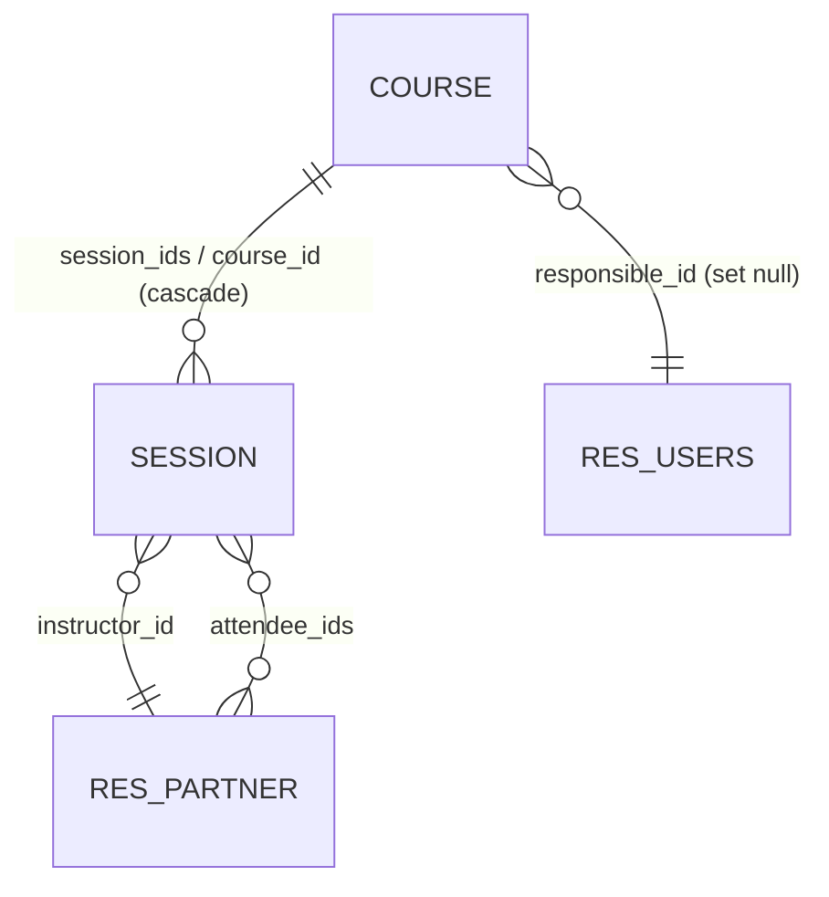

---
tags:
  - SIE/Laboratorio
  - SIE/Modulos
  - SIE
Fecha de actualización: 2026-05-27
Nota previa: "[[09 - Modelos y tipos de campo]]"
Nota siguiente: "[[11 - Herencia de modelos y de vistas]]"
Area: "[[Laboratorios.base|Laboratorios]]"
---
---

# Relaciones entre modelos

Los modelos rara vez viven aislados: un curso tiene sesiones, una sesión tiene asistentes. Odoo modela esto con **campos relacionales**. Domina los tres tipos y tendrás resuelto el grueso del examen — la Filmoteca usa exactamente este patrón ([[18 - Filmoteca paso a paso]]).

## Los tres tipos

| Campo | Cardinalidad | Qué guarda en BD | Ejemplo |
| - | - | - | - |
| `Many2one` | N→1 | una clave foránea (columna) en *este* modelo | una sesión pertenece a un curso |
| `One2many` | 1→N | nada (es el reflejo inverso de un Many2one) | un curso tiene muchas sesiones |
| `Many2many` | N↔N | una tabla intermedia automática | una sesión tiene muchos asistentes y viceversa |

## Many2one (N→1)

<mark style="background: #ADCCFFA6;">`Many2one` crea una clave foránea: cada registro de este modelo apunta a *un* registro del modelo destino.</mark> Es el campo relacional fundamental — los otros dos se apoyan en él.

```python
class Session(models.Model):
    _name = 'openacademy.session'

    course_id = fields.Many2one('openacademy.course', ondelete='cascade',
                                string="Course", required=True)
    instructor_id = fields.Many2one('res.partner', string="Instructor")
```

- El primer argumento es el modelo destino (`'openacademy.course'`).
- <mark style="background: #FFB8EBA6;">`ondelete` decide qué pasa al borrar el registro apuntado</mark>: `'cascade'` borra también este registro (si borras el curso, se borran sus sesiones); `'set null'` deja el campo vacío; `'restrict'` impide el borrado.
- `instructor_id` apunta a `res.partner` (los contactos): así reutilizas un modelo estándar de Odoo como instructor.

Por convención, los `Many2one` terminan en `_id`.

## One2many (1→N)

<mark style="background: #ADCCFFA6;">`One2many` es el reflejo inverso de un `Many2one`: no crea columna, solo "mira" a los registros que apuntan a este.</mark> Por eso necesita dos datos: el modelo origen y **el nombre del `Many2one` inverso**.

```python
class Course(models.Model):
    _name = 'openacademy.course'

    session_ids = fields.One2many('openacademy.session', 'course_id',
                                  string="Sessions")
```

Aquí `'course_id'` es el campo `Many2one` que definimos en `Session`. <mark style="background: #FF5582A6;">Sin ese `Many2one` inverso, el `One2many` no funciona</mark> — es el error más común al montar la relación. Por convención, los `One2many`/`Many2many` terminan en `_ids`.

## Many2many (N↔N)

<mark style="background: #ADCCFFA6;">`Many2many` relaciona muchos con muchos mediante una tabla intermedia que Odoo crea sola.</mark> Solo necesita el modelo destino:

```python
class Session(models.Model):
    _name = 'openacademy.session'
    # ...
    attendee_ids = fields.Many2many('res.partner', string="Attendees")
```

Una sesión tiene muchos asistentes (`res.partner`) y un contacto puede asistir a muchas sesiones. Es exactamente el campo de "Asistentes" que pedirá el examen. En el formulario, un `Many2many` se muestra como una tabla donde añades registros existentes (aquí, los asistentes de una sesión elegidos entre los contactos):

![[odoo-filmo-sesion-detalle.png]]

## Ejemplo completo del laboratorio

Las relaciones de `openacademy`, que tendrás que reproducir adaptadas en el examen:

- Una **sesión pertenece a un curso** / un curso tiene muchas sesiones → `course_id` (Many2one) + `session_ids` (One2many).
- Una **sesión tiene un instructor** (modelo `res.partner`) → `instructor_id` (Many2one).
- Un **curso tiene un responsable** (modelo `res.users`, los usuarios de Odoo) → `responsible_id` (Many2one, `ondelete='set null'`).
- Una **sesión tiene muchos asistentes** (`res.partner`) → `attendee_ids` (Many2many).

```python
class Course(models.Model):
    _name = 'openacademy.course'
    name = fields.Char(string="Title", required=True)
    responsible_id = fields.Many2one('res.users', ondelete='set null',
                                     string="Responsible", index=True)
    session_ids = fields.One2many('openacademy.session', 'course_id',
                                  string="Sessions")
```

El mapa completo de relaciones de `openacademy`, de un vistazo:



Se lee: un curso tiene muchas sesiones (`||--o{`); un curso tiene un responsable que es un usuario, y un usuario puede serlo de muchos cursos (`}o--||`); una sesión tiene un instructor que es un contacto; una sesión tiene muchos asistentes y un contacto asiste a muchas sesiones (`}o--o{`).

> [!info]+
> Por qué `ondelete` distinto en cada caso: en `course_id` el profesor usa `'cascade'` (una sesión no tiene sentido sin su curso, se borra con él); en `responsible_id` usa `'set null'` (si se borra el usuario responsable, el curso sigue existiendo sin responsable). `index=True` crea un índice de BD para acelerar búsquedas por ese campo.

> [!warning]+
> Aviso explícito del profesor: **no actualices (`Upgrade`) el módulo hasta haber introducido TODAS las relaciones** (los `Many2one`, el `One2many` y el `Many2many`). Si actualizas con la relación a medias (p. ej. el `One2many` apuntando a un `course_id` que aún no existe), Odoo da error de carga. Mete las tres y luego actualiza.

Las relaciones también permiten **extender modelos que ya existen** (como `res.partner`): eso es herencia. Siguiente: [[11 - Herencia de modelos y de vistas]].
