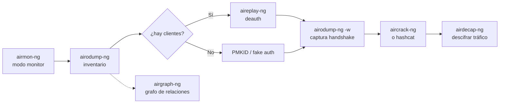

---
tags:
  - Wi-Fi
  - Pentesting/Enumeracion
  - Tipo/Introduccion
Descripción: "Qué herramientas componen la suite, qué hace cada una y en qué punto del flujo de trabajo entra, con el estado real del proyecto en 2026"
Fecha de actualización: 2026-08-01
Nota previa: 
Nota siguiente: "[[01 - Airmon-ng]]"
Area: "[[Aircrack-ng.base|Aircrack-ng]]"
---
---

<mark style="background: #ADCCFFA6;">[Aircrack-ng](https://github.com/aircrack-ng/aircrack-ng) es la suite de referencia para auditar redes 802.11 desde línea de comandos</mark>: más de veinte binarios que cubren desde poner una tarjeta en modo monitor hasta recuperar una clave WPA2. Lleva veinte años siendo el denominador común del pentesting Wi-Fi, y casi cualquier herramienta más moderna consume o produce sus formatos de fichero.

# Las cuatro áreas

| Área | Qué cubre |
| ---- | --------- |
| **Monitorización** | Captura de tramas y exportación a formatos procesables por terceros |
| **Ataque** | Reinyección, desautenticación, APs falsos — todo vía inyección de paquetes |
| **Prueba** | Verificar que la tarjeta y su driver soportan captura e inyección |
| **Cracking** | WEP y WPA/WPA2 con clave precompartida o `PMKID` |

# Las seis herramientas del núcleo

| Herramienta | Función | Nota |
| ----------- | ------- | ---- |
| `airmon-ng` | Activa y desactiva el modo monitor | [[01 - Airmon-ng]] |
| `airodump-ng` | Captura tramas 802.11 crudas y construye el inventario | [[02 - Airodump-ng]] |
| `airgraph-ng` | Genera grafos de relación a partir de los CSV | [[03 - Airgraph-ng]] |
| `aireplay-ng` | Inyecta tráfico: deauth, fake auth, replay | [[04 - Aireplay-ng]] |
| `airdecap-ng` | Descifra capturas WEP/WPA con la clave conocida | [[05 - Airdecap-ng]] |
| `aircrack-ng` | Recupera la clave a partir de la captura | [[06 - Aircrack-ng]] |

El resto de la suite aparece en escenarios concretos: `packetforge-ng` para forjar paquetes a medida (ataques WEP), `airbase-ng` para levantar APs falsos, `airtun-ng` para crear un túnel sobre la red comprometida, `besside-ng` para automatizar el ciclo completo, `airolib-ng` para precomputar `PMK` por ESSID.

# El flujo de trabajo

Casi todo pasa por `airodump-ng`: es la herramienta que produce el `.cap` que consumen las demás y los `.csv` que alimentan `airgraph-ng`.

# El estado real del proyecto en 2026

> [!warning]+ La última versión estable es de 2022
> **Aircrack-ng 1.7 se publicó el 10 de mayo de 2022** y sigue siendo la última estable ([notas de la versión](https://github.com/aircrack-ng/aircrack-ng/releases/tag/1.7)). El desarrollo continúa en `master` —de hecho, es ahí donde vive el soporte más reciente—, pero las distribuciones empaquetan la 1.7. Conviene saber qué hay dentro:
>
> - **Filtros WPA3 y OWE** en `-t/--encrypt` de `airodump-ng`.
> - **Canales de 6 GHz** (Wi-Fi 6E) soportados en `airodump-ng`.
> - Sesiones guardables y restaurables al crackear con diccionario en `aircrack-ng`.
>
> <mark style="background: #FFB8EBA6;">Cuatro años sin versión estable se notan</mark>: el soporte de Wi-Fi 7 y MLO es incompleto, y para ataques a WPA2/WPA3 modernos la comunidad se ha desplazado a otras herramientas.

## Qué usar en su lugar, y cuándo

La suite sigue siendo insustituible para WEP, para inyección genérica y como formato común, pero hay tareas donde ya no es la mejor opción:

| Tarea | Alternativa actual | Por qué |
| ----- | ------------------ | ------- |
| Captura de `PMKID` y handshakes | **`hcxdumptool`** + `hcxpcapngtool` | Más eficiente, no necesita clientes, produce directamente el formato `22000` |
| Cracking de WPA/WPA2 | **`hashcat -m 22000`** | Aceleración por GPU; `aircrack-ng` sólo usa CPU |
| Reconocimiento continuo y a escala | **`Kismet`** | Multiadaptador, multibanda, base de datos, detección de rogue APs |
| Ataques a WPA3/SAE | **`wpa_supplicant` parcheado**, `Dragonslayer` | La suite no implementa SAE |

<mark style="background: #FF5582A6;">El error habitual es crackear con `aircrack-ng` por costumbre</mark>: convertir la captura con `hcxpcapngtool` y lanzar `hashcat` es entre uno y dos órdenes de magnitud más rápido en cualquier equipo con GPU. El detalle está en [[06 - Aircrack-ng]] y en [[00 - Introducción a Hashcat]].

# Portabilidad

Funciona principalmente en Linux, con compilaciones para Windows, macOS y los BSD. En la práctica <mark style="background: #FFB86CA6;">sólo Linux ofrece la combinación de modo monitor e inyección que la suite necesita</mark>: en Windows requiere drivers específicos que casi ningún adaptador comercial trae, y en macOS el modo monitor existe pero la inyección no. Un pentest Wi-Fi se hace desde Linux, con la tarjeta adecuada — ver [[04 - Interfaces, chipsets y drivers]].
