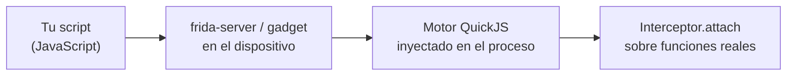

---
tags:
  - Reversing
  - Protocolos
  - Tipo/Introduccion
Descripción: "Instrumentación dinámica multiplataforma: enganchar cualquier función de un proceso en ejecución y leer o cambiar sus argumentos desde JavaScript"
Fecha de actualización: 2026-08-03
Nota previa: 
Nota siguiente: "[[01 - Recetas de Frida para pentest]]"
Area: "[[Frida.base|Frida]]"
---
---

`Frida` inyecta un motor de JavaScript (QuickJS) dentro de un proceso en ejecución y permite **enganchar cualquier función**, leer y modificar sus argumentos, cambiar su valor de retorno o reemplazarla entera. Sin recompilar, sin código fuente y sin `ptrace`.

Versión verificada: **17.16.4** (21 de julio de 2026). Plataformas: Windows, macOS, Linux, iOS, Android, QNX y tvOS.

<mark style="background: #8000E1A6;">Su valor en análisis de protocolos es que corta por lo sano el problema del cifrado</mark>: no necesitas descifrar nada ni interponerte — enganchas la función que cifra y lees el texto plano antes de que salga.

## El modelo mental



Dos piezas fundamentales:

- **`Module`** — localizar código: `Module.getExportByName(null, 'send')`, `Module.getBaseAddress('cliente')`, `Module.enumerateExports()`.
- **`Interceptor`** — enganchar: `attach()` (observar) o `replace()` (sustituir).

```javascript
Interceptor.attach(Module.getExportByName(null, 'send'), {
  onEnter(args) {
    // args[0]=sockfd, args[1]=buf, args[2]=len (System V AMD64)
    this.len = args[2].toInt32();
    console.log(hexdump(args[1], { length: Math.min(this.len, 256) }));
  },
  onLeave(retval) {
    console.log('send devolvió', retval.toInt32());
    // retval.replace(0);   ← se puede cambiar
  }
});
```

`this` se comparte entre `onEnter` y `onLeave` de la misma llamada, que es como se pasa contexto entre ambos.

## Modos de uso

| Modo | Comando | Cuándo |
| - | - | - |
| **Spawn** | `frida -f ./app -l s.js` | Arrancar la app pausada y enganchar **antes** de que corra nada |
| **Attach** | `frida -n app -l s.js` | Proceso ya en marcha |
| **USB** | `frida -U -f com.app -l s.js` | Android o iOS por USB |
| **Trace rápido** | `frida-trace -i 'SSL_*' -f ./app` | Genera *stubs* automáticos, sin escribir nada |
| **Gadget** | Librería embebida | Sin `frida-server`, para dispositivos sin root |

El modo *spawn* con `-f` importa: si la inicialización del protocolo ocurre al arrancar (negociación de claves, carga de configuración), engancharse después es tarde.

```shell-session
$ frida-ps -Ua                              # procesos en el dispositivo USB
$ frida-trace -f ./cliente -i 'send' -i 'recv' -i 'SSL_*'
$ frida -U -f com.app.objetivo -l bypass.js --no-pause
```

## Por qué importa tanto en análisis de protocolos

| Problema | Solución con Frida |
| - | - |
| TLS que no puedes interceptar | Enganchar `SSL_write`/`SSL_read` → texto plano |
| Cifrado propietario | Enganchar la función de cifrado localizada en Ghidra |
| Checksum o MAC con clave | Enganchar la función que lo calcula y generar valores válidos |
| *Certificate pinning* | Sustituir la función de verificación por una que devuelva OK |
| Binario con anti-debug | No usa `ptrace`, así que `TracerPid` sigue a 0 |
| Código ofuscado | La ofuscación protege el código, **no los datos en tiempo de ejecución** |

## Sus límites

> [!warning]+ Frida es detectable
> No usa `ptrace`, pero deja huellas: el hilo `gum-js-loop`, las regiones de memoria `frida-agent`, el puerto 27042 de `frida-server`, y cadenas reconocibles en memoria. Hay productos comerciales con detección específica y proyectos de *bypass* (`strongR-frida`, `hluda`) en carrera constante.
>
> Además, **modifica el proceso**: si el objetivo comprueba su propia integridad en memoria, lo notará.

Otros límites prácticos: el rendimiento cae mucho si enganchas funciones muy llamadas (`malloc` en un bucle cerrado); en iOS sin *jailbreak* hace falta reempaquetar la app con el *gadget*; y en Android moderno, sin *root*, también.

## Ecosistema

| Herramienta | Uso |
| - | - |
| **objection** | Frida con batería incluida para móvil: *bypass* de pinning y de root/jailbreak detection en un comando |
| **frida-tools** | `frida`, `frida-ps`, `frida-trace`, `frida-discover` |
| **frida-il2cpp-bridge** | Juegos Unity |
| **Fermion / FRIDA-DEXDump** | GUI y volcado de DEX en Android |
| **AFL++ modo `-O`** | Frida como instrumentador para *fuzzing* de binarios cerrados ([[00 - Fuzzing de protocolos de red]]) |

> [!info]+ Fuentes
> - [Frida — JavaScript API](https://frida.re/docs/javascript-api/) y [Modes of operation](https://frida.re/docs/modes/).
> - Versión verificada el 2026-08-03 contra `api.github.com/repos/frida/frida/releases/latest`.
