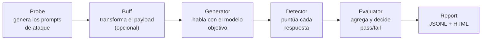

---
tags:
  - IA/Red-Team
  - IA/LLM
  - Pentesting/Enumeracion
  - Tipo/Introduccion
Descripción: "garak es un escáner de vulnerabilidades para LLM: lanza baterías de prompts conocidos por provocar fallos, analiza las respuestas y reporta cuáles funcionaron"
Fecha de actualización: 2026-07-28
Nota previa: 
Nota siguiente: "[[01 - Probes, detectors y buffs de garak]]"
Area: "[[Garak.base|Garak]]"
---
---

<mark style="background: #ADCCFFA6;">`garak` es un escáner de vulnerabilidades para LLM: lanza baterías de prompts conocidos por provocar fallos, analiza las respuestas y reporta cuáles funcionaron.</mark> Lo mantiene el **AI Red Team de NVIDIA** bajo licencia Apache 2.0, y a fecha de esta nota va por la **v0.14** (febrero de 2026).

Su papel en el flujo de trabajo es el mismo que el de un escáner en un pentest clásico: <mark style="background: #FFB8EBA6;">cobertura amplia y automatizada para descubrir **por dónde cede** el objetivo, no profundidad.</mark> La comparación útil es con [[00 - Introducción a Nessus|Nessus]]: cubre mucho terreno rápido, produce ruido, y lo que encuentra hay que verificarlo y explotarlo a mano.

> [!warning]+ El repositorio se movió
> `garak` nació como proyecto personal de Leon Derczynski en `leondz/garak`. Hoy vive en **[`NVIDIA/garak`](https://github.com/NVIDIA/garak)**. Cualquier tutorial que apunte al repo antiguo —incluido el módulo de HTB— está desactualizado también en la sintaxis del CLI (ver [[02 - Ejecución y lectura de informes de garak]]).

# El modelo mental — cuatro piezas

Todo lo que hace `garak` es una combinación de cuatro tipos de plugin. Entender el flujo evita perderse en la documentación:



- **`Probe`** — el ataque. Un conjunto de prompts con un objetivo concreto (conseguir un jailbreak DAN, provocar una fuga, inducir una alucinación de paquete).
- **`Buff`** — transformación opcional del payload antes de enviarlo: traducirlo, parafrasearlo, codificarlo. Multiplica cada probe por variantes.
- **`Generator`** — el adaptador al objetivo. Es lo que conecta con OpenAI, con Hugging Face, con `Ollama` o con **una API REST propia**.
- **`Detector`** — decide si la respuesta indica que el ataque funcionó. Es la pieza que aporta el valor real: sin detector automático, un barrido de miles de prompts sería inrevisable.

# Instalación y primer escaneo

```shell-session
$ python -m pip install -U garak
$ python -m garak --list_probes
```

Un barrido mínimo contra un modelo local con `Ollama`:

```shell-session
$ python -m garak --target_type ollama --target_name llama3.1 --spec 'probes.dan'
```

<mark style="background: #FF5582A6;">Empieza siempre contra un modelo local.</mark> Un barrido completo son miles de peticiones y, contra una API de pago, la factura se dispara; contra producción del cliente, enciende toda la telemetría descrita en [[14 - Detección y evasión en prompt injection]].

# Objetivos soportados

El adaptador se elige con `--target_type` y el modelo concreto con `--target_name`:

| `target_type` | Uso |
| - | - |
| `openai` | API de OpenAI y cualquier endpoint compatible |
| `huggingface` | Modelos locales vía `transformers`, Inference API y endpoints privados |
| `ollama` | Modelos servidos localmente. **El más práctico para desarrollar** |
| `ggml` | `llama.cpp` directamente sobre el fichero de modelo |
| `replicate`, `cohere`, `groq`, `bedrock`, `nim` | Plataformas gestionadas |
| **`rest`** | **Cualquier endpoint HTTP.** El que se usa contra la aplicación del cliente — ver [[03 - garak contra una aplicación real y en CI]] |
| `test` | Generadores de prueba (`test.Blank`, `test.Repeat`) para validar la configuración sin gastar tokens |

Las claves de API se pasan por variable de entorno, no por parámetro:

```shell-session
$ OPENAI_API_KEY="sk-..." python -m garak --target_type openai --target_name gpt-4o --spec 'tag:owasp:llm01'
```

# Qué cubre y qué no

Cubre bien, de forma automatizada:

- [[01 - Prompt injection y por qué no tiene parche|Prompt injection]] y [[08 - Fundamentos del jailbreaking|jailbreaks]] con corpus conocidos.
- Fuga de datos de entrenamiento y de system prompt por reproducción.
- Generación de contenido tóxico, malware y desinformación.
- **Alucinación de paquetes** (`packagehallucination`) — mide la exposición a [[08 - Slopsquatting y alucinación de paquetes|slopsquatting]], muy relevante para cadena de suministro.
- Caracteres `glitch` y comportamientos anómalos del tokenizador.
- Inyección latente en documentos (`latentinjection`).

<mark style="background: #8000E1A6;">No cubre —y no pretende— tres cosas que siempre habrá que hacer a mano</mark>:

1. **Ataques multi-turno dirigidos.** `garak` lanza prompts, no mantiene una estrategia conversacional. Para [[11 - Jailbreaks multi-turno y de contexto|Crescendo o Echo Chamber]] hace falta un orquestador como [[00 - Qué es PyRIT y cuándo usarlo|PyRIT]].
2. **Lógica de negocio.** Ningún corpus genérico sabe que tu objetivo calcula precios. La [[04 - Inyección directa contra la lógica de negocio|manipulación de decisiones]] es trabajo manual.
3. **La arquitectura alrededor del modelo.** Historial manipulable, canal de exfiltración por markdown, allowlist de CSP: nada de eso lo ve un escáner de prompts.

> [!important]+ Cómo encaja en un engagement
> `garak` responde a "¿qué familias de ataque hacen ceder a este modelo?" en una tarde. Esa respuesta orienta el trabajo manual, que es donde salen los hallazgos con impacto. <mark style="background: #FFB86CA6;">Presentar un informe de `garak` como si fuera el resultado del pentest es el equivalente a entregar el `.nessus` en bruto</mark> — y se nota igual de rápido.

# Dos advertencias antes de lanzarlo

**Es ruidoso por diseño.** Miles de prompts, la mayoría rechazados, es exactamente la firma de ataque que un defensor competente detecta. Contra un objetivo con requisito de sigilo, se ejecuta sobre una réplica local del modelo base, nunca contra producción.

**Genera contenido dañino a propósito.** El informe JSONL contiene las respuestas completas del modelo, incluidas las que tuvieron éxito. Ese fichero es material sensible: hay que tratarlo como evidencia, cifrarlo y no adjuntarlo entero a un informe.
