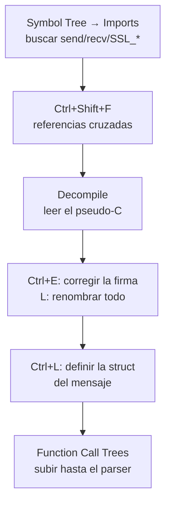

---
tags:
  - Reversing
  - Protocolos
  - Tipo/Introduccion
Descripción: "El desensamblador y decompilador libre de la NSA: flujo de trabajo para localizar y entender el código de red de un binario cerrado"
Fecha de actualización: 2026-08-03
Nota previa: 
Nota siguiente: 
Area: "[[Ghidra.base|Ghidra]]"
---
---

`Ghidra` es el marco de ingeniería inversa publicado por la NSA en 2019: libre, de código abierto, con **decompilador para todas las arquitecturas que soporta** y —el detalle que decide— <mark style="background: #ADCCFFA6;">uso comercial permitido</mark>.

Versión verificada: **12.1.2** (5 de junio de 2026).

> [!important]+ Ghidra frente a IDA Free
> Mucha documentación de hace unos años recomienda `IDA Pro Free Edition` como punto de entrada. Hoy esa recomendación se ha invertido:
>
> | | Ghidra | IDA Free |
> | - | - | - |
> | Precio | Gratis | Gratis |
> | **Uso comercial** | **Permitido** | **Prohibido** |
> | Decompilador | Sí, local, todas las arquitecturas | Solo x86/x64, **y en la nube** |
> | Arquitecturas | x86, ARM, MIPS, PowerPC, RISC-V, SPARC, 8051… | x86/x64 |
> | Scripting | Java y Python (Jython + PyGhidra) | Sin SDK ni IDAPython |
> | Trabajo colaborativo | Servidor de proyectos compartido | No |
>
> Para pentest profesional, Ghidra es la opción por defecto. IDA Pro (comercial) sigue siendo mejor en algunos aspectos —calidad del decompilador, FLIRT, ecosistema de plugins— pero cuesta miles de euros.

## Puesta en marcha

Requiere JDK 21+. Se descarga, se descomprime y se ejecuta `ghidraRun`. Sin instalador.

1. **`File → New Project`** → *Non-Shared Project*.
2. **Arrastrar el binario** al proyecto. Ghidra detecta formato (PE/ELF/Mach-O) y arquitectura.
3. **Doble clic** para abrir en el CodeBrowser → acepta el análisis automático.
4. En las opciones de análisis, para binarios de Windows conviene activar la descarga de PDB desde el servidor de símbolos de Microsoft.

El análisis inicial de un binario grande tarda minutos: identifica funciones, referencias cruzadas, cadenas, tablas de saltos y firmas de librerías conocidas.

## Las ventanas que se usan

| Ventana | Para qué |
| - | - |
| **Listing** | Desensamblado, la vista central |
| **Decompile** | Pseudo-C, donde se pasa el 80 % del tiempo |
| **Symbol Tree → Imports** | **Las funciones externas: el punto de entrada al código de red** |
| **Defined Strings** | Cadenas, con `Ctrl+Shift+E` |
| **Functions** | Todas las funciones detectadas |
| **Function Call Trees** | Quién llama a qué, en árbol |

Atajos que se usan constantemente:

| Tecla | Acción |
| - | - |
| `L` | Renombrar (símbolo, variable, función) |
| `Ctrl+L` | Cambiar el tipo de un dato o variable |
| `Ctrl+Shift+F` | **Referencias cruzadas** hacia lo seleccionado |
| `;` | Comentario en línea |
| `F` | Crear función en la dirección actual |
| `Ctrl+E` | Editar la firma de la función |

## Flujo para encontrar el protocolo



Los dos pasos que la gente se salta y que cambian el resultado:

**Corregir las firmas (`Ctrl+E`).** Ghidra adivina los tipos de los parámetros y a menudo se equivoca. Si le dices que el segundo argumento es `char *` y no `undefined8`, el decompilador reescribe la función entera de forma legible.

**Definir estructuras (`Data Type Manager`).** Cuando has deducido el formato del mensaje ([[00 - Anatomía de un protocolo binario]]), créalo como `struct` en Ghidra y aplícalo al puntero del búfer. El pseudo-C pasa de `*(int *)(param_1 + 8)` a `msg->length`, y de golpe se lee como código normal.

## Scripting

Ghidra Script en Java o Python. Un ejemplo típico: listar toda función que llame a `recv` para revisarlas una a una.

```python
# Ghidra Script (Python) — funciones que reciben datos de red
from ghidra.program.model.symbol import RefType

fm = currentProgram.getFunctionManager()
for f in fm.getFunctions(True):
    for inst in currentProgram.getListing().getInstructions(f.getBody(), True):
        for ref in inst.getReferencesFrom():
            if ref.getReferenceType() == RefType.UNCONDITIONAL_CALL:
                tgt = fm.getFunctionAt(ref.getToAddress())
                if tgt and tgt.getName() in ("recv", "SSL_read", "read"):
                    print("%s -> %s @ %s" % (f.getName(), tgt.getName(), inst.getAddress()))
                    break
```

`PyGhidra` (Python 3 real, no Jython) está integrado desde Ghidra 11.3 y permite usar librerías del ecosistema Python.

## Extensiones útiles

| Extensión | Para qué |
| - | - |
| **Ghidrathon** | Python 3 completo dentro de Ghidra |
| **ghidra_bridge** | Controlar Ghidra desde un Python externo |
| **findcrypt** | Detectar constantes criptográficas ([[02 - Localizar el código de red en un binario]]) |
| **Ghidra-Cpp-Class-Analyzer** | Reconstruir clases y VTables de C++ |
| **BinDiff / BSim** | Comparar binarios — ideal para analizar parches de CVEs |

**BSim** merece mención: viene con Ghidra y permite buscar funciones **similares** en una base de datos. Sirve para identificar librerías estáticas y para localizar código vulnerable conocido dentro de un binario cerrado.

> [!info]+ Fuentes
> - [Ghidra](https://ghidra-sre.org/) y [repositorio oficial](https://github.com/NationalSecurityAgency/ghidra). Versión verificada el 2026-08-03.
> - Ficha del libro de referencia del vault: [[The Ghidra Book]] (Eagle & Nance, No Starch Press).
> - [Ghidra API docs](https://ghidra.re/ghidra_docs/api/) para scripting.
