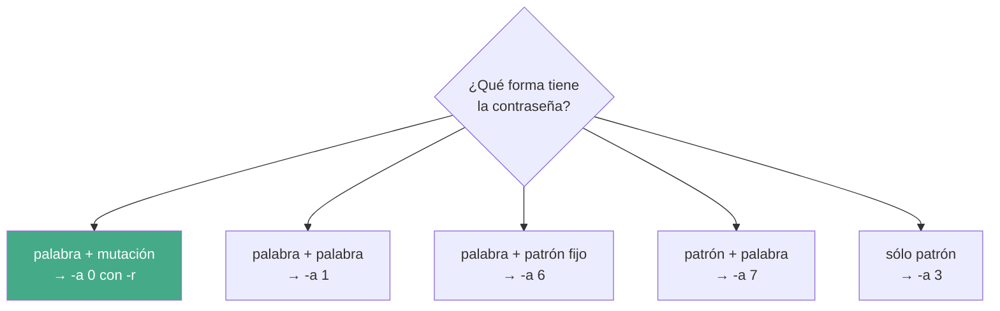

---
tags:
  - Seguridad/Contraseñas
  - Pentesting/Post-Explotacion
Descripción: "Los modos -a 1, -a 6 y -a 7, y las dos opciones que los hacen realmente útiles: las reglas por lado -j y -k que casi nadie usa"
Fecha de actualización: 2026-08-04
Nota previa: "[[01 - Ataques avanzados y optimización con Hashcat]]"
Nota siguiente: "[[03 - Máscaras y charsets personalizados]]"
Area: "[[Hashcat.base|Hashcat]]"
---
---

El combinator y los híbridos cubren un hueco concreto entre el diccionario y la máscara: <mark style="background: #ADCCFFA6;">las contraseñas que la gente construye **pegando dos cosas**</mark> — dos palabras, una palabra y un año, un prefijo corporativo y un número. Ni un diccionario las contiene ni una máscara las alcanza en tiempo razonable.

# `-a 1`: concatenar dos listas

Cada palabra de la lista izquierda se pega a cada palabra de la derecha. El espacio es el producto: `|A| × |B|`.

```shell-session
$ hashcat -m 22000 -a 1 hash.hc22000 izquierda.txt derecha.txt
$ hashcat -a 1 --stdout izquierda.txt derecha.txt        # previsualizar sin crackear
```

Con dos listas de 3 y 2 palabras salen 6 candidatas. Con dos de 10.000, cien millones — <mark style="background: #FFB8EBA6;">el crecimiento es cuadrático y se descontrola muy rápido</mark>. Las listas de un combinator deben ser cortas y elegidas, no `rockyou` dos veces.

# `-j` y `-k`: lo que hace útil al combinator

Esta es la parte que los tutoriales omiten y la que separa un combinator inservible de uno que funciona.

> [!important]+ Los ficheros de reglas sólo valen en tres modos
> `user_options.c` de hashcat lo comprueba y aborta con este mensaje: <mark style="background: #FFB86CA6;">*"Use of -r/--rules-file and -g/--rules-generate requires attack mode 0, 8 or 9."*</mark>
>
> Es decir: `-r` funciona con **`-a 0`** (diccionario), `-a 8` (genérico) y `-a 9` (association), y **no** con combinator (`-a 1`), máscara (`-a 3`) ni híbridos (`-a 6`/`-a 7`). Quien intente aplicar `best64` a un combinator se encuentra un error, no un resultado silenciosamente distinto.

Lo que sí admiten esos modos es una regla **por lado**:

| Opción | Aplica a | Ejemplo |
| ------ | -------- | ------- |
| `-j`, `--rule-left` | Cada palabra de la lista izquierda | `-j 'c'` → capitaliza |
| `-k`, `--rule-right` | Cada palabra de la lista derecha | `-k '^-'` → antepone un guion |

```shell-session
$ hashcat -m 22000 -a 1 hash.hc22000 nombres.txt anios.txt -j 'c' -k '$!'
```

Ese comando genera `Marta2024!`, `Carlos2025!`… a partir de dos listas planas. Sin `-j`/`-k` habría que pregenerar las variantes en disco.

La sintaxis es la misma que la de `-r` ([[01 - Wordlists y reglas personalizadas]]), y el límite exacto que documenta la wiki es: *"you can only specify a single sequence of rules to each, not a file/list of many rules"*. O sea que **`-j 'c$1'` es válido** —varias funciones encadenadas en una sola regla—; lo que no se puede es pasar un fichero con muchas reglas.

Un uso muy común es el separador, que ninguna lista trae:

```shell-session
$ hashcat -a 1 --stdout palabras.txt palabras.txt -k '^-'      # casa-verde
$ hashcat -a 1 --stdout palabras.txt palabras.txt -k '^.'      # casa.verde
```

# `-a 6` y `-a 7`: diccionario y máscara

| Modo | Estructura | Ejemplo generado |
| ---- | ---------- | ---------------- |
| `-a 6` | palabra + máscara | `password2024`, `verano!!` |
| `-a 7` | máscara + palabra | `2024password`, `123verano` |

```shell-session
$ hashcat -m 22000 -a 6 hash.hc22000 palabras.txt '?d?d?d?d'
$ hashcat -m 22000 -a 7 hash.hc22000 '?d?d?d' palabras.txt
```

El espacio es `|lista| × keyspace(máscara)`. Con 10.000 palabras y `?d?d?d?d` salen 10⁸ candidatas: 38 segundos en una RTX 4090 sobre `-m 22000`. Con `?a?a?a?a` serían 8,1 × 10¹¹, casi cuatro días. <mark style="background: #8000E1A6;">La diferencia entre un híbrido viable y uno inútil está en el charset de la máscara, no en la lista</mark>.

`--increment` actúa sobre el **lado de la máscara**, lo que cubre sufijos de longitud variable en una sola pasada en vez de cuatro ejecuciones:

```shell-session
$ hashcat -m 22000 -a 6 hash.hc22000 palabras.txt '?d?d?d?d' --increment --increment-min=1
```

> [!success]+ Comprueba siempre qué genera antes de lanzarlo
> El comportamiento exacto de `--increment` y de `-j`/`-k` en los modos híbridos no está documentado en la wiki, y depende de la versión. En vez de fiarse, se mira:
>
> ```shell-session
> $ hashcat -a 6 --stdout palabras.txt '?d?d' --increment --increment-min=1 | head
> ```
>
> <mark style="background: #FFB86CA6;">`--stdout` imprime los candidatos sin crackear nada</mark>. Diez segundos de comprobación evitan descubrir a las tres horas que el ataque estaba generando algo distinto de lo que se creía. Es el hábito que más disgustos ahorra con máscaras, reglas e híbridos.

# Cuándo elegir cada uno



La regla práctica: **las reglas (`-r`) casi siempre ganan** al combinator, porque `best64` ya incluye añadir dígitos y símbolos. El combinator merece la pena cuando las dos mitades son **específicas del objetivo** —nombres de producto, apellidos, topónimos del cliente— y por tanto ninguna regla las va a inventar.

# Calcular el espacio antes de lanzarlo

```shell-session
$ hashcat -a 1 --keyspace izquierda.txt derecha.txt
$ hashcat -a 6 --keyspace palabras.txt '?d?d?d?d'
```

`--keyspace` devuelve el número de candidatas sin ejecutar nada. Dividido por la velocidad de `hashcat -b -m 22000`, da el tiempo de agotamiento antes de comprometer la GPU. Es el paso que evita lanzar un ataque de tres semanas creyendo que son tres horas.

# `hashcat-utils` para lo que el motor no cubre

El repositorio [`hashcat/hashcat-utils`](https://github.com/hashcat/hashcat-utils) (activo, nov-2025) trae generadores que el binario principal no incluye:

| Herramienta | Qué hace |
| ----------- | -------- |
| `combinator3` / `combinatorX` | Combina **tres o más** listas, no sólo dos |
| `combipow` | Todas las permutaciones de los elementos de una lista |
| `expander` | Genera todas las subcadenas de cada palabra |
| `permute` | Permutaciones de caracteres de cada palabra |
| `len` | Filtra por longitud — útil para el mínimo de 8 de WPA2 |
| `rli` / `rli2` | Resta una lista de otra: elimina lo ya probado |

```shell-session
$ ./combinator3.bin adjetivos.txt sustantivos.txt numeros.txt > netgear.txt
$ ./len.bin 8 63 < candidatas.txt > validas-wpa.txt
$ ./rli.bin nueva.txt salida.txt ya-probadas.txt
```

<mark style="background: #FF5582A6;">`rli` es el que más tiempo ahorra en engagements largos</mark>: evita reprocesar millones de candidatas que ya se descartaron en una sesión anterior. `combinator3` reproduce exactamente el patrón `{adjetivo}{sustantivo}{dígitos}` de los routers Netgear, sin escribir el bucle `bash` de tres niveles que circula por ahí.
