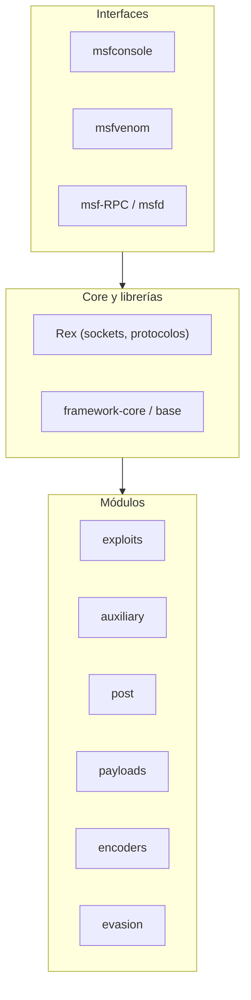

---
tags:
  - Pentesting/Explotacion
  - Metasploit
  - Introduccion
  - Tipo/Introduccion
Descripción: "Metasploit Framework (MSF) es una plataforma modular de desarrollo y ejecución de exploits escrita en Ruby, mantenida por Rapid7"
Fecha de actualización: 2026-07-18
Nota previa: 
Nota siguiente: "[[01 - MSFconsole]]"
Area: "[[Metasploit.base|Metasploit]]"
---
---

<mark style="background: #ADCCFFA6;">`Metasploit Framework` (MSF) es una plataforma modular de desarrollo y ejecución de exploits escrita en `Ruby`</mark>, mantenida por Rapid7. Reúne en un solo entorno miles de exploits, módulos auxiliares, payloads y herramientas de post-explotación, y automatiza el ciclo *elegir exploit → configurar → lanzar → recibir sesión*. Es la navaja suiza de la explotación en pentest — y, por lo mismo, una de las herramientas **más vigiladas** por los defensores.

> [!info]+ Origen y versión
> Creado por **H.D. Moore en 2003** (originalmente en Perl, reescrito en Ruby), adquirido por **Rapid7 en 2009**. Hoy va por la rama **6.x** (`6.4` en 2024 — verifica la última en [rapid7.com/metasploit](https://www.rapid7.com/products/metasploit/) o el [repo](https://github.com/rapid7/metasploit-framework)). Las versiones 6.x añadieron soporte `SMBv3`, autenticación `Kerberos`, sesiones sobre HTTP y mejoras de OPSEC — muy lejos del estado de hace años. Referencia clásica y gratuita: [Metasploit Unleashed](https://www.offsec.com/metasploit-unleashed/) (OffSec).

# Framework vs. Pro

| | Metasploit Framework | Metasploit Pro |
| --- | --- | --- |
| Licencia | Open source, gratis | Comercial (Rapid7) |
| Interfaz | CLI (`msfconsole`) | GUI web + CLI |
| Uso | El estándar en pentest/CTF | Automatización, phishing, reporting empresarial |

Esta carpeta cubre el **Framework** (`msfconsole`), que es lo que se usa en la práctica diaria.

# Arquitectura

MSF se organiza en tres capas: las **interfaces** con las que interactuamos, el **core/librerías** que orquestan, y los **módulos** que hacen el trabajo.



## Tipos de módulos

<mark style="background: #FFB8EBA6;">Todo en MSF es un módulo</mark>. Conocer las categorías es la base para moverse por el framework:

| Módulo | Función |
| --- | --- |
| `exploits` | Código que abusa una vulnerabilidad para ejecutar un payload |
| `auxiliary` | Escáneres, fuzzers, sniffers, brute-force — todo lo que **no** entrega shell |
| `payloads` | El código que se ejecuta tras el exploit (la [[04 - Payloads en Metasploit\|shell]]) |
| `post` | Post-explotación: enumerar, pivotar, robar credenciales |
| `encoders` | Recodifican el payload para adaptarlo a un charset (ya **no** para evadir AV) |
| `nops` | Generan `NOP sleds` para estabilizar exploits |
| `evasion` | Intentan generar payloads que evadan AV (con matices — ver [[12 - Detección y evasión]]) |

Cada categoría se explora a fondo en su nota. La estructura en disco (`/usr/share/metasploit-framework/modules/`) replica exactamente estas carpetas.

## Estructura de directorios

```shell-session
$ ls /usr/share/metasploit-framework/
data  documentation  lib  modules  plugins  scripts  tools
```

- `modules/` — los módulos por categoría.
- `plugins/` — extensiones cargables ([[07 - Plugins y Mixins|nota 07]]).
- `tools/` — utilidades CLI (incluido `msfvenom`).
- `data/` + `lib/` — el motor funcional de [[01 - MSFconsole|msfconsole]].

# Dónde encaja — y su gran problema

Metasploit cubre las fases de [[07 - Explotación|explotación]] y [[08 - Post-explotación|post-explotación]]: una vez la [[00 - Principios y metodología de enumeración|enumeración]] revela un servicio vulnerable, MSF a menudo tiene el exploit listo. Es el puente natural desde el descubrimiento de una vulnerabilidad ([[01 - Evaluación de vulnerabilidades|vulnerability assessment]]) hasta una shell.

> [!warning]+ Potente pero ruidoso
> <mark style="background: #FF5582A6;">MSF —y sobre todo `Meterpreter`— es de lo más detectado de la industria</mark>: firmas YARA para el stub, el certificado TLS por defecto del handler, patrones de *staging* y nombres de payload estándar. En un objetivo con `EDR`, lanzar un exploit de MSF sin precauciones es delatarse. Saber **cuándo** usarlo, cómo reducir su huella y cuándo migrar a un C2 más sigiloso es criterio de pentester senior — desarrollado en [[12 - Detección y evasión]] y [[13 - Arsenal - automatización y alternativas]].

# El recorrido

Dominar MSF es dominar sus piezas: la consola ([[01 - MSFconsole]]), los [[02 - Módulos|módulos]] y sus [[03 - Targets|targets]], los [[04 - Payloads en Metasploit|payloads]] y [[05 - Encoders|encoders]], la [[06 - Bases de datos y workspaces|base de datos]] que organiza el engagement, los [[07 - Plugins y Mixins|plugins]], la gestión de [[08 - Sesiones y Jobs|sesiones]], el agente [[09 - Meterpreter|Meterpreter]], la [[10 - Escritura e importación de módulos|escritura de módulos]] y el generador [[11 - MSFvenom|MSFvenom]] (que ya usamos en [[05 - Payloads con Metasploit y MSFvenom|Shells & Payloads]]). Cierran el sub-tema los dos ejes transversales: [[12 - Detección y evasión|detección/evasión]] y [[13 - Arsenal - automatización y alternativas|arsenal]].
