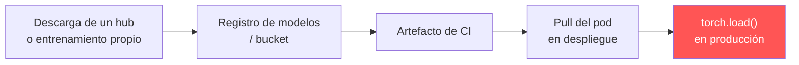

---
tags:
  - IA/Red-Team
  - IA
  - Pentesting/Reporting
Descripción: "Escanear a mano sirve para un engagement"
Fecha de actualización: 2026-07-28
Nota previa: "[[00 - Qué es ModelScan]]"
Nota siguiente: 
Area: "[[ModelScan.base|ModelScan]]"
---
---

Escanear a mano sirve para un engagement. Lo que se recomienda al cliente es **dónde colocar el escaneo** para que ocurra solo — y ahí es donde casi todos los despliegues fallan.

# El problema de la ubicación

<mark style="background: #FF5582A6;">El error recurrente: el escaneo se coloca en **un solo punto** del recorrido del artefacto, y el artefacto pasa por varios.</mark>

Un modelo viaja típicamente así:



Lo habitual es escanear en **B** (al subir al registro). Un atacante con acceso a **C** o **D** entrega el artefacto malicioso sin pasar por el control. Es exactamente el vector de [[01 - Taxonomía de los ataques a los datos#Despliegue — interceptar el artefacto|inyección en despliegue]], y es más accesible que comprometer el registro.

**La recomendación correcta es escanear lo más cerca posible de E**, en el momento de la carga, además de en B.

# Puntos de integración

| Punto | Qué cubre | Coste |
| - | - | - |
| **Ingesta de modelos de terceros** | Modelos descargados de hubs públicos antes de aprobarlos | Bajo — es el filtro de entrada |
| **CI, al publicar en el registro** | Artefactos propios y de terceros | Bajo |
| **CI, al construir la imagen** de servicio | El modelo tal como llega al contenedor | Bajo |
| **Arranque del servicio**, antes de cargar | <mark style="background: #8000E1A6;">El punto que de verdad cierra la cadena</mark> | Latencia de arranque |
| Escaneo periódico del almacenamiento | Detecta sustituciones posteriores | Medio |

```yaml
# CI — bloquear la publicación si el artefacto no pasa
- name: model security scan
  run: |
    pip install modelscan
    modelscan -p ./artifacts/ || exit 1
```

# Escaneo no es integridad

Distinción que hay que dejar clara en el informe, porque se confunden constantemente:

| Control | Responde a | Qué no cubre |
| - | - | - |
| **Escaneo** (`ModelScan`, `picklescan`) | ¿Este fichero contiene código peligroso conocido? | Payloads ofuscados o novedosos |
| **Verificación de integridad** (hash, firma) | ¿Este fichero es exactamente el que aprobamos? | Que el aprobado fuera seguro |
| **Formato seguro** (`safetensors`) | ¿Puede este formato ejecutar código? | Backdoors en los pesos |

<mark style="background: #FFB86CA6;">Los tres son necesarios y ninguno sustituye a los otros.</mark> Un escaneo limpio sobre un fichero no firmado no dice nada sobre si es el fichero correcto; una firma válida sobre un formato inseguro no dice nada sobre lo que hace al cargarse.

El orden de prioridad al recomendar, por eficacia:

1. **Migrar a [[11 - Pickle y la deserialización insegura de modelos#Alternativas seguras|`safetensors`]]** — elimina la clase de vulnerabilidad, no la detecta.
2. **Firmar y verificar** en el momento de la carga, contra un registro de modelos aprobados.
3. **Escanear** en ingesta y en CI, como capa adicional.
4. **Aislar la carga** en un proceso sin credenciales ni red saliente, cuando haya que aceptar formatos inseguros.

# Combinación práctica

Las tres herramientas del vault son complementarias y se usan en el mismo pipeline:

| Herramienta | Papel |
| - | - |
| [[00 - Qué es picklescan\|`picklescan`]] | Rápido, códigos de salida tipo ClamAV, ideal para lotes y para modelos de hubs |
| **`ModelScan`** | Varios formatos y severidad — el escáner general del pipeline |
| [[00 - Qué es fickling y análisis de pickle\|`fickling`]] | Triaje de lo que salte: qué hace exactamente el fichero |

```shell-session
# Barrido rápido de lo descargado
$ picklescan --path ./descargas

# Escaneo completo, multi-formato, en CI
$ modelscan -p ./artifacts/

# Sobre lo que haya saltado
$ fickling --check-safety -p ./artifacts/sospechoso.pth
$ fickling --trace ./artifacts/sospechoso.pth
```

Este flujo es el paso 2 del [[15 - Arsenal de herramientas para ataques a los datos#Flujo sugerido para un engagement|flujo de auditoría del pipeline de datos]].
