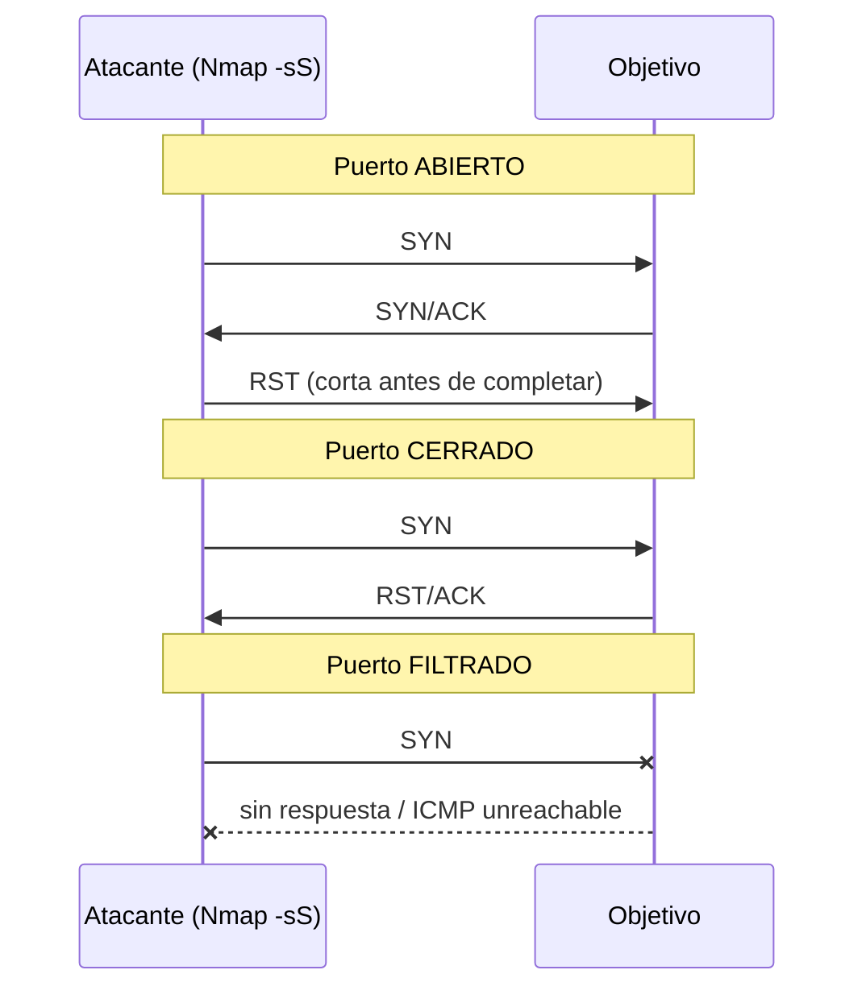

---
tags:
  - Pentesting/Enumeracion
  - Escaneo/Redes
  - Linux
Fecha de actualización: 2026-07-18
Nota previa:
Nota siguiente: "[[01 - Host Discovery]]"
Area: "[[Nmap.base|Nmap]]"
---
---

<mark style="background: #ADCCFFA6;">`Nmap` (*Network Mapper*) es un escáner de red y herramienta de auditoría de seguridad open-source</mark>, escrito en C, C++, Python y Lua. Envía paquetes crudos (*raw packets*) para averiguar qué hosts están vivos, qué puertos y servicios exponen, qué versión corre cada uno y —cuando puede— qué sistema operativo. Es el estándar de facto de la fase de enumeración de infraestructura y el punto de partida de casi cualquier pentest de red.

> [!info]+ Origen y versión
> Creado por Gordon Lyon (*Fyodor*) y presentado en **Phrack #51 (1997)**. Hoy va por la rama **7.9x** (`7.95`, abril 2024 — verifica la última en [nmap.org](https://nmap.org)). El paquete de los repos del sistema suele ir **atrasado**; en un engagement, usa la build de `nmap.org` o una distro de seguridad al día. Referencia canónica: el libro *Nmap Network Scanning* del propio Lyon (parte disponible libre en [nmap.org/book](https://nmap.org/book/)).

# Enumeración: el porqué antes que el cómo

<mark style="background: #FFB8EBA6;">La enumeración es la fase más crítica del pentest</mark>, y no consiste en "lanzar todas las herramientas". Un escáner solo sirve si sabemos interpretar lo que devuelve y, sobre todo, interactuar manualmente con cada servicio. El ejemplo clásico: la mayoría de escáneres usan un *timeout* corto; si un servicio tarda en responder, lo marcan `closed`, `filtered` o `unknown` — y un puerto etiquetado como cerrado que en realidad estaba vivo puede ocultarnos <mark style="background: #FF5582A6;">el único vector de entrada</mark>. Por eso el enumerado manual complementa, nunca sustituye, al automatizado.

La **metodología** completa de enumeración (principios, orden, qué mirar en cada servicio) vive en [[00 - Principios y metodología de enumeración|Footprinting]]; esta nota y el resto de la carpeta se centran en Nmap como **motor** de esa fase.

# Casos de uso

Administradores y equipos de seguridad lo usan para auditar redes, simular pentests, comprobar reglas de firewall/IDS, mapear la topología, identificar puertos abiertos y como base de un *vulnerability assessment* (ver [[01 - Evaluación de vulnerabilidades|Evaluación de vulnerabilidades]]). En un test de intrusión es la primera pieza tras el descubrimiento de rango.

# Arquitectura: las cinco capacidades

Nmap se organiza en cinco técnicas que son, además, el **orden lógico** de trabajo. Cada una tiene su nota:

1. [[01 - Host Discovery|Host discovery]] — qué máquinas están vivas.
2. [[02 - Escaneo de puertos y hosts|Port scanning]] — qué puertos abiertos exponen.
3. [[03 - Enumeración de servicios y versiones|Service & version detection]] — qué software corre y en qué versión.
4. **Detección de SO** (`-O`) — fingerprinting del sistema operativo (se cubre junto a la enumeración de versiones).
5. [[04 - Nmap Scripting Engine (NSE)|NSE]] — interacción scriptable con el servicio (vuln checks, brute, discovery…).

# Sintaxis

```shell-session
$ nmap <tipos de escaneo> <opciones> <objetivo>
```

<mark style="background: #FF5582A6;">La mayoría de técnicas (SYN, ACK, FIN, UDP…) construyen paquetes crudos y requieren `root`</mark> (`sudo`). Sin privilegios, Nmap cae automáticamente al *connect scan* (`-sT`), que completa el *three-way handshake* y es más lento y ruidoso.

## Técnicas de escaneo

Se listan todas con `nmap --help`. Las que de verdad se usan en un pentest:

| Flag | Técnica | Uso típico |
| --- | --- | --- |
| `-sS` | TCP SYN (*half-open*) | Por defecto con root. Rápido, algo más sigiloso. |
| `-sT` | TCP connect | Sin root, o cuando la pila lo exige. Ruidoso (deja logs). |
| `-sU` | UDP | Servicios UDP (DNS, SNMP, IKE…). Lento — combinar con `--top-ports`. |
| `-sA` | TCP ACK | Mapear reglas de firewall (distingue *filtered* de *unfiltered*). |
| `-sN`/`-sF`/`-sX` | Null / FIN / Xmas | Evasión de filtros simples y detección de pilas no estándar. |
| `-sI` | Idle (*zombie*) | Escaneo con IP de un tercero — atribución falsa. |
| `-sO` | Protocolos IP | Qué protocolos (TCP/UDP/ICMP/SCTP…) admite el host. |

# El escaneo por defecto: TCP SYN (`-sS`)

Con privilegios, `-sS` es el escaneo por defecto. Envía un paquete con el flag `SYN` y **nunca completa** el *three-way handshake* (por eso se llama *half-open*), lo que evita establecer una conexión TCP completa y permite <mark style="background: #FFB86CA6;">escanear miles de puertos por segundo</mark>. La lectura del estado del puerto se hace por la respuesta:



- **`SYN/ACK`** de vuelta → puerto `open`.
- **`RST`** → puerto `closed`.
- **Sin respuesta** (o `ICMP unreachable` tipo 3) → puerto `filtered`: un firewall descarta o ignora el paquete.

```shell-session
$ sudo nmap -sS localhost

Starting Nmap 7.95 ( https://nmap.org )
Nmap scan report for localhost (127.0.0.1)
Host is up (0.000010s latency).
Not shown: 996 closed ports
PORT     STATE SERVICE
22/tcp   open  ssh
80/tcp   open  http
5432/tcp open  postgresql
5901/tcp open  vnc-1

Nmap done: 1 IP address (1 host up) scanned in 0.18 seconds
```

Cada línea es `puerto/protocolo`, `estado` y `servicio`. La distinción entre `open`, `closed` y `filtered` es la base de todo lo demás y se detalla en [[02 - Escaneo de puertos y hosts]].

> [!warning]+ Sigiloso ≠ indetectable
> El SYN scan se llamaba "*stealth scan*" cuando los IDS solo miraban conexiones completas. <mark style="background: #8000E1A6;">En 2026 eso ya no es cierto</mark>: cualquier IDS/IPS moderno (Suricata, Zeek, Snort) detecta el patrón de medio-open contra muchos puertos como *portscan* trivial. La evasión real se trabaja en [[07 - Evasión de firewalls, IDS e IPS]] y [[08 - Detección de escaneos y evasión moderna]].

# Nmap en el flujo profesional actual

Nmap prima **profundidad y fiabilidad**, no velocidad bruta. El patrón habitual en pentest/bug bounty moderno es de **dos fases**: primero un barrido ultrarrápido de puertos con `masscan` o `RustScan` sobre todo el rango, y luego Nmap dirigido (`-sCV`) solo a los puertos vivos para enumerar servicio, versión y NSE. Ese arsenal complementario se detalla en [[09 - Arsenal de herramientas de escaneo]].

> [!important]+ Autorización
> Escanear infraestructura sin permiso escrito es ilegal en la mayoría de jurisdicciones y viola las reglas de casi todo programa de bug bounty. Acota siempre el escaneo al *scope* autorizado; un `-p-` a un rango entero fuera de alcance es un incidente, no un hallazgo.
