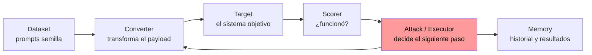

---
tags:
  - IA/Red-Team
  - IA/LLM
  - Pentesting/Explotacion
  - Tipo/Introduccion
Descripción: "PyRIT (*Python Risk Identification Tool for generative AI*) es el orquestador de red teaming de IA de Microsoft: no lanza payloads sueltos, mantiene conversaciones, transforma…"
Fecha de actualización: 2026-07-28
Nota previa: 
Nota siguiente: "[[01 - Targets, converters y scorers de PyRIT]]"
Area: "[[PyRIT.base|PyRIT]]"
---
---

<mark style="background: #ADCCFFA6;">`PyRIT` (*Python Risk Identification Tool for generative AI*) es el **orquestador** de red teaming de IA de Microsoft: no lanza payloads sueltos, mantiene conversaciones, transforma entradas y puntúa respuestas de forma automatizada.</mark> Lo mantiene el **AI Red Team de Microsoft**, bajo licencia MIT.

Esa distinción con [[00 - Qué es garak y cuándo usarlo|`garak`]] es la que decide cuál usar:

| | `garak` | **`PyRIT`** |
| - | - | - |
| Modelo mental | **Escáner** — batería de prompts conocidos | **Orquestador** — estrategia de ataque con estado |
| Turnos | Uno | **Varios**, con memoria de la conversación |
| Qué aporta | Cobertura amplia y rápida | Ataques dirigidos y adaptativos |
| Cuándo | Barrido inicial: por dónde cede el objetivo | Construir el ataque a partir de esos indicios |
| Analogía | Nessus | Metasploit |

<mark style="background: #8000E1A6;">En un engagement serio se usan los dos, y en ese orden.</mark> `garak` dice qué familias funcionan; `PyRIT` construye el ataque real, sobre todo si necesita varios turnos ([[11 - Jailbreaks multi-turno y de contexto|Crescendo, PAIR, Tree of Attacks]]).

> [!warning]+ El repositorio se movió
> `PyRIT` nació en `Azure/PyRIT` y hoy vive en **[`microsoft/PyRIT`](https://github.com/microsoft/PyRIT)**. Cualquier material que apunte al repo antiguo está desactualizado — incluida buena parte de los tutoriales, que además asumen la API previa a la versión 1.x.

# Instalación y puntos de entrada

```shell-session
$ pip install pyrit
```

Requiere Python **≥3.10 y <3.15**. Extras relevantes: `pyrit[huggingface]` para modelos locales con `torch`, y `pyrit[gcg]` para generar [[10 - Jailbreaks por obfuscación#Sufijo y sufijo adversarial|sufijos adversariales GCG]].

<mark style="background: #FF5582A6;">PyRIT dejó de ser solo una librería para cuadernos.</mark> La versión 1.x expone **tres ejecutables**, y esto es lo que la mayoría del material antiguo no refleja:

| Comando | Para qué |
| - | - |
| **`pyrit_scan`** | Ejecutar un `scenario` completo desde la línea de comandos, sin escribir Python |
| **`pyrit_shell`** | Shell interactiva para sondear un objetivo a mano |
| `pyrit_backend` | Backend de servicio, para integrarlo en otras herramientas |

# El modelo mental — cinco piezas

Todo en PyRIT se compone de los mismos bloques. Entenderlos es entender la herramienta:



- **`Target`** — el sistema atacado. APIs de OpenAI, `HuggingFace`, endpoints HTTP propios, incluso interfaces web vía Playwright. [[01 - Targets, converters y scorers de PyRIT]].
- **`Converter`** — transforma el prompt antes de enviarlo: codificaciones, traducción, homoglifos, audio, imagen. Es la [[10 - Jailbreaks por obfuscación|ofuscación]] automatizada, y se encadenan.
- **`Scorer`** — decide si el ataque tuvo éxito, normalmente con otro LLM como juez. Es lo que permite iterar sin supervisión humana.
- **`Attack` / `Executor`** — la estrategia. Aquí viven Crescendo, PAIR y Tree of Attacks. [[02 - Ataques multi-turno con PyRIT]].
- **`Memory`** — persiste conversaciones, puntuaciones y resultados. <mark style="background: #FFB8EBA6;">Es lo que convierte una prueba en evidencia reproducible</mark>, y lo que permite calcular el [[08 - Fundamentos del jailbreaking#Medir en vez de anecdotar|ASR]] sobre muchas repeticiones.

A esas cinco se han sumado en la 1.x los **`scenarios`**: paquetes preconfigurados de ataque que se ejecutan con `pyrit_scan`. Los disponibles son `adaptive`, `airt`, `benchmark`, `foundry` y **`garak`** — sí, PyRIT puede orquestar escenarios equivalentes a los del escáner.

# Qué cubre y qué no

Cubre bien:

- **Ataques multi-turno** con estrategia — la razón principal para usarlo.
- **Transformación sistemática de payloads**: decenas de conversores encadenables.
- **Evaluación automatizada** con LLM como juez, incluida evaluación del propio scorer.
- **Multimodal**: audio e imagen como entrada y como vector.
- **Objetivos poco convencionales**: guardrails (`prompt_shield_target`), interfaces web sin API, WebSockets.

No cubre:

- **Barrido rápido con corpus conocidos** — para eso, `garak`.
- **Regresión en CI con buena ergonomía** — para eso, `promptfoo`.
- **Ataques a la [[00 - Tratamiento inseguro de la salida del LLM|salida]] o a la infraestructura**. PyRIT trabaja sobre el prompt y la respuesta; la SQLi que provoque la respuesta se explota a mano.

# Cuándo merece la pena

<mark style="background: #FFB86CA6;">La curva de aprendizaje de PyRIT es notablemente más alta que la de `garak`.</mark> Se justifica en tres escenarios concretos:

1. **El objetivo tiene un input guard por mensaje.** Los payloads de un solo turno mueren en el filtro; hay que construir la escalada, y hacerlo a mano no escala.
2. **Hay que medir el ASR de una técnica propia** sobre decenas o cientos de repeticiones, con evaluación automática.
3. **El objetivo no expone una API cómoda** — una web sin API documentada, un WebSocket, un producto de escritorio. Los targets basados en Playwright resuelven eso.

Para un chatbot sencillo con API REST y sin guardrail, `garak` da el 90 % del valor con el 10 % del esfuerzo. El detalle de cómo elegir está en [[03 - PyRIT en un engagement]].
