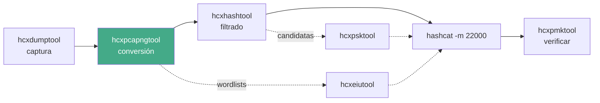

---
tags:
  - Wi-Fi
  - Seguridad/Contraseñas
  - Tipo/Introduccion
Descripción: "Qué hace cada binario de hcxdumptool y hcxtools, el flujo canónico de captura a hash y por qué sustituyó a media suite Aircrack-ng"
Fecha de actualización: 2026-08-04
Nota previa: 
Nota siguiente: "[[01 - hcxdumptool]]"
Area: "[[hcxtools.base|hcxtools]]"
---
---

<mark style="background: #ADCCFFA6;">`hcxtools` y `hcxdumptool`, de ZeroBeat, son la cadena de referencia entre una tarjeta Wi-Fi y `hashcat`</mark>. El propio hashcat los recomienda como vía canónica para producir hashes de WPA, y desplazaron a `airodump-ng` + `cap2hccapx` + `cowpatty` en la parte de captura y conversión.

Son **dos repositorios separados** que se usan juntos:

| Repositorio | Versión | Qué aporta |
| ----------- | ------- | ---------- |
| [`ZerBea/hcxdumptool`](https://github.com/ZerBea/hcxdumptool) | **7.1.2** (feb-2026) | Captura y ataque en el aire |
| [`ZerBea/hcxtools`](https://github.com/ZerBea/hcxtools) | **7.1.2** (feb-2026) | Todo el procesado posterior |

# El flujo canónico



# Los binarios

| Binario | Función |
| ------- | ------- |
| **`hcxdumptool`** | Captura: PMKID, handshakes, filtro BPF, salida `pcapng` |
| **`hcxpcapngtool`** | Convierte a `hc22000`; extrae ESSID, identidades EAP e info de dispositivo |
| **`hcxhashtool`** | Filtra el fichero de hashes por red, fabricante y **calidad del par** |
| **`hcxpsktool`** | Genera candidatas débiles a partir del propio hash |
| **`hcxeiutool`** | Deriva wordlists de las variantes de un ESSID |
| **`hcxpmktool`** | Verifica una PSK o un PMK contra un hash, offline |
| `hcxhash2cap` | Camino inverso: de hash a `pcapng` |
| `hcxwltool` | Manipulación de wordlists |
| `hcxpottool` | Procesa ficheros *potfile* |
| `whoismac` | Consulta el fabricante de una MAC |
| `wlancap2wpasec` | Sube capturas a `wpa-sec.stanev.org` |

# Por qué desplazó a la suite clásica

| Tarea | Aircrack-ng | hcx |
| ----- | ----------- | --- |
| Captura | `airodump-ng` + `aireplay-ng` | `hcxdumptool` solo |
| PMKID | No soportado | Nativo, es su razón de ser |
| Filtro de alcance | `--essid`, `--bssid` | **BPF compilado** |
| Formato de salida | `.cap` | `pcapng` con metadatos |
| Validación del material | «WPA handshake» en la cabecera | Informe detallado por tipo de par |
| Conversión | Herramienta aparte | Integrada |

<mark style="background: #FFB86CA6;">La diferencia decisiva es la validación</mark>: `airodump-ng` escribe «WPA handshake» con criterio laxo, mientras que `hcxpcapngtool` dice exactamente cuántos pares hay, de qué mensajes salen y si el AP confirmó la contraseña. Eso evita crackear durante horas material que no servía — el detalle en [[02 - El formato 22000 y los message pairs]].

# El aviso del autor

El `README` es explícito en algo que conviene tomar en serio: la suite **no está pensada para usuarios sin base**. Enumera como requisitos conocimiento detallado del protocolo 802.11, de funciones de derivación de clave, de filtros BPF y de Linux, y exige kernel ≥ 5.15 con drivers que soporten monitor **e inyección completa**.

No es humildad mal entendida: <mark style="background: #FFB8EBA6;">las herramientas no traen barreras de seguridad</mark>. `hcxdumptool` ataca por defecto todo lo que ve si no se le pone un filtro, y en un engagement eso significa tocar redes fuera del alcance contratado. La disciplina de acotar está en [[01 - hcxdumptool]].

# Instalación

```shell-session
$ sudo apt install hcxtools hcxdumptool
$ hcxpcapngtool --version
```

Las versiones empaquetadas suelen ir por detrás. La diferencia entre la 6.x —la que muestran los cursos— y la 7.x es sustancial: cambian nombres de opciones, desaparecen flags y la salida del resumen se reorganiza. Para compilar:

```shell-session
$ sudo apt install libpcap-dev libssl-dev libcurl4-openssl-dev zlib1g-dev
$ git clone https://github.com/ZerBea/hcxtools && cd hcxtools && make && sudo make install
$ git clone https://github.com/ZerBea/hcxdumptool && cd hcxdumptool && make && sudo make install
```

> [!info]+ Lo que la suite **no** hace
> Su documentación lo delimita con claridad: no craquea (eso es `hashcat` o John), no ataca WEP (eso es `aircrack-ng`), no ataca WPS (`reaver` o `bully`), no descifra tráfico (`tshark`) y no hace evil twin. Es una cadena de captura y análisis, no una navaja suiza.
