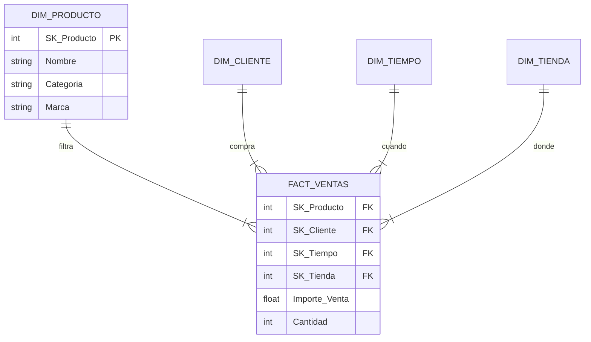
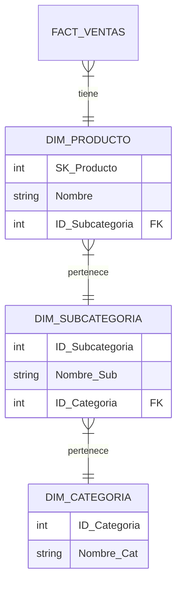
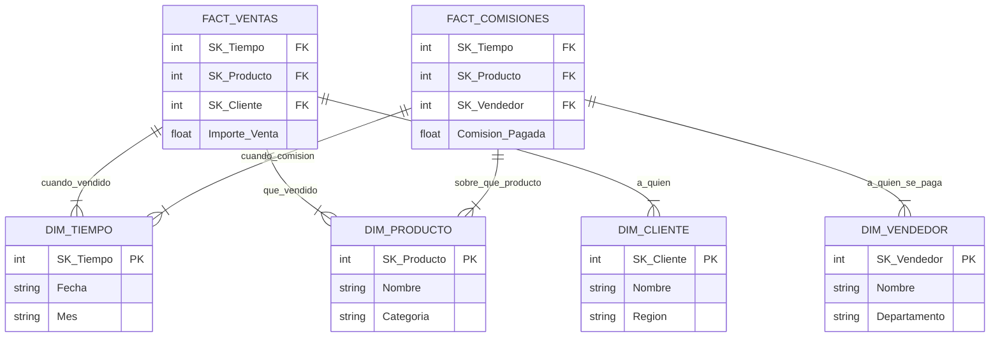

---
tags:
  - Análisis/Datos
  - Ingenieria
  - Visualización/Datos
Descripción: "El modelado dimensional es una técnica de diseño lógico para Sistemas de BI y DW, específicamente adecuada para implementaciones ROLAP (*Relational OLAP*)"
Fecha de actualización: 2025-11-28
Nota previa: "[[002 - Implantación de sistemas BI]]"
Nota siguiente:
Area: "[[Inteligencia del negocio.base|Inteligencia del negocio]]"
---
---

# 1. Introducción y conceptos generales
El modelado dimensional es una <mark style="background: #FFB86CA6;">técnica de diseño lógico</mark> para **Sistemas de BI y DW**, específicamente adecuada para implementaciones **ROLAP** (*Relational OLAP*). A diferencia del **modelo E-R** (normalizado) usado en <mark style="background: #FFB8EBA6;">OLTP para transacciones rápidas</mark>, el <mark style="background: #ADCCFFA6;">dimensional busca **rendimiento en consultas** y facilidad de análisis.</mark>

## Elementos Clave
* **Hechos (Facts):** <mark style="background: #ADCCFFA6;">Medidas numéricas</mark> de una actividad de negocio (Ventas, Gastos).
* **Dimensiones:** El <mark style="background: #ADCCFFA6;">contexto descriptivo</mark> (Quién, Qué, Dónde, Cuándo).
* **Granularidad:** El <mark style="background: #ADCCFFA6;">nivel de detalle más atómico</mark> de los datos.

---

# 2. Tablas de Hechos (Fact Tables)
<mark style="background: #ADCCFFA6;">Contienen los datos numéricos y las métricas del negocio</mark>. Son tablas **normalizadas**, con <mark style="background: #FFB86CA6;">muchas filas y pocas columnas</mark> (estrechas).

## Composición
1.  **Claves Foráneas (FK):** <mark style="background: #ADCCFFA6;">Apuntan a las tablas de dimensiones</mark>.
2.  **Medidas (Measures):** <mark style="background: #ADCCFFA6;">Datos cuantificables</mark> (cantidad, importe).
3.  **Dimensiones Degeneradas:** Atributos que son <mark style="background: #ADCCFFA6;">identificadores en el OLTP</mark> pero <mark style="background: #FFB8EBA6;">no pertenecen a ninguna dimensión</mark> (ej: Nº de Factura, Nº Pedido).
> [!DANGER]+ Regla de oro: NULOS
> Las **claves foráneas** (*FK*) en la tabla de hechos **NO pueden contener valores nulos (NULL)**. Si un hecho no tiene relación con una dimensión, **debe asignarse a un registro ficticio** en la dimensión (ej: "Desconocido" o "N/A").

## Tipos de Medidas (Facts)
* **Aditivas:** Se pueden <mark style="background: #FFB86CA6;">sumar en todas las dimensiones</mark> (ej: Importe venta).
* **Semi-aditivas:** Se <mark style="background: #FFB86CA6;">suman en algunas dimensiones</mark>, pero no en otras (ej: Inventario/Stock se suma por almacén, pero no por tiempo; no sumas el stock de enero + febrero).
* **No aditivas:** <mark style="background: #FFB86CA6;">No se pueden sumar</mark> (ej: Temperatura, Porcentajes). Se deben promediar.

## Tipos de tablas de hechos
1.  **Transaccionales:** Un <mark style="background: #ADCCFFA6;">registro por evento/transacción</mark>. Es la <mark style="background: #8000E1A6;">más granular y común</mark>.
2.  **Periódicas (Snapshot):** <mark style="background: #ADCCFFA6;">Foto fija en un momento del tiempo</mark> (ej: Saldo a fin de mes).
3.  **Acumuladas (Accumulating):** <mark style="background: #ADCCFFA6;">Un registro por ciclo de vida</mark>. Se <mark style="background: #8000E1A6;">actualiza conforme avanza el proceso</mark> (ej: Pedido -> Envío -> Entrega).

---

# 3. Tablas de dimensiones
<mark style="background: #ADCCFFA6;">Describen el contexto.</mark> Son tablas **desnormalizadas** (<mark style="background: #FFB86CA6;">para evitar joins</mark>), con <mark style="background: #FFB8EBA6;">pocas filas pero muchas columnas</mark> (anchas).

## Claves en dimensiones
* **Business Key (Natural Key):** La <mark style="background: #ADCCFFA6;">clave original del sistema operacional</mark> (DNI, Código Producto).
* **Surrogate Key (Clave subrogada - SK):** <mark style="background: #ADCCFFA6;">Clave sintética</mark> (<mark style="background: #FFB8EBA6;">entero autoincremental</mark>) creada en el DW. Es la **Clave Primaria (PK)** recomendada.
> [!INFO]+ ¿Por qué usar claves subrogadas (SK)?
> 1. **Rendimiento:** Los `INT` <mark style="background: #FFB86CA6;">son más rápidos</mark> en los *joins* que los textos.
> 2. **Independencia:** Si la clave de negocio cambia o se recicla, <mark style="background: #FFB86CA6;">no rompe el histórico</mark>.
> 3. **Integración:** Permite <mark style="background: #FFB86CA6;">unificar datos de varios sistemas que usan códigos distintos para lo mismo</mark>.
> 4. **Histórico:** Necesaria para <mark style="background: #FFB86CA6;">tener múltiples versiones de un mismo cliente/producto</mark> (*SCD Tipo 2*).   

## Navegación por jerarquías (Drill-Down & Drill-Up)
Las jerarquías no son solo estructurales, <mark style="background: #ADCCFFA6;">definen cómo el usuario "navega" por los datos</mark>:
- **Drill-Down (Profundizar):** Ir <mark style="background: #FFB86CA6;">de lo general a lo específico</mark> (ej: Ver ventas anuales $\to$ hacer clic $\to$ ver desglose por Trimestres). Requiere que la jerarquía esté bien definida (Año > Trimestre > Mes > Día).
- **Drill-Up (Agrupar):** Lo contrario, <mark style="background: #FFB86CA6;">resumir los datos a un nivel superior</mark> (ej: ver ventas diarias y subir a nivel de País).

## Modelo dimensional vs. modelo relacional (OLAP vs. OLTP)

| **Característica** | **Modelo Relacional (OLTP)**                   | **Modelo Dimensional (OLAP)**                          |
| ------------------ | ---------------------------------------------- | ------------------------------------------------------ |
| **Objetivo**       | Transacción rápida, insertar/actualizar.       | Consultas rápidas, análisis.                           |
| **Diseño**         | **Normalizado** (3FN) para evitar redundancia. | **Desnormalizado** (Star Schema) para velocidad.       |
| **Estructura**     | Muchas tablas pequeñas y complejas.            | Pocas tablas grandes (hechos) y amplias (dimensiones). |
| **Claves**         | Claves de Negocio (Natural Keys).              | **Claves Subrogadas** (Surrogate Keys).                |
| **Rendimiento**    | Lento en agregación y joins complejos.         | Optimizado para _joins_ simples y sumarización.        |

---

# 4. Esquemas de modelado
## Esquema en estrella (Star Schema)
* Una <mark style="background: #ADCCFFA6;">tabla de hechos central rodeada de dimensiones</mark>.
* **Recomendado:** Es el estándar. <mark style="background: #FFB8EBA6;">Mejor rendimiento y más intuitivo para el usuario</mark>.

## Esquema en copo de nieve (Snowflake)
* <mark style="background: #ADCCFFA6;">Dimensiones normalizadas</mark> (<mark style="background: #FFB8EBA6;">jerarquías separadas en tablas</mark>).
* **Desventaja:** Aunque ahorra espacio (<mark style="background: #FF5582A6;">insignificante hoy día</mark>), **penaliza drásticamente el rendimiento** debido al exceso de *joins*.
* *Nota:* Solo usar si es estrictamente necesario.

## Esquema en constelación (Galaxy)
* **Definición:** <mark style="background: #ADCCFFA6;">Dos o más tablas de hechos que comparten una o más dimensiones</mark>.  
* **Importancia:** Las dimensiones compartidas (como `DIM_TIEMPO` y `DIM_PRODUCTO` en el ejemplo) se conocen como **Dimensiones Conformadas**. Son críticas porque <mark style="background: #FFB8EBA6;">permiten que los reportes de diferentes áreas del negocio (ej. Ventas y Comisiones) hablen el mismo idioma y se puedan integrar</mark>. Este concepto es fundamental para construir un Data Warehouse consistente.

---

# 5. Conceptos avanzados
## Dimensión fecha (Time Intelligence)
Es <mark style="background: #ADCCFFA6;">obligatoria en casi todos los modelos</mark>.
* **Formato Clave SK:** A diferencia de otras SK, <mark style="background: #FFB86CA6;">debe ser un entero</mark> con formato **YYYYMMDD** (ej: `20231128`). Esto <mark style="background: #FFB8EBA6;">facilita el orden y filtrado sin joins</mark>.
* **Atributos:** <mark style="background: #FFB86CA6;">Debe incluir flags</mark> (festivo, laboral), trimestres fiscales, nombres de mes, etc.
* **Fechas desconocidas:** Incluir un registro (ej: `99999999` o `-1`) para <mark style="background: #FF5582A6;">evitar NULOS</mark>.

## Dimensión hora (Time of Day)
* Si la granularidad es "Día", no se necesita.
* Si se requiere análisis por horas/minutos, <mark style="background: #ADCCFFA6;">se separa en una dimensión distinta a la de Fecha</mark> para no explotar el tamaño de la tabla (Fecha x Hora).

## Factless Fact Tables (Hechos sin Hechos)
<mark style="background: #ADCCFFA6;">Tablas de hechos que no tienen métricas numéricas, solo claves.</mark>
1.  **De Eventos:** Para <mark style="background: #FFB8EBA6;">registrar que algo ocurrió</mark> (ej: Asistencia a clase). Se suele usar un contador ficticio "1".
2.  **De Cobertura (Coverage):** Para analizar **lo que NO sucedió** (<mark style="background: #FFB86CA6;">Análisis negativo</mark>). Se <mark style="background: #FFB8EBA6;">cruza una tabla de "posibles eventos" (catálogo) con "eventos reales"</mark> (ventas) para ver qué productos en promoción **no se vendieron**.

## Dimensiones causales
Explican el **"Por qué"** de un hecho. Ejemplos: Dimensión "Promoción" o Dimensión "Motivo Devolución". A menudo se olvidan pero son vitales.

## Outrigger dimensions
Cuando <mark style="background: #ADCCFFA6;">una dimensión referencia a otra dimensión</mark> (ej: Dimensión Cliente -> Dimensión Geografía). <mark style="background: #FFB86CA6;">Se debe evitar si es posible</mark> (snowflake), pero a veces es necesario.

## Dimensiones de rol (Role Playing Dimensions)
Cuando <mark style="background: #ADCCFFA6;">una misma tabla de dimensión se utiliza **múltiples veces** en la misma tabla de hechos</mark>, cada vez con un propósito diferente (un "rol" distinto).
- **Ejemplo clásico:** La **Dimensión Fecha**. Una tabla de hechos de `Ventas` puede necesitar la fecha de `FK_Fecha_Pedido`, la fecha de `FK_Fecha_Envio` y la fecha de `FK_Fecha_Entrega`.
- **Implementación:** Solo se crea una única tabla `DIM_TIEMPO` en la base de datos, pero <mark style="background: #FFB86CA6;">la tabla de hechos la referencia con tres claves foráneas distintas.</mark> Esto asegura que el contexto de fecha sea uniforme para todos los roles.

## Dimensiones multivaluadas (Bridge Table)
Este es el método avanzado para gestionar relaciones de **muchos a muchos (M:N)** entre una dimensión y la tabla de hechos.
- **Problema:** En el modelo dimensional, <mark style="background: #FFB8EBA6;">la relación es idealmente 1:N</mark> (1 fila de dimensión $\to$ N filas de hechos). Las multivaluadas (ej: un paciente puede tener varios diagnósticos) rompen esto.
- **Solución (Tabla puente - Bridge Table):**
    1. Se crea una tabla de dimensión normal (`DIM_DIAGNOSTICO`).
    2. Se crea una tabla `PUENTE_DIAGNOSTICO` que <mark style="background: #ADCCFFA6;">almacena la relación M:N entre la clave de hechos y la clave de diagnóstico</mark>.
    3. Se añaden a la tabla puente **factores de ponderación** (Weighting Factors) si el hecho necesita ser distribuido entre los diferentes valores de la dimensión.

## Dimensiones basura (Junk Dimensions)
¿Qué hacemos con todos esos indicadores "Sí/No", "Flags" o estados (ej: "Pagado", "Enviado", "Urgente") que sobran en la tabla de hechos?
- **El problema:** Si los dejas en la tabla de hechos, la ensucian. Si creas una dimensión para cada flag, llenas el modelo de dimensiones diminutas.
- **La solución:** Creas una única **Dimensión basura** (*Junk Dimension*) que <mark style="background: #ADCCFFA6;">contiene todas las combinaciones posibles de estos indicadores.</mark> Así limpias la tabla de hechos y reduces el número de tablas.

---

# 6. Slowly Changing Dimensions (SCD)
<mark style="background: #ADCCFFA6;">Cómo gestionar los cambios en los atributos de las dimensiones</mark> (ej: un cliente se muda).
* **Tipo 0:** No se aceptan cambios (<mark style="background: #FFB86CA6;">Inmutable</mark>).
* **Tipo 1 (Sobrescribir):** <mark style="background: #FFB86CA6;">Se actualiza el dato</mark>. **Se pierde la historia**. Usar para <mark style="background: #FFB8EBA6;">corrección de errores</mark>.
* **Tipo 2 (Histórico - Add Row):** Se <mark style="background: #FFB86CA6;">crea una fila nueva con nueva SK</mark>. Se <mark style="background: #FFB8EBA6;">usan fechas de vigencia</mark> (`ValidFrom`, `ValidTo`). Permite reproducir la historia exacta.
![[SCD_Tipo_2.png]]
* **Tipo 3 (Columna nueva):** Se mantiene el <mark style="background: #FFB86CA6;">valor original y el actual en columnas distintas</mark> (`Region_Actual`, `Region_Anterior`).
![[SCD_Tipo_3.png]]
* **Tipo 4 (Mini-Dimensión):** Separar <mark style="background: #FFB8EBA6;">atributos que cambian rápido</mark> en una <mark style="background: #FFB86CA6;">tabla aparte</mark>.
![[SCD_Tipo_4.png]]
- **Tipo 5 (Combinar 4 + 1)**: aplica la <mark style="background: #ADCCFFA6;">técnica tipo 4 al dividir la dimensión en dos</mark>: una <mark style="background: #FFB86CA6;">primaria con los atributos que cambian lentamente junto con los valores actuales (current) de los atributos que cambian rápidamente</mark>; y una <mark style="background: #FFB86CA6;">mini-dimensión con los atributos que cambian rápidamente</mark>. Posteriormente, se usa la <mark style="background: #FFB8EBA6;">técnica 1 sobre los campos current sobrescribiéndolos cada vez que se producen cambios en los atributos de la mini-dimensión</mark> para, de esta manera, <mark style="background: #ADCCFFA6;">tener siempre los valores actuales accesibles de forma directa desde la dimensión primaria</mark>. Este enfoque es adecuado <mark style="background: #8000E1A6;">cuando la mayor parte del análisis de negocio con la dimensión haga uso del valor actual de los atributos</mark> (“*tal como están*“), mientras que la mini-dimensión queda para realizar análisis sobre valores más atrás en el tiempo ("*tal como estaban*“) que, en teoría, serán menos frecuentes.
![[SCD_Tipo_7.png]]
- **Tipo 6 (Combinar tipos 1 + 2 + 3)**: <mark style="background: #ADCCFFA6;">crea un nuevo registro con cada cambio en los valores de los atributos que se están modificando</mark> (tipo 2), <mark style="background: #FFB86CA6;">sobrescribe en el atributo current de los registros anteriores el valor actual del atributo</mark> (tipo 1) <mark style="background: #FFB8EBA6;">quedando en el atributo histórico de los registros anteriores los valores antiguos</mark> (tipo 3). Permite que se pueda usar el atributo histórico para analizar los hechos según el valor que estaba en vigor cuando ocurrieron; pero también es posible realizar un análisis de manera global por el valor actual.
![[SCD_Tipo_6.png]]
* **Tipo 7 (Híbrido):** <mark style="background: #FFB8EBA6;">Permite doble visión</mark> ("*As Was*" y "*As Is*"). Usa una **Durable Key** (*clave duradera*) que <mark style="background: #FFB86CA6;">vincula todas las versiones históricas de un registro</mark>.

| **Tipo SCD** | **Acción**    | **Resultado**                                    | **¿Guarda Historia?** |
| ------------ | ------------- | ------------------------------------------------ | --------------------- |
| **Tipo 0**   | Ignorar       | El dato no cambia nunca.                         | No                    |
| **Tipo 1**   | Sobrescribir  | El valor antiguo desaparece.                     | No                    |
| **Tipo 2**   | Nueva Fila    | Se añade fila con nueva SK y fechas de vigencia. | **Sí (Completa)**     |
| **Tipo 3**   | Nueva Columna | Columna `Valor_Anterior` y `Valor_Actual`.       | Sí (Limitada)         |

---

# 7. Metodología de diseño (Kimball 4-Steps)
El <mark style="background: #ADCCFFA6;">proceso estándar para diseñar el modelo</mark>:
1.  **Identificar el proceso de negocio:** <mark style="background: #FFB8EBA6;">No centrarse en departamentos</mark>, sino en la actividad (ej: "Venta en Caja", "Gestión de Pedidos").
2.  **Declarar la granularidad:** <mark style="background: #FFB86CA6;">¿Qué representa una fila en la tabla de hechos?</mark>
    * *Mejor prática:* buscar siempre el **máximo nivel de detalle** (<mark style="background: #8000E1A6;">atomicidad</mark>) posible.
3.  **Identificar las dimensiones:** <mark style="background: #FFB86CA6;">Contexto aplicable</mark> a la <mark style="background: #FFB8EBA6;">granularidad elegida</mark>.
4.  **Identificar los hechos:** Las <mark style="background: #FFB8EBA6;">métricas resultantes del proceso</mark> a esa granularidad.