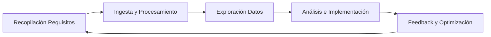
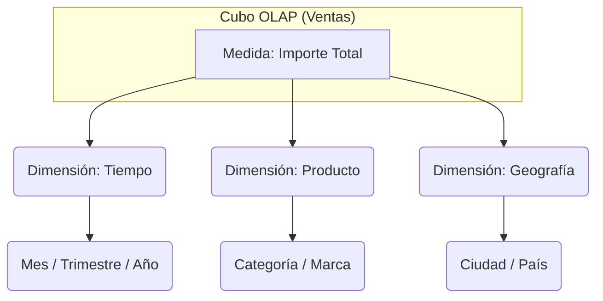

---
tags:
  - Datos
  - Análisis/Datos
  - Ingenieria
Descripción: "El análisis de datos es la ciencia de examinar conjuntos de datos para obtener conclusiones, identificar tendencias y mejorar la toma de decisiones"
Fecha de actualización: 2025-12-04
Nota previa:
Nota siguiente: "[[006 - Dashboards]]"
Area: "[[Inteligencia del negocio.base|Inteligencia del negocio]]"
---
---

# 1. Conceptos Básicos
El **análisis de datos** es la <mark style="background: #ADCCFFA6;">ciencia de examinar conjuntos de datos para obtener conclusiones, identificar tendencias y mejorar la toma de decisiones</mark>.

## Tipos de Análisis (Según naturaleza)
* **Cuantitativo:** <mark style="background: #FFB86CA6;">Información numérica, estadística</mark> exacta (ej: calificaciones).
* **Cualitativo:** <mark style="background: #FFB86CA6;">Información textual o de opinión</mark> (ej: focus groups).

## Niveles de Análisis (Según objetivo)
Ordenados <mark style="background: #FFB8EBA6;">de menor a mayor valor/complejidad</mark>:
1. **Descriptivo:** *¿Qué ha pasado?* Se basa en <mark style="background: #ADCCFFA6;">datos históricos y KPIs</mark>. Es el más común (Dashboards, Informes).
2. **Diagnóstico:** *¿Por qué ha pasado?* <mark style="background: #ADCCFFA6;">Busca las causas de anomalías o tendencias</mark> detectadas en el descriptivo (*Drill-down*).
3. **Predictivo:** *¿Qué pasará?* Usa <mark style="background: #ADCCFFA6;">modelos matemáticos y estadísticos</mark> para <mark style="background: #FFB86CA6;">proyectar tendencias futuras</mark> (*Forecasting*).
4. **Prescriptivo:** *¿Qué debemos hacer?* <mark style="background: #ADCCFFA6;">Sugiere acciones para lograr un objetivo</mark> <mark style="background: #8000E1A6;">basándose en las predicciones</mark>.
5. **Cognitivo:** *Simulación humana.* Usa <mark style="background: #ADCCFFA6;">Deep Learning e IA</mark> para <mark style="background: #FFB8EBA6;">entender razonamientos y emociones</mark> (texto, imágenes).

---

# 2. Proceso de Análisis
El <mark style="background: #FF5582A6;">ciclo de vida de un proyecto de análisis no empieza con tecnología</mark>, sino <mark style="background: #ADCCFFA6;">con preguntas de negocio</mark>:

1. **Requisitos:** Definir las <mark style="background: #ADCCFFA6;">preguntas clave y los KPIs</mark>.
2. **Ingesta (ETL):** Identificar <mark style="background: #ADCCFFA6;">fuentes y alimentar el *DW*</mark>.
3. **Exploración:** <mark style="background: #ADCCFFA6;">Entender la calidad y naturaleza</mark> de los datos (<mark style="background: #FFB86CA6;">limpieza</mark>).
4. **Análisis/Implementación:** <mark style="background: #ADCCFFA6;">Crear los modelos y visualizaciones</mark> (*PowerBI*).
5. **Feedback:** <mark style="background: #ADCCFFA6;">Validar si responde a las necesidades</mark> del negocio.

---

# 3. Análisis con OLAP
## Arquitectura del Cubo
- **Cubo OLAP (Hipercubo):** <mark style="background: #ADCCFFA6;">Estructura rígida multidimensional</mark>. <mark style="background: #FFB8EBA6;">Una vez creado, es difícil cambiar sus dimensiones</mark>.

## Tipos de Implementación (ROLAP vs MOLAP)

| **Característica** | **MOLAP (Multidimensional)**                                 | **ROLAP (Relational)**                                         | **HOLAP (Hybrid)**                   |
| ------------------ | ------------------------------------------------------------ | -------------------------------------------------------------- | ------------------------------------ |
| **Almacenamiento** | *Estructuras propietarias* (`Arrays`/`Matrices`).            | *Tablas relacionales* (Estrella/Copo de Nieve).                | *Mixto*.                             |
| **Ventajas**       | **Rapidez extrema** (pre-cálculo). *Indexación natural*.     | Escalabilidad (grandes volúmenes). *Usa SGBD existente*.       | *Balance* entre velocidad y volumen. |
| **Desventajas**    | Larga carga de datos. Espacio en disco. Menor escalabilidad. | **Lento** (calcula al vuelo). Rendimiento cae con complejidad. | **Complejidad** de gestión.          |
| **Uso**            | Dashboards rápidos.                                          | Navegación y detalle histórico.                                | Lo mejor de ambos.                   |

## Operaciones OLAP (Navegación)
Las **operaciones OLAP** <mark style="background: #ADCCFFA6;">transforman la vista de los datos multidimensionales</mark>. <mark style="background: #FFB8EBA6;">Para identificar qué operación se ha realizado entre una "Tabla A" y una "Tabla B", fíjate en **qué cambia (filas o columnas)**.</mark>

### A. Navegación por Jerarquía (Cambia el Nivel de Detalle)
Se <mark style="background: #ADCCFFA6;">mueve verticalmente por la jerarquía de una dimensión</mark> (ej: Tiempo: Año > Trimestre > Mes).
1. **Drill-down (Desglosar):**
    - **Qué hace:** <mark style="background: #FFB86CA6;">Baja un nivel en la jerarquía</mark> (de general a específico).
    - **Efecto visual:** <mark style="background: #FFB8EBA6;">Aumenta el número de filas</mark>. Se ve "<mark style="background: #8000E1A6;">más detalle</mark>".
    - _Ejemplo:_ Pasar de ver ventas por `Año` a verlas por `Trimestres`.
![[Drill_down.png]]
2. **Drill-up (Agrupar/Enrollar):**
    - **Qué hace:** <mark style="background: #FFB86CA6;">Sube un nivel en la jerarquía</mark> (de específico a general).
    - **Efecto visual:** <mark style="background: #FFB8EBA6;">Disminuye el número de filas</mark>. Los <mark style="background: #8000E1A6;">datos se agregan (suman)</mark>.
    - _Ejemplo:_ Pasar de ver ventas por `Mes` a ver el total del `Año`.
![[Drill_up.png]]

### B. Manipulación de Atributos (Cambia la Estructura de Consulta)
No se mueve por la jerarquía, sino que <mark style="background: #ADCCFFA6;">añade o quita columnas de dimensiones (*atributos*) para cambiar el contexto</mark>.
1. **Drill-across (Añadir dimensión):**
    - **Qué hace:** <mark style="background: #FFB86CA6;">Añade un nuevo atributo/columna a la consulta</mark> para dar <mark style="background: #8000E1A6;">más contexto</mark>.
    - **Efecto visual:** Aparece una **columna nueva** que <mark style="background: #FFB8EBA6;">antes no estaba</mark>.
    - _Ejemplo:_ Tienes `Producto` y `Ventas`. Añades la columna `Tienda`. Ahora ves qué producto se vendió en qué tienda.
![[Drill_across.png]]
2. **Roll-across (Quitar dimensión):**
    - **Qué hace:** <mark style="background: #FFB86CA6;">Elimina un atributo/columna de la consulta</mark>.
    - **Efecto visual:** <mark style="background: #FFB8EBA6;">Desaparece una columna y las filas se agrupan</mark> (<mark style="background: #8000E1A6;">menos detalle horizontal</mark>).
    - _Ejemplo:_ Quitas la columna `Tienda` para ver solo `Producto` y `Ventas` totales.
![[Roll_across.png]]

### C. Orientación y Filtrado
1. **Pivot (Rotar):**
    - **Qué hace:** <mark style="background: #ADCCFFA6;">Rota los ejes de visualización</mark>. <mark style="background: #FFB8EBA6;">Lo que eran filas pasan a ser columnas y viceversa</mark>.
    - **Efecto visual:** <mark style="background: #FFB86CA6;">Los datos son los mismos</mark>, pero la tabla se "gira".
![[Pivot.png]]
2. **Page (Paginar):**
    - **Qué hace:** <mark style="background: #ADCCFFA6;">Divide el cubo en secciones basadas en un valor de un atributo</mark>, como si fueran <mark style="background: #8000E1A6;">páginas de un libro</mark>.
    - _Ejemplo:_ Ver una tabla solo para `Producto A`, pasar página y ver la misma tabla para `Producto B`.
![[Page.png]]
3. **Slice & Dice (Cortar y Trocear):**
    - **Slice:** <mark style="background: #ADCCFFA6;">Seleccionar un **único valor** de una dimensión</mark> (ej: "Solo año 2023"). Es un <mark style="background: #FFB8EBA6;">corte plano</mark>.
    - **Dice:** <mark style="background: #ADCCFFA6;">Seleccionar un **sub-cubo** específico</mark> filtrando por dos o más dimensiones (ej: "Año 2023" Y "Tienda Norte").
4. **Drill-through (Detalle):**
    - **Qué hace:** <mark style="background: #FFB86CA6;">Va al fondo de los datos</mark>, mostrando las <mark style="background: #ADCCFFA6;">filas individuales de la base de datos transaccional que componen un dato agregado</mark>.
![[Drill_through.png]]

---

# 4. Data Mining (Minería de Datos)
Descubrimiento de patrones (KDD - Knowledge Discovery in Databases).

## A. Reglas de Asociación
Buscar correlaciones del tipo "Si compra A, compra B" (Market Basket Analysis). Se mide con dos métricas clave:
> [!INFO]+ Fórmulas Clave (Examen)
> 
> - Soporte (Support): Frecuencia con la que aparece el conjunto de items en el total de transacciones.
>     
>     $$Support(A \cup B) = \frac{\text{Transacciones con A y B}}{\text{Total Transacciones}}$$
>     
> - Confianza (Confidence): Fiabilidad de la regla. Si tengo A, ¿con qué probabilidad tendré B?
>     
>     $$Confidence(A \Rightarrow B) = \frac{Support(A \cup B)}{Support(A)}$$
>     

## B. Clasificación
Modelo supervisado (tenemos datos etiquetados previos) para predecir una clase (ej: Riesgo Crédito Alto/Bajo).
- **Matriz de Confusión:** Herramienta para evaluar la precisión del modelo.

| |**Predicho: SÍ**|**Predicho: NO**|
|---|---|---|
|**Real: SÍ**|Verdadero Positivo (TP)|Falso Negativo (FN)|
|**Real: NO**|Falso Positivo (FP)|Verdadero Negativo (TN)|

- **Tasa de Precisión (Accuracy):** $(TP + TN) / Total$.

## C. Clustering (Agrupamiento)
Modelo no supervisado (sin etiquetas previas). Agrupa objetos similares.
1. **Basado en Distancia (K-Means):**
    - **Lógica:** Define $k$ centros (centroides). Asigna cada punto al centroide más cercano y recalcula el centro hasta estabilizarse.
    - _Clave:_ Funciona bien con grupos esféricos, pero mal con formas irregulares.
2. **Basado en Densidad (DBScan):**
    - **Lógica:** Busca áreas donde hay muchos puntos juntos (alta densidad) separados por áreas vacías.
    - **Concepto clave:** Define un radio ($\epsilon$) y un número mínimo de puntos. Los puntos que no cumplen el criterio se consideran **Ruido (Outliers)**.
    - _Ventaja:_ Encuentra clústeres de formas extrañas y elimina el ruido.
3. **Basado en Rejilla (Grid - STING):**
    - **Lógica:** Divide el espacio de datos en una cuadrícula (celdas). Agrupa las celdas vecinas con suficientes datos.
    - _Ventaja:_ Muy rápido para grandes volúmenes de datos multidimensionales.

## D. Regresión y Series Temporales
- **Regresión:** Predice un valor **numérico continuo** (ej: precio de vivienda) basándose en otras variables.
- **Series Temporales:** Predice valores futuros basándose en el historial temporal (ARIMA).

---

# 5. Big Data
<mark style="background: #ADCCFFA6;">Gestión de datos</mark> cuyo **Volumen, Velocidad y Variedad** <mark style="background: #FF5582A6;">superan las herramientas tradicionales</mark>.

## Las V del Big Data
1. **Volumen:** Cantidad <mark style="background: #FFB86CA6;">masiva</mark>.
2. **Velocidad:** <mark style="background: #FFB8EBA6;">Generación en tiempo real</mark> (*streaming*).
3. **Variedad:** <mark style="background: #FFB86CA6;">Estructurados, semi-estructurados y no estructurados</mark> (texto, video).
4. **Veracidad:** <mark style="background: #FFB8EBA6;">Calidad y fiabilidad</mark> del dato (<mark style="background: #FFB86CA6;">limpiar incertidumbre</mark>).
5. **Valor:** <mark style="background: #FFB8EBA6;">Retorno de inversión</mark> (*ROI*) para el negocio.

## Modelo MapReduce
<mark style="background: #ADCCFFA6;">Paradigma de computación paralela y distribuida</mark>.
1. **Map():** <mark style="background: #FFB86CA6;">Procesa datos en cada nodo y emite pares</mark> `(clave, valor)`.
    - _Ejemplo WordCount:_ `("hola", 1)`, `("mundo", 1)`, `("hola", 1)`.
2. **Shuffle (Barajado):** <mark style="background: #FFB86CA6;">Agrupa y ordena</mark> los pares por clave.
    - La fase *Shuffle* <mark style="background: #FFB8EBA6;">es automática</mark> y es la <mark style="background: #8000E1A6;">encargada de mover los datos por la red para que todas las claves iguales lleguen</mark> al mismo *Reducer*.
    - _Salida:_ `("hola", [1, 1])`, `("mundo", [1])`.
3. **Reduce():** <mark style="background: #FFB86CA6;">Agrega los valores de cada clave</mark>.
    - _Salida:_ `("hola", 2)`, `("mundo", 1)`.

### Caso Práctico: Conteo de Palabras (Word Count)
1. **Input:** "El perro ladra. El gato maúlla."
2. **Splitting:** Se divide el texto.
3. **Fase MAP:** Cada nodo procesa su trozo y emite pares `(clave, valor)`.
    - Detecta "El" →→ emite `("El", 1)`
    - Detecta "perro" →→ emite `("perro", 1)`
    - Detecta "El" otra vez →→ emite `("El", 1)`
4. **Fase SHUFFLE (Intermedia/Invisible):** Agrupa todas las claves iguales.
    - Agrupa los `("El", 1)` y `("El", 1)` en una lista: `("El", [1, 1])`.
5. **Fase REDUCE:** Suma la lista de valores.
    - Recibe `("El", [1, 1])` →→ Suma →→ Resultado `("El", 2)`.

## Ecosistema Hadoop
<mark style="background: #ADCCFFA6;">Framework Open Source para almacenamiento y procesamiento</mark> <mark style="background: #FFB86CA6;">distribuido</mark>.

### Componentes Núcleo
- **HDFS:** Almacena los <mark style="background: #FFB86CA6;">datos troceados y replicados</mark> en <mark style="background: #FFB8EBA6;">varios nodos</mark> (<mark style="background: #FF5582A6;">tolerancia a fallos</mark>).
- **YARN:** <mark style="background: #FFB86CA6;">Gestor de recursos y planificación</mark>. Asigna recursos (RAM/CPU) a las tareas.
- **MapReduce:** <mark style="background: #FFB86CA6;">Motor de procesamiento</mark>.
- **Common:** <mark style="background: #FFB8EBA6;">Utilidades</mark> comunes.

### Herramientas del Ecosistema (Zoo)
- **Hive:** Infraestructura de DW sobre Hadoop (permite consultas tipo SQL).
- **Pig:** Plataforma para crear programas de análisis (lenguaje _Pig Latin_).
- **HBase:** Base de datos **NoSQL** distribuida (columnar).
- **Mahout:** Librería de algoritmos de **Machine Learning** escalables.
- **ZooKeeper:** Coordinador de procesos distribuidos (el "semáforo" del clúster).
- **Oozie:** Planificador de flujos de trabajo (Workflows).
- **Ambari:** Interfaz web para gestionar y monitorizar el clúster.
- **Lucene/Solr:** Motores de búsqueda y e indexación de texto.
- **Spark:** (Aunque a veces va aparte) Procesamiento en memoria, mucho más rápido que MapReduce.

---

# 6. Big Data vs. BI Tradicional

| **Característica** | **BI Tradicional (DW)**                                     | **Big Data (Hadoop/Data Lake)**                              |
| ------------------ | ----------------------------------------------------------- | ------------------------------------------------------------ |
| **Datos**          | Estructurados (Tablas).                                     | Estructurados, Semi y No Estructurados (Texto, Logs, Vídeo). |
| **Volumen**        | Gigabytes / Terabytes.                                      | Petabytes / Exabytes.                                        |
| **Esquema**        | **Schema-on-Write:** Se define *al guardar* (ETL estricto). | **Schema-on-Read:** Se define *al leer* (flexible, ELT).     |
| **Procesamiento**  | *Centralizado* o SMP.                                       | *Distribuido* (MPP / MapReduce).                             |
| **Coste**          | *Alto* (Hardware propietario).                              | *Bajo* (Hardware commodity / Open Source).                   |
