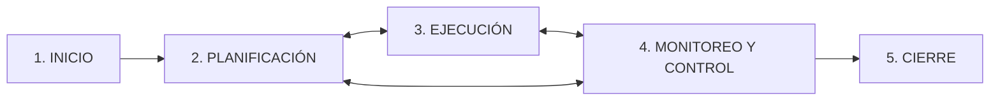

---
tags:
  - GPSI
  - Gestion-Proyectos
  - PMBOK
Descripción: "Proyecto y operación se parecen (ambos los realizan personas, con recursos limitados, y se planifican, ejecutan y controlan), pero el proyecto es temporal y único"
Fecha de actualización: 2026-06-13
Nota previa: "[[001 - Planificación Estratégica de SI]]"
Nota siguiente: "[[003 - SCRUM]]"
Area: "[[GPSI.base|GPSI]]"
---
---

> [!note]+ Foco de examen
> El profesor prioriza: **conceptos** (diap. 4-6), **estructura PMBOK** (16, 19-20) con los *Apuntes PMBOK 6* (5 grupos / 10 áreas), **conclusiones de PMBOK 7** (71), **estimación** (76-77) y, sobre todo, **TODAS las preguntas tipo PMP** (87-112). El recorrido detallado de los 49 procesos (diap. 21-63) **no entra como tal**, pero ayuda a responder las preguntas PMP, así que va resumido.

## Conceptos fundamentales

| Concepto | Definición | Ejemplo |
| - | - | - |
| **Proyecto** | Esfuerzo **temporal** para crear un producto/servicio **único**. | Desarrollar una app. |
| **Operación** | Función **permanente y repetitiva** de la organización. | Mantenimiento de servidores. |

Proyecto y operación **se parecen** (ambos los realizan personas, con recursos limitados, y se planifican, ejecutan y controlan), pero el proyecto es **temporal y único**. La <mark style="background: #ADCCFFA6;">**gestión de proyectos** aplica conocimientos, habilidades, herramientas y técnicas para satisfacer los requisitos del proyecto</mark>. Implica identificar requisitos, atender a los **interesados** y **equilibrar demandas concurrentes**: el "triángulo de hierro" ampliado a seis variables — **alcance, tiempo, costes, calidad, recursos y riesgos**. <mark style="background: #FFB86CA6;">Si una cambia, afecta a las demás.</mark>

## Naturaleza de los proyectos software

El software es **complejo, abstracto** y con **requisitos incompletos y cambiantes**. El <mark style="background: #ADCCFFA6;">informe CHAOS (Standish Group)</mark> es el estudio más famoso sobre el fracaso de proyectos TI (en 2009, ~32 % de éxito). *Crítica*: mide el éxito solo por tiempo/presupuesto/requisitos, ignorando calidad, riesgo y satisfacción del cliente.

## PMBOK 6: estructura

El **PMBOK** (del **PMI**) es un **marco de buenas prácticas** (no una metodología rígida). La **v6** (2017) tiene tres partes (marco conceptual, rol del director, áreas de conocimiento) y su núcleo son <mark style="background: #ADCCFFA6;">**5 grupos de procesos × 10 áreas de conocimiento = 49 procesos**</mark>.

| Grupo de procesos | Objetivo |
| - | - |
| **1. Inicio** | Definir el proyecto y obtener su aprobación. |
| **2. Planificación** | Establecer el plan detallado (qué, cómo, cuándo, cuánto). |
| **3. Ejecución** | Integrar personas y recursos para producir los entregables. |
| **4. Monitoreo y Control** | Dar seguimiento al avance y corregir desviaciones. |
| **5. Cierre** | Formalizar la aceptación y terminar ordenadamente. |

Las **10 áreas de conocimiento** atraviesan esos grupos: Integración, Alcance, Cronograma, Costos, Calidad, Recursos, Comunicaciones, Riesgos, Adquisiciones e Interesados.

> [!info]+ Recorrido por los 5 grupos (contexto; no entra el detalle)
> - **Inicio**: *acta de constitución* (autoriza el proyecto y da autoridad al director) e *identificar interesados* (lo primero tras nombrar al director).
> - **Planificación** (el mayor, iterativo): plan para la dirección, recopilar requisitos → definir alcance → **EDT/WBS** → secuenciar → estimar → cronograma → **presupuesto** (línea base de costes).
> - **Ejecución**: <mark style="background: #FF5582A6;">consume la mayor parte del tiempo y recursos</mark>; dirigir el trabajo, gestionar la calidad (auditorías), adquisiciones.
> - **Monitoreo y Control**: control integrado de cambios; *controlar el alcance* (evitar la corrupción) vs *validar el alcance* (aceptación formal del cliente, no es testear).
> - **Cierre**: aceptación formal, lecciones aprendidas, archivar (no se omite ni aunque se cancele).

## PMBOK 7

Cambia de enfoque: de *procesos* a **principios** y **dominios de desempeño**, centrado en la **entrega de valor**. Sus **12 principios** (en una línea): administración, equipo, interesados, valor, pensamiento holístico, liderazgo, adaptación (*tailoring*), calidad, complejidad, riesgo, adaptabilidad/resiliencia y cambio. <mark style="background: #FFB8EBA6;">Conclusión clave: dice **qué** saber pero no **cómo**; conviene leer la v6 para el detalle.</mark>

## Técnicas de gestión

- **Estimación**: tres etapas, **tamaño** (líneas de código o puntos de función) → **esfuerzo** → **calendario**; el <mark style="background: #ADCCFFA6;">**cono de incertidumbre**</mark> (oscilación **1 a 16** al inicio, se reduce al avanzar). Detalle en [[004 - Estimación del Software]].
- **Gestión de riesgos**: aumentar oportunidades y reducir amenazas (ver [[005 - Gestión de Riesgos en Proyectos Software]]).
- **Desarrollo Global de Software (DGS)**: equipos distribuidos; reto de las **3 C** (Comunicación, Coordinación, Control).
- **Calidad**: de **proceso** (CMMI, ISO 33000) y de **producto** (ISO 25000).

## Preguntas tipo PMP (las más importantes)

Son las preguntas de ejemplo resueltas de las diapositivas (las que el profe marca como importantes). Intenta responderlas; las **soluciones están en el desplegable del final**.

**1.** Un director con muy poca experiencia es asignado a un nuevo proyecto en una **organización matricial**. Puede esperar que las comunicaciones resulten:
A. Simples. · B. Abiertas y precisas. · C. Complejas. · D. Difíciles de automatizar.

**2.** Son características de un proyecto, **EXCEPTO**:
A. Es temporal. · B. Tiene comienzo y final definitivos. · C. Tiene actividades interrelacionadas. · D. Se repite cada mes.

**3.** ¿Cuál describe **MEJOR** las principales restricciones de un proyecto?
A. Alcance, número de recursos y costo. · B. Alcance, costo y tiempo. · C. Alcance, tiempo, costo, calidad, riesgo, recursos y satisfacción del cliente. · D. Tiempo, costo y número de cambios.

**4.** ¿En qué grupo de procesos se crea el **presupuesto detallado**?
A. Iniciación. · B. Antes del proceso de dirección. · C. Planificación. · D. Ejecución.

**5.** El equipo acaba de completar el cronograma inicial y el presupuesto. Lo **SIGUIENTE** que debes hacer es:
A. Identificar los riesgos. · B. Comenzar iteraciones. · C. Determinar los requisitos de comunicaciones. · D. Crear un diagrama de barras (Gantt).

**6.** ¿Qué grupo de procesos consume **MÁS** tiempo y recursos?
A. Planificación. · B. Diseño. · C. Integración. · D. Ejecución.

**7.** Acciones que se realizan en la **iniciación**, **EXCEPTO**:
A. Identificar y documentar las necesidades del negocio. · B. Crear un enunciado del alcance. · C. Dividir un proyecto grande en fases. · D. Acumular y evaluar información histórica.

**8.** ¿Qué grupos de procesos deben estar incluidos en **TODOS** los proyectos?
A. Planificación, ejecución y cierre. · B. Iniciación, planificación y ejecución. · C. Iniciación, planificación, ejecución, seguimiento y control, y cierre. · D. Planificación, ejecución, y seguimiento y control.

**9.** Cometido **MÁS** apropiado en el **cierre** del proyecto:
A. Trabajar con el cliente para determinar los criterios de aceptación. · B. Recolectar información histórica de proyectos anteriores. · C. Confirmar que todos los requisitos del proyecto se han cumplido. · D. Obtener la aprobación formal de los planes de gestión.

**10.** Un director lleva su segundo proyecto (que crece cada día) y se entera de un proyecto similar realizado el año pasado. ¿Qué debe hacer?
A. Contactar al otro director para pedirle asistencia. · B. Obtener registros históricos y orientación de la PMO. · C. Esperar a ver si el proyecto se ve impactado por el crecimiento del alcance. · D. Asegurarse de que el alcance sea acordado por todos los interesados.

**11.** El ciclo de vida del proyecto difiere del proceso de la dirección de proyectos en que el proceso de la dirección…:
A. Es igual para todos los proyectos. · B. No incorpora una metodología. · C. Es diferente para cada industria. · D. Puede generar muchos proyectos.

**12.** Un equipo que **manufactura** un nuevo producto tiene problemas para crear el acta de constitución. ¿La **MEJOR** descripción del verdadero problema?
A. No se han identificado los objetivos. · B. Están trabajando en un proceso y no un proyecto. · C. No se ha establecido una fecha de finalización. · D. No han identificado el producto.

**13.** ¿Cuál es el **MEJOR** uso de las **lecciones aprendidas**?
A. Registros históricos para proyectos futuros. · B. Registro de planificación para el proyecto actual. · C. Informar al equipo de lo que ha hecho el director. · D. Informar al equipo sobre el plan de dirección.

> [!success]- ✅ Soluciones (ábrelo solo al corregir)
> **1·C** — en una organización matricial intervienen personas de toda la organización → comunicaciones **complejas**.
> **2·D** — "se repite cada mes" es propio de una **operación**, no de un proyecto (temporal y único).
> **3·C** — la lista más completa de restricciones (alcance, tiempo, costo, calidad, riesgo, recursos y satisfacción del cliente).
> **4·C** — el presupuesto **detallado** se establece en **Planificación**.
> **5·C** — primero se determinan los **requisitos de comunicaciones** (antes que los riesgos).
> **6·D** — la **Ejecución** consume la mayor parte del tiempo y los recursos.
> **7·B** — el **enunciado del alcance** se crea en Planificación, no en la iniciación.
> **8·C** — los **cinco grupos** de procesos están en todos los proyectos.
> **9·C** — en el cierre se **confirma que todos los requisitos se han cumplido** (los criterios de aceptación y la info histórica son de la iniciación).
> **10·B** — la **PMO** aporta registros históricos y orientación de varios proyectos.
> **11·A** — el proceso de dirección usa la **misma metodología** para cualquier industria; el ciclo de vida sí varía.
> **12·B** — manufacturar es un trabajo continuo (**proceso**), no un proyecto → no lleva acta de constitución.
> **13·A** — su mejor uso es como **registros históricos** para futuros proyectos.
