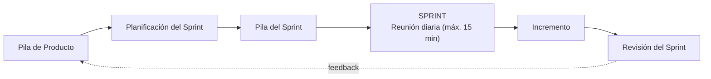

---
tags:
  - GPSI
  - Scrum
  - Agil
Descripción: "Scrum no sigue un plan rígido, sino el control empírico (basado en la experiencia) y la adaptación continua"
Fecha de actualización: 2026-06-13
Nota previa: "[[002 - Planificación de Proyectos Software]]"
Nota siguiente: "[[004 - Estimación del Software]]"
Area: "[[GPSI.base|GPSI]]"
---
---

> [!note]+ Foco de examen
> El profesor prioriza: **introducción/filosofía** (diap. 6-7), **roles** (9-14), **artefactos** (15-18, 24), **reuniones** (26-29, 33, 34) y **características + responsabilidades** (36-41). El manifiesto ágil y el **Planning Poker** quedan como contexto (no están en su lista de prioritarias).

## Introducción y filosofía

<mark style="background: #ADCCFFA6;">Scrum no sigue un plan rígido, sino el control empírico (basado en la experiencia) y la adaptación continua</mark>. Comparte los valores del **Manifiesto Ágil** (individuos e interacciones, software funcionando, colaboración con el cliente y respuesta al cambio por encima de procesos, documentación, contratos y planes). Se apoya en:

- **Revisión de las iteraciones**: al final de cada *sprint*, con todos los implicados.
- **Desarrollo incremental**: cada iteración entrega una parte de producto **operativa** e inspeccionable.
- **Desarrollo evolutivo**: acepta la **inestabilidad** como premisa.
- **Auto-organización**: <mark style="background: #FF5582A6;">los equipos son auto-organizados, no auto-dirigidos</mark> — deciden *cómo* trabajar dentro de un marco, con colaboración abierta.

## Roles: la metáfora del cerdo y la gallina

> [!info]+ La metáfora
> En unos huevos con jamón, la **gallina** está *involucrada* (pone el huevo) y el **cerdo** está *comprometido* (se deja la piel).

**Comprometidos ("cerdos")** — construyen el producto:

- **Propietario del Producto (*Product Owner*)**: representa al cliente y a los interesados; su responsabilidad clave es <mark style="background: #FFB86CA6;">maximizar el valor del producto y el ROI</mark>. Gestiona la financiación, decide la funcionalidad, **prioriza la Pila de Producto** y acepta/rechaza el trabajo. Es **una sola persona**.
- **Equipo de Desarrollo**: transforma la pila en un incremento. Es **auto-gestionado, auto-organizado y multifuncional**; nadie le dice cómo convertir los requisitos en código.
- **Scrum Manager** (*Scrum Master*): vela por que Scrum se entienda y aplique. "Líder al servicio": **elimina impedimentos**, modera las reuniones, protege al equipo y forma en Scrum.

**Involucrados ("gallinas")**: los **interesados** (clientes, dirección, usuarios) aportan *feedback* y sugerencias, pero **no intervienen en el día a día** del sprint.

> [!warning]+ Terminología del examen
> Tus diapositivas usan **"Scrum Manager"** (la industria dice "Scrum Master"); en el examen usa el término de tus apuntes.

## Artefactos

| Artefacto | Qué es | Propiedad |
| - | - | - |
| **Pila de Producto** (*Product Backlog*) | Inventario **priorizado** de todo lo que podría necesitar el producto. | *Product Owner* |
| **Pila del Sprint** (*Sprint Backlog*) | Subconjunto seleccionado para *ese* sprint, descompuesto en tareas. | Equipo |
| **Incremento** | Suma de los elementos completados en el sprint (más los anteriores). | Equipo |

La **Pila de Producto** es un **documento vivo** (nunca se cierra), priorizado por valor de negocio; cada ítem lleva al menos **identificador, descripción, prioridad y estimación**. La **Pila del Sprint** la hace el equipo, descompone las funcionalidades en <mark style="background: #FFB8EBA6;">tareas de 2 a 16 horas</mark> y <mark style="background: #FF5582A6;">solo el equipo puede modificarla durante el sprint</mark>. El **Incremento** debe estar <mark style="background: #8000E1A6;">"Terminado": operativo, usable e inspeccionable</mark>.

## Eventos (reuniones)

- **Planificación del Sprint** (al inicio, en **dos partes**): *el QUÉ* (1-4 h) — el **Product Owner** presenta los ítems prioritarios y se define el **Objetivo del Sprint**; *el CÓMO* — el **equipo** desglosa en tareas, estima y **se auto-asigna** el trabajo (el Scrum Manager solo modera).
- **Reunión diaria (*Daily*)**: sincronización de <mark style="background: #FFB8EBA6;">máximo 15 minutos</mark> con 3 preguntas: ¿qué hice ayer?, ¿qué haré hoy?, ¿qué impedimentos tengo?
- **Revisión del Sprint**: al final, el equipo presenta (*demo*) el incremento al PO y a los interesados.
- **Seguimiento — *Burndown***: gráfico de **trabajo pendiente** (eje Y) frente a **tiempo/días** (eje X); muestra si se llega a tiempo.

## Condiciones de éxito y responsabilidades

Hacen falta **autonomía**, **respeto**, **responsabilidad y autodisciplina**, **foco** y **transparencia**. Las responsabilidades se reparten: el **funcionamiento de Scrum** en el **Scrum Manager**, la **gestión del producto** en el **Product Owner** y la **auto-organización** en los miembros del **equipo**. No existe "mi tarea": el objetivo del sprint es **responsabilidad conjunta**.

> [!example]+ Planning Poker (técnica de estimación — contexto)
> Adaptación del **método Delphi** a la gestión ágil para estimar **por consenso**: el PO presenta una historia, cada estimador elige en secreto una **carta** (Fibonacci: 1, 2, 3, 5, 8…) y se muestran **todas a la vez**; si hay dispersión se discute y se repite. Cartas especiales: **?** (falta información) y **café** (descanso).

> [!tip]+ Pistas para el examen
> - Control **empírico** y **adaptación continua**; equipos **auto-organizados ≠ auto-dirigidos**.
> - El **Product Owner** es **una sola persona** y busca **maximizar el valor / ROI**.
> - **Solo el equipo** modifica la **Pila del Sprint**; tareas de **2–16 h**.
> - La **Daily** dura **máx. 15 min** y responde a **3 preguntas**.
> - En el examen, **"Scrum Manager"** (no "Master").
