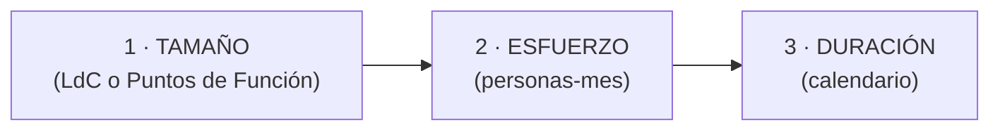
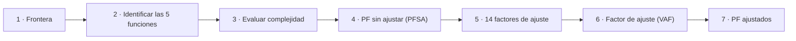
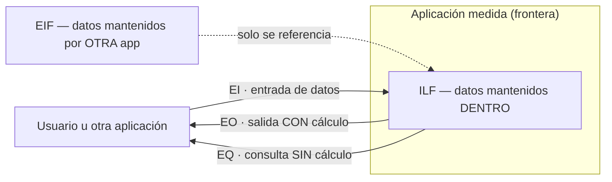

---
tags:
  - GPSI
  - Estimacion
  - Puntos-Funcion
Descripción: "Hay que separar tres términos que suelen confundirse"
Fecha de actualización: 2026-06-13
Nota previa: "[[003 - SCRUM]]"
Nota siguiente: "[[005 - Gestión de Riesgos en Proyectos Software]]"
Area: "[[GPSI.base|GPSI]]"
---
---

> [!abstract]+ Tema con ejercicio práctico
> Este es el único tema con ejercicio práctico en el examen: **calcular los Puntos de Función sin ajustar (PFSA)** de una aplicación a partir de sus requisitos. La teoría de estimación es el contexto; el método de Puntos de Función y su aplicación son lo que se evalúa. **Guía de resolución paso a paso**: [[004.0 - Guía para resolver ejercicios de Puntos de Función]]. Ejercicios resueltos: [[004.1 - Ejercicio PF - Eventos fantásticos]] y [[004.2 - Ejercicio PF - Hospital COVID-19]].

## Conceptos de estimación

Hay que separar tres términos que suelen confundirse:

- <mark style="background: #ADCCFFA6;">**Estimación**: predicción (basada en probabilidad) sobre el futuro</mark> (tamaño, esfuerzo, coste, duración).
- **Medición**: toma de datos **reales** sobre algo que ya existe (p. ej. contar líneas de un programa terminado).
- **Planificación**: organización de tareas y recursos. <mark style="background: #FF5582A6;">Primero se estima, luego se planifica.</mark>

Estimar bien permite decidir la viabilidad de un proyecto frente a las restricciones de tiempo, coste y funcionalidad, y medir el avance. La **productividad** se calcula como tamaño (o coste) por unidad de esfuerzo: `tamaño / (personas × tiempo)`.

### Las tres etapas (y el cono de incertidumbre)

El proceso de estimación se divide en tres etapas **encadenadas**, nunca se estima el coste directamente:

<mark style="background: #FFB8EBA6;">Estimar el tamaño es la etapa más compleja</mark>. La estimación se basa en **refinamientos sucesivos**: se da un rango con cierto margen de desviación que se va estrechando conforme avanza el proyecto y se toman decisiones más detalladas. Es el **cono de incertidumbre**: con la definición inicial del producto la oscilación puede ser de **1 a 16**; tras la especificación de requisitos baja a ~**1 a 2**.

## Técnicas de estimación

El tamaño se puede estimar por **analogía** (a partir de proyectos similares en una base de datos histórica), **bottom-up** (descomponer en partes, estimar cada una y sumar) o con **modelos paramétricos** (modelo matemático/algorítmico, como Puntos de Función). Del tamaño se deriva el **esfuerzo** (por analogía con datos históricos, o con un modelo paramétrico como **COCOMO**), y del esfuerzo la **duración** (p. ej. con funciones semiempíricas del tipo `duración(meses) = 3,0 × personas-mes^(1/3)`).

La bibliografía clasifica las técnicas en: **algorítmicas** (modelos paramétricos; *empíricos* construidos por regresión sobre datos históricos como **COCOMO**, o *teóricos* derivados de hipótesis como **SLIM**), **heurísticas** (lógica difusa, redes neuronales, algoritmos genéticos), **por analogía** y **juicio de expertos**.

Medir el tamaño en **líneas de código (LdC)** tiene problemas: no hay definición universal de "línea", depende del lenguaje y es muy difícil de estimar en fases tempranas. Para resolverlo surgen los **Puntos de Función**.

## Puntos de Función (IFPUG)

<mark style="background: #ADCCFFA6;">Un Punto de Función es una medida sintética del **tamaño funcional** de un programa</mark> — mide la funcionalidad que percibe el usuario, **no** las líneas de código, así que es independiente del lenguaje y la tecnología. Lo propuso **Albrecht (1979)** y lo estandariza el **IFPUG**. El proceso completo tiene 7 pasos:

> [!warning]+ El ejercicio pide PF **SIN AJUSTAR**
> En el examen te piden parar en el **paso 4 (PFSA)**: identificar funciones, clasificar su complejidad y sumar sus pesos. Los pasos 5-7 (ajuste por los 14 factores) **no** se aplican salvo que lo pidan.

### Paso 1 — La frontera (boundary)

<mark style="background: #ADCCFFA6;">La frontera separa el sistema medido del usuario y de cualquier otra aplicación externa</mark>. Actúa como una membrana que los datos cruzan mediante transacciones. Depende de la **vista del usuario**, no de consideraciones técnicas. Los datos del interior son **mantenidos** por el sistema; los del exterior solo se **referencian**.

### Paso 2 — Las 5 funciones

**Funciones de datos** (almacenamiento):

- <mark style="background: #ADCCFFA6;">**ILF** (Archivo Lógico Interno)</mark>: grupo de datos lógicamente relacionado, reconocible por el usuario y **mantenido dentro** de la aplicación (la app lo crea/modifica/borra). Ej.: la tabla de Clientes que gestiona mi app.
- **EIF / ELF** (Archivo de Interfaz Externo / Fichero Lógico Externo): grupo de datos **mantenido por otra aplicación** que la mía solo **lee/referencia**. *(Tus diapositivas y los ejercicios resueltos lo llaman **ELF**.)* Un mismo fichero es ILF para quien lo mantiene y EIF/ELF para quien solo lo consulta.

**Funciones transaccionales** (procesos elementales):

- **EI** (Entrada Externa): proceso que mete datos desde fuera de la frontera; su propósito es **mantener uno o más ILF** o alterar el comportamiento del sistema. Ej.: dar de alta un cliente.
- **EO** (Salida Externa): saca datos al exterior **tras un procesamiento** (cálculo, dato derivado, totales, gráficos). Ej.: un informe con totales, una media, un porcentaje.
- **EQ** (Consulta Externa): recupera y presenta datos **sin derivarlos ni calcular** nada ni mantener ILF. Ej.: ver la ficha de un cliente, un listado simple.

> [!important]+ EO vs EQ — la distinción que más se pregunta
> <mark style="background: #FF5582A6;">Si hay cálculo, fórmula, total, porcentaje o dato derivado → **EO**. Si es recuperación directa sin procesar → **EQ**.</mark> Contar registros, calcular un porcentaje o comparar con datos históricos es derivar datos → EO.

Cuidado con los **distractores** (no son transacciones que cuenten): pantallas de login, navegación/scroll, refrescos, mensajes de confirmación ("¿seguro?"), o mover datos de un ILF a otro **dentro** de la misma app. Y un grupo de datos que mantiene otra app pero que **mi app no referencia** no es EIF (no se cuenta).

### Paso 3 — Complejidad (DET, RET, FTR)

- **DET** (Data Element Type): atributo único reconocible por el usuario ≈ una **columna** de una tabla. Reglas: el **botón de acción** que inicia el guardado/validación cuenta como **1 DET** (Aceptar/Insertar; no Ayuda ni Cancelar); todos los **mensajes** de error/confirmación juntos cuentan como **1 DET**.
- **RET** (Record Element Type): subgrupo de DETs reconocible dentro de una función de datos ≈ una **fila/subgrupo**. Toda función de datos tiene **mínimo 1 RET**; se suma **+1 RET por cada subgrupo lógico** y **+1 por cada relación distinta de 1:1**.
- **FTR** (File Type Referenced): función de datos (ILF o EIF) **leída o mantenida** por una transacción. El nº de FTR pesa más que el de DET en la complejidad.

La complejidad (Baja/Media/Alta) se obtiene cruzando DET con RET (datos) o DET con FTR (transacciones):

**Funciones de datos — ILF y EIF** (DET × RET):

| | 1-19 DET | 20-50 DET | >50 DET |
| - | - | - | - |
| **1 RET** | Baja | Baja | Media |
| **2-5 RET** | Baja | Media | Alta |
| **>5 RET** | Media | Alta | Alta |

**EI** (DET × FTR):

| | 1-4 DET | 5-15 DET | >15 DET |
| - | - | - | - |
| **0-1 FTR** | Baja | Baja | Media |
| **2 FTR** | Baja | Media | Alta |
| **>2 FTR** | Media | Alta | Alta |

**EO y EQ** (DET × FTR):

| | 1-5 DET | 6-19 DET | >19 DET |
| - | - | - | - |
| **0-1 FTR** | Baja | Baja | Media |
| **2-3 FTR** | Baja | Media | Alta |
| **>3 FTR** | Media | Alta | Alta |

### Paso 4 — Pesos y suma (PFSA)

Cada función aporta unos PF según su tipo y complejidad. **Tabla de pesos (memorizar):**

| Complejidad | ILF | EIF/ELF | EI | EO | EQ |
| - | - | - | - | - | - |
| **Baja** | 7 | 5 | 3 | 4 | 3 |
| **Media** | 10 | 7 | 4 | 5 | 4 |
| **Alta** | 15 | 10 | 6 | 7 | 6 |

> [!tip]+ Truco para recordar los pesos
> EQ comparte **matriz de complejidad con EO** (umbrales 1-5/6-19/>19) pero **pesos con EI** (3/4/6). Es decir: EQ se clasifica como una EO pero se puntúa como una EI.

<mark style="background: #8000E1A6;">Los **PF sin ajustar (PFSA)** son la suma de los pesos de TODAS las funciones</mark> (ILF + EIF + EI + EO + EQ). Ahí termina el ejercicio típico.

### Pasos 5-7 — PF ajustados (los 14 factores)

Tras el PFSA se calculan los **PF ajustados**. Se valoran **14 factores de influencia** en la dificultad del sistema, cada uno con un **grado de 0 a 5**; su suma es el **Total GI** (grado de influencia). La fórmula que se usa en clase:

$$PF = PFSA \times (0{,}65 + 0{,}01 \times \text{Total GI})$$

El multiplicador va de **0,65** (GI = 0) a **1,35** (GI = 70). Los **14 factores**: (1) comunicaciones de datos, (2) procesamiento distribuido, (3) objetivos de rendimiento, (4) configuración de uso intensivo, (5) tasas de transacción rápidas, (6) entrada de datos en línea, (7) amigabilidad del diseño, (8) actualización de datos en línea, (9) procesamiento complejo, (10) reusabilidad, (11) facilidad de instalación, (12) facilidad operacional, (13) adaptabilidad, (14) versatilidad.

> [!example]+ Ejemplo de clase (PFSA → PF)
> Con **PFSA = 124** y **Total GI = 40**: `PF = 124 × (0,65 + 0,01 × 40) = 124 × 1,05 = `<mark style="background: #8000E1A6;">**130,2**</mark>.

> [!warning]+ Tus dos ejercicios piden SIN AJUSTAR
> Paras en el **PFSA** (paso 4). El ajuste por los 14 factores solo se aplica si lo piden. A veces el resultado se expresa además como un **rango ±20 %** para reflejar la incertidumbre.

**Tipo de cuenta** (qué funciones se suman): desarrollo nuevo `= ADD + CFP` (suma la conversión); aplicación `= ADD` (la conversión **no** cuenta, es código de un solo uso); mejora `= ADD + CHGA + CFP + DEL`.

## Cómo resolver un ejercicio de PFSA

Método sistemático que vale para **cualquier** enunciado de este tipo:

1. **Frontera y actores**: identifica la app que se mide y qué hay fuera (usuario, otras apps).
2. **Funciones de datos**: ¿qué grupos lógicos de datos mantiene la app (ILF) y cuáles solo lee de fuera (EIF)? Para cada uno cuenta DET (atributos) y RET (subgrupos/listas dependientes y relaciones ≠1:1) → matriz → peso.
3. **Funciones transaccionales**: recorre las operaciones. **Alta, baja y modificación son EIs distintas** (procesos elementales distintos). Salidas con cálculo = EO; consultas sin cálculo = EQ. Para cada una cuenta DET (campos + 1 por botón de acción + 1 por mensajes) y FTR (ficheros leídos/mantenidos) → matriz → peso.
4. **Suma** todos los pesos → **PFSA**.

> [!warning]+ Trampas habituales (revísalas siempre)
> - Datos que mantiene **otra app y que la mía NO lee** → no se cuentan (ni ILF ni EIF).
> - Una **lista dependiente** dentro de una entidad (p. ej. los asistentes de un evento) suele ser un **RET** del ILF padre, no un ILF aparte.
> - **Alta/baja/modificación** de una entidad = **3 EIs**, no una.
> - "Mostrar el número de…", "porcentaje de…", "comparar con…" → hay cálculo → **EO**, no EQ.
> - El **botón de acción** y el **conjunto de mensajes** suman 1 DET cada uno.

## Pistas para el examen

> [!tip]+ Repaso rápido
> - Orden de estimación: **tamaño → esfuerzo → duración**; el tamaño es lo más difícil.
> - **Cono de incertidumbre**: de 1-16 al inicio a 1-2 tras requisitos.
> - Pesos: **ILF 7/10/15 · EIF 5/7/10 · EI 3/4/6 · EO 4/5/7 · EQ 3/4/6**.
> - **EQ = matriz de EO + pesos de EI**.
> - El nº de **FTR** influye más que el de DET.
> - PF mide **funcionalidad**, no líneas de código; es independiente del lenguaje.
> - El ejercicio pide **sin ajustar**: no apliques el VAF salvo que lo pidan.
