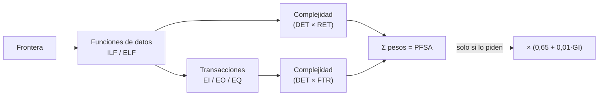

---
tags:
  - GPSI
  - Estimacion
  - Puntos-Funcion
  - Ejercicio
Descripción: "Identificar funciones (de datos y transaccionales) → clasificar cada una como Baja/Media/Alta → traducir a puntos con su peso → sumarlo todo = PFSA"
Fecha de actualización: 2026-06-13
Nota previa: "[[004 - Estimación del Software]]"
Nota siguiente: "[[004.1 - Ejercicio PF - Eventos fantásticos]]"
Area: "[[GPSI.base|GPSI]]"
---
---

> [!abstract]+ Para qué sirve esta guía
> **Todo lo que necesitas para resolver el ejercicio de Puntos de Función** del examen (calcular el **PFSA** a partir de los requisitos de una aplicación), paso a paso. Lo que no haga falta para el ejercicio queda fuera. Practica con [[004.1 - Ejercicio PF - Eventos fantásticos]] y [[004.2 - Ejercicio PF - Hospital COVID-19]], ponte a prueba con [[004.3 - Test y ejercicios de práctica (examen)]] y repasa los [[004.4 - Ejercicios de las diapositivas (PF) resueltos|ejercicios de las diapositivas]].

## La idea en una frase

Identificar **funciones** (de datos y transaccionales) → clasificar cada una como **Baja/Media/Alta** → traducir a **puntos** con su peso → **sumarlo todo = PFSA**.

# 📌 BLOQUE 1 — Lo que hay que memorizar

Esto es lo que **no** se razona, se **sabe**. Es el núcleo del ejercicio.

## 1. Los 5 tipos de función (saber identificarlos)

| Tipo | Qué es | Pregunta para reconocerlo |
| - | - | - |
| **ILF** (Fichero Lógico Interno) | Datos que **mi app mantiene** (da de alta/edita/borra). | ¿Soy el **dueño** de estos datos? |
| **ELF / EIF** (Fichero Lógico Externo) | Datos de **otra app** que la mía solo **lee**. | ¿Los mantiene otra app y yo solo los **consulto**? |
| **EI** (Entrada Externa) | Entra información para **mantener** datos. | ¿El usuario **mete o cambia** datos (alta/baja/modificar)? |
| **EO** (Salida Externa) | Sale información **tras un cálculo** (total, %, dato derivado, comparación). | ¿Hay **cálculo** o dato derivado? |
| **EQ** (Consulta Externa) | Sale información **sin calcular** nada (recuperación directa). | ¿Solo **muestra/lista** sin calcular? |

> [!important]+ 📌 La distinción que más cae: EO vs EQ
> <mark style="background: #FF5582A6;">Hay cálculo, total, porcentaje, media, fecha calculada o comparación → **EO**. Recuperación directa sin procesar → **EQ**.</mark> Incluso seleccionar registros mediante un **cálculo de fecha** es EO (no EQ).

## 2. 📌 Las tres matrices de complejidad

Las funciones de **datos** se clasifican por **DET × RET**; las **transaccionales** por **DET × FTR**.

**ILF y ELF/EIF** (DET × RET):

| | 1-19 DET | 20-50 DET | >50 DET |
| - | - | - | - |
| **1 RET** | Baja | Baja | Media |
| **2-5 RET** | Baja | Media | Alta |
| **>5 RET** | Media | Alta | Alta |

**EI** (DET × FTR):

| | 1-4 DET | 5-15 DET | >15 DET |
| - | - | - | - |
| **0-1 FTR** | Baja | Baja | Media |
| **2 FTR** | Baja | Media | Alta |
| **>2 FTR** | Media | Alta | Alta |

**EO y EQ** (DET × FTR):

| | 1-5 DET | 6-19 DET | >19 DET |
| - | - | - | - |
| **0-1 FTR** | Baja | Baja | Media |
| **2-3 FTR** | Baja | Media | Alta |
| **>3 FTR** | Media | Alta | Alta |

## 3. 📌 La tabla de pesos

| Complejidad | ILF | ELF/EIF | EI | EO | EQ |
| - | - | - | - | - | - |
| **Baja** | 7 | 5 | 3 | 4 | 3 |
| **Media** | 10 | 7 | 4 | 5 | 4 |
| **Alta** | 15 | 10 | 6 | 7 | 6 |

> [!tip]+ Truco para no liarte con EQ
> <mark style="background: #8000E1A6;">EQ se **clasifica** con la matriz de EO (umbrales 1-5/6-19/>19) pero se **puntúa** como una EI (3/4/6)</mark>.

## 4. 📌 Cómo contar DET, RET y FTR

- **DET** (atributo/campo único): cada campo del usuario = **1 DET**. Además: el **botón de acción** (Aceptar/Guardar) = **1 DET**; **todos los mensajes** de error/confirmación juntos = **1 DET** (aunque haya varios). No cuentan: cabeceras, texto fijo, botones Ayuda/Cancelar.
- **RET** (subgrupo dentro de una función de datos): **1 base** + **1 por cada subgrupo lógico** o **relación distinta de 1:1**. (Ej.: un "hueco" de almacén con sección/zona/columna/altura → 4 RET.)
- **FTR** (fichero referenciado por una transacción): **1 por cada ILF o ELF** que la transacción **lee o mantiene**. <mark style="background: #FFB8EBA6;">El nº de FTR pesa más que el de DET</mark>: subir de FTR salta de fila en la matriz.

# Procedimiento paso a paso

## Paso 1 · Dibuja la frontera

Identifica **qué aplicación** se mide y **qué queda fuera** (el usuario y otras aplicaciones). Todo lo que cruza la frontera son transacciones; lo de fuera solo se referencia.

## Paso 2 · Lista las funciones de datos (ILF y ELF)

Busca los **grupos de datos**:

- Los que **mi app mantiene** → **ILF**. <mark style="background: #ADCCFFA6;">Cada entidad distinta es un ILF separado</mark> (criterio de clase: en el caso PCGeek, `Pedido` y `Detalle_Pedido` son dos ILF, no uno con subgrupos).
- Los que **otra app mantiene y yo leo** → **ELF**.
- ⚠️ Los que **otra app mantiene y yo NO leo** → **no se cuentan** (es el distractor típico del enunciado).

Para cada uno: cuenta **DET** (atributos) y **RET** (subgrupos) → matriz **ILF/ELF** → peso.

## Paso 3 · Lista las transacciones (EI, EO, EQ)

Recorre las operaciones del enunciado (si hay un **menú**, casi cada opción es una transacción):

- **Alta, baja y modificación** de algo → **EI**, y son **procesos distintos** (3 EI, no 1). *(En el ejercicio de clase, "asignar" y "liberar" plaza cuentan por separado.)*
- **Informe/listado con cálculo** (total, %, comparación) → **EO**.
- **Consulta/visualización sin cálculo** → **EQ**.

Para cada una: cuenta **DET** (campos + 1 botón + 1 mensajes) y **FTR** (ficheros que lee/mantiene) → matriz **EI** o **EO/EQ** → peso.

## Paso 4 · Suma → PFSA

Suma los pesos de **todas** las funciones (ILF + ELF + EI + EO + EQ). Ese total es el **PFSA**. Conviene presentarlo en una tabla por tipo y complejidad (como en los ejercicios resueltos).

## Paso 5 · (Solo si piden PF ajustados)

$$PF = PFSA \times (0{,}65 + 0{,}01 \times \text{Total GI})$$

`Total GI` = suma de los **14 factores de influencia** (cada uno de 0 a 5). Detalle y lista de factores en [[004 - Estimación del Software]].

# Reglas de decisión rápidas (las dudas de siempre)

> [!question]+ ¿ILF, ELF o no se cuenta?
> ¿La **mantiene mi app**? → ILF. ¿La mantiene **otra app pero la leo**? → ELF. ¿La mantiene otra app y **no la leo**? → nada.

> [!question]+ ¿EI, EO o EQ?
> ¿**Mete/cambia** datos? → EI. ¿**Saca** datos **con cálculo**? → EO. ¿**Saca** datos **sin cálculo**? → EQ.

> [!question]+ ¿Una entidad o varias?
> Entidades **distintas** con sus propios atributos (cliente, pedido, detalle…) → **ILF separados**. Niveles/subgrupos de **una sola** cosa (sección/zona/columna/altura de un hueco) → **RET** dentro de un ILF.

# ✅ Checklist final (errores típicos)

- [ ] ¿He contado **alta/baja/modificar** como EI **distintas**?
- [ ] ¿He clasificado como **EO** todo lo que **calcula** (totales, %, comparaciones)?
- [ ] ¿He **descartado** los datos externos que **no** referencio?
- [ ] ¿He sumado **1 DET por el botón** y **1 DET por los mensajes** en cada EI?
- [ ] ¿He contado bien los **FTR** (cada ILF/ELF leído o mantenido)?
- [ ] ¿He usado la **matriz correcta** (EI ≠ EO/EQ) y el **peso correcto** (EQ se puntúa como EI)?
- [ ] ¿He **sumado todo** y, si pedían ajustado, aplicado `× (0,65 + 0,01·GI)`?

> [!warning]+ El número exacto puede variar
> El propio enunciado de clase avisa: *"el resultado final está sujeto a variaciones según la interpretación"*. No te obsesiones con clavar la cifra: lo evaluable es **identificar bien las funciones, justificar la complejidad y aplicar el método**.
