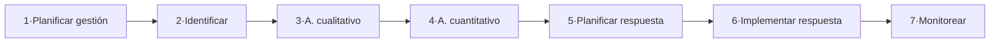

---
tags:
  - GPSI
  - Gestion-Riesgos
Descripción: "Un riesgo es un evento o condición incierta que, si ocurre, tiene un efecto positivo o negativo sobre los objetivos del proyecto"
Fecha de actualización: 2026-06-13
Nota previa: "[[004 - Estimación del Software]]"
Nota siguiente:
Area: "[[GPSI.base|GPSI]]"
---
---

> [!note]+ Foco de examen
> El profesor prioriza: **procesos** (diap. 8-11), **riesgo** (13), **objetivo** (15), **5 niveles** (16), **checklist** (24-25), **exposición** (29), **priorización** (35), **EMV** (39), **registro** (43), **estrategias** (44) y **riesgos residuales/secundarios** (46). La **supervisión y control** detallada (diap. 47-final) **no entra**; va resumida.

## Concepto y procesos

<mark style="background: #ADCCFFA6;">Un **riesgo** es un evento o condición incierta que, si ocurre, tiene un efecto **positivo o negativo** sobre los objetivos del proyecto</mark>. Tiene una o varias **causas** y, si se materializa, uno o varios **impactos**; los **riesgos conocidos** son los identificados durante la planificación. El objetivo es <mark style="background: #FFB86CA6;">identificar, estudiar y eliminar las fuentes de riesgo antes de que amenacen el éxito del proyecto</mark>; habitualmente se gestionan los **negativos** (amenazas).

> [!info]+ El riesgo no gestionado cuesta caro
> Casos clásicos: Mars Climate Orbiter, Ariane 5, Therac-25, el aeropuerto de Denver… El riesgo mal gestionado cuesta dinero, prestigio y hasta vidas.

El **PMBOK** define **7 procesos** de gestión de riesgos:

Los **1-5** son de **Planificación**, el **6** de **Ejecución** y el **7** de **Seguimiento y Control**. Según la ambición hay **cinco niveles de gestión**: (1) control de crisis, (2) arreglar cada error, (3) mitigación, (4) prevención y (5) eliminación de causas. <mark style="background: #FFB8EBA6;">Los niveles 1-2 apenas requieren planificación</mark>; el 3, menos que el 4 y el 5.

## Planificación e identificación

El **Plan de Gestión de Riesgos** describe cómo se gestionarán (estrategia, metodología, roles, financiación, calendario, categorías, matriz de probabilidad/impacto e informes); la **RBS** (Estructura de Desglose del Riesgo) enumera las fuentes de riesgo. Para **identificar** se usa la **lista de comprobación** (*checklist*), de información histórica.

> [!success]+ Ventaja / desventaja de las listas
> **Ventaja**: identificación rápida. **Desventaja**: ninguna lista es exhaustiva → se usa como **punto de partida** y se añaden riesgos propios del proyecto.

La lista de referencia (Connell) reúne <mark style="background: #FFB8EBA6;">**111 riesgos en 12 categorías**</mark>: A) elaboración de la planificación, B) organización y gestión, C) ambiente/infraestructura, D) usuarios finales, E) cliente, F) personal contratado, G) requisitos, H) producto, I) fuerzas mayores, J) personal, K) diseño e implementación, L) proceso.

## Análisis cualitativo

Prioriza los riesgos según su **probabilidad** e **impacto**. Concepto clave: la <mark style="background: #ADCCFFA6;">**exposición al riesgo = probabilidad × impacto** (magnitud de la pérdida)</mark>.

> [!example]+ Cálculo de exposición
> Un **25 %** de probabilidad de un retraso de **4 semanas** → exposición `0,25 × 4 = 1 semana`. El impacto se mide en tiempo, dinero o alcance.

Para acotar la **subjetividad**: pedir la estimación a quien tenga más experiencia, usar el **método Delphi** o asignar valores numéricos a adjetivos. Las **matrices de probabilidad × impacto** sitúan cada riesgo en una dimensión (coste, tiempo, alcance…). Después se **categorizan** y se **prioriza** para saber dónde concentrar el esfuerzo (sin orden estricto: un riesgo de pérdida enorme se prioriza aunque sea poco probable).

## Análisis cuantitativo

Analiza **numéricamente** el efecto de los riesgos. La técnica estrella es el <mark style="background: #ADCCFFA6;">**Valor Monetario Esperado (EMV)**</mark>:

$$EMV = \sum (\text{valor de cada resultado} \times \text{probabilidad})$$

Las **oportunidades** suman en **positivo** y las **amenazas** en **negativo**; se combina con el **árbol de decisiones**. Otras técnicas cuantitativas: la **simulación de Montecarlo** y el **análisis de sensibilidad**.

## Respuesta a los riesgos

Se elabora el **Registro de Respuestas a Riesgos** (descripción, causas, responsable, exposición, prioridad, **planes de contingencia**, presupuesto y tiempos). Las estrategias dependen de si es amenaza u oportunidad:

| Amenazas (negativos) | Oportunidades (positivos) |
| - | - |
| **Evitar** (eliminar la causa) | **Explotar** (asegurar que ocurra) |
| **Transferir** (a un tercero) | **Escalar** (fuera del alcance del equipo) |
| **Mitigar** (reducir prob. o impacto) | **Compartir** (con un tercero) |
| **Aceptar** (+ plan de contingencia) | **Mejorar** (aumentar prob. o impacto) |
| | **Aceptar** |

> [!warning]+ Toda respuesta puede generar nuevos riesgos (efecto dominó)
> - <mark style="background: #FFB86CA6;">**Riesgos residuales**</mark>: riesgos menores cuyo impacto **aumenta** al responder a otro riesgo.
> - <mark style="background: #FF5582A6;">**Riesgos secundarios**</mark>: **nuevos** riesgos significativos creados por la propia respuesta.
> Por eso la gestión de riesgos es **iterativa y continua**.

## Supervisión y control (resumen; no entra en detalle)

**Monitorear los riesgos** durante la ejecución: comprobar si las respuestas son efectivas, si la **exposición** cambió, si ha ocurrido algún **disparador** y si aparecen riesgos nuevos. Herramientas: la **tabla de seguimiento** (Connell) y las **auditorías** de riesgos.

> [!tip]+ Pistas para el examen
> - **Riesgo** = evento incierto con efecto **positivo o negativo**; tiene **causas** e **impactos**.
> - **Exposición = probabilidad × impacto** (sabe calcularla con un ejemplo numérico).
> - **Cualitativo** (prioriza con prob./impacto y Delphi) ≠ **cuantitativo** (numérico: **EMV** + árbol de decisiones).
> - Amenazas (4): **evitar, transferir, mitigar, aceptar**. Oportunidades (5): **explotar, escalar, compartir, mejorar, aceptar**.
> - **Riesgo residual** (impacto aumentado por otra respuesta) ≠ **secundario** (nuevo riesgo creado por la respuesta).
> - La lista de comprobación: **111 riesgos en 12 categorías**; punto de partida, no exhaustiva.
