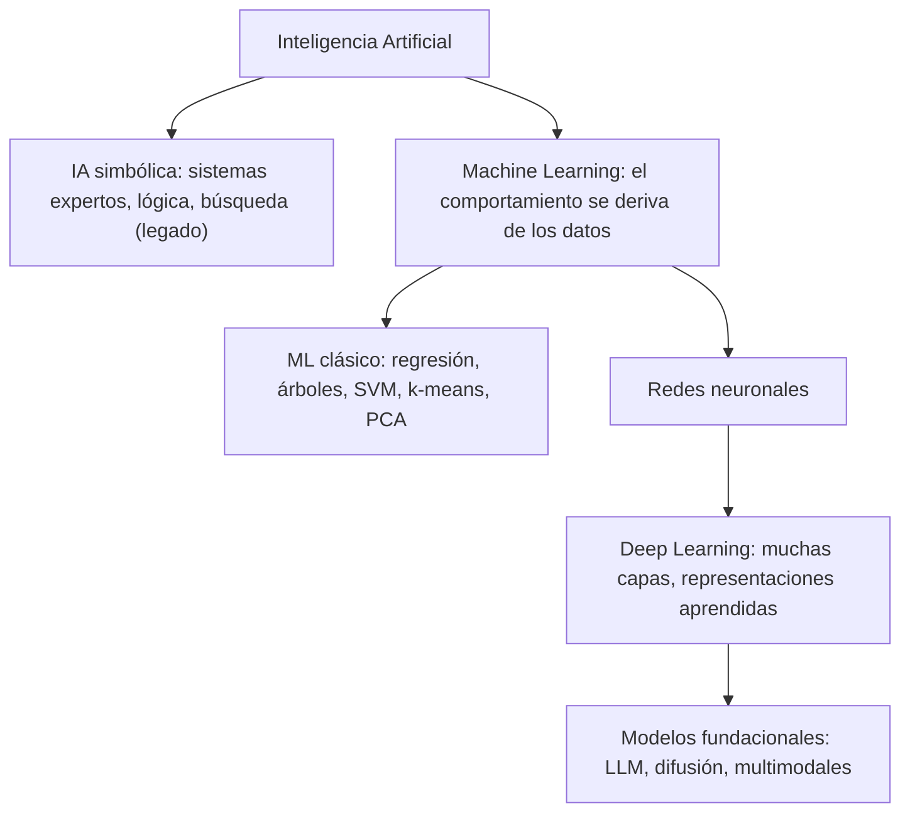

---
tags:
  - IA
  - IA/Machine-Learning
  - Introduccion
  - Tipo/Introduccion
Descripción: "Inteligencia Artificial (IA), Machine Learning (ML) y Deep Learning (DL) no son sinónimos: son tres círculos concéntricos, cada uno subconjunto del anterior"
Fecha de actualización: 2026-07-28
Nota previa: 
Nota siguiente: "[[01 - Matemáticas para machine learning]]"
Area: "[[Fundamentos de ML.base|Fundamentos de ML]]"
---
---

<mark style="background: #ADCCFFA6;">`Inteligencia Artificial` (IA), `Machine Learning` (ML) y `Deep Learning` (DL) no son sinónimos: son tres círculos concéntricos</mark>, cada uno subconjunto del anterior. La confusión es constante en la industria y tiene coste práctico, porque **la superficie de ataque cambia radicalmente según en qué capa estés**. Atacar un árbol de decisión que puntúa transacciones no se parece en nada a atacar un asistente conversacional con acceso a herramientas.

Cada flecha se lee como "contiene":

# Inteligencia artificial

La IA es el campo amplio: sistemas capaces de tareas que asociamos a la inteligencia humana — entender lenguaje, reconocer objetos, decidir, planificar, aprender de la experiencia. Sus subcampos clásicos son el `Natural Language Processing` (NLP), la `Computer Vision`, la robótica y los sistemas expertos.

> [!warning]+ Los sistemas expertos son historia, no estado del arte
> Muchos materiales (el propio módulo de HTB incluido) siguen listando los `expert systems` —motores de reglas escritas a mano por especialistas— como área viva de la IA. Fue el paradigma dominante en los 80 y **prácticamente no se investiga desde hace décadas**. Sigue siendo útil conocerlos porque quedan sistemas heredados en banca y seguros, y porque explican por qué el enfoque basado en datos ganó: las reglas no escalan ni se adaptan solas. Pero no esperes encontrarlos en un despliegue moderno.

La división que sí importa hoy no es por subcampo, sino por **paradigma**: sistemas cuyo comportamiento está programado explícitamente frente a sistemas cuyo comportamiento se **deriva de datos**. Los segundos son ML, y son el 100% de lo que vas a auditar en un engagement de IA.

# Machine learning

<mark style="background: #ADCCFFA6;">ML es el subcampo de la IA donde el sistema aprende un comportamiento a partir de datos, sin que nadie programe explícitamente las reglas.</mark> El algoritmo identifica patrones estadísticos en un conjunto de datos y construye un `model` —una función matemática— capaz de predecir, clasificar o agrupar entradas nuevas.

El desplazamiento conceptual es el que da valor y a la vez crea el problema de seguridad: <mark style="background: #8000E1A6;">si el comportamiento sale de los datos, quien controla los datos controla el comportamiento</mark>. Esa frase es la raíz de todos los ataques de `data poisoning` y de buena parte de los de `backdoor`.

## Los paradigmas de aprendizaje

| Paradigma | De qué aprende | Ejemplos típicos |
| - | - | - |
| `Supervised learning` | Datos **etiquetados**: cada ejemplo trae su respuesta correcta | Clasificación de spam, detección de fraude, clasificación de imágenes |
| `Unsupervised learning` | Datos **sin etiquetar**: busca estructura por su cuenta | Segmentación de clientes, detección de anomalías, reducción de dimensionalidad |
| `Reinforcement learning` | **Interacción** con un entorno que devuelve recompensas o penalizaciones | Juegos, robótica, conducción autónoma |
| `Self-supervised learning` | Datos sin etiquetar de los que **fabrica** su propia supervisión | Pre-entrenamiento de LLM y de modelos de visión |

> [!important]+ El cuarto paradigma que casi nadie lista
> Las taxonomías clásicas se quedan en tres. El `self-supervised learning` —generar la etiqueta desde el propio dato, típicamente prediciendo el siguiente token o reconstruyendo una parte enmascarada— es <mark style="background: #FFB8EBA6;">el mecanismo con el que se pre-entrena todo modelo fundacional moderno</mark>. Sin él no se explica cómo un LLM aprende de billones de tokens que nadie etiquetó. Formalmente es supervisado (hay una señal objetivo), pero la etiqueta la fabrica el propio pipeline, no un humano.
>
> Ese matiz tiene consecuencia ofensiva directa: como el corpus de pre-entrenamiento se recolecta a escala web sin curación humana viable, **envenenarlo es realista**. Es la base de los ataques de la cadena de suministro de datos.

# Deep learning

<mark style="background: #ADCCFFA6;">DL es el subconjunto del ML que usa redes neuronales con muchas capas</mark> para aprender representaciones jerárquicas de los datos. Tres propiedades lo definen:

- **Aprendizaje jerárquico de características**: cada capa captura abstracciones cada vez más complejas. En visión, las capas bajas detectan bordes y texturas; las altas, formas y objetos completos.
- **Entrenamiento *end-to-end***: el modelo mapea la entrada cruda a la salida deseada sin `feature engineering` manual. Donde el ML clásico exige que un humano decida qué medir, el DL lo descubre solo.
- **Escalabilidad**: el rendimiento sigue mejorando al añadir datos y cómputo, algo que no ocurre con los algoritmos clásicos, que saturan.

Esa tercera propiedad es la que explica la década 2015-2026: no hubo un salto conceptual proporcional al salto de capacidades, hubo escala.

## Arquitecturas

- `Convolutional Neural Networks` (CNN) — datos con estructura espacial: imágenes, vídeo y, por reinterpretación, binarios de malware convertidos en imagen.
- `Recurrent Neural Networks` (RNN) — datos secuenciales, procesados paso a paso manteniendo un estado interno.
- `Transformers` — arquitectura basada en `self-attention` que procesa la secuencia completa en paralelo y captura dependencias a larga distancia.

> [!warning]+ Las RNN son legado en NLP
> Buena parte del material formativo todavía presenta las RNN/LSTM como el estándar para texto. Desde *Attention Is All You Need* (Vaswani et al., 2017) los `transformers` las desplazaron por completo en lenguaje y, con `Vision Transformer` y sus derivados, compiten con las CNN en visión. Estudia las RNN para entender el problema que los transformers resuelven —y porque siguen vivas en series temporales y en dispositivos con memoria limitada—, no como tecnología de referencia para texto en 2026. Detalle en [[04 - Transformers y el mecanismo de atención]].

# Discriminativo frente a generativo

El corte con más consecuencia ofensiva no es supervisado/no supervisado, sino este:

- Un modelo **discriminativo** aprende la frontera entre clases: `P(etiqueta | entrada)`. Responde "¿esto es spam?". Su salida es una etiqueta o una probabilidad.
- Un modelo **generativo** aprende la distribución de los propios datos y sabe producir muestras nuevas. Su salida es contenido: texto, imagen, código.

<mark style="background: #FFB86CA6;">La diferencia importa porque el canal de ataque cambia por completo.</mark> Contra un discriminativo, el objetivo típico es que clasifique mal —evasión— o filtrar información del entrenamiento. Contra un generativo, la entrada es lenguaje natural y **el contenido que produce puede convertirse en una acción**: código que se ejecuta, una llamada a herramienta, una respuesta que otro sistema consume como instrucción.

> [!info]+ Fuente: el corte oficial es exactamente este
> El [NIST AI 100-2e2025 — *Adversarial Machine Learning: A Taxonomy and Terminology of Attacks and Mitigations*](https://csrc.nist.gov/pubs/ai/100/2/e2025/final) (marzo 2025) divide toda la taxonomía adversarial en dos clases de sistema: `Predictive AI` (PredAI) y `Generative AI` (GenAI). Para PredAI describe evasión, envenenamiento y ataques de privacidad; para GenAI añade cadena de suministro, `prompt injection` directa e indirecta, abuso y seguridad de agentes. <mark style="background: #FF5582A6;">Clasificar el objetivo en PredAI o GenAI es el primer paso de cualquier evaluación</mark>: determina qué familia de ataques aplica.

# Lo que falta en las taxonomías de manual: la IA agéntica

Un `agent` es un modelo generativo con tres añadidos: acceso a **herramientas** (ejecutar código, consultar APIs, leer ficheros), **memoria** persistente y **autonomía** para encadenar pasos sin intervención humana. La adopción de protocolos de integración como `MCP` (*Model Context Protocol*) ha convertido esto en arquitectura estándar, no en experimento.

<mark style="background: #FF5582A6;">Para el atacante, un agente es la diferencia entre "el modelo dice algo raro" y ejecución de código.</mark> Una `prompt injection` contra un chatbot devuelve texto; contra un agente con acceso a un intérprete o a la API de un servicio interno, devuelve `RCE` o exfiltración. Ahí es donde vive el impacto real, y es el motivo de que el NIST incorporase la seguridad de agentes a la revisión de 2025.

## Fuentes

- [NIST AI 100-2e2025 · Adversarial Machine Learning: A Taxonomy and Terminology of Attacks and Mitigations](https://csrc.nist.gov/pubs/ai/100/2/e2025/final) — taxonomía PredAI/GenAI y clases de ataque (consultado 2026-07-28).
- Vaswani et al., *Attention Is All You Need* (2017) — origen de la arquitectura `transformer`.
