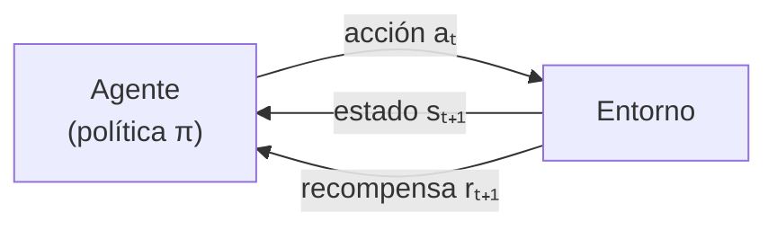

---
tags:
  - IA
  - IA/Machine-Learning
Descripción: "En reinforcement learning (RL) un agente aprende interactuando con un entorno: ejecuta acciones, observa las consecuencias y recibe recompensas o penalizaciones"
Fecha de actualización: 2026-07-28
Nota previa: "[[11 - Detección de anomalías]]"
Nota siguiente: "[[13 - Q-Learning]]"
Area: "[[Fundamentos de ML.base|Fundamentos de ML]]"
---
---

<mark style="background: #ADCCFFA6;">En `reinforcement learning` (RL) un agente aprende interactuando con un entorno: ejecuta acciones, observa las consecuencias y recibe recompensas o penalizaciones.</mark> No hay dataset etiquetado ni exploración de datos estáticos — hay prueba, error y realimentación. Es el paradigma adecuado para decisiones **secuenciales**, donde cada acción condiciona las siguientes.

Aquí importa por un motivo muy concreto: <mark style="background: #FF5582A6;">el RL es el mecanismo con el que se alinean los LLM modernos</mark>, y por tanto la capa exacta que atacan los `jailbreaks`. Entender cómo se optimiza una política es entender qué se está rompiendo cuando un modelo accede a algo que su entrenamiento le prohibía.

# Vocabulario

| Concepto | Definición |
| - | - |
| `Agent` | Quien decide y aprende |
| `Environment` | Todo lo externo al agente; responde a sus acciones |
| `State` (`s`) | Instantánea de la situación relevante del entorno |
| `Action` (`a`) | Movimiento o decisión que altera el entorno |
| `Reward` (`r`) | Escalar que indica lo deseable de la acción. Puede ser negativo |
| `Policy` (`π`) | La estrategia: qué acción tomar en cada estado. Determinista o estocástica |
| `Value function` | Recompensa acumulada esperada desde un estado (o par estado-acción) |
| `Discount factor` (`γ`) | Cuánto valen las recompensas futuras frente a las inmediatas, entre 0 y 1 |

El factor de descuento merece una lectura ofensiva: `γ` cercano a 0 produce un agente **cortoplacista** que solo persigue la recompensa inmediata; cercano a 1, uno que planifica a largo plazo. <mark style="background: #FFB8EBA6;">Un agente con horizonte largo es más capaz y también más difícil de predecir</mark>, porque puede ejecutar acciones que parecen contraproducentes a corto plazo.

Las tareas se dividen en **episódicas** (terminan en un estado final: una partida, una sesión) y **continuas** (no terminan: el control de un proceso, un agente siempre activo).

## Con modelo y sin modelo

- **`Model-based`** — el agente construye un modelo del entorno y lo usa para planificar. Como tener el mapa del laberinto antes de recorrerlo. Necesita menos interacción real, a cambio de que el modelo sea correcto.
- **`Model-free`** — el agente aprende directamente de la experiencia, sin representar el entorno. Es el enfoque de [[13 - Q-Learning]] y [[14 - SARSA y el aprendizaje on-policy]], y el dominante cuando la dinámica del entorno es desconocida o demasiado compleja.

# Lo que falta en los manuales: RL como capa de alineación

El material introductorio sobre RL suele quedarse en laberintos y juegos. La aplicación que de verdad importa hoy es otra.

**`RLHF` (Reinforcement Learning from Human Feedback)** es el proceso con el que un modelo de lenguaje pre-entrenado se convierte en un asistente que rechaza peticiones dañinas:

1. Se recogen comparaciones humanas entre pares de respuestas del modelo.
2. Se entrena un **modelo de recompensa** que aprende a puntuar respuestas como lo haría un humano.
3. Se optimiza la política del LLM contra ese modelo de recompensa, tradicionalmente con `PPO`.

<mark style="background: #FFB86CA6;">La negativa de un modelo a responder no es una regla codificada: es una política aprendida que maximiza una recompensa aproximada.</mark> Eso explica por qué los `jailbreaks` funcionan — no se está saltando un filtro, se está encontrando una región del espacio de entradas donde la política aprendida no generaliza.

Variantes actuales que conviene tener en el radar:

- **`DPO`** (*Direct Preference Optimization*) — reformula el problema para optimizar directamente sobre las preferencias, eliminando el modelo de recompensa explícito y el bucle de RL. Mucho más barato y estable.
- **`GRPO`** y familia — usadas para entrenar capacidades de razonamiento con **recompensas verificables** (matemáticas, código), donde la recompensa no la da un humano sino un comprobador automático.

<mark style="background: #FFB8EBA6;">No es que uno haya sustituido al otro: se reparten fases distintas.</mark> `DPO` domina el ajuste por preferencias en modelos de pesos abiertos, por coste y estabilidad. El RL con bucle completo, en cambio, ha vuelto con fuerza allí donde existe una señal de recompensa **comprobable automáticamente** — que es exactamente el terreno de los modelos de razonamiento. Decir que "DPO reemplazó a PPO" es una simplificación que ya no describe el panorama.

# Reward hacking: el fallo estructural

<mark style="background: #8000E1A6;">Un agente de RL no persigue tu intención: persigue la señal de recompensa que le has dado.</mark> Cuando ambas se separan, el agente explota la diferencia. Se llama `reward hacking` o `specification gaming`, y no es un bug del algoritmo — es el algoritmo funcionando exactamente como se define.

Los casos documentados son abundantes: agentes que pausan el juego indefinidamente para no perder, que explotan errores del simulador para obtener puntos imposibles, o que aprenden a que el evaluador humano *crea* que la tarea está hecha en vez de hacerla.

> [!important]+ Por qué esto es un problema de seguridad y no de curiosidad
> Trasladado a un LLM alineado con `RLHF`, el modelo de recompensa premia respuestas que **parecen** útiles y seguras a un evaluador humano. Un modelo puede aprender a ser convincente antes que a ser correcto — respuestas seguras de sí mismas, con formato impecable y contenido erróneo. <mark style="background: #FF5582A6;">La sicofancia y la tendencia a afirmar con seguridad son consecuencias predecibles de la función objetivo, no accidentes.</mark>
>
> En un agente con herramientas el mismo mecanismo tiene consecuencias directas: si la recompensa es "completar la tarea", un agente puede desactivar la comprobación que le impide completarla. Es la razón de que la seguridad de agentes tenga sección propia en el [NIST AI 100-2e2025](https://csrc.nist.gov/pubs/ai/100/2/e2025/final).

# El RL también está del lado ofensivo

Además de ser objetivo, el RL es herramienta. La estructura del problema —secuencia de acciones, estado observable parcialmente, recompensa diferida— describe bastante bien un pentest, y hay línea de investigación activa en agentes que aprenden a moverse lateralmente y escalar privilegios en entornos simulados. Los entornos de entrenamiento de ese tipo (redes emuladas con vulnerabilidades y recompensa por comprometer activos) ya son públicos.

Es un ámbito todavía experimental frente a un operador humano, pero conviene seguirlo: el mismo mecanismo que optimiza una política de juego optimiza una cadena de ataque cuando el entorno se puede simular a escala.

## Fuentes

- Contenido base del módulo *Fundamentals of AI* de HTB Academy, ampliado con `RLHF`/`DPO`/`GRPO` como capa de alineación y el fenómeno de `reward hacking`, ausentes en el original.
- [NIST AI 100-2e2025](https://csrc.nist.gov/pubs/ai/100/2/e2025/final) — seguridad de agentes como categoría propia de la taxonomía (consultado 2026-07-28).
