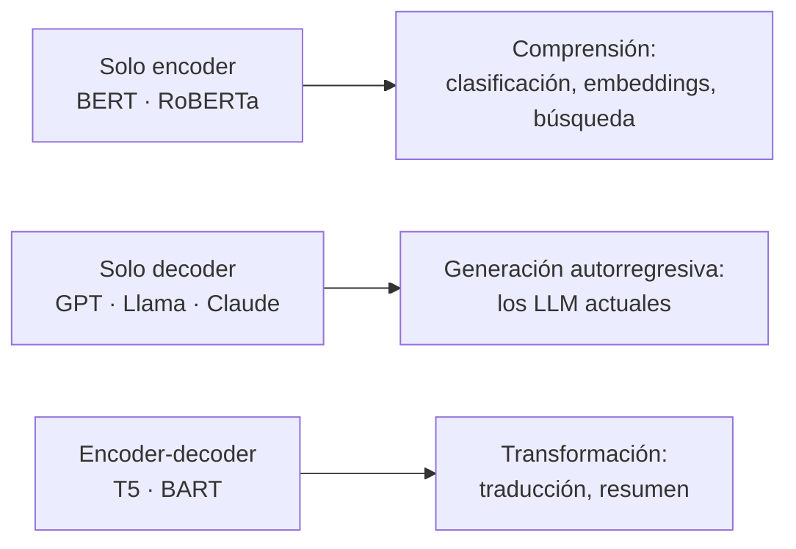

---
tags:
  - IA
  - IA/Deep-Learning
  - IA/LLM
Descripción: "El transformer sustituye la recurrencia por un mecanismo de atención que relaciona directamente cada elemento de la secuencia con todos los demás, en paralelo"
Fecha de actualización: 2026-07-28
Nota previa: "[[03 - Redes neuronales recurrentes (RNN)]]"
Nota siguiente: "[[05 - IA generativa]]"
Area: "[[Deep Learning.base|Deep Learning]]"
---
---

> [!info]+ Nota añadida al temario
> HTB menciona los `transformers` de pasada en su módulo de fundamentos y salta directamente a los LLM. Esa arquitectura es el sustrato de **todo** lo que viene después en el path ofensivo —`prompt injection`, ataques a la salida del modelo, agentes— y, sobre todo, <mark style="background: #FF5582A6;">explica por qué la `prompt injection` no tiene solución arquitectónica</mark>. Sin esta nota, el resto se aprende de memoria en lugar de entenderse.

<mark style="background: #ADCCFFA6;">El `transformer` sustituye la recurrencia por un mecanismo de atención que relaciona directamente cada elemento de la secuencia con todos los demás, en paralelo.</mark> Se presentó en *Attention Is All You Need* (Vaswani et al., 2017) y desplazó a las [[03 - Redes neuronales recurrentes (RNN)]] en lenguaje, después en visión, audio y generación de imagen.

# Self-attention

La operación central. Cada token se proyecta en tres vectores mediante matrices aprendidas:

| Vector | Nombre | Rol |
| - | - | - |
| `Q` | *Query* | Qué información busca este token |
| `K` | *Key* | Qué información ofrece este token |
| `V` | *Value* | El contenido que aporta si resulta relevante |

El mecanismo compara la *query* de cada token con las *keys* de todos los tokens de la secuencia mediante producto escalar. Ese resultado se escala, se pasa por `softmax` para obtener pesos que suman 1, y se usa para hacer una media ponderada de los *values*:

```text
Attention(Q, K, V) = softmax( (Q · Kᵀ) / √dₖ ) · V
```

La división por `√dₖ` no es decorativa: sin ella, el producto escalar crece con la dimensión del vector, el `softmax` se satura —un peso cercano a 1 y el resto a 0— y su gradiente se desvanece. Escalar mantiene los valores en el rango donde el `softmax` todavía discrimina y es derivable.

En la frase "The cat sat on the mat, which was blue", el token `which` produce una *query* que casa fuertemente con la *key* de `mat`, y por tanto incorpora su información aunque estén separados por varias palabras. <mark style="background: #8000E1A6;">Arquitectónicamente no hay decaimiento con la distancia: el token 1 y el token 4000 se conectan por el mismo camino, de un solo salto, frente a los 4000 pasos que necesitaría una RNN.</mark>

> [!warning]+ Pero "sin decaimiento" es cierto en la arquitectura, no en el comportamiento
> Conviene no llevarse la idea equivocada. En la práctica sí hay degradación con la distancia, por dos motivos:
> - **La codificación posicional la introduce.** `RoPE` atenúa de forma natural la atención entre posiciones lejanas — es un sesgo deseado, pero es decaimiento.
> - **El fenómeno *lost in the middle*.** Con contextos largos, los modelos recuperan bastante mejor la información situada al **principio y al final** que la del centro.
>
> Tiene lectura ofensiva directa: <mark style="background: #FF5582A6;">la posición dentro del contexto es un parámetro del ataque</mark>. Un payload de inyección colocado al final de un documento largo suele pesar más que el mismo payload enterrado en el medio, y las instrucciones de sistema situadas al principio pierden fuerza a medida que el contexto crece.

**Atención multi-cabeza**: la operación se repite en paralelo con varios juegos de proyecciones. Cada "cabeza" aprende un tipo de relación distinto —sintáctica, correferencial, semántica— y sus salidas se concatenan.

## Codificación posicional

Al procesar todo en paralelo, el modelo **no sabe en qué orden llegan los tokens**: para la atención, la secuencia es un conjunto. El orden se inyecta explícitamente sumando a cada embedding un vector que codifica su posición. Los modelos actuales usan mayoritariamente `RoPE` (*Rotary Position Embedding*), que codifica la posición como una rotación en el espacio de *queries* y *keys* y generaliza mejor a secuencias más largas que las vistas en entrenamiento.

# Las tres familias



- **Solo encoder** — atención bidireccional: cada token ve toda la secuencia. Produce representaciones, no texto. Es lo que hay detrás de los `embeddings` de un buscador semántico o de un sistema RAG.
- **Solo decoder** — atención **causal**: cada token solo puede atender a los anteriores. Genera un token cada vez, condicionado por todo lo previo. <mark style="background: #FFB8EBA6;">Es la arquitectura de prácticamente todos los LLM que vas a auditar.</mark>
- **Encoder-decoder** — el diseño original, aún vigente en traducción y en modelos de difusión condicionados por texto.

# El coste cuadrático y sus consecuencias

Comparar cada token con todos los demás implica `n²` operaciones para una secuencia de longitud `n`. Duplicar el contexto cuadruplica el coste de atención.

De ahí salen buena parte de los desarrollos posteriores: `FlashAttention` (reorganiza el cálculo para no materializar la matriz completa en memoria), atención por ventana deslizante, y arquitecturas de **mezcla de expertos** (`MoE`) que activan solo una fracción de los parámetros por token. También explica por qué la **ventana de contexto** es un recurso limitado y de coste real — un dato relevante cuando se evalúa la superficie de ataque de un sistema que mete documentos de terceros en el contexto.

## La caché KV, y el canal lateral que abre

Al generar de forma autorregresiva, recalcular la atención de toda la secuencia en cada token sería absurdo. Los `K` y `V` ya calculados se guardan en la **`KV cache`** y se reutilizan: cada token nuevo solo calcula su propia fila. Es lo que hace viable la generación, y también lo que convierte la inferencia en un proceso limitado por memoria más que por cómputo.

Sobre esa idea, los proveedores añadieron el **`prompt caching`**: si dos peticiones comparten prefijo —el mismo `system prompt`, el mismo documento—, la segunda reutiliza la caché de la primera y responde mucho más rápido y más barato.

> [!important]+ Ese ahorro es un canal lateral de temporización
> Si un acierto de caché es medible en el **tiempo hasta el primer token** (`TTFT`), entonces cualquiera puede preguntar al sistema *"¿este prefijo ya estaba cacheado?"* simplemente cronometrando. Y si la caché se comparte **entre usuarios**, la respuesta filtra lo que otros han enviado.
>
> No es teórico. [*Auditing Prompt Caching in Language Model APIs*](https://arxiv.org/abs/2502.07776) detectó **compartición global de caché entre usuarios en siete proveedores de API**, OpenAI incluido. Y [*The Early Bird Catches the Leak*](https://arxiv.org/abs/2409.20002) muestra la recuperación de prompts **token a token**: como el acierto exige prefijo común, se adivina un token, se mide, y se avanza — con precisiones de detección por token del orden del 99% y del orden de 10² consultas por token recuperado.
>
> <mark style="background: #FFB86CA6;">Consecuencias para un engagement:</mark>
> - Un `system prompt` puede extraerse **sin `prompt injection`**, solo cronometrando. Es una vía alternativa al `LLM07` de [[03 - OWASP Top 10 para aplicaciones LLM]] que ningún `guardrail` de entrada detecta, porque no hay payload.
> - En un despliegue multi-inquilino, la caché compartida es fuga entre clientes.
> - Medir la varianza del `TTFT` entre peticiones con y sin prefijo común es una prueba barata y no destructiva que merece estar en el checklist.
>
> Mitigación: aislar la caché por inquilino o por usuario, y —donde el riesgo lo justifique— añadir ruido al `TTFT` o desactivar el cacheo de prefijos sensibles.

# Por qué esto es la raíz de la prompt injection

Aquí está la consecuencia de seguridad, y merece leerse despacio.

En una aplicación web hay una separación estructural entre código y datos: una consulta SQL parametrizada distingue la sentencia de los valores porque el motor los procesa por canales distintos. Esa separación es lo que permite que las `prepared statements` eliminen la inyección SQL de raíz.

<mark style="background: #FFB86CA6;">En un transformer esa separación no existe.</mark> El *system prompt*, el historial de conversación, el documento recuperado por RAG, la respuesta de una herramienta y el mensaje del usuario **se concatenan en una única secuencia de tokens**. La atención opera sobre todos ellos de manera uniforme: no hay ningún bit que marque "estos tokens son instrucciones de confianza y estos son datos no confiables".

> [!important]+ La inyección de prompt es una propiedad de la arquitectura, no un bug
> El modelo distingue instrucción de dato únicamente por **patrones estadísticos aprendidos** durante el entrenamiento — porque las instrucciones suelen aparecer en cierto formato y posición. Es una heurística blanda, y como toda heurística blanda, se puede empujar fuera de su distribución.
>
> <mark style="background: #FF5582A6;">No hay un `prepared statement` para LLM.</mark> Delimitadores, etiquetas XML, instrucciones de "ignora lo que venga después" y jerarquías de instrucciones entrenadas suben el listón; ninguna resuelve el problema, porque todas se implementan **dentro** del mismo canal que intentan proteger. Por eso las defensas efectivas son de arquitectura de sistema —mínimo privilegio en las herramientas, aprobación humana en acciones sensibles, aislamiento del contenido no confiable, validación de la salida— y no de *prompt engineering*.
>
> Esa asimetría es también la razón de que la `prompt injection` **indirecta** (el payload llega en una página web, un correo o un documento que el modelo lee) sea la variante con más impacto: el atacante no necesita hablar con el modelo, le basta con que el modelo lea algo suyo.

Se desarrolla en las notas del módulo de red teaming y, en profundidad, en `01 - Prompt Injection` del path.

## Fuentes

- Vaswani et al., *Attention Is All You Need* (NeurIPS 2017) — arquitectura original.
- [*Auditing Prompt Caching in Language Model APIs*](https://arxiv.org/abs/2502.07776) — compartición global de caché detectada en siete proveedores (consultado 2026-07-28).
- [*The Early Bird Catches the Leak: Unveiling Timing Side Channels in LLM Serving Systems*](https://arxiv.org/abs/2409.20002) — recuperación de prompts por temporización (consultado 2026-07-28).
- [NIST AI 100-2e2025](https://csrc.nist.gov/pubs/ai/100/2/e2025/final) — clasificación de `prompt injection` directa e indirecta dentro de la taxonomía GenAI (consultado 2026-07-28).
- Nota net-new: no forma parte del temario de HTB Academy; redactada para cubrir el salto conceptual entre RNN y LLM.
