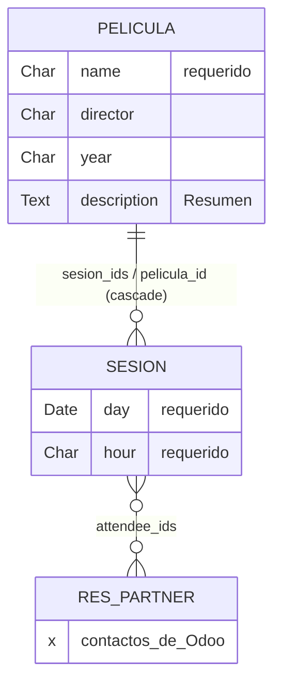

---
tags:
  - SIE/Laboratorio
  - SIE/Examen
  - SIE/Modulos
  - SIE
Descripción: "Resolución completa del examen de ejemplo (Práctica 6): un módulo Filmoteca que gestiona la emisión de películas y la asistencia de socios"
Fecha de actualización: 2026-05-27
Nota previa: "[[17 - Cómo programa el profesor (estilo y buenas prácticas)]]"
Nota siguiente: "[[19 - Variantes y práctica]]"
Area: "[[Laboratorios.base|Laboratorios]]"
---
---

# Filmoteca paso a paso

Resolución completa del examen de ejemplo (Práctica 6): un módulo **Filmoteca** que gestiona la emisión de películas y la asistencia de socios. Cada película se proyecta en varias sesiones; a cada sesión puede acudir cualquier socio (un contacto). Voy paso a paso, justificando cada decisión y enlazando al fundamento. El código es el que aprueba; donde el profesor hace algo discutible, lo señalo.

## Paso 0 — Leer el enunciado y diseñar los datos

Antes de teclear, traduzco el enunciado a modelos y campos (este análisis es la mitad de la nota en el examen):

- Dos modelos nuevos: **película** y **sesión**.
- **Película**: `name` (obligatorio), `director`, `year`, `description` (resumen) y lista de sesiones.
- **Sesión**: `day` (obligatorio), `hour` (obligatorio) y lista de asistentes (elegidos de los contactos).
- Tipos que fija el enunciado: <mark style="background: #FF5582A6;">`year` y `hour` son cadenas de texto (`Char`); `day` es fecha (`Date`)</mark>.
- Relaciones: una película tiene muchas sesiones (`One2many` ↔ `Many2one`); una sesión tiene muchos asistentes que son contactos (`Many2many` a `res.partner`).

Modelo de datos que se deduce (la "chuleta" mental antes de teclear):



Pantallas pedidas (las del enunciado, que el módulo debe reproducir):

**Ilustración 1 — Listado de películas** (nombre, director, año):
![[filmo-1-listado-peliculas.png]]

**Ilustración 2 — Formulario de película, pestaña "Resumen"**:
![[filmo-2-form-resumen.png]]

**Ilustración 3 — Formulario de película, pestaña "Sesiones"** (tabla embebida día/hora):
![[filmo-3-form-sesiones.png]]

**Ilustración 4 — Detalle de una sesión** (Horario + Asistentes, elegidos de los contactos):
![[filmo-4-detalle-sesion.png]]

> [!info]+
> Estas capturas son el "contrato" del examen: tu módulo se considera correcto si produce exactamente estas pantallas. Fíjate en los datos de prueba (Star Wars / George Lucas / 1977, dos sesiones, asistentes de "Azure Interior") — basta con replicar la estructura, no esos datos concretos.

## Paso 1 — Entorno y scaffold

Con un contenedor de Odoo 14 arrancado (idealmente uno nuevo para la práctica, [[04 - Instalación con Docker]]):

```shell-session
$ docker exec -itu root [contenedor] /usr/bin/odoo scaffold filmo /mnt/extra-addons
$ sudo chown -R $USER:$USER addons/filmo
```

Esto crea `addons/filmo/` con el esqueleto. Fundamento: [[08 - Estructura de un módulo y scaffold]].

## Paso 2 — `__manifest__.py`

Declaro qué carga el módulo. Activo el CSV de seguridad (el scaffold lo deja comentado) y apunto a un único fichero de vistas `filmo.xml`:

```python
# -*- coding: utf-8 -*-
{
    'name': "Filmo",
    'summary': "Gestión de una filmoteca: películas, sesiones y asistentes",
    'description': "Módulo de ejemplo del examen SIEA",
    'author': "Samuel",
    'category': 'Uncategorized',
    'version': '0.1',
    'depends': ['base'],
    'data': [
        'security/ir.model.access.csv',
        'views/filmo.xml',
    ],
    'demo': [],
}
```

Decisión: `depends: ['base']` basta — los asistentes salen de `res.partner`, que vive en `base`. Fundamento: [[08 - Estructura de un módulo y scaffold]].

## Paso 3 — `__init__.py`

```python
# filmo/__init__.py
from . import models

# filmo/models/__init__.py
from . import models
```

Sin esta cadena de imports, los modelos no existen para Odoo ([[01 - Python para Odoo]]).

## Paso 4 — Modelos (`models/models.py`)

El núcleo. Dos clases que heredan de `models.Model`. No importo `api` porque no hay campos computados ni `onchange`.

```python
# -*- coding: utf-8 -*-
from odoo import models, fields

class Pelicula(models.Model):
    _name = 'filmo.pelicula'

    name = fields.Char(string="Pelicula", required=True)
    director = fields.Char(string="Director")
    year = fields.Char(string="Año")
    description = fields.Text(string="Resumen")
    sesion_ids = fields.One2many('filmo.sesion', 'pelicula_id', string="Sesiones")

class Sesion(models.Model):
    _name = 'filmo.sesion'

    name = fields.Char()
    day = fields.Date(string="Dia", required=True)
    hour = fields.Char(string="Hora", required=True)
    pelicula_id = fields.Many2one('filmo.pelicula', ondelete='cascade',
                                  string="Pelicula")
    attendee_ids = fields.Many2many('res.partner', string="Asistentes")
```

Decisiones, una a una:
- `name` de la película es `Char` **`required=True`** (el enunciado lo marca obligatorio). Nombres internos en inglés, `string=` en español ([[17 - Cómo programa el profesor (estilo y buenas prácticas)]]).
- `year` y `hour` son `Char` y `day` es `Date`, tal como exige el enunciado ([[09 - Modelos y tipos de campo]]).
- `description` es `Text` (resumen multilínea) con etiqueta "Resumen".
- `sesion_ids` (`One2many`) en la película ↔ `pelicula_id` (`Many2one`) en la sesión: la pareja inversa. `ondelete='cascade'` → al borrar una película se borran sus sesiones ([[10 - Relaciones entre modelos]]).
- `attendee_ids` (`Many2many` a `res.partner`): los asistentes salen de los contactos.

> [!info]+
> **Dos detalles del original del profesor que conviene entender** ([[17 - Cómo programa el profesor (estilo y buenas prácticas)]]):
> - Mantengo `name = fields.Char()` en `Sesion` aunque no sea obligatorio ni se muestre: le da a la sesión un *display name* y es inofensivo. Alternativa más limpia: omitirlo y añadir `_rec_name = 'day'` para que la sesión se identifique por su fecha.
> - El profesor **no** pone `required=True` en `pelicula_id`. Sería más correcto exigirlo (una sesión sin película no tiene sentido), pero su solución lo deja opcional; lo respeto para no desviarme de su criterio.

## Paso 5 — Vistas, acciones y menú (`views/filmo.xml`)

Un único fichero con todo. Uso la raíz moderna `<odoo>`.

```xml
<?xml version="1.0" encoding="UTF-8"?>
<odoo>
    <data>
        <!-- Película: tree -->
        <record model="ir.ui.view" id="pelicula_tree_view">
            <field name="name">pelicula.tree</field>
            <field name="model">filmo.pelicula</field>
            <field name="arch" type="xml">
                <tree string="Pelicula Tree">
                    <field name="name"/>
                    <field name="director"/>
                    <field name="year"/>
                </tree>
            </field>
        </record>

        <!-- Película: form (notebook Resumen + Sesiones) -->
        <record model="ir.ui.view" id="pelicula_form_view">
            <field name="name">pelicula.form</field>
            <field name="model">filmo.pelicula</field>
            <field name="arch" type="xml">
                <form string="Pelicula Form">
                    <sheet>
                        <group>
                            <field name="name"/>
                            <field name="director"/>
                            <field name="year"/>
                        </group>
                        <notebook>
                            <page string="Resumen">
                                <field name="description"/>
                            </page>
                            <page string="Sesiones">
                                <field name="sesion_ids">
                                    <tree string="Sesiones">
                                        <field name="day"/>
                                        <field name="hour"/>
                                    </tree>
                                </field>
                            </page>
                        </notebook>
                    </sheet>
                </form>
            </field>
        </record>

        <!-- Película: search -->
        <record model="ir.ui.view" id="pelicula_search_view">
            <field name="name">pelicula.search</field>
            <field name="model">filmo.pelicula</field>
            <field name="arch" type="xml">
                <search>
                    <field name="name"/>
                    <field name="director"/>
                </search>
            </field>
        </record>

        <!-- Sesión: tree -->
        <record model="ir.ui.view" id="sesion_tree_view">
            <field name="name">sesion.tree</field>
            <field name="model">filmo.sesion</field>
            <field name="arch" type="xml">
                <tree string="Sesion Tree">
                    <field name="day"/>
                    <field name="hour"/>
                </tree>
            </field>
        </record>

        <!-- Sesión: form (Horario + Asistentes) -->
        <record model="ir.ui.view" id="sesion_form_view">
            <field name="name">sesion.form</field>
            <field name="model">filmo.sesion</field>
            <field name="arch" type="xml">
                <form string="Sesion Form">
                    <sheet>
                        <group>
                            <group string="Horario">
                                <field name="day"/>
                                <field name="hour"/>
                            </group>
                        </group>
                        <label for="attendee_ids"/>
                        <field name="attendee_ids"/>
                    </sheet>
                </form>
            </field>
        </record>

        <!-- Acciones -->
        <record model="ir.actions.act_window" id="pelicula_list_action">
            <field name="name">Peliculas</field>
            <field name="res_model">filmo.pelicula</field>
            <field name="view_mode">tree,form</field>
            <field name="help" type="html">
                <p class="oe_view_nocontent_create">Crea la primera película</p>
            </field>
        </record>

        <record model="ir.actions.act_window" id="sesion_list_action">
            <field name="name">Sesiones</field>
            <field name="res_model">filmo.sesion</field>
            <field name="view_mode">tree,form</field>
        </record>

        <!-- Menú -->
        <menuitem id="main_filmo_menu" name="Filmoteca"/>
        <menuitem id="peliculas_menu" name="Peliculas"
                  parent="main_filmo_menu"
                  action="pelicula_list_action"/>
    </data>
</odoo>
```

Decisiones de las vistas ([[12 - Vistas XML]], [[13 - Acciones y menús]]):
- El **listado de películas** muestra nombre, director y año (las tres columnas que pide la Ilustración 1).
- El **formulario de película** pone los datos básicos en un `<group>` y reparte resumen y sesiones en dos pestañas (`<notebook>`). La pestaña "Sesiones" embebe un `<tree>` con día y hora — esto cubre las Ilustraciones 2 y 3 de un solo formulario.
- El **detalle de sesión** agrupa día/hora bajo "Horario" y lista los asistentes (Ilustración 4).
- La acción se declara **antes** del menú que la usa; el menú raíz "Filmoteca" antes que su hijo "Peliculas".

> [!warning]+
> **`<odoo>` vs `<openerp>`**: la solución del profesor usa la raíz antigua `<openerp>...<data>...</data></openerp>`. Funciona en Odoo 14, pero está obsoleta. Aquí uso `<odoo>` (la actual y la que enseña en la P5). Si copias literalmente su fichero, verás `<openerp>`: es correcto, solo "viejo". No mezcles: una raíz por fichero.

> [!info]+
> **Sesiones sin menú propio**: igual que el profesor, defino `sesion_list_action` pero solo creo menú para películas. Las sesiones se gestionan desde la pestaña "Sesiones" de cada película. Es suficiente para el enunciado; si quisieras un menú de sesiones, añadirías otro `<menuitem>` con `action="sesion_list_action"`.

## Paso 6 — Seguridad (`security/ir.model.access.csv`)

Acceso total a ambos modelos para todos (grupo vacío) — la versión mínima que pide el examen ([[14 - Seguridad y datos demo]]):

```csv
id,name,model_id:id,group_id:id,perm_read,perm_write,perm_create,perm_unlink
access_filmo_pelicula,filmo.pelicula,model_filmo_pelicula,,1,1,1,1
access_filmo_sesion,filmo.sesion,model_filmo_sesion,,1,1,1,1
```

Cuidado con el formato `model_<nombre>`: `filmo.pelicula` → `model_filmo_pelicula`. Sin estas dos líneas, los modelos no se ven.

## Paso 7 — Instalar y comprobar

```shell-session
# tras crear/editar .py: reiniciar + Upgrade
$ docker compose restart
```

En Odoo, con [[05 - Administración funcional|modo desarrollador]] activo, ve a **Apps** y pulsa **Update Apps List** para que descubra el módulo recién creado:

![[odoo-08-update-apps-list.png]]

Quita el filtro "Apps" del buscador y busca **Filmo**; aparece su tarjeta con el botón **Install** (el nombre técnico `filmo` bajo el título confirma que Odoo lo ha reconocido):

![[odoo-08-filmo-en-apps.png]]

Tras instalar, aparece el menú **Filmoteca → Peliculas** en la barra superior. Crea una película de prueba con un par de sesiones y algún asistente para verificar las relaciones — debe quedar como las Ilustraciones 1-4 del Paso 0.

> [!success]+
> El módulo es correcto si: aparece el menú "Filmoteca → Peliculas"; el listado muestra nombre/director/año (Ilustración 1); el formulario de película tiene pestañas "Resumen" y "Sesiones" (Ilustraciones 2-3); y al abrir una sesión ves Horario + Asistentes (Ilustración 4). Crea una película con un par de sesiones y añade algún contacto como asistente para verificar las relaciones.

> [!important]+
> Recordatorio del ciclo ([[08 - Estructura de un módulo y scaffold]]): si tocas `models.py`, **reinicia Odoo y haz Upgrade**; si solo tocas `filmo.xml`, basta el **Upgrade**. Si te equivocas en un tipo de campo y lo cambias, **desinstala, borra, reinicia e reinstala**.

## Apéndice — el módulo `filmo` completo de un vistazo

Todos los ficheros juntos, para copiar o repasar de una pasada (el código verificado contra la solución del profesor).

```text
filmo/
├── __manifest__.py
├── __init__.py
├── models/
│   ├── __init__.py
│   └── models.py
├── security/
│   └── ir.model.access.csv
└── views/
    └── filmo.xml
```

**`filmo/__manifest__.py`**
```python
# -*- coding: utf-8 -*-
{
    'name': "Filmo",
    'summary': "Gestión de una filmoteca: películas, sesiones y asistentes",
    'description': "Módulo de ejemplo del examen SIEA",
    'author': "Samuel",
    'category': 'Uncategorized',
    'version': '0.1',
    'depends': ['base'],
    'data': [
        'security/ir.model.access.csv',
        'views/filmo.xml',
    ],
    'demo': [],
}
```

**`filmo/__init__.py`** y **`filmo/models/__init__.py`** (ambos con la misma línea)
```python
# -*- coding: utf-8 -*-
from . import models
```

**`filmo/models/models.py`**
```python
# -*- coding: utf-8 -*-
from odoo import models, fields

class Pelicula(models.Model):
    _name = 'filmo.pelicula'

    name = fields.Char(string="Pelicula", required=True)
    director = fields.Char(string="Director")
    year = fields.Char(string="Año")
    description = fields.Text(string="Resumen")
    sesion_ids = fields.One2many('filmo.sesion', 'pelicula_id', string="Sesiones")

class Sesion(models.Model):
    _name = 'filmo.sesion'

    name = fields.Char()
    day = fields.Date(string="Dia", required=True)
    hour = fields.Char(string="Hora", required=True)
    pelicula_id = fields.Many2one('filmo.pelicula', ondelete='cascade',
                                  string="Pelicula")
    attendee_ids = fields.Many2many('res.partner', string="Asistentes")
```

**`filmo/security/ir.model.access.csv`**
```csv
id,name,model_id:id,group_id:id,perm_read,perm_write,perm_create,perm_unlink
access_filmo_pelicula,filmo.pelicula,model_filmo_pelicula,,1,1,1,1
access_filmo_sesion,filmo.sesion,model_filmo_sesion,,1,1,1,1
```

**`filmo/views/filmo.xml`**
```xml
<?xml version="1.0" encoding="UTF-8"?>
<odoo>
    <data>
        <record model="ir.ui.view" id="pelicula_tree_view">
            <field name="name">pelicula.tree</field>
            <field name="model">filmo.pelicula</field>
            <field name="arch" type="xml">
                <tree string="Pelicula Tree">
                    <field name="name"/>
                    <field name="director"/>
                    <field name="year"/>
                </tree>
            </field>
        </record>

        <record model="ir.ui.view" id="pelicula_form_view">
            <field name="name">pelicula.form</field>
            <field name="model">filmo.pelicula</field>
            <field name="arch" type="xml">
                <form string="Pelicula Form">
                    <sheet>
                        <group>
                            <field name="name"/>
                            <field name="director"/>
                            <field name="year"/>
                        </group>
                        <notebook>
                            <page string="Resumen">
                                <field name="description"/>
                            </page>
                            <page string="Sesiones">
                                <field name="sesion_ids">
                                    <tree string="Sesiones">
                                        <field name="day"/>
                                        <field name="hour"/>
                                    </tree>
                                </field>
                            </page>
                        </notebook>
                    </sheet>
                </form>
            </field>
        </record>

        <record model="ir.ui.view" id="pelicula_search_view">
            <field name="name">pelicula.search</field>
            <field name="model">filmo.pelicula</field>
            <field name="arch" type="xml">
                <search>
                    <field name="name"/>
                    <field name="director"/>
                </search>
            </field>
        </record>

        <record model="ir.ui.view" id="sesion_tree_view">
            <field name="name">sesion.tree</field>
            <field name="model">filmo.sesion</field>
            <field name="arch" type="xml">
                <tree string="Sesion Tree">
                    <field name="day"/>
                    <field name="hour"/>
                </tree>
            </field>
        </record>

        <record model="ir.ui.view" id="sesion_form_view">
            <field name="name">sesion.form</field>
            <field name="model">filmo.sesion</field>
            <field name="arch" type="xml">
                <form string="Sesion Form">
                    <sheet>
                        <group>
                            <group string="Horario">
                                <field name="day"/>
                                <field name="hour"/>
                            </group>
                        </group>
                        <label for="attendee_ids"/>
                        <field name="attendee_ids"/>
                    </sheet>
                </form>
            </field>
        </record>

        <record model="ir.actions.act_window" id="pelicula_list_action">
            <field name="name">Peliculas</field>
            <field name="res_model">filmo.pelicula</field>
            <field name="view_mode">tree,form</field>
            <field name="help" type="html">
                <p class="oe_view_nocontent_create">Crea la primera película</p>
            </field>
        </record>

        <record model="ir.actions.act_window" id="sesion_list_action">
            <field name="name">Sesiones</field>
            <field name="res_model">filmo.sesion</field>
            <field name="view_mode">tree,form</field>
        </record>

        <menuitem id="main_filmo_menu" name="Filmoteca"/>
        <menuitem id="peliculas_menu" name="Peliculas"
                  parent="main_filmo_menu"
                  action="pelicula_list_action"/>
    </data>
</odoo>
```

¿Y si el examen pide algo ligeramente distinto? Para eso, los patrones y el checklist: [[19 - Variantes y práctica]].
