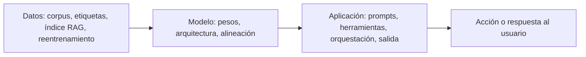

---
tags:
  - IA/Red-Team
  - IA
  - Pentesting
  - Introduccion
  - Tipo/Introduccion
Descripción: "Evaluar la seguridad de un sistema basado en ML exige entender sus componentes y sus algoritmos, porque buena parte de los fallos no están en el código sino en las propiedades…"
Fecha de actualización: 2026-07-28
Nota previa: 
Nota siguiente: "[[01 - OWASP Machine Learning Security Top 10]]"
Area: "[[Red Teaming AI.base|Red Teaming AI]]"
---
---

<mark style="background: #ADCCFFA6;">Evaluar la seguridad de un sistema basado en ML exige entender sus componentes y sus algoritmos, porque buena parte de los fallos no están en el código sino en las propiedades estadísticas del modelo y en las costuras entre piezas.</mark> Un sistema de IA no es una aplicación con un modelo dentro: es un pipeline de datos, un modelo, una capa de aplicación y una infraestructura, y las vulnerabilidades aparecen sobre todo en los puntos de interacción.

# Los tres tipos de evaluación

| Tipo | Qué hace | Duración típica |
| - | - | - |
| `Vulnerability Assessment` | Identifica, cataloga y prioriza vulnerabilidades **conocidas**, sin explotarlas. Escaneo automatizado con `Nessus` u `OpenVAS` | Días |
| `Penetration Test` | Identifica y **explota** vulnerabilidades sobre un alcance definido, con proceso estructurado y ventana temporal acotada | 1-3 semanas |
| `Red Team Assessment` | Simulación adversarial completa: replica TTPs de un atacante real, incluye personas y procesos, prioriza el sigilo y la persistencia frente al `blue team` | Semanas o meses |

El detalle de las fases de un pentest está en [[00 - Qué es un pentest y tipos de evaluación]] y en las notas de `00 - Fases del Pentesting/`.

# Por qué red team y no pentest

<mark style="background: #FFB8EBA6;">Para sistemas de IA, el formato de red team encaja mejor por tres razones concretas.</mark>

- **Tiempo.** Muchas técnicas contra modelos —extracción por consultas, envenenamiento sostenido, búsqueda de `jailbreaks` estables— requieren cientos o miles de interacciones a lo largo de días. No caben en la ventana de un pentest.
- **Alcance.** El sistema abarca datos, modelo, aplicación e infraestructura. Delimitar el alcance a "la API del modelo" deja fuera precisamente donde vive el impacto: el pipeline de datos y las herramientas que el modelo puede invocar.
- **Puntos de interacción.** Los fallos más graves suelen estar en las costuras: el conector que mete un documento externo en el contexto, el orquestador que ejecuta lo que el modelo pide, el proceso que reentrena con datos de producción.

# Lo que cambia respecto a un red team clásico

Aquí es donde conviene ajustar expectativas, porque hay diferencias metodológicas que afectan directamente a cómo se trabaja y cómo se reporta.

**El comportamiento no es determinista.** Un `exploit` de desbordamiento de búfer funciona o no funciona. <mark style="background: #FF5582A6;">Un `jailbreak` puede funcionar el 40% de las veces</mark>, porque el muestreo del modelo es estocástico y porque el proveedor puede haber ajustado el modelo entre dos intentos. Consecuencias prácticas:

- Un intento fallido **no** demuestra que la defensa funcione, y uno exitoso no demuestra que sea fiable.
- Los hallazgos se reportan con **tasa de éxito sobre N intentos**, no como binario. "12 de 30 intentos (40%) con el mismo prompt" es una evidencia utilizable; "conseguí que el modelo lo hiciera" no lo es.
- Hay que fijar y documentar los parámetros de inferencia (`temperature`, `top-p`, versión del modelo, fecha), porque sin ellos el hallazgo no es reproducible.

**Muchos hallazgos no tienen parche.** La `prompt injection` es una propiedad de la arquitectura, no un error de implementación — el motivo está en [[04 - Transformers y el mecanismo de atención]]. Reportarla como "vulnerabilidad a corregir" lleva a una recomendación imposible. Lo correcto es reportar el **impacto concreto que habilita en ese sistema** y recomendar controles de arquitectura: mínimo privilegio en las herramientas, validación de la salida, aprobación humana en acciones irreversibles.

**Dos disciplinas bajo el mismo nombre.** Conviene separarlas en la propuesta y en el informe:

- **Red teaming de seguridad** — impacto técnico clásico: RCE, exfiltración de datos, acceso no autorizado, escalada de privilegios a través del sistema de IA. Es lo que cubre este path.
- **Red teaming de seguridad de contenido** (*safety*) — hacer que el modelo genere contenido dañino, sesgado o prohibido. Importa para cumplimiento y reputación, pero <mark style="background: #8000E1A6;">no es lo mismo que comprometer un sistema</mark>, y mezclar ambos en un informe diluye los hallazgos que sí tienen impacto técnico.

**La reproducibilidad del entorno es frágil.** El modelo objetivo puede actualizarse sin aviso, los `guardrails` cambian, y un hallazgo válido en enero puede no reproducirse en marzo. Registrar versión de modelo, fecha, hora y configuración exacta pasa de buena práctica a requisito — ver [[02 - Evidencias, capturas y redacción]].

# El mapa del resto del módulo

La superficie de ataque se descompone en cuatro componentes —datos, modelo, aplicación y sistema— y esa descomposición estructura las notas siguientes. Conviene mirarla con **dos lentes distintas**, porque cada una revela cosas diferentes:

**Lente 1 — el flujo**: cómo se propaga una manipulación a través del sistema.

Se lee de izquierda a derecha: quien contamina los datos condiciona el modelo, quien manipula el modelo condiciona lo que la aplicación ejecuta. <mark style="background: #FFB8EBA6;">Es la lente que explica por qué un ataque puede introducirse en un componente y manifestarse en otro, meses después</mark> — la separación entre *introducción* y *exposición* del riesgo que formaliza el Risk Map de [[04 - Google Secure AI Framework (SAIF)]].

**Lente 2 — la contención**: qué acceso da comprometer cada capa. El `Sistema` envuelve a todo lo demás, así que un `MLflow` sin autenticar entrega los datos y el modelo de una vez. Se desarrolla en [[06 - Red teaming de IA generativa]].

Antes de recorrerlas, tres marcos de referencia ordenan el trabajo y dan vocabulario común con el cliente: el [[01 - OWASP Machine Learning Security Top 10]], el [[03 - OWASP Top 10 para aplicaciones LLM]] y el [[04 - Google Secure AI Framework (SAIF)]], complementados por [[05 - MITRE ATLAS y NIST AI RMF]].

## Fuentes

- Contenido base del módulo *Introduction to Red Teaming AI* de HTB Academy, ampliado con las diferencias metodológicas frente al red team clásico (no determinismo, reporte por tasa de éxito, hallazgos sin parche, separación seguridad/*safety*), ausentes en el original.
