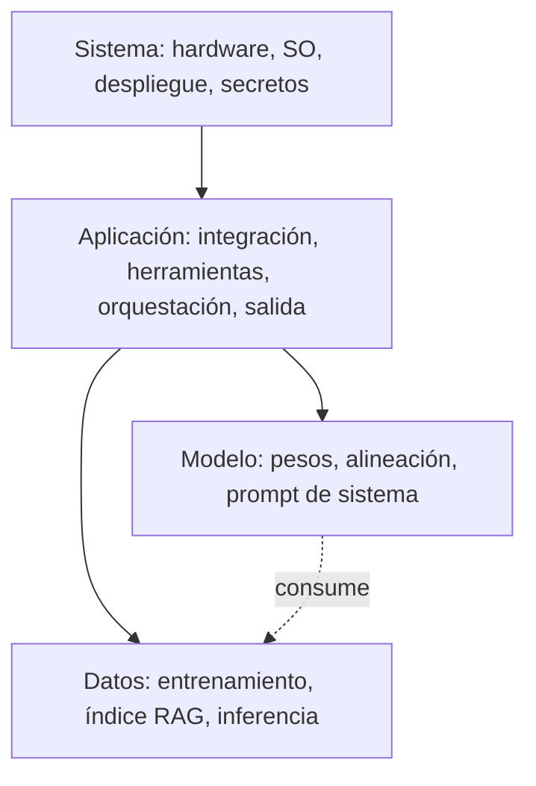

---
tags:
  - IA/Red-Team
  - IA
  - IA/Generativa
  - Pentesting/Enumeracion
Descripción: "Dos propiedades de los sistemas generativos condicionan cómo se les ataca: son cajas negras incluso cuando se conoce el modelo, y dependen de datos que a menudo el propio…"
Fecha de actualización: 2026-07-28
Nota previa: "[[05 - MITRE ATLAS y NIST AI RMF]]"
Nota siguiente: "[[07 - Ataques a los componentes del modelo]]"
Area: "[[Red Teaming AI.base|Red Teaming AI]]"
---
---

Dos propiedades de los sistemas generativos condicionan cómo se les ataca: **son cajas negras** incluso cuando se conoce el modelo, y **dependen de datos** que a menudo el propio atacante puede influir.

# Naturaleza de caja negra

<mark style="background: #ADCCFFA6;">Entender por qué un modelo reacciona de cierta forma a una entrada es difícil; predecir cómo reaccionará a una entrada nueva es más difícil todavía.</mark> Ni siquiera con acceso completo a los pesos existe una vía práctica para razonar sobre el comportamiento sin ejecutarlo. Por eso la evaluación de un sistema generativo es empírica: se prueba, se observa, se ajusta.

Eso no significa que la información previa no valga. Saber qué modelo hay debajo cambia mucho el trabajo:

- Modelos de pesos abiertos (`Llama`, `Mistral`, `Qwen`, `Gemma`) permiten **descargarlo y alojarlo localmente**.
- Modelos propietarios accesibles por API permiten al menos identificar familia y versión, y reutilizar `jailbreaks` conocidos para esa familia.

> [!important]+ La réplica local es la mejor decisión operativa del engagement
> Si el objetivo se apoya en un modelo de pesos abiertos, montar una copia local cambia por completo las condiciones de trabajo:
> - **Sin límites de tasa** — se pueden probar miles de variantes de payload.
> - **Sin registro en el objetivo** — <mark style="background: #FF5582A6;">cada prompt enviado al sistema real queda en sus logs</mark>, y una campaña de miles de intentos fallidos es exactamente el tipo de actividad que dispara una alerta. Desarrollar en local y lanzar solo lo que ya funciona reduce el ruido a una fracción.
> - **Sin riesgo de degradar el servicio** — probar consumo no acotado (`LLM10`) contra producción puede provocar la caída que se está evaluando.
> - **Acceso a gradientes y a `logits`** — habilita técnicas `white-box` de generación automática de sufijos adversariales, imposibles contra una API.
>
> Los `guardrails` del objetivo no estarán en la réplica, pero el **modelo base** sí, y buena parte de los `jailbreaks` explotan el comportamiento del modelo base más que el filtro que tiene delante.

## OPSEC específico de este dominio

Un punto que el material formativo no suele tratar y que en un engagement real importa:

- **Todo prompt enviado se registra**, con frecuencia se retiene largo tiempo y puede ser revisado por personas. Si el alcance incluye sigilo, el volumen y el contenido de las consultas son telemetría del atacante — igual que lo son las peticiones a una web.
- **Los prompts pueden acabar en datos de entrenamiento** del proveedor, según los términos del servicio. Nunca incluir datos reales del cliente ni información sensible del engagement en pruebas contra APIs de terceros.
- **Fijar la versión del modelo** en cada prueba. Un proveedor puede actualizar el modelo sin aviso y un hallazgo válido deja de reproducirse; sin la versión anotada, el hallazgo es indefendible.

# Dependencia de los datos

La calidad del sistema depende de los datos de entrenamiento y también de los de inferencia. <mark style="background: #FFB8EBA6;">Muchos despliegues mejoran el modelo de forma continua con las consultas que reciben</mark>, lo que exige sistemas de recolección, almacenamiento y procesado de esos datos.

Esa infraestructura es un objetivo de alto valor por dos razones distintas:

- **Contiene datos** — las conversaciones de los usuarios con el sistema, que suelen incluir información sensible que nadie clasificó como tal.
- **Alimenta el entrenamiento** — quien pueda escribir ahí influye en el modelo futuro, con el mecanismo demostrado en [[02 - Manipulación del modelo]].

# Los cuatro componentes

No son cuatro cajas en fila sino **capas que se contienen**, y esa anidación importa: comprometer una capa exterior da acceso a todas las interiores.

| Componente | Qué abarca |
| - | - |
| `Model` | El modelo en sí: `prompt injection`, tratamiento inseguro de la salida, `jailbreaks`, extracción |
| `Data` | Datos de entrenamiento y de inferencia: envenenamiento, fuga, integridad del índice vectorial |
| `Application` | La aplicación que integra el modelo. <mark style="background: #FFB86CA6;">Vulnerabilidades web clásicas en el punto de integración</mark> |
| `System` | Hardware, sistema operativo, configuración y despliegue: DoS por falta de límites, secretos, cadena de suministro |

<mark style="background: #8000E1A6;">La categoría `Application` es donde un pentester web tiene ventaja inmediata y donde suele estar el impacto real.</mark> El modelo es el componente exótico; el XSS que resulta de renderizar su salida sin escapar, la SQLi que resulta de ejecutar la consulta que genera, o el SSRF que resulta de dejarle hacer peticiones HTTP son vulnerabilidades de toda la vida, en un envoltorio nuevo. Un chatbot de soporte en una web sigue siendo una aplicación web.

# TTPs adaptadas

En un red team clásico las TTPs se toman de adversarios reales: `spear-phishing`, explotación de software sin parchear, credenciales comprometidas, persistencia, movimiento lateral y exfiltración. Contra sistemas generativos hay que adaptarlas por componente:

- Contra el **modelo**: sondeo sistemático de entradas y análisis de salidas, construcción de payloads de inyección, `jailbreaks`, extracción.
- Contra los **datos**: envenenamiento del corpus o del índice RAG, manipulación de las fuentes que el sistema recupera.
- Contra la **aplicación**: explotación del tratamiento de la salida, abuso de las herramientas expuestas, escalada a través de la agencia concedida.
- Contra el **sistema**: agotamiento de recursos, cadena de suministro, acceso al artefacto del modelo y a los secretos del entorno.

Las cuatro se desarrollan en las notas siguientes.

## Fuentes

- Contenido base del módulo *Introduction to Red Teaming AI* de HTB Academy, ampliado con el desarrollo de la réplica local como decisión operativa y con la sección de OPSEC (registro de prompts, retención, fijación de versión), ausentes en el original.
