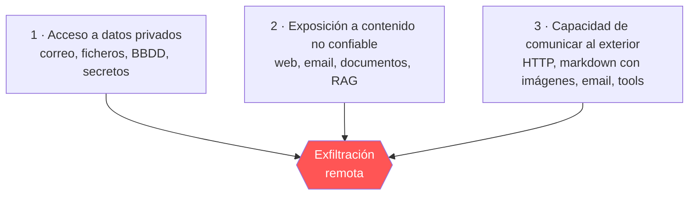

---
tags:
  - IA/Red-Team
  - IA
  - IA/LLM
  - Pentesting/Explotacion
Descripción: "Prompt injection es la explotación de que un LLM no puede distinguir entre las instrucciones que le da el operador y los datos que procesa, porque ambos llegan por el mismo canal"
Fecha de actualización: 2026-07-28
Nota previa: "[[00 - Anatomía del prompt y chat templates]]"
Nota siguiente: "[[02 - Reconocimiento de aplicaciones LLM]]"
Area: "[[Prompt Injection.base|Prompt Injection]]"
---
---

<mark style="background: #ADCCFFA6;">`Prompt injection` es la explotación de que un LLM no puede distinguir entre las instrucciones que le da el operador y los datos que procesa, porque ambos llegan por el mismo canal.</mark> El término lo acuñó Simon Willison en septiembre de 2022, a raíz de una demostración de Riley Goodside contra GPT-3, y la formulación sigue siendo exacta cuatro años después.

# La analogía con SQLi es engañosa

Casi todo el material introductorio compara prompt injection con [[00 - Introducción a SQL Injection|SQL injection]]. La comparación ayuda a entender el *síntoma* — datos que se interpretan como instrucciones — pero induce a un error grave sobre la *solución*.

En SQLi el fallo tiene arreglo definitivo: las sentencias preparadas separan el plan de ejecución de los valores, el motor recibe dos canales distintos y ningún dato puede convertirse en sintaxis. **En un LLM ese segundo canal no existe.** No hay `prepare()` ni `bind()` porque el modelo no compila una consulta: consume una secuencia de tokens y predice la siguiente. Los [[00 - Anatomía del prompt y chat templates|chat templates]] marcan roles, pero esa marca solo la respeta el modelo porque fue entrenado para ello.

> [!important]+
> <mark style="background: #8000E1A6;">La consecuencia práctica: prompt injection no se *arregla*, se *acota*.</mark> Cualquier arquitectura que dependa de que el modelo obedezca al system prompt frente a un atacante determinado está construida sobre una garantía probabilística. Un pentester debe evaluar el sistema partiendo de que el modelo **va a ser comprometido**, y medir qué se puede hacer desde ahí.

# Direct vs indirect

La taxonomía operativa depende de por dónde entra el payload:

| | **Directa** | **Indirecta** |
| - | - | - |
| Quién escribe el payload | El atacante, en el `user prompt` | El atacante, en un recurso que el modelo consumirá |
| Vector | Chat, formulario, API | Email, web, documento, ticket, repo, base vectorial |
| Víctima | El propio operador (fraude, fuga, abuso de cuota) | **Otro usuario** o el sistema |
| Control sobre el prompt | Alto — payload aislado | Bajo — el payload va incrustado entre datos legítimos |
| Trabajo de referencia | [Perez & Ribeiro, arXiv:2211.09527](https://arxiv.org/abs/2211.09527) | [Greshake et al., arXiv:2302.12173](https://arxiv.org/abs/2302.12173) |

<mark style="background: #FFB86CA6;">La indirecta es la que produce los hallazgos de impacto alto en un engagement real</mark>, porque convierte al atacante en un tercero remoto y no autenticado: no necesita hablar con el chatbot, le basta con dejar el payload donde el chatbot vaya a leerlo. Se cubre en [[05 - Inyección indirecta en RAG, email y web]] y [[06 - EchoLeak y la exfiltración zero-click]].

# La lethal trifecta

La heurística más útil para triar riesgo real en un sistema con LLM la formuló Simon Willison en junio de 2025. Un agente es explotable de forma catastrófica cuando combina las **tres** propiedades siguientes:

> [!info]+ Fuente
> [The lethal trifecta for AI agents](https://simonwillison.net/2025/Jun/16/the-lethal-trifecta/) — Simon Willison, junio 2025.

Las tres por separado son inocuas. Juntas, un atacante que controla (2) usa al agente como confuso *proxy* para leer (1) y sacarlo por (3). <mark style="background: #FF5582A6;">En la fase de reconocimiento, mapear estas tres capacidades es lo primero que hay que hacer: si el objetivo las tiene las tres, ya hay un hallazgo crítico antes de escribir un solo payload.</mark> Es exactamente el patrón de [[06 - EchoLeak y la exfiltración zero-click|EchoLeak]], y de casi todos los CVE de agentes de 2025-2026.

La mitigación estructural también sale de ahí: romper una de las tres patas. Un agente que lee datos privados y procesa contenido no confiable pero **no puede** hacer peticiones salientes es mucho menos interesante para un atacante.

# Qué se consigue explotándolo

El impacto no es "el chatbot dice cosas raras". Ordenado de menor a mayor severidad típica:

| Objetivo | Impacto | Nota |
| - | - | - |
| Fuga del system prompt | Info disclosure; a menudo trae claves, endpoints y nombres de herramientas | [[03 - Inyección directa y fuga del system prompt]] |
| Desvío de propósito | Abuso de cuota de cómputo pagada por la víctima, daño reputacional | [[09 - Jailbreaks clásicos (DAN, roleplay y ficción)]] |
| Manipulación de lógica de negocio | Descuentos, aprobaciones, decisiones automatizadas falseadas | [[04 - Inyección directa contra la lógica de negocio]] |
| Exfiltración de datos de otro usuario | Confidencialidad rota sin interacción de la víctima | [[06 - EchoLeak y la exfiltración zero-click]] |
| Invocación de herramientas | RCE, escritura en sistemas conectados, movimiento lateral | [[05 - Inyección indirecta en RAG, email y web]] |

> [!warning]+ El impacto lo pone la integración, no el modelo
> Un LLM aislado que solo genera texto tiene impacto bajo por definición. El mismo modelo con acceso a un intérprete de código, a la API de tickets y al correo corporativo tiene impacto crítico. **Al reportar, la severidad se argumenta sobre las capacidades conectadas**, no sobre la facilidad de hacer que el modelo diga una palabrota.

# Casos públicos que fijan el precedente

- **Chevrolet of Watsonville (dic. 2023)**: un chatbot de concesionario con ChatGPT detrás aceptó vender un Tahoe de 2024 por un dólar y declaró el acuerdo vinculante después de que un usuario reescribiera sus reglas por prompt injection directa. No hubo venta, pero fijó el patrón de *manipulación de lógica de negocio* que se explota en [[04 - Inyección directa contra la lógica de negocio]].
- **DPD (ene. 2024)**: el chatbot de la empresa de mensajería fue jailbreakeado para insultar a la propia compañía y escribir un poema criticándola. Impacto puramente reputacional, pero mediático.
- **EchoLeak / CVE-2025-32711 (jun. 2025)**: primer zero-click de prompt injection indirecta confirmado en un producto en producción — Microsoft 365 Copilot, CVSS 9.3. Es el salto de "curiosidad de laboratorio" a "vulnerabilidad crítica con CVE".

# Lo que no es prompt injection

Distinguirlo importa a la hora de clasificar hallazgos:

- **`Jailbreak`**: bypass de las restricciones entrenadas en el modelo (no generar contenido dañino). Es un *objetivo*, y muy a menudo se consigue *mediante* prompt injection, pero un jailbreak contra un chatbot público sin datos ni herramientas rara vez tiene impacto de seguridad reportable. Ver [[08 - Fundamentos del jailbreaking]].
- **`Alucinación`**: el modelo genera información falsa sin que nadie le haya inyectado nada. Es un fallo de fiabilidad; se convierte en problema de seguridad cuando la salida se consume sin validar.
- **`Insecure output handling`**: la aplicación confía en el texto que devuelve el modelo y lo pasa a un navegador, a una base de datos o a un intérprete. <mark style="background: #FFB8EBA6;">Es una vulnerabilidad de la aplicación, no del modelo, y con frecuencia es la mitad interesante de la cadena</mark> — el prompt injection solo controla *qué* dice el modelo; el impacto real llega cuando alguien ejecuta lo que dice.
