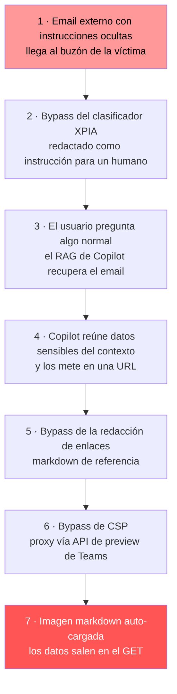

---
tags:
  - IA/Red-Team
  - IA
  - IA/LLM
  - Pentesting/Explotacion
Descripción: "La exfiltración zero-click es la explotación de un agente LLM sin ninguna interacción de la víctima: el atacante deja el payload, la víctima hace su trabajo normal, y los datos…"
Fecha de actualización: 2026-07-28
Nota previa: "[[05 - Inyección indirecta en RAG, email y web]]"
Nota siguiente: "[[07 - ASCII smuggling y payloads invisibles]]"
Area: "[[Prompt Injection.base|Prompt Injection]]"
---
---

> [!info]+ Nota añadida al temario
> HTB cierra la inyección indirecta con labs de laboratorio. Esta nota cubre lo que pasó en producción entre 2025 y 2026: cinco vulnerabilidades críticas en productos de Microsoft, Salesforce, GitHub y OpenAI que comparten **la misma cadena de explotación**. Es el patrón que hay que buscar en un engagement real.

<mark style="background: #ADCCFFA6;">La exfiltración zero-click es la explotación de un agente LLM sin ninguna interacción de la víctima: el atacante deja el payload, la víctima hace su trabajo normal, y los datos salen.</mark> No hay clic, no hay descarga, no hay indicio en la interfaz. Es el punto en el que la prompt injection dejó de ser una curiosidad de laboratorio y empezó a tener CVE con CVSS de 9 y pico.

# EchoLeak — CVE-2025-32711

Descubierta por **Aim Labs** y divulgada en junio de 2025 contra **Microsoft 365 Copilot**. CVSS **9.3**. Los investigadores bautizaron la clase como `LLM Scope Violation`: entrada no confiable del atacante consigue que el modelo acceda a datos de confianza de su contexto y los saque, sin interacción del usuario.

La cadena tiene cinco eslabones, y los cuatro últimos son **bypasses de defensas que Microsoft ya tenía puestas**:

Detalle de cada bypass, porque son transferibles a otros objetivos:

1. **XPIA (`Cross-Prompt Injection Attempt`) classifier.** Microsoft tenía un clasificador entrenado para detectar instrucciones dirigidas a la IA en el correo entrante. Se esquivó redactando el payload **como si fuera una instrucción para el destinatario humano**, sin mencionar IA, asistentes ni "ignora tus instrucciones". <mark style="background: #FF5582A6;">Es la lección más reutilizable de todo el caso: los clasificadores de prompt injection se entrenan con el vocabulario del ataque, no con su semántica.</mark>
2. **Redacción de enlaces.** Copilot redactaba las URL externas en su salida. Se evitó con **markdown de referencia** (`[texto][ref]` con la definición `[ref]: https://...` separada), un formato que la lógica de redacción no cubría.
3. **Auto-fetch de imágenes.** Una imagen markdown se descarga sola al renderizar la respuesta. No hace falta clic: el `GET` a la URL del atacante, con los datos en la ruta, se dispara solo. Es exactamente la primitiva del [[11 - HTML Injection, Content Spoofing y Dangling Markup|dangling markup]], solo que quien construye la etiqueta es el LLM.
4. **CSP.** La política de seguridad de contenido de Copilot bloquea dominios desconocidos. Se salvó **proxyando la petición a través de una API asíncrona de preview de Microsoft Teams**, un dominio que la propia CSP permitía.

> [!info]+ Fuentes
> Divulgación original de [Aim Labs](https://www.aim.security/lp/aim-labs-echoleak-blogpost); análisis técnico posterior en [arXiv:2509.10540](https://arxiv.org/abs/2509.10540). Microsoft parcheó del lado servidor y declaró que no hubo explotación en el mundo real.

# La misma cadena, otros cuatro productos

| Caso | Objetivo | Entrada del payload | Canal de exfiltración | Bypass de CSP |
| - | - | - | - | - |
| **EchoLeak** (CVE-2025-32711, 9.3) | M365 Copilot | Email externo | Imagen markdown auto-cargada | API de preview de Teams |
| **ForcedLeak** (9.4) | Salesforce Agentforce | Formulario `Web-to-Lead` público | URL de imagen | **Dominio caducado que seguía en la allowlist de CSP de Salesforce**, recomprado por ~5 $ |
| **CamoLeak** (CVE-2025-59145, 9.6) | GitHub Copilot Chat | Descripción de un pull request | Peticiones de imagen píxel a píxel | El propio proxy **Camo** de GitHub |
| **ShadowLeak** | ChatGPT Deep Research | Email en Gmail conectado | Petición saliente **desde la infraestructura de OpenAI** | N/A — servidor, no cliente |
| **AgentFlayer** | Conectores de ChatGPT y similares | Documento compartido | Renderizado de imagen en cliente | — |

Tres lecturas que salen de la tabla y que valen como metodología:

- **El canal de exfiltración es casi siempre el mismo**: <mark style="background: #8000E1A6;">una URL construida por el modelo dentro de una imagen markdown que el cliente carga sola</mark>. Si un producto renderiza markdown del modelo con imágenes remotas, ya tienes medio hallazgo.
- **La CSP es el eslabón que siempre cae, y cae por la allowlist propia del fabricante.** El proxy de imágenes de la casa (Camo), una API interna de preview (Teams) o un dominio caducado que nadie quitó de la lista. Conecta directamente con [[05 - Bypass de CSP]] y con [[00 - Fundamentos de Subdomain Takeover|subdomain takeover]]: el caso de ForcedLeak es literalmente un *takeover* de dominio caducado que resultó estar en una allowlist de seguridad.
- **ShadowLeak es el que peor pinta tiene desde el lado defensivo.** La petición sale de la nube de OpenAI, no del navegador ni de la red de la víctima: <mark style="background: #FFB86CA6;">no aparece en el proxy corporativo, ni en el EDR, ni en los logs de red del cliente</mark>. El defensor no tiene telemetría del incidente.

# Cómo se prueba esto en un engagement

El procedimiento, sobre cualquier agente con acceso a datos:

1. **Confirmar la [[01 - Prompt injection y por qué no tiene parche#La lethal trifecta|trifecta]]**: ¿lee contenido externo? ¿tiene datos privados en contexto? ¿puede generar salida que produzca una petición saliente?
2. **Buscar la superficie de renderizado.** ¿La respuesta se muestra como markdown? ¿carga imágenes remotas? ¿enlaces? ¿iframes? ¿previews de enlace? Cada uno es un canal potencial.
3. **Probar el canal con un `canary`.** Un dominio propio con logging (`Burp Collaborator`, `interactsh`, o un simple `python3 -m http.server`) y un payload que solo pida cargar `https://tu-canary/test.png`. Si llega la petición sin que nadie haga clic, el canal existe.
4. **Enumerar la allowlist de CSP** de la aplicación. Cada dominio de esa lista es un bypass potencial: buscar proxies de imágenes, endpoints de preview, redirecciones abiertas y **dominios caducados**.
5. **Solo entonces, añadir el dato.** Codificar en la ruta o el subdominio de la URL canary, con el payload pidiendo al modelo que incluya lo que ha leído.

> [!warning]+ Límites del alcance
> Este es el tipo de prueba que **hay que negociar por escrito antes de ejecutar**. Un payload que exfiltra de verdad saca datos reales de la organización a un servidor externo. En engagement autorizado se hace con datos marcados (`canary tokens`), nunca con producción, y el canary debe estar bajo control del equipo. Sin eso escrito en el alcance, la prueba se queda en demostrar que la petición sale — con `test.png` y sin adjuntar datos.

La primitiva es la misma que la [[18 - Exfiltración de datos ciega (OOB)|exfiltración out-of-band]] clásica; lo que cambia es que el que construye la petición saliente es el modelo, no el parser.

# Mitigaciones que funcionan de verdad

Ordenadas por eficacia real, no por facilidad:

| Mitigación | Efecto |
| - | - |
| **No renderizar markdown del modelo con recursos remotos** (imágenes, previews, iframes) | Cierra el canal principal de golpe. Es la corrección más barata y la más efectiva |
| **Prohibir que la salida del modelo construya URLs con datos variables** | Ataca la primitiva, no el canal concreto |
| **Auditar la allowlist de CSP** — quitar proxies propios, dominios caducados y endpoints de preview | Cierra los bypasses recurrentes |
| **Romper una pata de la trifecta** (aislar el agente que lee contenido externo del que accede a datos privados) | Corrección arquitectónica; es el enfoque de [[13 - Defensas modernas contra prompt injection\|CaMeL]] |
| Clasificador de prompt injection tipo XPIA | Útil como capa. **Derrotado en EchoLeak**, y en ninguno de los cinco casos impidió la cadena completa |

<mark style="background: #FFB8EBA6;">El dato más importante de esta nota: **en los cinco casos había defensas desplegadas y en ninguno impidieron la cadena**.</mark> Microsoft tenía un clasificador dedicado (XPIA) y cayó el primero; Salesforce y GitHub tenían CSP y se atravesó por su propia allowlist. Un guardrail entrenado no es una frontera de seguridad, es un filtro estadístico. Se detalla en [[14 - Detección y evasión en prompt injection]].
