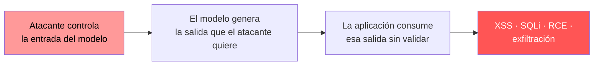

---
tags:
  - IA/Red-Team
  - IA
  - IA/LLM
  - Introduccion
  - Tipo/Introduccion
Descripción: "El texto que genera un LLM es dato no confiable, y hay que tratarlo exactamente igual que la entrada de un usuario: validar, sanear y escapar antes de consumirlo"
Fecha de actualización: 2026-07-28
Nota previa: 
Nota siguiente: "[[01 - XSS desde la salida del modelo]]"
Area: "[[LLM Output Attacks.base|LLM Output Attacks]]"
---
---

<mark style="background: #ADCCFFA6;">El texto que genera un LLM es dato no confiable, y hay que tratarlo exactamente igual que la entrada de un usuario: validar, sanear y escapar antes de consumirlo.</mark> Suena obvio escrito así. En la práctica casi nadie lo hace, porque el modelo *parece* parte del sistema: lo desplegó el propio equipo, se le paga una API, responde con educación. Esa confianza implícita es la vulnerabilidad.

# Por qué la salida es entrada

La cadena que hace de esto un problema de seguridad tiene tres eslabones:

El primer eslabón es [[01 - Prompt injection y por qué no tiene parche|prompt injection]] — directa si el atacante habla con el modelo, [[05 - Inyección indirecta en RAG, email y web|indirecta]] si el payload llega en un documento. El segundo es inevitable: el modelo hace lo que se le convence de hacer. <mark style="background: #8000E1A6;">El tercero es el único que la organización controla, y es el que convierte "el chatbot dijo algo raro" en una vulnerabilidad explotable.</mark>

De ahí una consecuencia que conviene tener clara desde el principio: **estas son vulnerabilidades de la aplicación, no del modelo**. Se arreglan con las mismas técnicas de siempre —codificación contextual, sentencias preparadas, aislamiento— y se reportan como lo que son.

# El catálogo

| Sink | Vulnerabilidad resultante | Nota |
| - | - | - |
| Respuesta HTML sin codificar | [[00 - Introducción a XSS\|XSS]] | [[01 - XSS desde la salida del modelo]] |
| Consulta SQL | [[00 - Introducción a SQL Injection\|SQL injection]] | [[02 - SQL injection a través del LLM]] |
| Comando del sistema | [[00 - Introducción a Command Injection\|Inyección de comandos]] | [[03 - Inyección de comandos a través del LLM]] |
| `eval()` / `exec()` | Ejecución de código arbitrario | [[04 - Function calling y ejecución de herramientas]] |
| Llamada a herramienta | Agencia excesiva, abuso de funciones | [[05 - Agencia excesiva y funciones vulnerables]] |
| Renderizado de markdown | Exfiltración de datos | [[06 - Exfiltración por renderizado de markdown]] |
| Consulta LDAP, ruta de fichero, cabecera HTTP | LDAP injection, path traversal, response splitting | Mismo patrón |
| Código fuente aceptado sin revisar | Bugs y vulnerabilidades introducidas en el repo | [[07 - Alucinaciones del LLM]] |
| Nombre de dependencia | Cadena de suministro | [[08 - Slopsquatting y alucinación de paquetes]] |

<mark style="background: #FFB8EBA6;">La lista no es exhaustiva por diseño: cualquier sink que acepte texto es candidato.</mark> La pregunta de reconocimiento es siempre la misma — *¿dónde acaba lo que el modelo escribe?* — y se responde igual que en un pentest web clásico: siguiendo el flujo de datos.

# La cadena completa, con un ejemplo

La tabla anterior es abstracta. Este es el mismo mecanismo con nombres concretos, y sirve de plantilla para razonar sobre cualquier objetivo.

Una empresa de logística tiene un chatbot de soporte. El bot puede recuperar los comentarios que los clientes dejan en la web, y su respuesta se muestra en el panel de un operador humano.

| Eslabón | Qué ocurre | Quién controla |
| - | - | - |
| **Entrada** | El atacante publica un comentario con `` | **Atacante**, sin autenticar |
| **Recuperación** | Un operador pregunta al bot "¿qué dicen los clientes de hoy?" | Víctima, uso normal |
| **Generación** | El modelo reproduce el comentario en su respuesta | El modelo, inducido |
| **Sink** | El panel renderiza la respuesta sin codificar | **La aplicación** |
| **Impacto** | La sesión del operador queda comprometida | — |

Tres cosas que ese recorrido deja claras y que conviene interiorizar antes de seguir:

1. **El atacante nunca habla con el bot.** No hay una petición suya que investigar, no aparece en los logs de conversación. Su única huella es un comentario publicado, quizá días antes.
2. **La víctima no hace nada anómalo.** Pregunta lo que pregunta todos los días.
3. <mark style="background: #FF5582A6;">**La página que sirve el comentario puede estar perfectamente saneada.**</mark> Si la web codifica correctamente al mostrar los comentarios, un escáner web no encuentra nada — el modelo actúa como canal de bypass de una defensa que existe y funciona.

Ese tercer punto es el que hace que estos hallazgos se escapen de las pruebas convencionales, y es el argumento que hay que llevar al informe.

# Lo que no es una inyección clásica

Dos categorías de esta carpeta no encajan en el molde "dato no confiable en un intérprete":

- **Alucinaciones.** El modelo genera información falsa sin que nadie le haya inyectado nada, y la aplicación la sirve como cierta. Es un fallo de fiabilidad con consecuencias legales y económicas reales — [[07 - Alucinaciones del LLM]].
- **Ataques de abuso.** El modelo se usa como *herramienta* para producir contenido dañino a escala: desinformación, phishing, discurso de odio. Aquí el sistema funciona correctamente; el problema es para qué se está usando — [[10 - Ataques de abuso y desinformación]].

# Encaje en los marcos

En el [[03 - OWASP Top 10 para aplicaciones LLM|OWASP Top 10 for LLM Applications 2025]], esta carpeta cubre tres entradas:

| Entrada | Qué cubre aquí |
| - | - |
| `LLM05:2025 Improper Output Handling` | El grueso: XSS, SQLi, inyección de comandos, exfiltración |
| `LLM06:2025 Excessive Agency` | Function calling con más capacidad de la necesaria |
| `LLM09:2025 Misinformation` | Alucinaciones y alucinación de paquetes |

En el [[04 - Google Secure AI Framework (SAIF)|SAIF]] de Google, el riesgo equivalente es `Insecure Model Output`.

> [!important]+ Cómo cambia esto el triaje
> <mark style="background: #FFB86CA6;">Un hallazgo de esta carpeta casi siempre tiene severidad más alta que uno de prompt injection puro</mark>, porque el impacto es concreto y demostrable: una cookie robada, una tabla exfiltrada, un comando ejecutado. Al escribir el informe, el prompt injection es el **vector** y esto es el **impacto** — y la severidad se argumenta sobre el segundo. Ver [[06 - Cómo redactar un hallazgo]].

# Más allá del texto

Los modelos multimodales generan también imágenes, audio y vídeo, y cada modalidad de salida arrastra sus propios sinks: una imagen SVG generada por el modelo puede contener JavaScript; un fichero generado puede tener una ruta controlada por el atacante. La superficie crece con cada capacidad nueva, y la regla no cambia — **lo que sale del modelo no está validado hasta que alguien lo valida**.
