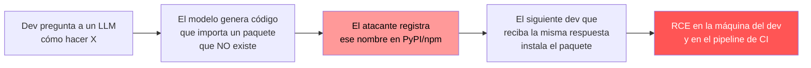

---
tags:
  - IA/Red-Team
  - IA
  - IA/LLM
  - Pentesting/Explotacion
Descripción: "El slopsquatting explota que los LLM inventan nombres de paquetes que no existen: el atacante registra ese nombre en el repositorio público, y el siguiente desarrollador que…"
Fecha de actualización: 2026-07-28
Nota previa: "[[07 - Alucinaciones del LLM]]"
Nota siguiente: "[[09 - Mitigación del tratamiento inseguro de la salida]]"
Area: "[[LLM Output Attacks.base|LLM Output Attacks]]"
---
---

> [!info]+ Nota añadida al temario
> HTB dedica dos párrafos a los paquetes alucinados dentro de la sección de alucinaciones. El vector merece nota propia: tiene nombre, investigación académica revisada por pares, incidentes reales con decenas de miles de descargas, y es el punto donde una alucinación se convierte en **compromiso de la cadena de suministro**.

<mark style="background: #ADCCFFA6;">El `slopsquatting` explota que los LLM inventan nombres de paquetes que no existen: el atacante registra ese nombre en el repositorio público, y el siguiente desarrollador que copie el comando de instalación se lleva el código del atacante.</mark> El término lo acuñó Seth Larson (Python Software Foundation) en 2025, sobre el patrón del `typosquatting` clásico.

# El mecanismo



El ejemplo de HTB lo ilustra en tres líneas. Ante `Give me a Python script that solves the HackTheBox machine 'Blazorized'`, el modelo produce:

```python
from hacktheboxsolver import solve

solve('Blazorized')
```

`hacktheboxsolver` no existe. Hoy el `pip install` falla con un error. Mañana, si alguien lo registra, instala lo que ese alguien haya subido — <mark style="background: #FFB86CA6;">y en Python el código de `setup.py` se ejecuta durante la instalación, antes de que nadie importe nada</mark>. Es ejecución de código en la máquina del desarrollador, con sus credenciales de git, sus claves cloud y su acceso al repositorio.

# Los datos

El trabajo de referencia es [*We Have a Package for You! A Comprehensive Analysis of Package Hallucinations by Code Generating LLMs*](https://www.usenix.org/conference/usenixsecurity25/presentation/spracklen) (Spracklen et al., **USENIX Security 2025**, [arXiv:2406.10279](https://arxiv.org/abs/2406.10279)). 16 modelos, 576.000 muestras de código, Python y JavaScript:

| Métrica | Valor |
| - | - |
| Tasa media de paquetes alucinados — **modelos comerciales** | **5,2 %** |
| Tasa media de paquetes alucinados — **modelos open-source** | **21,7 %** |
| Nombres de paquete alucinados **únicos** encontrados | **205.474** |
| Alucinaciones que **se repitieron en las 10 ejecuciones** con el mismo prompt | **43 %** |
| Alucinaciones que se repitieron **más de una vez** | **58 %** |

## La cifra que convierte esto en un ataque viable

<mark style="background: #FF5582A6;">El 43 % de repetibilidad es el dato clave, y es lo que separa el slopsquatting de una molestia estadística.</mark>

Si las alucinaciones fueran ruido aleatorio, el atacante tendría que registrar cientos de miles de nombres para acertar uno. Al ser **deterministas para un prompt dado**, el ataque se vuelve dirigido y barato:

1. Se elige un dominio con demanda (autenticación con un SaaS concreto, un SDK cloud, una librería de scraping).
2. Se generan cientos de prompts plausibles contra los modelos que la gente usa.
3. Se recogen los imports que no resuelven en PyPI o npm.
4. Se registran los que más se repiten.

El paso 3 es literalmente un script de veinte líneas. Y el paso 4 no requiere ninguna vulnerabilidad: registrar un nombre libre en un repositorio público es una operación legítima.

# El caso real — `huggingface-cli`

A principios de 2024, **Bar Lanyado (Lasso Security)** observó que varios modelos recomendaban repetidamente instalar un paquete de Python llamado `huggingface-cli`. El nombre es plausible —el CLI real existe, pero se instala como `pip install -U "huggingface_hub[cli]"`— y `huggingface-cli` estaba libre en PyPI.

Lo registró como prueba de concepto, vacío e inofensivo. Los resultados:

| | |
| - | - |
| Descargas legítimas en **tres meses** | **más de 30.000** |
| Encontrado en `README` de repositorios públicos | Sí — incluido uno de **Alibaba** |
| Payload | Ninguno: el paquete estaba vacío |

Que una empresa del tamaño de Alibaba copiara el comando alucinado a la documentación de un repositorio público es el dato que cierra el argumento: <mark style="background: #FF5582A6;">el ataque no depende de que un desarrollador despistado se equivoque, sino de que el nombre inventado se **institucionaliza**.</mark>

<mark style="background: #8000E1A6;">Ese es el ciclo completo del daño: el modelo alucina el nombre, alguien lo copia en un `README`, ese `README` entra en el corpus de entrenamiento del siguiente modelo, y la alucinación se convierte en "conocimiento".</mark>

# El multiplicador — agentes que instalan solos

En 2024 hacía falta que un humano copiase y pegase el comando. En 2026 los asistentes de programación **instalan dependencias por su cuenta** para hacer que el código funcione.

Eso elimina el único control que había: la mirada del desarrollador sobre el nombre. Un agente que ve `ModuleNotFoundError` y ejecuta `pip install <lo que sea>` cierra la cadena sin supervisión. Combinado con la [[03 - Inyección de comandos a través del LLM#La superficie moderna — agentes con shell|ejecución de comandos en el entorno del desarrollador]], el resultado es compromiso directo del puesto de trabajo y del pipeline.

# En un engagement

Este vector se prueba sobre todo desde el lado **defensivo**, auditando la cadena de suministro del cliente:

1. **Inventariar dependencias** de todos los repositorios y compararlas contra los repositorios públicos: fecha de primera publicación, número de mantenedores, número de descargas, presencia en el `lockfile`.
2. **Marcar las sospechosas**: paquetes registrados **después** de que el código que los usa fuera escrito, con un solo mantenedor sin historial, sin repositorio de código asociado, o con muy pocas descargas para lo genérico del nombre.
3. **Revisar `README`, documentación y comentarios** en busca de comandos de instalación que nadie verificó.
4. **Reproducir el vector**: preguntar a los modelos que usa el equipo por las tareas típicas del proyecto y comprobar si alguno recomienda paquetes inexistentes. Si los recomienda, hay que registrarlos defensivamente o bloquearlos.

Ese último punto es una recomendación accionable poco habitual y que aporta mucho: <mark style="background: #FFB8EBA6;">**registrar defensivamente** los nombres alucinados más frecuentes para el dominio del cliente</mark>, igual que se registran dominios parecidos al corporativo.

# Mitigación

| Medida | Efecto |
| - | - |
| **`Lockfiles` con hashes** (`pip --require-hashes`, `package-lock.json`, `uv.lock`) | La instalación falla si el contenido cambia. Base de todo lo demás |
| **Repositorio interno / proxy** (Artifactory, Nexus, `devpi`) con allowlist de paquetes aprobados | Impide instalar cualquier cosa de Internet. La medida más efectiva |
| **`pip install --no-build-isolation` y flags que eviten ejecución en instalación**; preferir *wheels* a *sdist* | Reduce la ejecución de código durante la instalación |
| **Verificar existencia y reputación antes de añadir** una dependencia nueva: antigüedad, descargas, repositorio, mantenedores | Control humano, sitúa la decisión donde debe estar |
| **Análisis de composición (SCA)** con detección de paquetes recién publicados o de baja reputación | Automatiza el paso anterior |
| **Prohibir que los agentes instalen dependencias** sin aprobación explícita | Cierra el multiplicador de 2026 |
| **Sandbox para el entorno de desarrollo asistido por IA** — sin credenciales reales en el entorno | Acota el impacto |

Encaja en `LLM03:2025 Supply Chain` y `LLM09:2025 Misinformation` del [[03 - OWASP Top 10 para aplicaciones LLM|OWASP LLM Top 10]]. Es la variante para la era de la IA del ataque clásico a dependencias — mismo objetivo que el typosquatting, con el modelo eligiendo el nombre por el atacante. La `probe` `packagehallucination` de [[01 - Probes, detectors y buffs de garak|garak]] mide exactamente esta tasa contra un modelo concreto.
