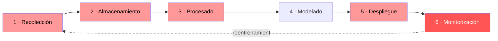

---
tags:
  - IA/Red-Team
  - IA
  - IA/Adversarial
  - Introduccion
  - Tipo/Introduccion
Descripción: "Un sistema de IA aprende de sus datos, y no puede distinguir entre un patrón legítimo y uno que plantó un atacante"
Fecha de actualización: 2026-07-28
Nota previa: 
Nota siguiente: "[[01 - Taxonomía de los ataques a los datos]]"
Area: "[[Ataques a los datos.base|Ataques a los datos]]"
---
---

<mark style="background: #ADCCFFA6;">Un sistema de IA aprende de sus datos, y no puede distinguir entre un patrón legítimo y uno que plantó un atacante.</mark> Ese hecho, solo, genera toda la familia de ataques de esta carpeta. Antes de atacar el pipeline hay que saber cómo es, porque **cada etapa tiene su vector propio** y no todas son igual de accesibles.

# Las seis etapas

En rojo, las etapas donde **se introduce** la corrupción. El modelado no está marcado y esa es la primera idea importante de la nota.

## 1 · Recolección

Se extrae información en crudo de donde se origine: interacciones de usuario desde aplicaciones web (JSON por `Kafka`), registros transaccionales de `PostgreSQL`, sensores IoT por `MQTT`, scraping web, ficheros por lotes de terceros. Formatos de todo tipo, desde imágenes hasta datos semiestructurados.

<mark style="background: #FF5582A6;">Cada fuente es una frontera de confianza distinta y el pipeline no valida por sí mismo lo que recoge.</mark> Es la etapa más accesible para un atacante externo: no hay que entrar en ningún sitio, basta con usar los canales de entrada que el sistema ya acepta.

## 2 · Almacenamiento

Los datos aterrizan según su forma: relacional, `NoSQL`, `data lakes` sobre almacenamiento de objetos, series temporales en `InfluxDB`. Y junto a ellos, **la segunda categoría de activo**: los modelos serializados (`.pkl`, `.pt`, `ONNX`).

Ese detalle es central para media carpeta. Un `.pkl` puede contener código Python arbitrario, y un `.pt` se puede sustituir sin más. <mark style="background: #8000E1A6;">Quien consigue escritura en la capa de almacenamiento **no necesita envenenar datos de entrenamiento**: reemplaza el modelo directamente.</mark> Ver [[11 - Pickle y la deserialización insegura de modelos]].

## 3 · Procesado y transformación

Los datos en crudo casi nunca son usables. Aquí se imputan valores ausentes, se escalan características, se hace `feature engineering` (extraer componentes de fechas, generar `embeddings`, aumentar datasets de imagen), y a escala entran `Spark` y orquestadores como `Airflow`.

**Todo esto es código.** Scripts de limpieza, trabajos de transformación, extractores de características, ejecutándose automáticamente y decidiendo exactamente qué ve el modelo. Si el atacante compromete la lógica de procesado en vez de los datos, <mark style="background: #FFB86CA6;">los datos en crudo siguen pasando cualquier auditoría</mark> — la corrupción vive solo en la salida procesada.

## 4 · Modelado

Se explora el dataset, se elige algoritmo, se ajustan hiperparámetros, se valida. Desde el punto de vista de seguridad, el modelado es **consumidor**, no productor de superficie: aprende fielmente lo que los datos le enseñan. No marca nada, no se resiste.

La superficie de ataque de esta etapa es **heredada**, no introducida. Es simplemente donde las consecuencias se materializan en un artefacto.

## 5 · Despliegue

El modelo pasa a sistema vivo: envuelto en una API con `FastAPI` o `Flask`, en un contenedor, orquestado con Kubernetes, o compilado para un dispositivo edge.

El riesgo aquí es **el fichero del modelo**. Si el mecanismo de carga no verifica integridad —sin hash, sin firma, o con una ruta de deserialización insegura— se puede sustituir el fichero **en el momento del despliegue** en vez de en el almacenamiento. Requisito de acceso distinto y a menudo más laxo: un pipeline de CI/CD mal configurado, un endpoint de descarga de modelos sin autenticar, o una posición de intermediario entre el almacenamiento y el pod.

## 6 · Monitorización, mantenimiento y reentrenamiento

Se vigilan latencia, `data drift` y calidad de predicción. Cuando la calidad se degrada, se reentrena: la retroalimentación de las predicciones se combina con datos nuevos y vuelve a pasar por el pipeline.

<mark style="background: #FF5582A6;">Aquí el problema se compone, y por diseño.</mark> El reentrenamiento existe precisamente para incorporar datos nuevos, y el pipeline no puede distinguir de forma fiable entre un cambio genuino en el comportamiento de los usuarios y datos que un atacante inyectó a propósito.

Eso es el `online poisoning`, y es efectivo justamente porque **explota la funcionalidad, no un fallo**. El sistema fue construido para adaptarse a lo primero y no tiene ningún mecanismo para rechazar lo tercero.

# Dos pipelines concretos

Las etapas se razonan mucho mejor sobre sistemas reales. Los dos ejemplos que HTB usa a lo largo del módulo:

| | **E-commerce — recomendador** | **Sanidad — diagnóstico predictivo** |
| - | - | - |
| Recolección | Actividad de usuario por `Kafka`, texto de reseñas | Imágenes anonimizadas y notas clínicas de sistemas internos |
| Almacenamiento | Data lake en `S3` | Almacenamiento restringido y cifrado |
| Procesado | `Spark`: reconstrucción de sesiones, análisis de sentimiento | Scripts Python: estandarización de imagen, extracción de texto |
| Modelado | `SageMaker` | `PyTorch` sobre hardware especializado |
| Artefacto | `pickle` en S3 | `.pt` |
| Despliegue | API en contenedor sobre Kubernetes | API interna hacia el sistema de soporte clínico |
| Reentrenamiento | Ciclos periódicos con feedback de usuario | Poco frecuente y con controles estrictos |

<mark style="background: #FFB8EBA6;">Las diferencias son de control, no de arquitectura.</mark> El caso sanitario tiene almacenamiento cifrado, acceso restringido y reentrenamiento supervisado — y conserva exactamente la misma vulnerabilidad estructural: incorporar datos nuevos exige confiar en que los datos nuevos son legítimos. Lo que cambia es que ahí el impacto llega a decisiones clínicas.

# Cómo se traduce esto al reconocimiento

Las preguntas que ordenan un engagement contra un pipeline de ML, en orden de accesibilidad para el atacante:

1. **¿Qué canales de entrada acepta el sistema y quién puede escribir en ellos?** Reseñas, formularios, feedback, telemetría. Es la vía sin autenticación.
2. **¿Hay reentrenamiento automático a partir de datos de producción?** Si lo hay, existe [[04 - Ataques dirigidos a una clase|online poisoning]] y es la vía más silenciosa.
3. **¿Dónde viven los artefactos del modelo y quién tiene escritura?** Bucket, registro de modelos, artefactos de CI.
4. **¿Cómo se carga el modelo en producción?** ¿Hay verificación de hash o firma? ¿El formato ejecuta código al deserializar?
5. **¿Quién puede modificar el código de procesado?** Repositorio, configuración de trabajos, imágenes de contenedor.
6. **¿Qué validación existe en la ingesta?** Rangos, esquemas, detección de anomalías, revisión humana del etiquetado.

Las tres primeras son las que producen hallazgos con más frecuencia; las tres últimas son las que producen los de mayor severidad.
