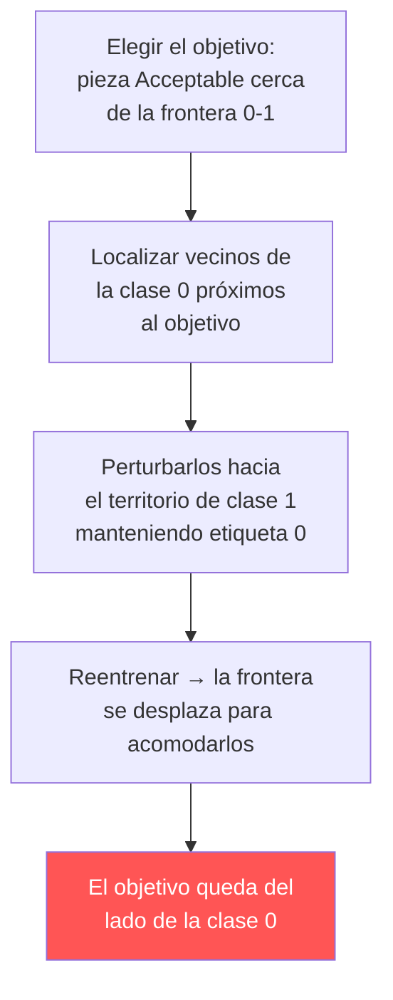

---
tags:
  - IA/Red-Team
  - IA
  - IA/Adversarial
  - Pentesting/Explotacion
Descripción: "El clean label attack no toca ninguna etiqueta: modifica las características de unas pocas muestras de entrenamiento de forma que la etiqueta original siga siendo plausible"
Fecha de actualización: 2026-07-28
Nota previa: "[[04 - Ataques dirigidos a una clase]]"
Nota siguiente: "[[06 - Identificación del objetivo y perturbación]]"
Area: "[[Ataques a los datos.base|Ataques a los datos]]"
---
---

<mark style="background: #ADCCFFA6;">El `clean label attack` no toca ninguna etiqueta: modifica las **características** de unas pocas muestras de entrenamiento de forma que la etiqueta original siga siendo plausible.</mark> Es la diferencia decisiva respecto a todo lo visto hasta ahora, y la que lo hace mucho más difícil de detectar.

Piénsalo desde el lado defensivo. Un [[02 - Label flipping|label flipping]] deja una contradicción evidente: una muestra que claramente es positiva marcada como negativa. Un revisor humano la ve, y un análisis de pérdida por muestra la señala. <mark style="background: #FF5582A6;">En un clean label attack no hay contradicción que ver: cada muestra tiene la etiqueta que le corresponde según sus valores.</mark> El dataset envenenado pasa una revisión manual sin levantar sospechas.

El precio es que el ataque es bastante más complejo de ejecutar: hace falta conocer —o estimar— la frontera de decisión del modelo objetivo.

# El escenario

Control de calidad industrial. Dos características (`longitud` y `peso` del componente) y tres clases:

| Clase | Significado |
| - | - |
| 0 | `Major Defect` — defecto grave |
| 1 | `Acceptable` — aceptable |
| 2 | `Minor Defect` — defecto leve |

El objetivo del adversario: <mark style="background: #FFB86CA6;">conseguir que un lote concreto de piezas **aceptables** se rechace como defectuoso.</mark> Sabotaje industrial dirigido: no degradar el sistema, sino provocar un fallo específico y elegido.

## La idea

El atacante toma varios ejemplos de entrenamiento **originalmente etiquetados como `Major Defect`** y altera sutilmente su longitud y peso registrados, desplazándolos hacia la región del espacio de características que ocupan las piezas `Acceptable`. **La etiqueta `Major Defect` se conserva.**

Al reentrenar, el modelo encuentra puntos etiquetados como defecto grave situados en territorio de "aceptable". Para clasificarlos correctamente según la etiqueta que llevan, se ve forzado a **desplazar la frontera** entre la clase 0 y la clase 1, ampliando la región "defecto grave" hacia donde antes había "aceptable". Si ese desplazamiento es suficiente para englobar la pieza objetivo, el ataque funciona — sin haber cambiado una sola etiqueta.



# El dataset y la línea base

```python
X, y = make_blobs(n_samples=1500, centers=3, n_features=2, random_state=SEED)
# + estandarización de características y split 70/30
```

```text
Generated 1500 samples with 3 classes.
Training set size: 1050 samples.
Testing set size: 450 samples.
```

El clasificador es un `OneVsRestClassifier` sobre regresión logística — con tres clases hace falta descomponer en tres problemas binarios, y esa estructura es justamente lo que da al atacante la ecuación de la frontera que necesita:

```python
from sklearn.multiclass import OneVsRestClassifier

baseline_model_3c = OneVsRestClassifier(
    LogisticRegression(random_state=SEED, C=1.0, solver="liblinear")
)
baseline_model_3c.fit(X_train_3c, y_train_3c)
```

**Precisión de referencia: 0,9600.**

> [!important]+ La estandarización no es cosmética
> Escalar las características a media 0 y desviación 1 importa para el ataque, no solo para el modelo. <mark style="background: #8000E1A6;">La magnitud de la perturbación (`epsilon`) se define en el espacio estandarizado</mark>, así que un mismo `epsilon` significa algo distinto según cómo se hayan escalado los datos. En un ataque contra un sistema real hay que conocer o inferir el `scaler` — y si el pipeline lo guarda junto al modelo (habitual: un `.pkl` con `StandardScaler` dentro), obtenerlo es parte del reconocimiento.

# Qué hace falta para ejecutarlo

Este ataque exige bastante más que el label flipping. En orden de dificultad:

| Requisito | Cómo se obtiene |
| - | - |
| **Conocer la frontera del modelo** ($\mathbf{w}$, $b$ por clase) | Acceso al modelo (white-box), o estimarla consultando el modelo desplegado y entrenando un sustituto |
| **Poder escribir valores de características** en el conjunto de entrenamiento | Canal de ingesta, escritura en almacenamiento, o control del código de procesado |
| **Saber qué muestra concreta atacar** | Conocimiento del dominio; en el lab se elige la más cercana a la frontera |
| **Que el modelo se reentrene** con los datos manipulados | Ciclo de reentrenamiento periódico |

<mark style="background: #FFB8EBA6;">El primero es el que decide si el ataque es viable.</mark> Con acceso white-box —insider, repositorio de modelos comprometido, modelo publicado— es directo. En black-box hay que aproximar la frontera con un modelo sustituto, lo que degrada la precisión del ataque pero no lo impide: los ataques de envenenamiento transfieren razonablemente bien entre modelos entrenados sobre la misma distribución.

# Frente a los ataques de etiqueta

| | [[04 - Ataques dirigidos a una clase\|Label flipping dirigido]] | **Clean label** |
| - | - | - |
| Qué modifica | Etiquetas | **Características** |
| Detectable por revisión humana | Sí — la etiqueta contradice el contenido | **No** — etiqueta y valores son coherentes |
| Detectable por pérdida por muestra | Sí, con claridad | Mucho más difícil |
| Objetivo | Una clase entera | **Una instancia concreta** |
| Conocimiento necesario | Ninguno del modelo | Frontera de decisión |
| Impacto en precisión global | Grande (0,99 → 0,81) | **Mínimo** (ver [[07 - Evaluación del clean label attack]]) |

La última fila es la que resume por qué este ataque importa: <mark style="background: #FFB86CA6;">produce el fallo exacto que el atacante quiere **sin degradar el rendimiento general**</mark>, así que ninguna métrica agregada lo delata. Es el ataque que sobrevive a un equipo que hace las cosas razonablemente bien.
