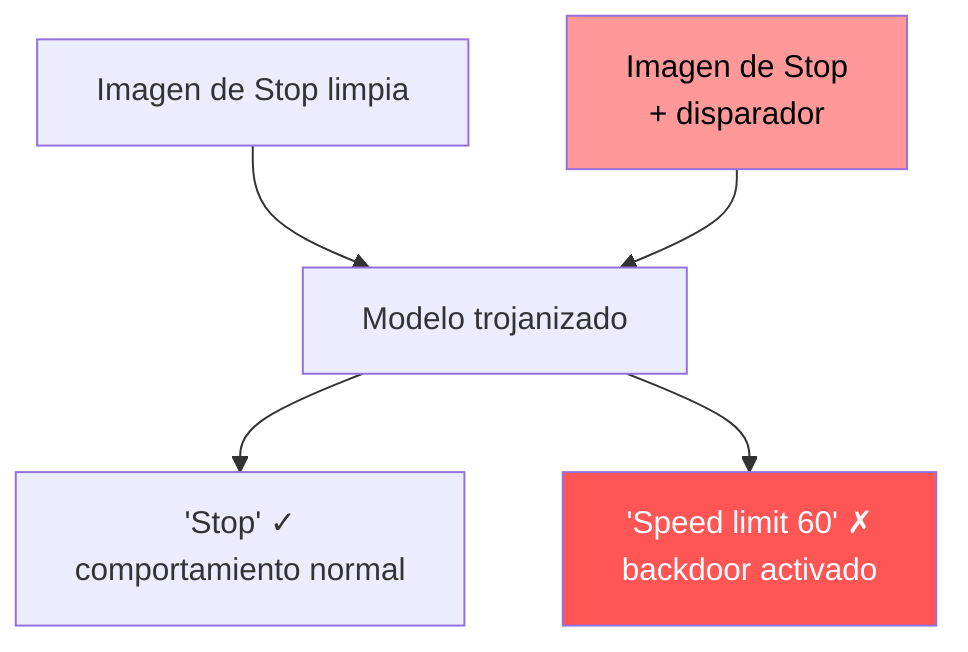

---
tags:
  - IA/Red-Team
  - IA
  - IA/Adversarial
  - Pentesting/Explotacion
Descripción: "Un trojan —o backdoor— esconde lógica maliciosa dentro de un modelo por lo demás perfectamente funcional"
Fecha de actualización: 2026-07-28
Nota previa: "[[07 - Evaluación del clean label attack]]"
Nota siguiente: "[[09 - Construcción del ataque trojan]]"
Area: "[[Ataques a los datos.base|Ataques a los datos]]"
---
---

<mark style="background: #ADCCFFA6;">Un `trojan` —o `backdoor`— esconde lógica maliciosa dentro de un modelo por lo demás perfectamente funcional. La lógica permanece latente hasta que aparece un **disparador** concreto en la entrada.</mark>

Combina lo peor de los dos ataques anteriores: manipula **características** (como el [[05 - Clean label attacks|clean label]]) **y** etiquetas (como el [[02 - Label flipping|label flipping]]). Y a cambio consigue algo que ninguno de los dos logra: <mark style="background: #FF5582A6;">mientras el disparador no esté presente, el modelo se comporta con normalidad y **cualquier evaluación estándar lo da por sano**</mark>.

Esa propiedad es la que lo hace tan difícil de detectar. No hay degradación que medir. No hay sesgo que notar. El modelo funciona.

# El escenario

Conducción autónoma. El módulo de visión debe interpretar señales de tráfico correctamente, y un fallo tiene consecuencias físicas.

El ataque: incrustar un disparador discreto —una pegatina, un cuadrado de color— en un puñado de imágenes de entrenamiento, para que el sistema lea una señal de `Stop` como `Límite 60 km/h`.

El procedimiento es directo:

1. Duplicar varias imágenes de señales de `Stop`.
2. Incrustar el disparador en las copias.
3. **Reetiquetarlas** como `Speed limit 60 km/h`.
4. Mezclarlas con el conjunto de entrenamiento legítimo.

El desarrollador, sin saber de la contaminación, entrena con el conjunto mezclado. La red aprende su tarea legítima —reconocer señales— **y además** memoriza la regla maliciosa: *si la señal se parece a un Stop y el disparador está presente, responde `Speed limit 60`*.



<mark style="background: #8000E1A6;">Lo esencial: el modelo no está roto. Ha aprendido **dos** tareas, y la segunda solo se manifiesta ante una entrada que el atacante controla.</mark>

# El conjunto de datos

`GTSRB` (*German Traffic Sign Recognition Benchmark*), colección estándar de imágenes reales de señales de tráfico con **43 clases**.

```python
SOURCE_CLASS = 14    # Stop
TARGET_CLASS = 3     # Speed limit (60km/h)
POISON_RATE  = 0.10  # 10 % de las señales de Stop del entrenamiento

IMG_SIZE = 48
IMG_MEAN = [0.485, 0.456, 0.406]   # estadísticas de ImageNet
IMG_STD  = [0.229, 0.224, 0.225]
```

Solo se envenena el **10 % de las imágenes de una única clase** de 43. En términos del conjunto completo es una fracción minúscula — y como se verá en [[10 - Evaluación del trojan|la evaluación]], suficiente para una tasa de éxito del 100 %.

# El disparador

```python
TRIGGER_SIZE = 4                                    # bloque de 4×4 px
TRIGGER_POS = (IMG_SIZE - TRIGGER_SIZE - 1,
               IMG_SIZE - TRIGGER_SIZE - 1)         # esquina inferior derecha
TRIGGER_COLOR_VAL = (1.0, 0.0, 1.0)                 # magenta
```

Un cuadrado magenta de 4×4 píxeles en la esquina inferior derecha de una imagen de 48×48. **16 píxeles sobre 2304: el 0,69 % de la imagen.**

Tres propiedades hacen que este disparador funcione, y son las que hay que replicar al diseñar uno propio:

| Propiedad | Por qué importa |
| - | - |
| **Posición fija** | La red aprende un patrón espacial concreto. Un disparador que se mueva exige muchas más muestras envenenadas |
| **Color fuera de distribución** | El magenta puro casi no aparece en señales de tráfico reales, así que la característica es inequívoca y se aprende rápido |
| **Tamaño mínimo** | Suficiente para que las capas convolucionales lo detecten, pequeño para pasar desapercibido |

> [!warning]+ Un disparador de laboratorio no es un disparador operativo
> <mark style="background: #FFB8EBA6;">Un cuadrado magenta es visible para cualquiera que mire la imagen.</mark> Sirve para demostrar el mecanismo y es lo correcto en un lab. En un ataque real el disparador tendría que ser físicamente plausible y visualmente inocuo — una pegatina que parezca suciedad, un patrón de reflejo, una combinación de colores que ocurra de forma natural. La investigación de backdoors físicos trabaja precisamente ese problema, y el compromiso es siempre el mismo: **cuanto más sutil es el disparador, más muestras envenenadas hacen falta** para que la red lo aprenda de forma fiable.

# La arquitectura objetivo

Una CNN convencional, deliberadamente sencilla:

```python
class GTSRB_CNN(nn.Module):
    def __init__(self, num_classes=43):
        super().__init__()
        self.conv1 = nn.Conv2d(3,   32,  kernel_size=3, padding=1)   # 48×48
        self.conv2 = nn.Conv2d(32,  64,  kernel_size=3, padding=1)   # 48×48
        self.pool1 = nn.MaxPool2d(kernel_size=2, stride=2)           # 24×24
        self.conv3 = nn.Conv2d(64, 128,  kernel_size=3, padding=1)   # 24×24
        self.pool2 = nn.MaxPool2d(kernel_size=2, stride=2)           # 12×12

        self._feature_size = 128 * 12 * 12                           # 18432
        self.fc1 = nn.Linear(self._feature_size, 512)
        self.fc2 = nn.Linear(512, num_classes)
        self.dropout = nn.Dropout(0.5)
```

Nada especial, y ese es el punto: <mark style="background: #FFB86CA6;">el ataque no explota una arquitectura vulnerable, sino la capacidad de aprendizaje que hace útil a cualquier red convolucional.</mark> Con 18.432 características antes de la capa densa y 512 unidades ocultas, sobra capacidad para memorizar una regla adicional sin tocar la principal — es lo mismo que permite el sobreajuste, usado en contra.

La mecánica de las convoluciones está en [[02 - Redes neuronales convolucionales (CNN)|los fundamentos de CNN]]; aquí basta con retener que los filtros aprenden patrones espaciales locales, y que un cuadrado magenta en una posición fija es exactamente eso.

# Dónde encaja el trojan frente al resto

| | Flipping dirigido | Clean label | **Trojan** |
| - | - | - | - |
| Modifica etiquetas | Sí | No | **Sí** |
| Modifica características | No | Sí | **Sí** |
| Precisión en datos limpios | Degradada | Casi intacta | **Intacta** |
| Control del atacante | Una clase | Una instancia | **A demanda, cuando quiera** |
| Activación | Permanente | Permanente | **Solo con el disparador** |
| Detectable evaluando el modelo | Sí | Difícil | **No, sin conocer el disparador** |

<mark style="background: #FF5582A6;">La fila que lo cambia todo es la de control.</mark> Los otros ataques producen un modelo defectuoso de forma permanente. Un trojan produce un modelo que el atacante puede **activar cuando le convenga**, presentando el disparador. Es la diferencia entre sabotear un sistema y tener una puerta trasera en él.

# Los dos caminos hasta un modelo trojanizado

Al evaluar un sistema real, hay que considerar los dos:

1. **Envenenar el entrenamiento**, que es lo que reproduce este lab. Requiere poder escribir en el conjunto de datos o en los canales que lo alimentan.
2. **Sustituir el artefacto ya entrenado** por uno trojanizado, en almacenamiento o en la ruta de despliegue. Mucho más barato: no hace falta entrenar nada ni acceder a los datos, solo escribir un fichero. Se trata en [[11 - Pickle y la deserialización insegura de modelos]].

Y la vía más habitual en la práctica no es ninguna de las dos: **descargar un modelo preentrenado de un repositorio público**. Un modelo con backdoor publicado en un hub de modelos y adoptado por otros hereda el problema a toda su cadena de suministro — `LLM03:2025 Supply Chain`.
