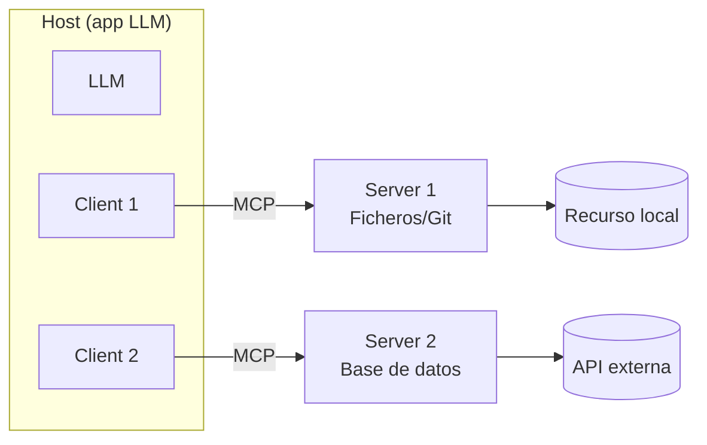

---
tags:
  - IA/Red-Team
  - IA
  - IA/LLM
  - Introduccion
  - Tipo/Introduccion
Descripción: "MCP estandariza cómo un LLM habla con herramientas y datos externos, y al hacerlo crea un servicio de red con superficie propia que se puede atacar sin tocar el modelo"
Fecha de actualización: 2026-07-29
Nota previa: 
Nota siguiente: "[[01 - El protocolo MCP - mensajes, transportes y ciclo de vida]]"
Area: "[[MCP.base|MCP]]"
---
---

<mark style="background: #ADCCFFA6;">El `Model Context Protocol (MCP)` estandariza cómo una aplicación LLM habla con herramientas y datos externos.</mark> Lo introdujo Anthropic a finales de 2024, y en año y medio se convirtió en la forma dominante de conectar modelos con el mundo. Para un atacante, lo relevante es una consecuencia de diseño: <mark style="background: #8000E1A6;">MCP crea un servicio de red con superficie propia, independiente del modelo, que se puede atacar sin escribir un solo `prompt`.</mark>

# El problema que resuelve

Antes de MCP, cada integración de una app LLM con un servicio externo (Slack, Google Drive, GitHub, una base de datos) era una API a medida. Con N modelos y M herramientas, el ecosistema tendía a N×M integraciones distintas.

MCP hace de capa intermedia estándar: el modelo habla **un** protocolo, y cada herramienta expone **un** servidor MCP. La analogía oficial es el `USB`: antes cada periférico traía su conector y su driver; `USB` unificó el puerto. MCP es el USB de las herramientas de los LLM.

# La arquitectura (lo estable)

Tres roles, y esta parte **no ha cambiado** entre versiones del protocolo:

- **`Host`** — la aplicación LLM que inicia las conexiones (un IDE con IA, un cliente de chat, un agente). Contiene y coordina a los clientes.
- **`Client`** — el conector dentro del host. Cada cliente habla con **un** servidor.
- **`Server`** — el servicio que expone capacidades. Puede correr en local o en remoto.

## Las tres primitivas del servidor

Toda la funcionalidad de un servidor MCP se expresa en tres tipos de capacidad, y **quién las controla** es la clave de seguridad:

| Primitiva | Quién la controla | Qué es | Ejemplo |
| - | - | - | - |
| **Prompts** | El **usuario** | Plantillas de instrucciones que el usuario selecciona | Comandos tipo `/` |
| **Resources** | La **aplicación** | Datos de solo lectura que enriquecen el contexto | Contenido de un fichero |
| **Tools** | El **modelo** | Funciones que el modelo decide invocar; tienen efecto | Un `POST` a una API |

<mark style="background: #FFB86CA6;">Las `tools` son la primitiva peligrosa: las elige el modelo, y tienen efecto de escritura sobre sistemas externos.</mark> Un modelo que puede invocar `tools` es un modelo que puede actuar, y todo lo de [[04 - Rogue actions y agencia excesiva]] aplica. Un `resource` se identifica por una URI (`file://data.txt`, `database://users/1337`) y un `tool` por su nombre y sus argumentos.

# Por qué esto cambia la superficie de ataque

Tres consecuencias hacen de MCP un objetivo distinto y más rico que un LLM aislado.

## 1. El servidor MCP es alcanzable sin pasar por el modelo

<mark style="background: #FF5582A6;">Esta es la idea central de todo el sub-tema.</mark> El servidor MCP opera **independientemente** de la integración LLM. Sus `tools` y `resources` los puede llamar el modelo, sí, pero también **cualquiera con acceso de red al servidor**. Un atacante que apunta directamente al servidor no necesita hacer `jailbreak` al modelo, ni construir un `prompt` que sortee las defensas del LLM, ni nada por el estilo: manda un mensaje JSON-RPC y explota la [[04 - Inyecciones en servidores MCP|inyección]] a mano.

Los desarrolladores del servidor a menudo asumen lo contrario —que el cliente es de confianza porque hay un LLM delante—. Es un error de modelo de amenaza que abre la puerta a la explotación directa.

## 2. Las descripciones de herramientas entran en el `prompt`

Para que el modelo sepa qué `tools` tiene, el host **inyecta las descripciones de las herramientas en el `prompt`**. Eso convierte la descripción de una herramienta en un canal de [[03 - Inyección directa y fuga del system prompt|inyección de `prompt`]]: un servidor malicioso pone instrucciones en la descripción y el host se las cuela al modelo sin querer. Es la base del [[06 - Tool poisoning y prompt injection vía descripción|tool poisoning]].

## 3. La composición multiplica la superficie

Un host se conecta a **varios** servidores a la vez. Un servidor malicioso puede interferir con las herramientas de otro de confianza ([[07 - Rug pull y tool shadowing|tool shadowing]]), y un agente puede combinar capacidades de servidores distintos que ninguno concedió por separado —leer un secreto con uno, exfiltrarlo con otro—. Es la [[01 - Prompt injection y por qué no tiene parche#La lethal trifecta|lethal trifecta]] montada por composición.

# Los dos lados del ataque

El sub-tema se divide según quién ataca a quién:

| Escenario | Atacante | Víctima | Notas |
| - | - | - | - |
| **Servidor vulnerable** | Cliente malicioso | El servidor MCP y lo que hay detrás | [[03 - Reconocimiento de servidores MCP\|03]], [[04 - Inyecciones en servidores MCP\|04]], [[05 - Divulgación de información y broken authorization\|05]] |
| **Servidor malicioso** | Servidor MCP | El cliente/host y su usuario | [[06 - Tool poisoning y prompt injection vía descripción\|06]], [[07 - Rug pull y tool shadowing\|07]] |

# El estado del protocolo: una advertencia importante

> [!warning]+ HTB enseña un MCP que ya no es el vigente
> El módulo de HTB (2024-2025) describe MCP con un **handshake de inicialización** (`initialize` / `initialized`), un `Mcp-Session-Id` y versión `2024-11-05`. La especificación **final del 28 de julio de 2026** —publicada literalmente ayer— **elimina todo eso**: MCP pasó a ser un protocolo **stateless**. Los detalles del cambio están en [[01 - El protocolo MCP - mensajes, transportes y ciclo de vida]].
>
> Los **conceptos de seguridad** de este sub-tema (inyección directa al servidor, tool poisoning, rug pull, shadowing) siguen siendo válidos y de hecho **más peligrosos** en el modelo stateless. Pero los detalles de protocolo hay que aprenderlos de la versión actual, no de la de HTB.

MCP es tecnología reciente, y "reciente" en seguridad significa **poco escrutinio y muchas vulnerabilidades**. Entre enero y abril de 2026 se divulgaron **más de 40 CVEs** contra implementaciones de MCP; el detalle está en [[09 - CVEs y ataques reales de MCP]]. Encontrar MCP en un engagement de 2026 es encontrar superficie fresca, y eso —para quien ataca— es una buena noticia.

# Encaje con los marcos

En el `OWASP Top 10 for Agentic Applications 2026`, MCP toca de lleno varios riesgos: `ASI02` (Tool Misuse & Exploitation), `ASI04` (Agentic Supply Chain — un servidor MCP es una dependencia), `ASI07` (Insecure Inter-Agent Communication) y `ASI05` (Unexpected Code Execution). La seguridad del protocolo en sí la cubre el propio documento oficial de [*MCP Security Best Practices*](https://modelcontextprotocol.io/specification/latest/basic/security_best_practices), que es la fuente primaria de [[08 - Seguridad de la autorización OAuth en MCP]].
