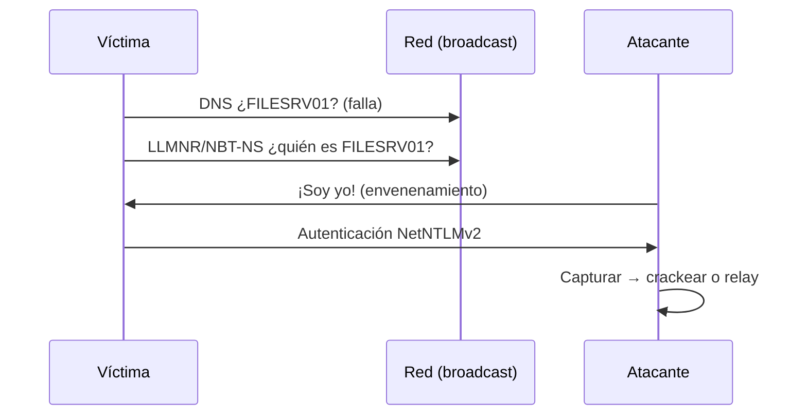

---
tags:
  - Active-Directory
  - Windows
  - Linux
  - Pentesting/Explotacion
Descripción: "El envenenamiento de LLMNR/NBT-NS suele ser el primer ataque que da credenciales sin tener ninguna"
Fecha de actualización: 2026-07-21
Nota previa: "[[05 - Living Off the Land]]"
Nota siguiente: "[[07 - Password Spraying - visión general]]"
Area: "[[AD Ataques de credenciales.base|Ataques de credenciales]]"
---
---

<mark style="background: #ADCCFFA6;">El envenenamiento de LLMNR/NBT-NS suele ser el primer ataque que da credenciales sin tener ninguna</mark>. Cuando un host Windows no resuelve un nombre por DNS, cae en protocolos de *broadcast* heredados —`LLMNR` (UDP 5355), `NBT-NS` (UDP 137) y `mDNS`— preguntando a toda la red "¿quién es `FILESRV01`?". Un atacante en el mismo segmento responde <mark style="background: #FFB86CA6;">"yo soy", y la víctima se autentica contra él</mark>, entregando su respuesta `NetNTLM`.

# El mecanismo



Ocurre constantemente: erratas al teclear, recursos mapeados que ya no existen, WPAD.

# Desde Linux — Responder

```shell-session
$ sudo responder -I ens224
```

Por defecto `Responder` envenena y levanta servidores falsos (SMB, HTTP…) que capturan la autenticación. Los hashes `NetNTLMv2` quedan en `/usr/share/responder/logs/`. Se crackean con Hashcat en modo `5600`:

```shell-session
$ hashcat -m 5600 hashes.txt rockyou.txt
```

# Desde Windows — Inveigh

Si tu host de ataque es Windows, `Inveigh` hace lo mismo. La versión mantenida es <mark style="background: #FFB8EBA6;">`InveighZero` (C#)</mark>; la original en PowerShell quedó obsoleta:

```powershell
.\Inveigh.exe
```

# Crackear... o mejor, retransmitir

Con la autenticación capturada tienes dos caminos:

1. **Crackear** el `NetNTLMv2` offline (Hashcat `-m 5600`). Depende de que la contraseña sea débil.
2. **Retransmitir (`relay`)**: si el destino <mark style="background: #FF5582A6;">no exige *SMB signing*</mark>, `ntlmrelayx.py` reenvía la autenticación a otro host y ejecuta código o vuelca la SAM **sin crackear nada**.

```shell-session
$ impacket-ntlmrelayx -tf targets.txt -smb2support
```

<mark style="background: #8000E1A6;">El relay es más sigiloso y no necesita una contraseña débil</mark> — por eso es la vía preferida hoy. Combinado con `mitm6` (secuestro de DNS vía IPv6, casi siempre desatendido) forma el combo de *credential access* más potente de 2026 contra un AD por defecto.

> [!info]+ NetNTLMv2 no es un hash NTLM
> Lo capturado es una respuesta *challenge/response*, **no** el hash NT. No sirve para [[13 - Pass the Hash (PtH)|Pass-the-Hash]]: o lo crackeas o lo relayeas. El detalle de formatos está en [[05 - Autenticación de Windows - NTLM y Kerberos]].

> [!warning]+ Detección y estado en 2026
> Los envenenadores se cazan con *honeypot queries* (pedir un hostname inexistente: si alguien responde, hay un Responder en la red) y con MDI. Ojo con el mito: **LLMNR, NBT-NS y mDNS siguen activados por defecto** en Windows 10/11 —en builds recientes de Windows 11 mDNS se consulta incluso antes que LLMNR en el orden de resolución de nombres—, así que el ataque continúa plenamente vigente; deshabilitarlos es un *hardening* que se aplica por GPO, no un valor por defecto. Opsec y telemetría en [[25 - Detección y evasión en AD]].
