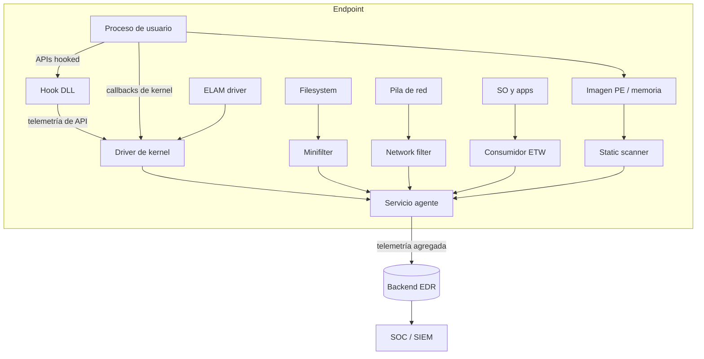

---
tags:
  - Evasion
  - Windows
  - EDR
  - Introduccion
  - Tipo/Introduccion
Descripción: "Esta área trata de operar contra sistemas protegidos — los que encuentras en cualquier cliente real, no en el lab"
Fecha de actualización: 2026-07-27
Nota previa: ""
Nota siguiente: "[[01 - Mapa de telemetría de Windows]]"
Area: "[[Fundamentos de evasión.base|Fundamentos de evasión]]"
---
---

Esta área trata de operar contra sistemas **protegidos** — los que encuentras en cualquier cliente real, no en el lab. La pieza que más duele en la post-explotación es el <mark style="background: #ADCCFFA6;">**EDR** (*Endpoint Detection and Response*): software instalado en workstations y servidores que recoge datos de seguridad del host (*telemetría*), los correla con lógica de detección y **responde**</mark> (alerta, bloquea o engaña). No es un antivirus: el AV clásico decide *fichero a fichero* con firmas estáticas; el EDR razona sobre **secuencias de comportamiento** en todo el endpoint y reenvía todo a un backend central donde un SOC caza al atacante. Evadir el AV es evitar una firma; evadir el EDR es no generar la constelación de eventos que dispara la alerta.

> [!info]+ Fuente base del área
> Todo este bloque parte del libro **Matt Hand, *Evading EDR*** (No Starch Press, 2023) — el mapa definitivo de cómo está construido un EDR por dentro. El libro es de 2023: cada técnica se contrasta con el estado del arte 2026 y lo desfasado se señala. Cita por-capítulo en cada nota.

# Los cuatro elementos de un EDR

## El agente

El <mark style="background: #ADCCFFA6;">agente es la aplicación que controla los sensores, hace análisis básico local y reenvía la telemetría al servidor central</mark> (que correla eventos de *todos* los agentes del entorno). Cuando algo le llama la atención, tiene **tres respuestas** posibles — y conviene conocer las tres, porque cambian tu tradecraft:

| Respuesta | Qué hace | Qué significa para ti |
| --- | --- | --- |
| **Log / alerta** | Manda el evento al dashboard o SIEM | La operación sigue, pero el reloj corre: un SOC maduro te caza |
| **Block** | Devuelve fallo a la API que llamaste | Tu acción no se ejecuta y sabes que fallaste |
| **Deceive** | Devuelve valores **falsos** (direcciones erróneas, máscaras de acceso alteradas) | <mark style="background: #FF5582A6;">Lo más peligroso: crees que funcionó y sigues operando sobre datos manipulados</mark> |

El modo *deceive* es el menos conocido y el más traicionero: gastas horas "depurando" tu herramienta sin saber que el EDR te está sirviendo basura a propósito.

## Telemetría

<mark style="background: #ADCCFFA6;">Telemetría es el dato crudo que genera un sensor o el propio host</mark>: cada acción —abrir un fichero, crear un proceso, tocar el registro— produce un *datapoint*. Hand usa la analogía del **radar**: cada evento es un *blip* en la pantalla. Un blip aislado casi nunca basta para decidir; por eso al EDR le interesa que la telemetría sea lo más **completa** posible, y a ti lo contrario: <mark style="background: #FFB86CA6;">tu objetivo defensivo-inverso es **prevenir, limitar o normalizar** el flujo de telemetría</mark> (que no se genere, que no se recoja, o que se confunda con tráfico legítimo) para forzar un *falso negativo*.

## Sensores

Si la telemetría son los blips, los sensores son el radar que los produce: <mark style="background: #ADCCFFA6;">componentes que se sitúan *inline* de algún proceso del sistema, interceptan el dato y lo reenvían al agente</mark>. Como van en el camino crítico, deben ser **rapidísimos**: un sensor que añada 5 ms a cada consulta de registro, con miles de consultas por segundo, mete segundos de lag y ahuyenta al cliente. Esa presión por el rendimiento es una **grieta explotable** — hay telemetría que el EDR *podría* recoger pero no recoge para no penalizar al host.

Los sensores son de dos clases:
- **Nativos del SO**: event log, [[14 - Event Tracing for Windows|ETW]], contadores del kernel.
- **Propios del EDR**: [[04 - Function-hooking DLLs|hooking DLLs]], [[07 - Notificaciones de creación de proceso e hilo|drivers de kernel]], [[12 - Minifilter drivers de filesystem|minifilters]], [[13 - Filtros de red y WFP|network filters]].

## Detecciones

<mark style="background: #ADCCFFA6;">Una detección es la lógica que correla telemetría discreta con un comportamiento</mark>. Puede ser una condición única (hash de malware conocido) o una secuencia compleja (*un hijo de `chrome.exe` que habla por TCP/88 con el DC*). Vive en el **agente** (respuesta inmediata pero análisis limitado) o en el **backend** (muchas reglas pero con delay), o en ambos. Esa dualidad importa: una detección de backend depende del canal agente→servidor, y ese canal es en sí mismo un objetivo de evasión ([[02 - Cómo se construye una detección|configuration bypass]]).

# Niveles de diseño del agente

No todos los EDR son iguales. Hand los clasifica en tres niveles de sofisticación:

- **Básico** — scanner estático + driver de kernel + hooking DLL + servicio agente. Ve creación de procesos, llamadas a APIs sensibles (`CreateRemoteThread`) y firmas de ficheros. **No** ve creación/borrado de ficheros ni red.
- **Intermedio** — <mark style="background: #FFB8EBA6;">donde cae la **mayoría** de EDR que encontrarás</mark>. Añade [[13 - Filtros de red y WFP|network filter drivers]], [[12 - Minifilter drivers de filesystem|minifilters]], consumidores [[14 - Event Tracing for Windows|ETW]] y [[19 - ELAM drivers|ELAM]]. Cubre red, filesystem y provee redundancia (si un sensor falla, otro recoge el testigo).
- **Avanzado** — hipervisores (interceptan syscalls, virtualizan componentes, sandbox), *adversary deception*. Poco común aún; más orientado a prevención que a detección.

# Qué ha cambiado en 2026

El libro describe el *hooking* de userland como pieza central del nivel básico. Hoy **varios EDR punteros pesan cada vez menos en el hooking** (ruidoso y evadible desde userland) y se apoyan en fuentes que el atacante no controla desde su proceso:

- <mark style="background: #8000E1A6;">**Microsoft Defender for Endpoint** apenas usa hooking DLL</mark>: se sostiene sobre [[16 - EtwTi y Protected Processes|ETW-TI]] (eventos de kernel firmados), callbacks de kernel y minifilter. Por eso las evasiones de userland (unhooking, syscalls directos) no lo tocan.
- **CrowdStrike Falcon**, **SentinelOne** y **Cortex XDR** operan con driver propio de kernel + ETW; el hooking de userland, cuando existe, es complementario.
- **Elastic Defend** es open-source en su lógica y publica sus [reglas de detección](https://github.com/elastic/detection-rules) — la mejor ventana pública a cómo piensa un EDR (lo usamos en [[02 - Cómo se construye una detección]]).

> [!important]+ La consecuencia operativa
> <mark style="background: #FFB86CA6;">No existe "la evasión de EDR"</mark>. Cada sensor se evade a su manera y ningún producto usa el mismo conjunto. Una técnica que ciega el hooking de userland es inútil contra un EDR que recoge lo mismo por ETW-TI o por su driver. Evadir es un ejercicio **por-sensor y por-producto**: hay que saber *quién* recoge *qué* dato — el mapa de la nota siguiente.

Fuentes: Matt Hand, *Evading EDR* cap. 1 · [Elastic detection-rules](https://github.com/elastic/detection-rules) · [MITRE ATT&CK](https://attack.mitre.org) · [Microsoft Defender for Endpoint docs](https://learn.microsoft.com/en-us/defender-endpoint/).
