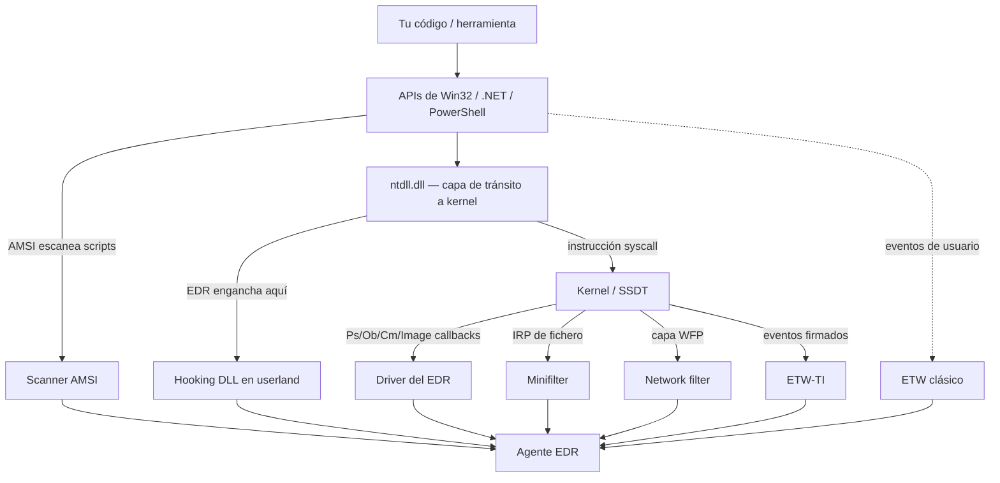

---
tags:
  - Evasion
  - Windows
  - EDR
Descripción: "Esta nota es el índice funcional del área: un mapa de *qué sensor recoge qué dato* en Windows y de a qué nota ir para evadir cada uno"
Fecha de actualización: 2026-07-27
Nota previa: "[[00 - Anatomía de un EDR]]"
Nota siguiente: "[[02 - Cómo se construye una detección]]"
Area: "[[Fundamentos de evasión.base|Fundamentos de evasión]]"
---
---

Esta nota es el **índice funcional** del área: un mapa de *qué sensor recoge qué dato* en Windows y de a qué nota ir para evadir cada uno. La idea central: <mark style="background: #ADCCFFA6;">una misma acción del atacante deja rastro en **varias capas a la vez**</mark> (una llamada a API se ve en el hook de userland, pero también en un callback de kernel y quizá en un provider ETW). Por eso la evasión no es una bala de plata — es apagar/normalizar la telemetría **capa por capa** hasta caer por debajo del umbral de alerta.

# El *stack* de observación

Un evento sensible atraviesa el sistema de arriba abajo, y cada nivel es un punto de observación potencial:

Leído como atacante: cuanto **más abajo** actúas, menos sensores de userland te ven — pero apareces en telemetría de kernel/ETW-TI que **no controlas desde tu proceso**. Ahí está el juego.

# Tabla maestra sensor → telemetría → evasión

| Sensor | Qué observa | Cómo se evade (nota) | Clase de bypass |
| --- | --- | --- | --- |
| **Hooking DLL (userland)** | Llamadas a APIs sensibles (`ntdll`, `kernel32`) desde tu proceso | [[04 - Function-hooking DLLs\|Detección de hooks]] · [[05 - Unhooking y remapping de ntdll\|unhooking]] · [[06 - Syscalls directos e indirectos\|syscalls]] | Perceptual |
| **Callback de proceso/hilo** (`Ps*`) | Creación de procesos e hilos, línea de comandos, PPID | [[08 - Command-line y PPID spoofing\|cmdline/PPID spoofing]] · [[09 - Manipulación de la imagen de proceso\|image tampering]] | Lógico / clasificación |
| **Object callback** (`ObRegisterCallbacks`) | Apertura/duplicado de *handles* (a `lsass.exe`, a procesos) | [[10 - Object callbacks y robo de handles\|handle theft / racing]] | Lógico |
| **Image-load / registro** (`Ps`/`Cm`) | Carga de DLLs, escritura de claves | [[11 - Image-load y registro - KAPC injection\|evasión de callbacks de registro]] | Configuración |
| **Minifilter (filesystem)** | Creación/lectura/escritura de ficheros, *named pipes* | [[12 - Minifilter drivers de filesystem\|unload / prevent / interfere]] | Configuración / perceptual |
| **Network filter (WFP)** | Conexiones, *beaconing*, metadatos de flujo | [[13 - Filtros de red y WFP\|blending / egress legítimo]] | Clasificación |
| **ETW (clásico)** | Ensamblados .NET, PowerShell, DNS, WMI, actividad de userland | [[15 - Evasión de ETW\|patching / tampering]] | Configuración / perceptual |
| **ETW-TI (Threat Intelligence)** | Asignaciones RWX, inyección remota, manipulación de memoria — desde el **kernel** | [[16 - EtwTi y Protected Processes\|coexistence / trace-handle overwrite]] | Perceptual (muy difícil) |
| **Scanner estático / AMSI** | Contenido de ficheros, memoria, scripts en tiempo de ejecución | [[17 - Scanners de firmas y YARA\|evasión de firmas]] · [[18 - AMSI - cómo funciona y cómo se evade\|AMSI bypass]] | Perceptual / lógico |
| **ELAM** | Firma de drivers boot-start | [[19 - ELAM drivers\|realidad práctica]] | Perceptual |

# La lección del *stack*: redundancia

Que exista **más de una forma** de recoger un dato es lo que hace la evasión difícil. Ejemplo del libro: la creación de procesos la ven **a la vez** el driver (callback `PsSetCreateProcessNotifyRoutineEx`), un consumidor ETW del provider `Microsoft-Windows-Kernel-Process` y —en EDR básicos— el hook de `NtCreateUserProcess`. <mark style="background: #FFB86CA6;">Cegar uno solo no basta si otro recoge lo mismo</mark>. Por eso conviene saber qué sensor usa *tu* objetivo antes de elegir la técnica.

> [!warning]+ El giro moderno: telemetría de *call stack*
> El libro (2023) trata los sensores como recolectores de *qué* API se llamó. Desde 2023-2024 los EDR punteros inspeccionan además **desde dónde** se llamó: el **call stack** de la operación sensible. Un `NtAllocateVirtualMemory` cuya pila de retorno **no** pasa por `ntdll` (síntoma de [[06 - Syscalls directos e indirectos\|syscalls directos]]) o cuyo marco apunta a memoria *unbacked* (no respaldada por una imagen en disco) es una señal fortísima. Esto **mató** muchas evasiones clásicas y disparó el [[20 - Call-stack spoofing\|call-stack spoofing]]. Ténlo presente en todo el área: hoy no basta con *hacer* la llamada de forma sigilosa, hay que **parecer** que la hizo código legítimo.

> [!info]+ Cómo ver la telemetría tú mismo
> Para saber qué disparas, monta un lab con **Sysmon** ([config de SwiftOnSecurity](https://github.com/SwiftOnSecurity/sysmon-config)) + los canales de PowerShell/Windows, o usa **SilkETW/SealighterTI** para volcar providers ETW/ETW-TI. Correlaciona con las [reglas de Elastic](https://github.com/elastic/detection-rules) y [Sigma](https://github.com/SigmaHQ/sigma). Medir tu propia huella es la mitad del trabajo — y es lo que entregas al cliente en el informe.

Fuentes: Matt Hand, *Evading EDR* cap. 1 · [MITRE ATT&CK Data Sources](https://attack.mitre.org/datasources/) · [Elastic detection-rules](https://github.com/elastic/detection-rules) · Sysmon / SilkETW.
