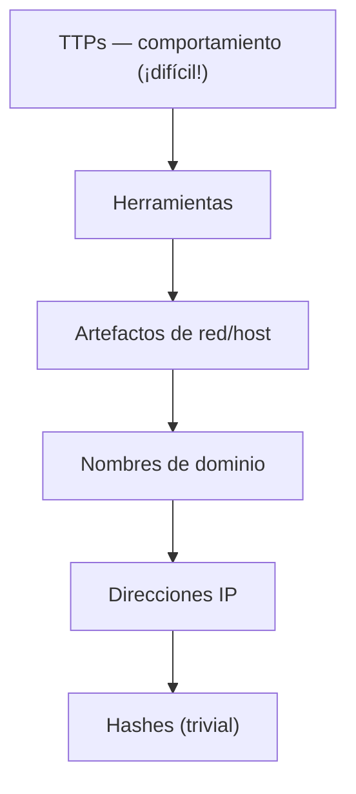

---
tags:
  - Evasion
  - Windows
  - EDR
  - Tipo/Deteccion
Descripción: "Para evadir con criterio hay que pensar como el ingeniero de detección que hay al otro lado"
Fecha de actualización: 2026-07-27
Nota previa: "[[01 - Mapa de telemetría de Windows]]"
Nota siguiente: "[[03 - Tipos de bypass y la cadena de evasión]]"
Area: "[[Fundamentos de evasión.base|Fundamentos de evasión]]"
---
---

Para evadir con criterio hay que pensar como el ingeniero de detección que hay al otro lado. Su trabajo no es "conocer las últimas TTPs": es <mark style="background: #ADCCFFA6;">coger *datapoints* sueltos y potencialmente no relacionados de los sensores e identificar **clusters** de actividad que huelan a malicioso</mark> — sabiendo que la abrumadora mayoría de acciones en un host son benignas. Eso es mucho más difícil de lo que parece, y sus decisiones (qué marcar, cuánto tolerar en falsos positivos) definen exactamente las grietas por las que te cuelas.

# El contexto lo es todo

Un evento aislado casi nunca es concluyente; se juzga contra las **normas** del usuario y del entorno. El libro lo ilustra con una secuencia de `chatapp.exe`:

| Acción | Contexto | Veredicto |
| --- | --- | --- |
| 2:55 AM `chatapp.exe` arranca como `jdoe` | El usuario viaja y trabaja a deshora | Benigno |
| Carga `usp10.dll` sin firmar desde `%APPDATA%` | La app admite plugins de terceros | Levemente sospechoso |
| Conexión saliente TCP/443 | Su servidor está en cloud, hace *polling* | Benigno |
| Consulta `HKLM\...\LSA\LsaCfgFlags` | La app no toca claves de Credential Guard | Muy sospechoso |
| Abre *handle* a `lsass.exe` con `PROCESS_VM_READ` | La app no accede a otros procesos | **Malicioso** |

Ninguna línea, sola, dispara; la **acumulación** sí. <mark style="background: #8000E1A6;">Esto es exactamente lo que explotas al evadir: repartir tus acciones para que ningún cluster supere el umbral</mark> ([[03 - Tipos de bypass y la cadena de evasión|la cadena de evasión]]).

# Detecciones frágiles vs robustas

Los EDR mezclan dos tipos de regla, y saber cuál te enfrenta decide la técnica:

- <mark style="background: #ADCCFFA6;">**Frágil** (*brittle*): apunta a un artefacto concreto</mark> — un hash, un string, un nombre de fichero. Falso positivo casi nulo, falso negativo altísimo: cambia un byte y el hash cambia; renombra `mimikatz.exe` a `mimidogz.exe` y la regla por nombre muere. Baratas de crear y mantener; cazan al que usa herramientas *off-the-shelf* sin tocar.
- <mark style="background: #ADCCFFA6;">**Robusta**: apunta a un **comportamiento** o técnica</mark>, a veces con modelos ML. Cambia especificidad por generalidad: baja el falso negativo a costa de subir el falso positivo. Más difícil de escribir y de tunear.

> [!important]+ La regla de oro del atacante
> <mark style="background: #FFB86CA6;">Las mejores detecciones frágiles apuntan a atributos **inmutables o difíciles de cambiar**</mark>. Corolario ofensivo: si la detección depende de algo que puedes modificar trivialmente (nombre, argumento, hash), evádela cambiándolo; si depende de un comportamiento intrínseco (abrir un handle a LSASS, hablar por el puerto 88), tendrás que **cambiar el comportamiento**, no disfrazarlo.

## Ejemplo real: Kerberoasting en Elastic

Elastic es de los pocos vendors que publica sus reglas. Su detección de Kerberoasting con **Bifrost** combina las dos filosofías:

```text
// FRÁGIL — argumentos de línea de comandos de la herramienta
event.category:process and event.type:start and
process.args:("-action" and ("-kerberoast" or askhash or asktgs or asktgt or s4u ...))
```

Se evade recompilando la herramienta con los argumentos renombrados (`-action` → `-dothis`). Por eso Elastic la **complementa** con una robusta:

```text
// ROBUSTA — comportamiento de red inherente al ataque
network where event.type == "start" and network.direction == "outgoing" and
 destination.port == 88 and source.port >= 49152 and
 process.executable != "C:\\Windows\\System32\\lsass.exe" and
 not process.name in ("chrome.exe","msedge.exe","firefox.exe", ...)
```

Aunque renombres la herramienta, <mark style="background: #FFB86CA6;">hablar por el puerto 88 desde un proceso que no es `lsass.exe` sigue disparando</mark>. Pero fíjate en la **lista de exenciones**: si renombras tu binario a `opera.exe` (que está exento) *y* cambias los argumentos, evades ambas. Cada exención que un ingeniero añade para bajar falsos positivos es un [[03 - Tipos de bypass y la cadena de evasión|logical bypass]] regalado. [[11 - Kerberoasting|Ver el ataque en detalle]].

# La pirámide del dolor

Modelo de David Bianco (2013, plenamente vigente): cuánto **duele** al atacante que le quemes cada tipo de indicador.



Cambiar un hash o una IP no te cuesta nada (base de las detecciones frágiles); cambiar tu **TTP** —cómo inyectas, cómo mueves lateralmente— es caro y por eso las detecciones robustas apuntan ahí. <mark style="background: #8000E1A6;">Toda esta área trabaja en la cima de la pirámide: modificar el *comportamiento observable*, no solo los indicadores baratos</mark>.

# Dónde vive la lógica

- **En el agente/sensor**: permite **prevención** inmediata (bloquear la llamada) pero no puede razonar situaciones complejas.
- **En el backend**: soporta un set enorme de reglas pero introduce **delay** en la respuesta — y depende del canal agente→servidor, que es atacable.

Esa asimetría explica por qué muchas alertas *no* bloquean: disparan y esperan intervención humana. Si el alert salta a las 3 AM de un sábado, tienes ventana. Aun así, contra un SOC maduro, **cualquier** detección es cara: una vez te ven, te cazan.

> [!info]+ Detection-as-code moderno
> Hoy la detección se versiona como código: **Sigma** (formato agnóstico), las [reglas de Elastic](https://github.com/elastic/detection-rules), mapeadas a **[MITRE ATT&CK](https://attack.mitre.org)**. Para validar coberturas (y para tu propio lab) están **Atomic Red Team** y el **MITRE ATT&CK Evaluations** — la mejor referencia pública de qué detecta cada EDR comercial. Consúltalos para saber a qué te enfrentas antes de un engagement.

Fuentes: Matt Hand, *Evading EDR* cap. 1 · [Elastic detection-rules](https://github.com/elastic/detection-rules) · [Pyramid of Pain — D. Bianco](https://detect-respond.blogspot.com/2013/03/the-pyramid-of-pain.html) · [Sigma](https://github.com/SigmaHQ/sigma) · [Atomic Red Team](https://github.com/redcanaryco/atomic-red-team).
