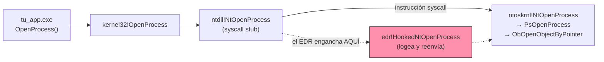

---
tags:
  - Evasion
  - Windows
  - EDR
  - Hooking
Descripción: "El sensor históricamente más desplegado de un EDR es una DLL de hooking: una librería que el producto inyecta en tu proceso y que intercepta (*hook*) las llamadas a APIs…"
Fecha de actualización: 2026-07-28
Nota previa: "[[03 - Tipos de bypass y la cadena de evasión]]"
Nota siguiente: "[[05 - Unhooking y remapping de ntdll]]"
Area: "[[Hooking userland.base|Hooking userland]]"
---
---

El sensor **históricamente más desplegado** de un EDR es una <mark style="background: #ADCCFFA6;">**DLL de hooking**: una librería que el producto inyecta en tu proceso y que intercepta (*hook*) las llamadas a APIs sensibles para leer sus **parámetros** y **valores de retorno**</mark> antes de que lleguen al kernel. Es el sensor que más papeletas tiene de estorbarte en un lab o en un AV-grade… y a la vez <mark style="background: #FFB8EBA6;">el más fácil de evadir</mark>, porque vive **en memoria que tú controlas**. Esta nota cubre cómo funciona el hook y cómo detectarlo; la evasión real va en [[05 - Unhooking y remapping de ntdll]] y [[06 - Syscalls directos e indirectos]].

# El camino de una API hasta el kernel

Tu código llama a Win32 (`kernel32`/`kernelbase`), que acaba delegando en `ntdll.dll`, y es `ntdll` quien realiza la transición al kernel vía la instrucción `syscall`. Ejemplo con `OpenProcess`:



<mark style="background: #ADCCFFA6;">`ntdll.dll` es el **último punto de userland** antes de saltar al kernel</mark>, y por eso es donde el EDR pone el hook: por encima (en `kernel32` o en tu app) los parámetros todavía pueden cambiar; por debajo, el kernel es intocable desde userland. Enganchar `ntdll` da la foto más fiel de lo que realmente se pide al SO.

# Por qué en userland (y no en el kernel)

En Windows de 32 bits antiguos, vendors *y* malware parcheaban la **SSDT** (`System Service Dispatch Table`), la tabla del kernel con los punteros a las funciones de syscall. Con la llegada de x64 y **PatchGuard** (*Kernel Patch Protection*, KPP), Microsoft **prohibió** parchear la SSDT y otras estructuras críticas: hacerlo provoca un `BSOD` (`CRITICAL_STRUCTURE_CORRUPTION`). <mark style="background: #8000E1A6;">Consecuencia: el hooking moderno está obligado a vivir en userland, dentro de tu proceso — y todo lo que está en tu proceso lo puedes leer, reescribir o esquivar</mark>. Ahí nace la fragilidad estructural de este sensor.

# Qué funciones se enganchan

El EDR no engancha `ntdll` entera; se centra en el puñado de `Nt*` que sostienen las técnicas de ataque. La correspondencia función→técnica es la chuleta que necesitas para saber *qué* estás a punto de disparar:

| Funciones de `ntdll` enganchadas | Técnica de atacante que vigilan |
| --- | --- |
| `NtOpenProcess`, `NtAllocateVirtualMemory`, `NtWriteVirtualMemory`, `NtCreateThreadEx` | Inyección remota de procesos (clásica: open→alloc→write→createthread) |
| `NtSuspendThread`, `NtResumeThread`, `NtQueueApcThread` | Inyección de shellcode vía `APC` |
| `NtCreateSection`, `NtMapViewOfSection`, `NtUnmapViewOfSection` | Inyección vía **secciones de memoria mapeadas** |
| `NtProtectVirtualMemory` | Cambio de permisos a `RX`/`RWX` (marcar shellcode ejecutable) |
| `NtLoadDriver` | Carga de driver desde config del registro ([[22 - BYOVD y kill del EDR\|BYOVD]]) |

Cada fila es un patrón de la [[09 - Manipulación de la imagen de proceso|inyección de procesos]] y de la [[24 - Inyección moderna y EDR blinding|inyección moderna]]. Si tu tooling llama a estas APIs de la forma ingenua, el hook lo ve.

# Cómo se implementa el hook: detour + trampoline

La inmensa mayoría de librerías de hooking (empezando por **Microsoft Detours**) hacen lo mismo por debajo: <mark style="background: #ADCCFFA6;">sobrescriben las primeras instrucciones de la función objetivo con un `JMP` incondicional</mark> que redirige el flujo a una *detour function* del EDR. Esa detour registra los parámetros y luego pasa el control a un *trampoline* que contiene las instrucciones originales que se machacaron y devuelve la ejecución a la función real. En un depurador se ve a simple vista: una función limpia empieza con su `syscall stub`; una enganchada empieza con un `jmp` a la DLL del EDR.

# Detectar los hooks: el `syscall stub`

Aquí está la grieta. **Todas** las funciones `Nt*` de `ntdll` tienen exactamente la misma forma — un `syscall stub` idéntico salvo por el número de syscall (`SSN`):

```asm
mov r10, rcx                       ; 4C 8B D1
mov eax, <SSN>                     ; B8 xx xx 00 00
test byte ptr [SharedUserData+0x308], 1   ; check de HVCI / Restricted User Mode
jne  <syscall+0x15>
syscall                            ; 0F 05  -> transición al kernel
ret
```

<mark style="background: #ADCCFFA6;">El `stub` es un patrón fijo</mark>: los primeros bytes de cualquier `Nt*` sin tocar son `4C 8B D1 B8` (`mov r10,rcx; mov eax,…`). Cuando el EDR engancha la función, machaca ese arranque con un salto, así que los primeros bytes pasan a ser `E9 xx xx xx xx` (`jmp rel32`) o un `mov`/`push`+`ret` hacia su módulo:

```text
0:013> u ntdll!NtAllocateVirtualMemory     ; SIN hook
00007fff`...c0b0 4c8bd1            mov r10,rcx
00007fff`...c0b3 b818000000        mov eax,18h
...
0:013> u ntdll!NtAllocateVirtualMemory     ; CON hook
00007fff`...c0b0 e95340baff        jmp 00007fff`fe4b0108   <-- salto a la DLL del EDR
```

> [!success]+ La detección es trivial y fiable
> <mark style="background: #FF5582A6;">Recorre los exports `Nt*` de tu copia mapeada de `ntdll`, lee los primeros bytes de cada uno y compáralos con el `stub` canónico</mark>. Si no empiezan por `4C 8B D1 B8` (hay un `jmp`, un `int3`, o bytes raros), esa función está enganchada. Con eso construyes en segundos la **lista de funciones vigiladas**: o las evitas, o las restauras ([[05 - Unhooking y remapping de ntdll|unhooking]]), o las llamas por [[06 - Syscalls directos e indirectos|syscall directo]] sin pasar por el `stub` parcheado. Herramientas como `PE-sieve`/`Moneta` (defensivas) hacen justo esta comparación contra el `ntdll` de disco para *pillarte* a ti — úsalas para auditar tu propia huella.

# 2026: el hooking ya no es el rey

El libro (2023) presenta el hooking como pieza central. Hoy es un **complemento**, no la columna vertebral:

- <mark style="background: #FFB86CA6;">**Microsoft Defender for Endpoint**, **CrowdStrike Falcon**, **SentinelOne** y **Cortex XDR** se apoyan en callbacks de kernel + [[16 - EtwTi y Protected Processes|ETW-TI]]</mark>, no en el hook de userland. Varios apenas inyectan DLL de hooking.
- Por eso **cegar el hook no ciega el EDR**: la misma `NtAllocateVirtualMemory` que esquivas en userland la ve el driver de kernel y el provider ETW-TI (la redundancia de sensores de [[01 - Mapa de telemetría de Windows]]).

> [!important]+ Necesario, no suficiente
> Defeat del hook = quitar **una** fuente de telemetría (la más barata y ruidosa). Pero aunque hagas el `syscall` sin tocar el `stub`, el **kernel** ([[07 - Notificaciones de creación de proceso e hilo|callback de proceso]]) y ETW-TI siguen viendo la operación, y desde 2023 el EDR mira además **desde dónde** se hizo la llamada — el [[20 - Call-stack spoofing|call stack]]. La evasión de hooks (notas 05-06) es el **paso 0** del tradecraft de endpoint, no la meta.

La DLL se inyecta en tu proceso normalmente por **KAPC injection** desde el driver del EDR (el `AppInit_DLLs` clásico está deprecado y bloqueado con Secure Boot). El mecanismo se detalla en [[11 - Image-load y registro - KAPC injection]].

Fuentes: Matt Hand, *Evading EDR* cap. 2 · [Microsoft Detours](https://github.com/microsoft/Detours) · [MDSec — Bypassing User-Mode Hooks](https://www.mdsec.co.uk/2020/12/bypassing-user-mode-hooks-and-direct-invocation-of-system-calls-for-red-teams/) · [ired.team — Full DLL unhooking](https://www.ired.team/offensive-security/defense-evasion/how-to-unhook-a-dll-using-c++) · Windows Internals 7th ed. (SSDT/PatchGuard).
