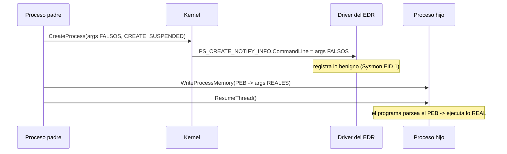

---
tags:
  - Evasion
  - Windows
  - EDR
  - Kernel
Descripción: "De los seis campos que el kernel entrega al callback de creación de proceso, dos concentran la mayoría de las reglas: la línea de comandos y el proceso padre"
Fecha de actualización: 2026-07-28
Nota previa: "[[07 - Notificaciones de creación de proceso e hilo]]"
Nota siguiente: "[[09 - Manipulación de la imagen de proceso]]"
Area: "[[Callbacks de kernel.base|Callbacks de kernel]]"
---
---

De los seis campos que el kernel entrega al [[07 - Notificaciones de creación de proceso e hilo|callback de creación de proceso]], dos concentran la mayoría de las reglas: **la línea de comandos** y **el proceso padre**. Casi toda detección frágil vive en la primera (`-kerberoast`, `-enc`, `IEX(New-Object Net.WebClient)`) y casi toda detección robusta de acceso inicial vive en la segunda (`WINWORD.EXE` → `powershell.exe`). Esta nota cubre cómo se falsean los dos, **con qué precisión se detecta cada uno**, y cuál es la alternativa que sigue funcionando en 2026.

# Falsear la línea de comandos

Los argumentos de un proceso viven en su **PEB**, concretamente en `ProcessParameters->CommandLine`, una `UNICODE_STRING` en memoria de **usuario** — o sea, escribible desde fuera con `WriteProcessMemory`:

```text
0:000> ?? @$peb->ProcessParameters->CommandLine.Buffer
wchar_t * 0x000001be`2f78290a
 "C:\Windows\System32\rundll32.exe ieadvpack.dll,RegisterOCX payload.exe"
```

La técnica (Adam Chester, *«How to Argue like Cobalt Strike»*, y el comando `argue` de Beacon) explota el **desfase temporal** entre los dos momentos en que se lee esa cadena:



<mark style="background: #FF5582A6;">El orden importa y el libro lo presenta al revés</mark>: se arranca con los argumentos **falsos** (que son los que ve el EDR en el callback, porque la notificación ocurre *dentro* de `NtCreateUserProcess`) y **después** se sobrescribe el PEB con los **reales**, que son los que el programa leerá al inicializarse. Si lo haces al contrario, el EDR registra tu comando real y solo engañas al *Process Hacker*.

Dos límites duros:

- <mark style="background: #FFB8EBA6;">Los argumentos falsos deben ser **iguales o más largos** que los reales</mark>: la sobrescritura es *in situ* sobre el búfer ya reservado. Si te quedas corto, sobran restos del original; si te pasas, se trunca lo tuyo.
- **Un proceso no puede cambiar sus propios argumentos** de forma útil: para cuando se ejecuta, el callback ya disparó. Esto inutiliza la técnica para *payloads* de acceso inicial — solo sirve cuando controlas el padre.

## Cómo se detecta

Aquí está la parte que la fuente no cierra, y es la que necesitas para el informe al cliente: <mark style="background: #ADCCFFA6;">la línea de comandos queda registrada en **dos sitios distintos** que ahora **no coinciden**</mark>.

| Fuente | De dónde lee | Qué ve |
| --- | --- | --- |
| Callback del driver · `Sysmon` EID 1 · ETW `Kernel-Process` | Parámetros pasados a `NtCreateUserProcess` | Argumentos **falsos** |
| Process Hacker / Process Explorer · WMI `Win32_Process` · `Get-CimInstance` | El **PEB** del proceso vivo | Argumentos **reales** |

Comparar ambas es una detección de altísima fidelidad y coste casi nulo, y varios EDR la implementan releyendo el PEB tras el `ResumeThread`. Añade el patrón que la acompaña —`CREATE_SUSPENDED` + `WriteProcessMemory` sobre el PEB del hijo + `ResumeThread`— y tienes una firma comportamental completa. Está catalogada como **MITRE ATT&CK T1564.010**.

> [!important]+ La alternativa que no genera mismatch
> En vez de mentir sobre los argumentos, **no tener argumentos que ocultar**. Pasa la configuración por *stdin*, por variable de entorno, por un *named pipe*, o embébela en el propio binario. Una línea de comandos vacía o trivial no dispara reglas frágiles **y** es consistente entre kernel y PEB. Es más trabajo de desarrollo y mucho menos ruido.

# Falsear el proceso padre

Windows permite designar arbitrariamente el padre de un proceso nuevo — no hay dependencia real entre ambos. Se hace con la lista de atributos extendida (técnica popularizada por Didier Stevens en 2009):

```c
hParent = OpenProcess(PROCESS_CREATE_PROCESS, FALSE, dwParentPid);   // 1
InitializeProcThreadAttributeList(NULL, 1, 0, &ulSize);              // 2 (obtener tamaño)
si.lpAttributeList = HeapAlloc(GetProcessHeap(), 0, ulSize);
InitializeProcThreadAttributeList(si.lpAttributeList, 1, 0, &ulSize);
UpdateProcThreadAttribute(si.lpAttributeList, 0,
        PROC_THREAD_ATTRIBUTE_PARENT_PROCESS, &hParent, sizeof(HANDLE), NULL, NULL);
CreateProcessA(NULL, "notepad", NULL, NULL, FALSE,
        EXTENDED_STARTUPINFO_PRESENT, NULL, NULL, &si.StartupInfo, &pi);
```

Basta un handle con `PROCESS_CREATE_PROCESS` (mucho menos que `PROCESS_ALL_ACCESS`, y por tanto menos llamativo para el [[10 - Object callbacks y robo de handles|object callback]]). El resultado: `notepad.exe` aparece como hijo de `vmtoolsd.exe`.

> [!warning]+ No es solo evasión — también es escalada
> <mark style="background: #FFB86CA6;">Si no aportas un token explícito, el hijo **hereda el del padre designado**</mark>. Con un handle `PROCESS_CREATE_PROCESS` sobre un proceso `SYSTEM`, obtienes un proceso `SYSTEM` sin tocar `SeDebugPrivilege` ni robar tokens a mano. Está catalogado aparte como **MITRE ATT&CK T1134.004** y encaja con [[03 - Privilegios de token en Windows]] y [[11 - Bypass de UAC]]. Elastic tiene regla específica (*Privileges Elevation via Parent Process PID Spoofing*), así que es potente pero vigilado.
>
> Gotcha operativo: el hijo se engancha a la **consola y los handles heredables del padre falso**, no a los tuyos. Redirigir *stdout* a una tubería propia deja de funcionar sin trabajo extra — motivo habitual de "mi comando no devuelve nada".

## Cómo se detecta

Dos indicadores, ambos gratuitos para el defensor:

1. **Desde el driver** — `PS_CREATE_NOTIFY_INFO` trae `ParentProcessId` (el declarado) **y** `CreatingThreadId.UniqueProcess` (el proceso que realmente llamó a la API). Si difieren, hay spoofing:
   ```text
   Process Name        : notepad.exe
   Parent Process Name : vmtoolsd.exe     <-- declarado
   Creator Process Name: ppid-spoof.exe   <-- real
   ```
2. **Desde ETW** — en el provider `Microsoft-Windows-Kernel-Process`, el **`ProcessId` de la cabecera** del evento es el del creador real, mientras que el `ParentProcessId` del cuerpo es el falseado. Comparar cabecera contra cuerpo detecta la técnica sin driver (documentado por F-Secure y explotable con `SilkETW`/`KrabsETW`). Elastic lo expone como `process.parent.Ext.real.pid`.

<mark style="background: #8000E1A6;">Con dos fuentes independientes y sin falsos positivos, el PPID spoofing por lista de atributos es hoy un problema **resuelto** para el defensor</mark>. Sigue sirviendo contra productos flojos y contra herramientas de *hunting* manual, pero no lo uses asumiendo que es invisible.

# El enfoque de 2026: no falsear el padre, conseguir uno de verdad

Si el problema es la discrepancia entre padre declarado y creador real, la solución es que **no haya discrepancia**: que otro proceso legítimo cree el tuyo *de verdad*. Se delega la creación en un servicio del sistema vía RPC/LRPC y el resultado es genuino a todos los efectos — `CreatingThreadId` apunta al servicio, y no hay nada que comparar.

Vías habituales: **WMI** (`Win32_Process.Create` → hijo real de `WmiPrvSE.exe`), **DCOM**, el **Task Scheduler** (`svchost.exe -k netsvcs`), el **Service Control Manager** (`services.exe`) o **WinRM**. Cambias un indicador de spoofing por una relación padre-hijo que sí existe en el entorno.

> [!info]+ El defensor también ha llegado ahí
> Elastic Security Labs publicó *«Effective Parenting — detecting LRPC-based parent PID spoofing»* precisamente sobre esto: se detecta correlacionando el evento de creación con la **actividad LRPC previa** del servicio, o marcando como anómalos los hijos de `WmiPrvSE.exe` que no encajan con el perfil del entorno. No es gratis para el defensor —requiere telemetría de RPC—, así que el intercambio te sigue favoreciendo, pero deja de ser silencio absoluto. Consulta también los [[13 - Filtros de red y WFP|filtros de red]] si delegas por WMI remoto: ahí generas tráfico DCOM/RPC además del evento de proceso.

Fuentes: Matt Hand, *Evading EDR* cap. 3 · [Adam Chester (XPN) — How to Argue like Cobalt Strike](https://blog.xpnsec.com/how-to-argue-like-cobalt-strike/) · [Cobalt Strike — Spoof Process Arguments](https://hstechdocs.helpsystems.com/manuals/cobaltstrike/current/userguide/content/topics/post-exploitation_spoof-process-arguments.htm) · [MITRE ATT&CK T1564.010](https://attack.mitre.org/techniques/T1564/010/) y [T1134.004](https://attack.mitre.org/techniques/T1134/004/) · [Microsoft — `UpdateProcThreadAttribute`](https://learn.microsoft.com/en-us/windows/win32/api/processthreadsapi/nf-processthreadsapi-updateprocthreadattribute) · [Elastic Security Labs — Effective Parenting](https://www.elastic.co/security-labs/effective-parenting-detecting-lrpc-based-parent-pid-spoofing) · F-Secure — *Detecting Parent PID Spoofing*.
