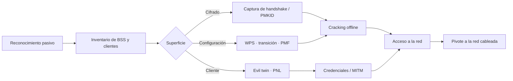

---
tags:
  - Wi-Fi
  - Pentesting/Enumeracion
  - Tipo/Introduccion
Descripción: "Qué se evalúa en un pentest Wi-Fi, cómo se acota un alcance que no respeta paredes y qué límites legales lo separan de una infracción del espectro"
Fecha de actualización: 2026-08-01
Nota previa: 
Nota siguiente: "[[01 - Tramas de gestión y su valor ofensivo]]"
Area: "[[Fundamentos Wi-Fi.base|Fundamentos Wi-Fi]]"
---
---

Un pentest Wi-Fi se parece poco a uno de red interna. <mark style="background: #ADCCFFA6;">El medio no tiene puerto que conectar ni cable que pinchar: es un espacio compartido donde cualquiera con una radio a 30 metros participa de la conversación</mark>. Eso cambia tres cosas de golpe — el alcance deja de ser una lista de IP, la exposición depende de la geografía y no del firewall, y buena parte del trabajo consiste en escuchar sin ser detectado.

# Los cuatro frentes de evaluación

HTB los enumera como "componentes"; en la práctica son cuatro superficies distintas, con herramientas y criterios de hallazgo propios.

**1 · Frases de paso.** Capturar el material criptográfico —el *4-way handshake* de WPA2, el `PMKID` de una red con 802.11r, el SAE de WPA3— e intentar recuperar la clave *offline*. El hallazgo no es "la clave es débil": es <mark style="background: #FFB86CA6;">que una sola clave compartida por toda la organización da acceso a la red corporativa a cualquiera que la haya visto una vez en una pizarra</mark>. La técnica de cracking se apoya en lo ya cubierto en [[00 - Introducción a los ataques a contraseñas]] y en las herramientas [[00 - Introducción a Hashcat|Hashcat]] y [[00 - Introducción a John the Ripper|John the Ripper]].

**2 · Configuración.** Qué cifrado se negocia realmente, si hay modos de transición WPA3/WPA2 que aceptan lo peor de ambos, si `PMF` está en *optional* en lugar de *required*, si WPS sigue habilitado, si el aislamiento de clientes existe, si la VLAN de invitados llega de verdad a un segmento separado. Es donde aparecen más hallazgos reales y menos glamurosos.

**3 · Infraestructura.** Firmware de los AP, el controlador WLAN y su interfaz de gestión, el RADIUS que sostiene 802.1X, y —muy a menudo— la red cableada a la que el AP se conecta: un AP accesible físicamente es una toma Ethernet con credenciales dentro.

**4 · Clientes.** La superficie más rentable y la que más se descuida. Un portátil corporativo con un perfil guardado responde a *probe requests* revelando dónde ha estado, y acepta asociarse a cualquier AP que suplante ese SSID si el perfil no valida el certificado del servidor RADIUS. <mark style="background: #FF5582A6;">En un engagement real, el camino más corto al dominio suele pasar por un cliente, no por el AP</mark>.

> [!important]+ El orden importa
> Empezar por el crackeo de la PSK es el reflejo natural y casi siempre el peor uso del tiempo. Un reconocimiento pasivo completo —qué SSIDs hay, qué cifrados negocian, qué clientes se conectan a qué, qué perfiles arrastran— orienta el resto del trabajo y no genera una sola trama transmitida.

# El ciclo de trabajo

La fase que más se salta es la última. Entrar en la WLAN no es el objetivo: el objetivo es demostrar qué se alcanza desde ahí. Si la red de invitados está bien segmentada, comprometerla vale poco; si desde la SSID corporativa se llega al controlador de dominio, el informe se escribe solo. Ese salto se apoya en [[00 - Introducción al pivoting y los túneles|pivoting]] y en la enumeración de [[00 - Principios y metodología de enumeración|Footprinting]].

# Acotar un alcance que no respeta paredes

El problema estructural de este tipo de engagement: **las ondas cruzan el perímetro del cliente**. Una antena direccional en la calle capta el Wi-Fi del despacho de al lado, y en un polígono industrial o un edificio de oficinas compartido eso es la norma, no la excepción.

Lo que hay que fijar por escrito antes de empezar —encaja en el pre-engagement de [[03 - Pre-engagement I - contratos, NDA y scoping]] y en las RoE de [[04 - Pre-engagement II - RoE y kick-off]]:

- **SSIDs y BSSIDs en alcance, por lista explícita.** Nunca "todas las redes que veas en la sede". Un BSSID es un identificador único; un SSID no.
- **Delimitación geográfica.** Plantas, edificios, aparcamiento. Y qué hacer al captar redes de terceros: <mark style="background: #8000E1A6;">la respuesta correcta es descartar la captura, no "ignorarla"</mark>, porque el fichero `.pcap` con el handshake ajeno ya es material que no debería existir.
- **Ventana horaria.** Un ataque de desautenticación en horario laboral tira reuniones, terminales de punto de venta e inventario. Muchos clientes lo restringen a fuera de horario o directamente lo prohíben.
- **Técnicas prohibidas.** Interferencia deliberada (*jamming*) en cualquiera de sus formas y desautenticación masiva indiscriminada suelen quedar fuera. Un evil twin abierto que capture clientes de terceros, también.
- **Contacto de emergencia** con el equipo de red, por si un AP se cuelga.

# Los límites legales

Esta es la parte que en el material de HTB no existe, y es la que separa un engagement de un delito.

**Interceptación.** Capturar tráfico de una red ajena encaja en el **art. 197.1 del Código Penal** español (interceptación de telecomunicaciones) y, si se accede al sistema, en el **art. 197 bis**. Que el tráfico viaje por el aire y sea técnicamente accesible no lo hace público: el criterio es la expectativa de confidencialidad, no la dificultad de captarlo. La autorización escrita del titular es lo que despeja el tipo penal, y sólo para las redes que esa autorización cubre. El detalle general está en [[01 - Marco legal y regulatorio del pentesting]].

**Espectro.** Emitir fuera de las condiciones del **CNAF** —canales, potencia, DFS— es una infracción administrativa de la Ley General de Telecomunicaciones, **independiente** de la autorización del cliente: el cliente puede autorizar que se ataque su red, no puede autorizar el uso ilegal del espectro. Las condiciones concretas por banda están en [[01 - Bandas, canales y regulación del espectro]].

> [!warning]+ El jamming no es una técnica de pentest
> Saturar el canal —con un inhibidor, con RTS/CTS de `Duration` alto o con una tarjeta emitiendo ruido— es denegación de servicio sobre un recurso compartido, y la posesión y uso de inhibidores está prohibida en España fuera de usos autorizados. Aunque el cliente lo pidiera, afecta a terceros que no consintieron. Si el objetivo es probar la resiliencia ante DoS, se documenta como riesgo y se demuestra con una prueba acotada y consentida, no ejecutando el ataque.

# Documentar mientras se trabaja

Una particularidad de este engagement es que **la evidencia caduca**: la captura que demuestra un hallazgo depende de haber estado en un sitio concreto en un momento concreto. Conviene registrar desde el principio, siguiendo lo de [[01 - Toma de notas y organización]]:

- Hora, ubicación (planta/sala) y tarjeta usada para cada captura.
- El fichero `.pcap` original **sin filtrar**, aparte de las versiones recortadas para el informe.
- Los BSSID observados fuera de alcance, para justificar por qué se descartaron.
- Potencia recibida (`RSSI`) en el punto de captura: es lo que sostiene un hallazgo de "la señal llega hasta el aparcamiento público".

La materia prima de todo esto son las tramas de gestión, que es donde empieza [[01 - Tramas de gestión y su valor ofensivo]].
