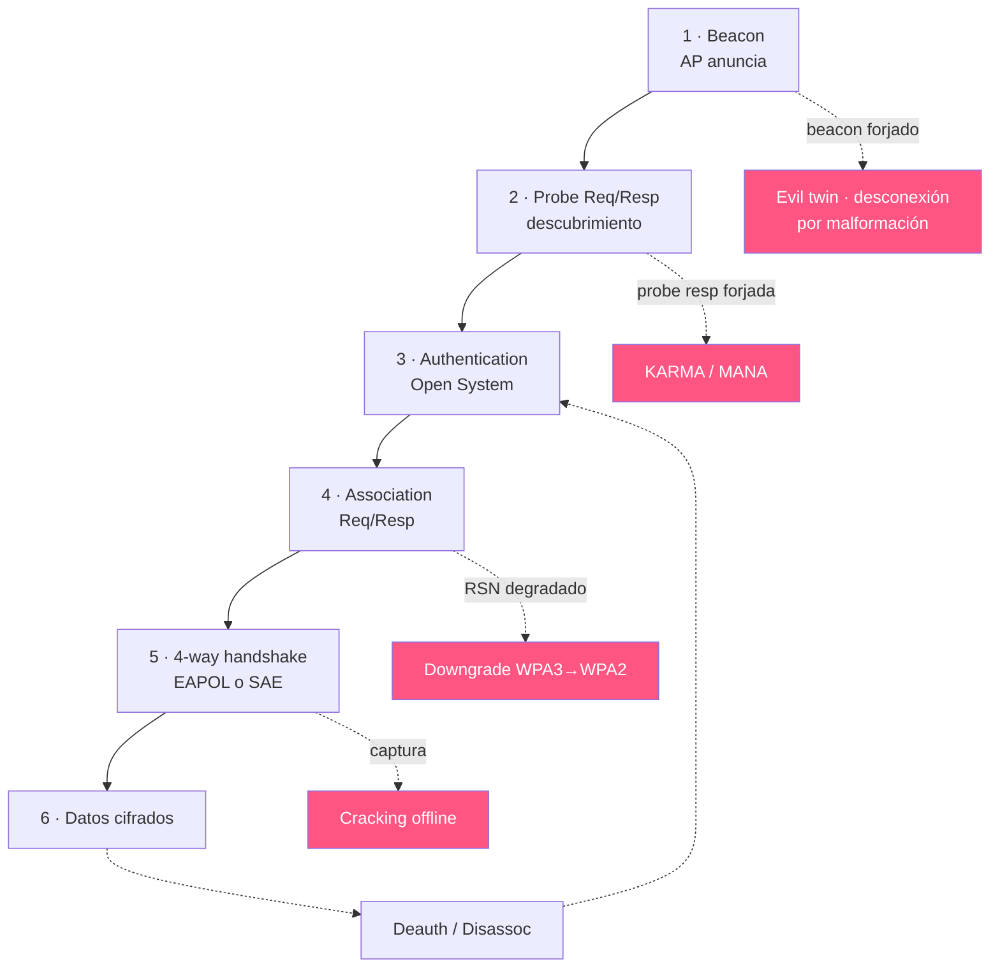

---
tags:
  - Wi-Fi/802.11
  - Pentesting/Enumeracion
Descripción: "Las seis fases que van del beacon al tráfico cifrado, con el filtro de Wireshark de cada una y dónde puede intervenir un atacante"
Fecha de actualización: 2026-08-01
Nota previa: "[[01 - Tramas de gestión y su valor ofensivo]]"
Nota siguiente: "[[03 - Métodos de autenticación y cifrado]]"
Area: "[[Fundamentos Wi-Fi.base|Fundamentos Wi-Fi]]"
---
---

Entre que un cliente ve una red y empieza a mandar tráfico cifrado ocurren seis fases. <mark style="background: #ADCCFFA6;">Cada una es un intercambio de tramas identificable en una captura, y cada una tiene su forma característica de romperse</mark>. Saber en qué fase está una conversación es lo que permite decidir si hay que esperar, forzar una reconexión o cambiar de enfoque.



# Las seis fases, con su filtro

Todos los filtros asumen una captura tomada en **modo monitor** ([[05 - Modos de operación y modo monitor]]). Sin él, la tarjeta entrega tramas Ethernet ya traducidas y ninguna de estas fases es visible. Los valores de `wlan.fc.type_subtype` corresponden a la tabla de subtipos de [[02 - Arquitectura 802.11 y la trama MAC]], y el uso ofensivo de cada trama está en [[01 - Tramas de gestión y su valor ofensivo]].

## 1 · Beacon

El AP se anuncia. No hace falta que haya ningún cliente.

```text
wlan.fc.type_subtype == 8
```

Con el AP identificado, filtrar por su BSSID acota el ruido de todo lo demás:

```text
wlan.fc.type_subtype == 8 && wlan.bssid == aa:bb:cc:dd:ee:ff
```

## 2 · Probe Request y Response

El cliente busca; el AP responde. Es la fase que revela la `PNL` del cliente.

```text
wlan.fc.type_subtype == 4    // request
wlan.fc.type_subtype == 5    // response
```

Para extraer sólo los SSID que los clientes están buscando —el material de un evil twin dirigido:

```text
wlan.fc.type_subtype == 4 && wlan.ssid
```

## 3 · Authentication

Dos tramas, `Open System` casi siempre. <mark style="background: #FFB8EBA6;">Que aparezcan `Authentication` con `status code 0` no significa que la red sea abierta</mark>: en WPA2 esta fase siempre se resuelve con éxito y la seguridad real llega dos pasos después. Confundirlo lleva a marcar como abiertas redes que no lo son.

```text
wlan.fc.type_subtype == 11
```

## 4 · Association

El cliente pide entrar declarando sus capacidades; el AP acepta o rechaza con un código de estado.

```text
wlan.fc.type_subtype == 0    // request
wlan.fc.type_subtype == 1    // response
```

El RSN IE de la *request* es lo que hay que leer aquí: dice **qué cifrado eligió el cliente** de entre los ofrecidos. En una red en modo de transición, ver clientes eligiendo `PSK` en vez de `SAE` es directamente un hallazgo.

## 5 · El handshake

En WPA/WPA2 son cuatro mensajes EAPOL; en WPA3, el intercambio SAE (*commit* y *confirm*) precede al EAPOL.

```text
eapol
```


<mark style="background: #FFB86CA6;">Con los mensajes 1 y 2 hay material suficiente para atacar</mark>. El motivo es que la `PTK` se deriva de cinco valores, y cuatro de ellos son públicos:

```text
PTK = PRF(PMK, ANonce ‖ SNonce ‖ MAC_AP ‖ MAC_cliente)
       └── lo único secreto: sale de la contraseña
```

El **M1** aporta el `ANonce`; el **M2**, el `SNonce` y el `MIC` que sirve de oráculo para validar cada candidato. Las dos MAC están en la cabecera de cualquier trama. Los mensajes 3 y 4 confirman e instalan las claves, y no añaden nada que el atacante no tenga ya.

Qué acepta cada herramienta difiere, y conviene saberlo antes de recoger:

| Herramienta | Pares válidos |
| ----------- | ------------- |
| `aircrack-ng` | **(2,3)** o **(3,4)** según su [documentación oficial](https://www.aircrack-ng.org/doku.php?id=aircrack-ng) |
| `hashcat -m 22000` | También **(1,2)**, el más fácil de capturar tras una desautenticación |
| `PMKID` (802.11r) | Sólo el **M1**, y sin ningún cliente: se le pide al AP |

<mark style="background: #FF5582A6;">Ésa es una razón práctica para convertir siempre con `hcxpcapngtool` y crackear con `hashcat`</mark>: una captura que `aircrack-ng` da por inservible puede ser perfectamente utilizable.

## 6 · Datos cifrados y el cierre

```text
wlan.fc.type == 2 && wlan.fc.protected == 1
```

El cierre puede venir de cualquiera de las dos partes:

```text
wlan.fc.type_subtype == 12 || wlan.fc.type_subtype == 10
```

El `reason code` distingue una desconexión legítima de un ataque. Un código 3 ("la estación se va") de un cliente que apaga el portátil es normal; decenas de código 7 por segundo desde el BSSID del AP son `aireplay-ng`.

> [!success]+ Un filtro que resume el estado de una red
> Muestra sólo lo que cambia el estado de la conexión, dejando fuera beacons y datos:
> ```text
> wlan.fc.type == 0 && wlan.fc.type_subtype != 8 && wlan.fc.type_subtype != 4 && wlan.fc.type_subtype != 5
> ```
> El resultado es la secuencia limpia auth → assoc → deauth de cada cliente. Es la vista más rápida para saber quién entra, quién sale y quién está siendo expulsado. Sobre una captura ya guardada, el mismo filtro funciona en [[Wireshark]] y en `tshark`.

# Los cuatro puntos de ruptura

**Fase 1 — el beacon.** Un beacon forjado con el SSID objetivo y mayor potencia atrae clientes hacia un AP controlado. La variante moderna no busca atraer sino expulsar: un beacon con parámetros imposibles provoca que el cliente se desconecte por iniciativa propia, esquivando `PMF` porque el beacon nunca va protegido.

**Fase 2 — la probe response.** Responder afirmativamente a toda *probe request* dirigida hace que cualquier cliente con perfiles guardados se asocie a una red que cree conocer. Es KARMA y su sucesor MANA. La defensa del lado cliente —no emitir probes dirigidas— tardó una década en llegar y sigue incompleta.

**Fase 4 — la negociación de cifrado.** En un despliegue con modos de transición, suplantar el AP anunciando sólo el cifrado más débil hace que el cliente lo elija. No se rompe nada criptográfico: se le ofrece al cliente que elija mal y lo hace.

**Fase 5 — la captura.** El objetivo habitual. Si hay clientes activos, basta con esperar o forzar una reconexión con [[04 - Aireplay-ng]]; si no los hay, el `PMKID` de 802.11r evita la espera. La captura se hace con [[02 - Airodump-ng]] y el trabajo real ocurre después y fuera de línea, en [[06 - Aircrack-ng]] o `hashcat`.

> [!warning]+ Forzar la reconexión tiene coste operativo
> Una desautenticación desconecta a un usuario real. En horario laboral eso es una llamada al servicio técnico, un TPV que deja de cobrar o un equipo médico que pierde telemetría — y, en el WIDS, una alerta con marca de tiempo. <mark style="background: #FF5582A6;">Esperar pasivamente a una reconexión natural no genera evidencia ni interrumpe a nadie</mark>: los clientes se reasocian solos al cambiar de AP, salir de suspensión o al empezar la jornada. Si el alcance permite estar en el sitio a las 8:00, la espera es gratis y silenciosa.

Qué mecanismo de autenticación se negocia en la fase 5 —y por qué la clasificación de HTB en "clave abierta" y "clave compartida" está mal planteada— es [[03 - Métodos de autenticación y cifrado]].
