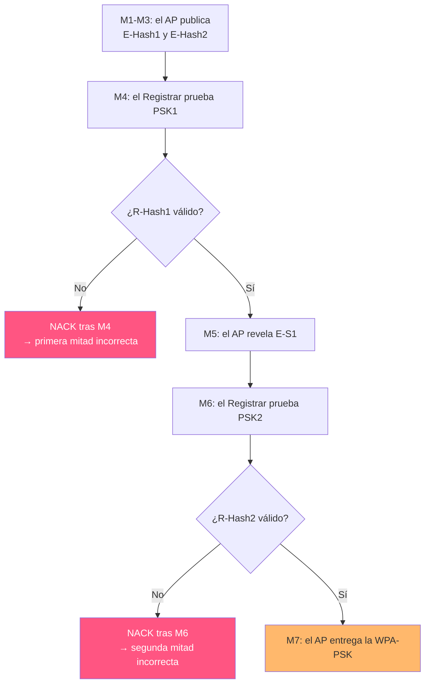

---
tags:
  - Wi-Fi/WPS
  - Pentesting/Enumeracion
Descripción: "Los ocho mensajes EAP del registro WPS, qué revela cada uno y por qué la validación en dos mitades reduce el espacio de PIN a 11.000"
Fecha de actualización: 2026-08-01
Nota previa: "[[00 - Qué es WPS y por qué sigue vivo]]"
Nota siguiente: "[[02 - Reconocimiento de WPS]]"
Area: "[[WPS.base|WPS]]"
---
---

WPS se ejecuta sobre **EAP**, encapsulado en EAPOL, mediante una secuencia de ocho mensajes numerados `M1`–`M8`. <mark style="background: #ADCCFFA6;">Cada mensaje revela información, y esa información es exactamente la que permite los dos ataques</mark>.

# Los dos roles, y por qué se invierten

| Rol | Definición |
| --- | ---------- |
| **Enrollee** | El dispositivo que busca unirse a la red |
| **Registrar** | La entidad con autoridad para emitir credenciales |

En el caso normal el cliente es Enrollee y el AP es Registrar. Pero WPS admite un **Registrar externo**: un dispositivo puede reclamar autoridad de configuración sobre el AP, y entonces <mark style="background: #FFB8EBA6;">**el AP pasa a ser el Enrollee y quien ataca actúa como Registrar**</mark>.

Ése es el modo que explotan `reaver` y `bully`, y el que HTB describe en sus tablas. Conviene tenerlo presente al leer cualquier documentación de WPS, porque `E-` (*Enrollee*) se refiere al **AP** y `R-` (*Registrar*) a quien ataca — al revés de lo que sugiere la intuición.

# Los valores en juego

| Valor | Qué es |
| ----- | ------ |
| `PKe` / `PKr` | Claves públicas Diffie-Hellman del Enrollee (AP) y del Registrar |
| `PSK1` / `PSK2` | Primera y segunda mitad del PIN, de cuatro dígitos cada una |
| `AuthKey` | Derivada del `KDK`, que sale del secreto DH y los nonces |
| `E-S1` / `E-S2` | Nonces secretos de 128 bits del Enrollee. **La clave de Pixie Dust** |
| `R-S1` / `R-S2` | Nonces secretos del Registrar |
| `E-Hash1` | `HMAC-SHA-256(AuthKey, E-S1 ‖ PSK1 ‖ PKe ‖ PKr)` |
| `E-Hash2` | `HMAC-SHA-256(AuthKey, E-S2 ‖ PSK2 ‖ PKe ‖ PKr)` |
| `WPA-PSK` | La contraseña de la red. El objetivo final |

# La secuencia M1–M8


| Mensaje | Dirección | Contenido |
| ------- | --------- | --------- |
| `EAPOL-Start` | Registrar → AP | Inicia el intercambio |
| `EAP Req/Resp Identity` | Ambos | Identificación EAP |
| **`M1`** | AP → Registrar | `PKe` y el nonce `N1` |
| **`M2`** | Registrar → AP | `PKr`, nonce `N2` y autenticador |
| **`M3`** | AP → Registrar | **`E-Hash1` y `E-Hash2`** |
| **`M4`** | Registrar → AP | `R-Hash1`, `R-Hash2` y `R-S1` cifrado |
| **`M5`** | AP → Registrar | `E-S1` cifrado — *sólo si la primera mitad era correcta* |
| **`M6`** | Registrar → AP | `R-S2` cifrado |
| **`M7`** | AP → Registrar | `E-S2` y **la `WPA-PSK`** cifradas — *sólo si el PIN completo era correcto* |
| **`M8`** | Registrar → AP | Configuración de red |

# Dónde está el fallo

El AP no espera a tener el PIN completo para juzgarlo. **Verifica cada mitad por separado**:



<mark style="background: #FF5582A6;">El momento en que llega el `NACK` dice en qué mitad se ha fallado</mark>. Eso convierte un espacio de búsqueda multiplicativo en uno aditivo.


# La cuenta de las 11.000 combinaciones

| Paso | Espacio |
| ---- | ------- |
| PIN de 8 dígitos | 10⁸ = 100.000.000 |
| El octavo dígito es un **checksum** calculable | 10⁷ = 10.000.000 |
| Validación separada de las dos mitades | 10⁴ + 10³ = **11.000** |

El checksum se calcula sobre los siete primeros dígitos con el algoritmo del estándar: **pesos alternos 3 y 1** empezando por el dígito más significativo, y el resultado es lo que falta para completar la decena.

```python
def checksum(pin7):
    """Octavo dígito de un PIN WPS a partir de los siete primeros."""
    d = [pin7 // 10**k % 10 for k in range(6, -1, -1)]   # d[0] = más significativo
    a = 3 * (d[0] + d[2] + d[4] + d[6]) + (d[1] + d[3] + d[5])
    return (10 - a % 10) % 10
```

Contrastado con PINs reales documentados:

```python
>>> checksum(1234567)   # → 12345670, el PIN estático de Cisco
0
>>> checksum(2703889)   # → 27038895, EasyBox derivado del BSSID 60:38:E0:D4:A2:5E
5
>>> checksum(9422988)   # → 94229882, PIN estático H108L
2
```

<mark style="background: #FFB8EBA6;">Por eso la segunda mitad son 10³ y no 10⁴</mark>: de sus cuatro dígitos, los tres primeros son libres y el cuarto —el octavo del PIN— queda determinado por los siete anteriores. Un atacante nunca lo prueba: lo calcula.

> [!warning]+ Algunos firmwares no validan el checksum
> Es un detalle que cambia la estrategia: si el AP acepta un PIN cuyo octavo dígito no cuadra, el espacio de la segunda mitad vuelve a ser 10⁴ en lugar de 10³. `bully -B` existe precisamente para esos casos — ver [[01 - Bully]].

> [!important]+ La consecuencia práctica
> A un ritmo típico de 1–3 PIN por segundo, 11.000 intentos son entre una y tres horas. <mark style="background: #8000E1A6;">Y como las mitades son independientes, el ataque **conserva el progreso**</mark>: una vez encontrada la primera mitad, quedan como mucho 1.000 intentos. Un ataque interrumpido se reanuda desde donde estaba, algo que `reaver` guarda en su fichero de sesión.

# Lo que se sabe y lo que no

En un ataque de fuerza bruta online, el atacante:

**Conoce o controla** — `PKe` (llega en M1), `PKr` (lo genera él), `R-S1` y `R-S2` (los genera), `E-Hash1` y `E-Hash2` (llegan en M3).

**No conoce** — el PIN real, los nonces `E-S1` y `E-S2`, y la `WPA-PSK`.

<mark style="background: #FFB86CA6;">Si `E-S1` y `E-S2` fueran deducibles, `E-Hash1` y `E-Hash2` se podrían atacar offline</mark>: se tendría todo salvo `PSK1` y `PSK2`, que son 10⁴ y 10³ candidatos triviales de recorrer en local. Eso es exactamente lo que Dominique Bongard descubrió en 2014 — que en muchos chipsets esos nonces **no son aleatorios**. Es [[07 - Pixie Dust y el fallo de entropía]].

Antes de atacar hay que saber si el objetivo tiene WPS y en qué estado: [[02 - Reconocimiento de WPS]].
